## 核对与使用边界

本文已按保存的全文审阅记录进行文字校订；本轮仅静态核对，未运行 PoC、请求目标或逐图验证。

适用条件与版本记录（来源主张，未列为明确更正的部分仍待权威资料核对）：article infers1.9.1–1.9.6 from code introduction; public frontend nonce, no legitimate account

- **结论使用边界（1）**：重复请求被折叠一行，render_element含转义反斜线、nonce开头空格，报文排版需恢复。此项限制直接适用于下文对应结论；现有正文不足以作更宽泛推论，所列方法和原始证据均保留。

- **适用与权限边界（2）**：ajax调用链一处称loop_element缺失/false才进入，随后称因此默认无法实例化，条件解释内部冲突需对照源码。按此限制解释本文结论，版本相同不足以证明所需角色、入口、配置、依赖或可控参数均已满足；原操作和失败记录一并保留。

- **证据待核（3）**：仅凭database.php文件名推断需要SQL注入没有证据。保留原引用、截图位置和实验叙述；本项所缺材料未被补造，截图存在或作者宣称成功都不等于已核验其内容。

- **适用与权限边界（4）**：JSON objectType为空与文字允许post/term/user之间需解释默认回退；版本下界的代码研究有价值但需官方印证。按此限制解释本文结论，版本相同不足以证明所需角色、入口、配置、依赖或可控参数均已满足；原操作和失败记录一并保留。

- **事实待核（5）**：无官方补丁来源；应保留公开nonce不是授权的核心证据，独立分析不按CVE直接去重。该项尚不能从转载本身确定外部事实；下文相应编号、版本或修复说法只作为来源记录，不能据此判定部署受影响或已修复。明确更正另列于本节。

历史原文标识：下文原技术材料按来源保留；仅本节明确确认的更正替代相应旧说法，标为待核的观察仍不是事实确认。

# CVE-2024-25600 WordPress Bricks Builder 远程代码执行漏洞分析

> 本文由 [简悦 SimpRead](http://ksria.com/simpread/) 转码， 原文地址 [mp.weixin.qq.com](https://mp.weixin.qq.com/s/kmYY-5RvFmZWiaR6GMRPag)

前言
==

朋友圈看到有人转发了一篇 “CVE-2024-25600：WordPress Bricks Builder RCE”，感觉挺有意思，点进去看了下，可是从头到尾看得我有点迷糊，本着打破砂锅问到底的原则，本文试图以漏洞挖掘者的视角详细分析这个漏洞，试着讲清楚漏洞真正的成因，也在分析的过程中发现一些新的小东西，比如漏洞只影响 1.9.1 及之上的版本，网上都在说影响版本是 <=1.9.6，其实应该是 1.9.1 <= affected version <= 1.9.6

这里想说句题外话，如果一篇文章看得你云里雾里，那不排除一种可能，这篇文章质量不高~

0x01 漏洞宏观流程
===========

漏洞最终触发点是 eval 执行了攻击者传入的恶意代码，导致任意代码执行

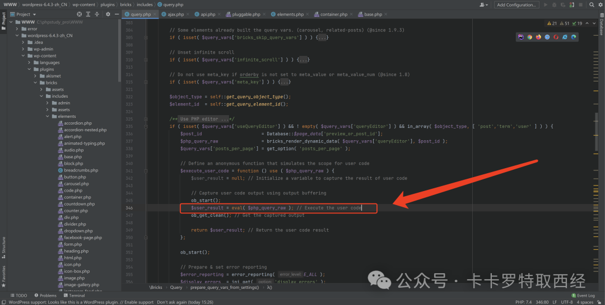

其中参数 $php_query_raw 是攻击者可控的，路由也是攻击者可控的，最后在权限校验部分仅使用 nonce 进行权限校验，而 nonce 会泄露在前端源码中，至此《危险函数 -> 用户输入 -> 对应路由 -> 权限绕过》全部满足，最终导致了前台 RCE（实际的细节有些复杂…)

pyload 如下

```
POST /WordPress-6.4.3/wp-json/bricks/v1/render\_element HTTP/1.1Host: 127.0.0.1User-Agent: Mozilla/5.0 (X11; Linux x86\_64) AppleWebKit/537.36 (KHTML, like Gecko) Chrome/41.0.2227.0 Safari/537.36Connection: closeContent-Length: 270Content-Type: application/jsonAccept-Encoding: gzip, deflate, {    "postId": "1",    "nonce": " a980a714d9",    "element": {        "name": "container",        "settings": {            "hasLoop": "",            "query": {"useQueryEditor": "","queryEditor": "system('calc');","objectType": ""}        }    }}

```

0x02 漏洞细节流程
===========

01 危险函数
-------

危险函数是 eval，平时挖漏洞时，危险函数可以通过 Seay 跑一遍后发现，从代码注释中可以看到，漏洞代码是自版本 1.9.1 才有的

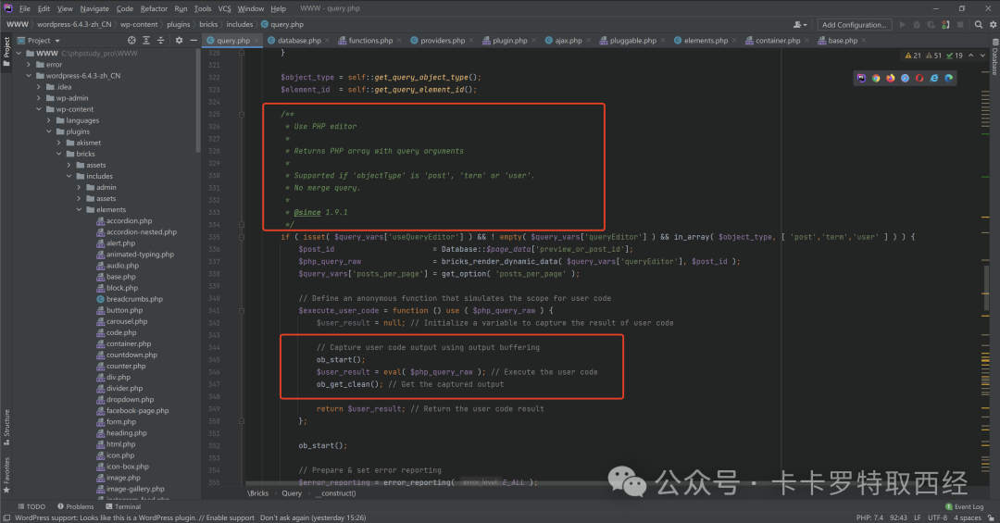

02 用户输入
-------

从触发点往上回溯，可看到参数 $php_query_raw 的值来自于 bricks_render_dynamic_data($query_vars[‘queryEditor’], $post_id ) 的返回值

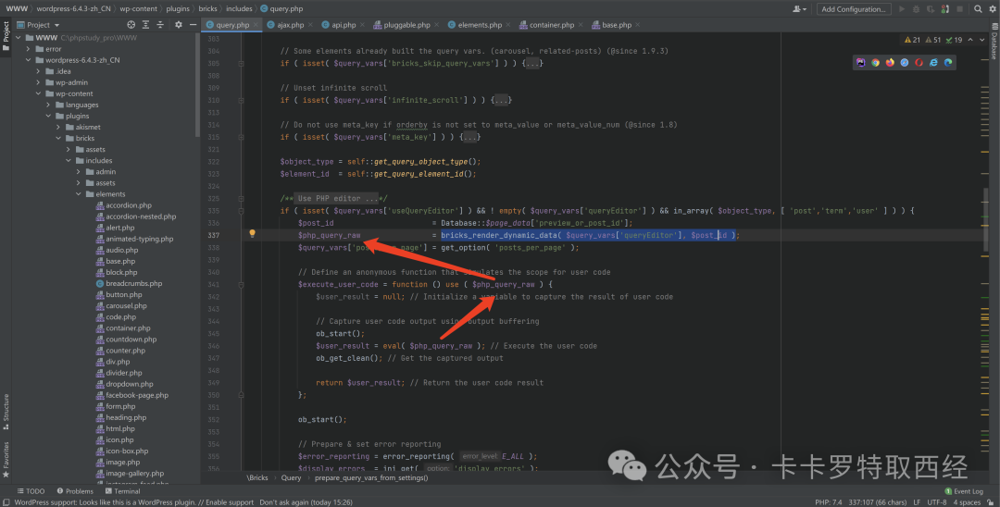

ctrl + 鼠标左键，进去看下 bricks_render_dynamic_data 对 $query_vars[‘queryEditor’] 和 $post_id 有没有什么过滤，可以看到具体实现在 render_content 中

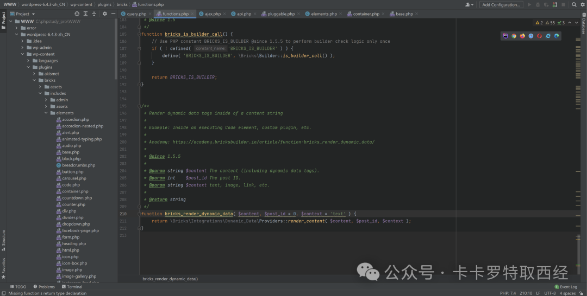

继续跟进 render_content，代码逻辑是：  
如果第一个参数是数组且至少有一个元素，则直接返回第一个元素。  
如果第一个参数中键 name 对应的值不为空，那么将键 name 对应的值赋值给第一个元素，否则将第一个参数转化为字符串类型后赋值给第一个参数。  
如果第一个参数中不包含字符’{‘，则直接返回第一个参数。  
如果第一个参数中包含字符串’{echo:’，那么去掉第一个参数中用来转义的反斜线。  
如果 $post_id 的值为空，那么调用 get_the_ID() 并将返回值赋值给 $post_id，否则 $post_id 的值不变。  
$post_id 经 get_post() 处理后赋值给 $post。  
将’bricks/dynamic_data/render_content’, $content, $post, $context 经 apply_filters 处理后的返回值返回  
（详细讲述代码逻辑太费劲了，估计看的人也费劲，后面只讲基本逻辑）

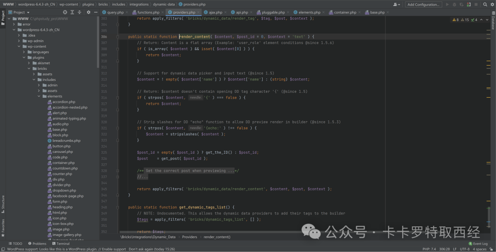

现在我们梳理了 bricks_render_dynamic_data 内部做了什么，具体返回什么值要看传入什么样的参数，回到原来的地方，Database::$page_data[‘preview_or_post_id’]跟进后值是常量 0，现在变量只剩 $query_vars[‘queryEditor’]，向上找 $query_vars[‘queryEditor’]发现没有，只找到 $query_vars，$query_vars 来自方法 prepare_query_vars_from_settings 的第一个参数 $settings，也就是说，调用 prepare_query_vars_from_settings 时，第一个参数 $settings 需要满足：$settings->[‘query’]->[‘useQueryEditor’]存在且不为 null、$settings->[‘query’]->[‘queryEditor’]不为空，还有一个条件，$object_type 需要是 [ ‘post’,’term’,’user’ ] 中的一个，$object_type 来自于 self::get_query_object_type()，跟进 get_query_object_type，基本逻辑是：根据全局变量 $bricks_loop_query 的值决定返回’post’还是’’

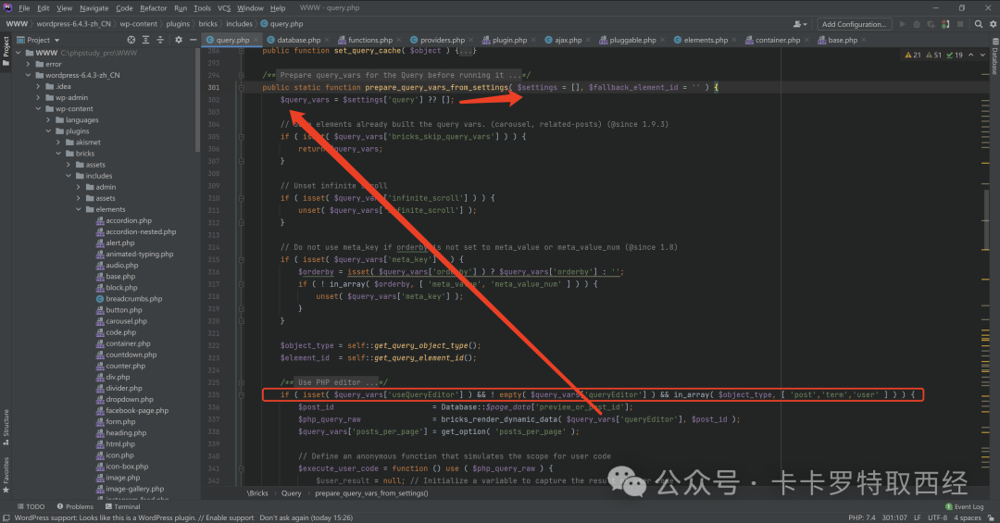

ctrl + 鼠标左键，看下哪些函数调用了 prepare_query_vars_from_settings，可以看到只有 2 个，database.php 和 query.php，database.php 看名字就知道是和数据库打交道的，如果漏洞点在这个文件中，很可能还需要一个 sql 注入漏洞将恶意代码注入到数据库中，所以优先选择 query.php 进行深入查看

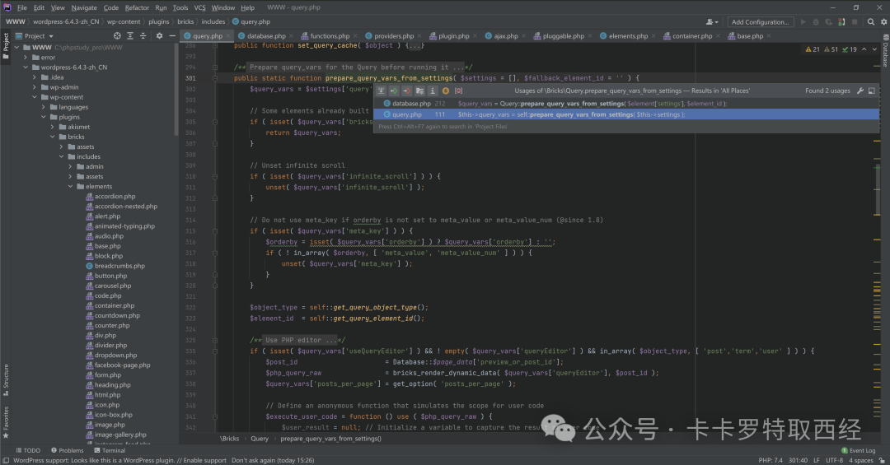

跟进 query.php，可以看到在下图 111 行中调用了 prepare_query_vars_from_settings，传入的是 $this->settings，向上回溯发现 $this->settings 来自于 $element[‘settings’]，并且这些代码处于 else 子句中，也就是说需要让 $query_instance 的值为 false，$query_instance 的值来自于 self::get_query_by_element_id( $this->element_id )，$this->element_id 的值来自于实例化类 Query 时传进来的参数 $element

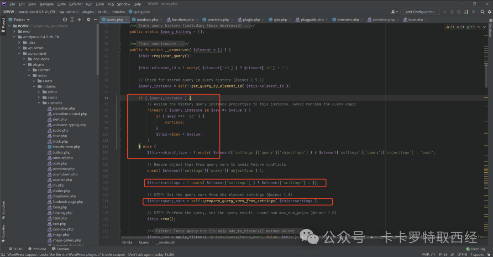

跟进 get_query_by_element_id 里面看一下，可以看到如果传进来的 $element_id 为空的话，则返回 false，也就符合上面说的进入 else 子句

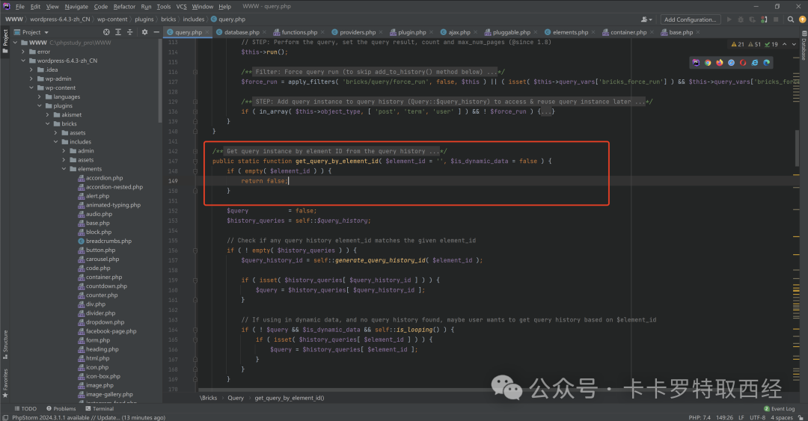

然后看下哪些地方实例化了类 Query，可以看到一共有 15 处

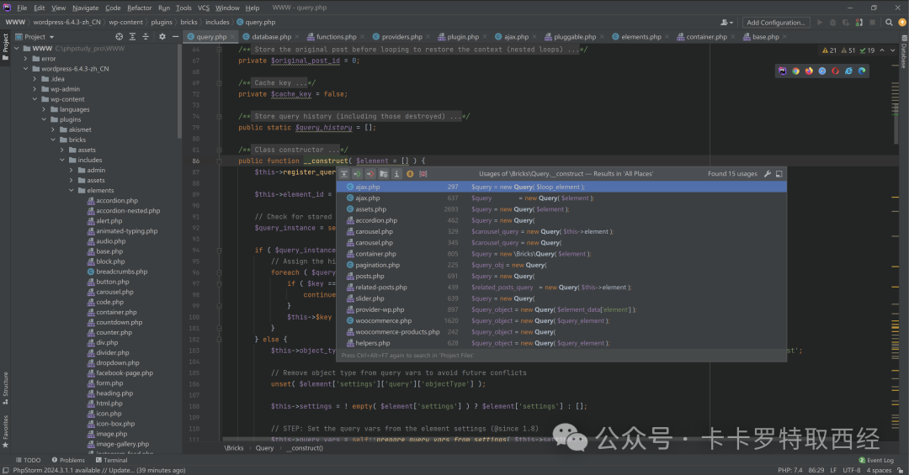

先看第 1 处，ajax.php，需要满足 $loop_element 不存在或为 false 的时候，才会实例化类 Query，向上找发现 $loop_element 的值默认为 false，假如中间没改变 $loop_element 的值，是没法实例化类 Query

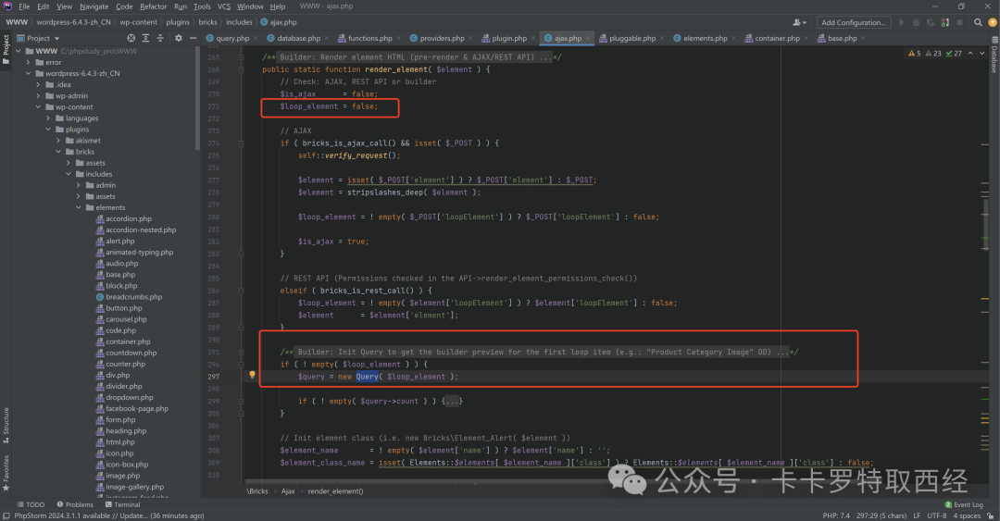

向下会看到 new $element_class_name($element) 这样一行代码，关键点就在这个地方，此处才是漏洞的真正成因，想要执行 new $element_class_name( $element ) 需要 $element_class_name 表示的类存在，跟进 Elements 可以看到，里面定义了一个静态属性 $elements，初始化之后，会将 $element_names 中的元素注册到 $elements 中

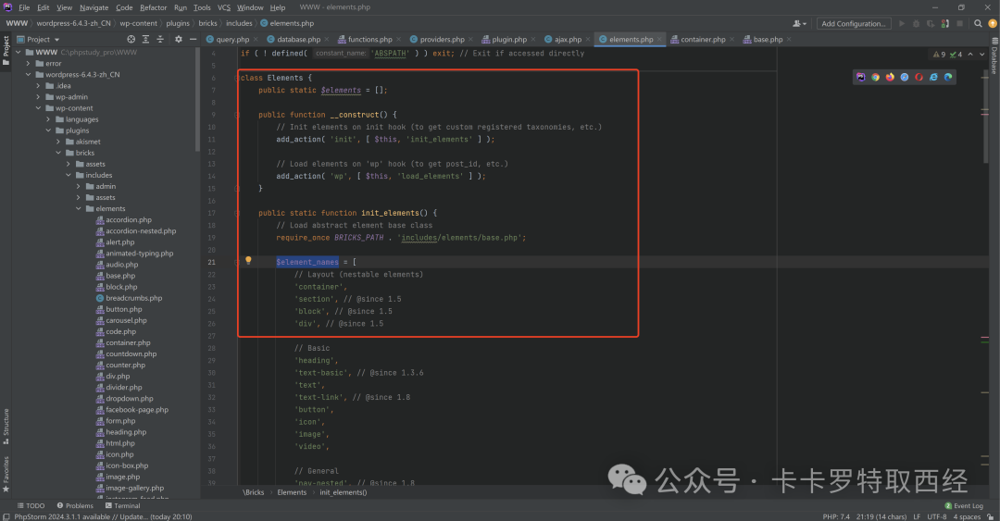

如下是注册到 $elements 中

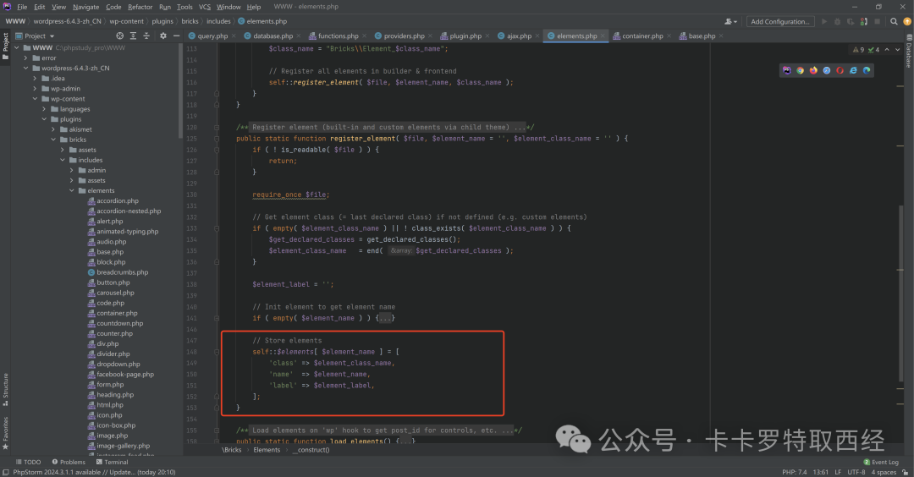

再看一下 payload

```
POST /WordPress-6.4.3/wp-json/bricks/v1/render\_element HTTP/1.1Host: 127.0.0.1User-Agent: Mozilla/5.0 (X11; Linux x86\_64) AppleWebKit/537.36 (KHTML, like Gecko) Chrome/41.0.2227.0 Safari/537.36Connection: closeContent-Length: 270Content-Type: application/jsonAccept-Encoding: gzip, deflate, {    "postId": "1",    "nonce": " a980a714d9",    "element": {        "name": "container",        "settings": {            "hasLoop": "",            "query": {"useQueryEditor": "","queryEditor": "system('calc');","objectType": ""}        }    }}

```

此时我们变成了实例化类 Bricks\Element_Container，进到 Element_Container 类中，可以看到它是继承父类 Element，也就是说它能调用的方法不光在它中，还可能在父类中，回到 ajax.php，我们看下 new $element_class_name($element) 之后的代码，调用了 2 个方法 load 和 init，其中 init 在父类 Element 中，并且 init 中调用了方法 render，然后 render 中实例化了类 Query，满足上面我们分析的条件

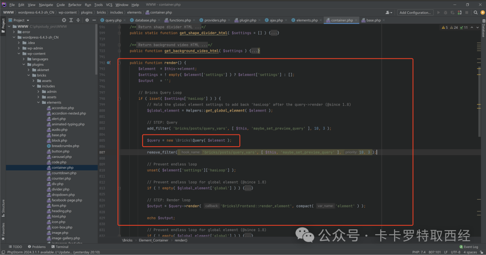

03 对应路由
-------

回到 ajax.php，从注释中就能看到，一段是处理 AJAX 请求，一段是处理 REST API 请求

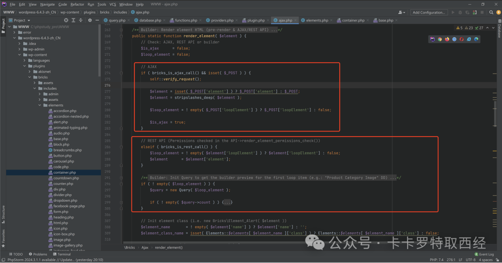

04 权限绕过
-------

可以看到代码 AJAX 中有权限检验，代码 REST API 中看似没有权限检验，但注释中说了，权限检查在 API->render_element_permissions_check() 中，跟进 render_element_permissions_check 后发现，内部其实没进行权限检查，只校验了 nonce

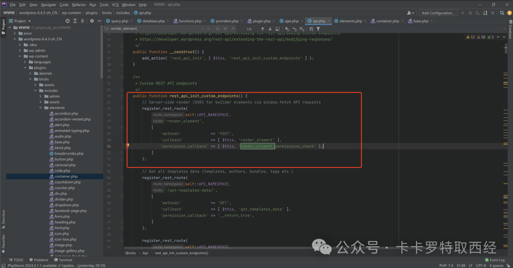

wordpress 中明确提到，nonce 不应作为权限验证，最终导致权限绕过

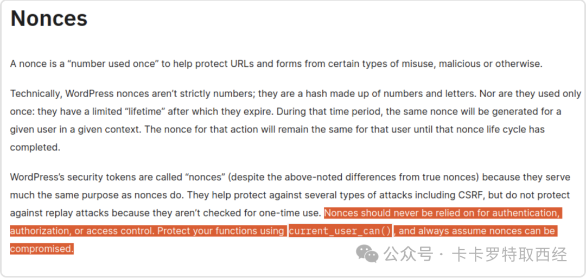

总结
==

漏洞出现在后台的编辑器功能处，用于渲染元素并且预览效果，由于弱权限校验导致权限绕过可直接访问 REST API 端点，最终导致 RCE，最后，感谢 ID 为 zero 的师傅分享的源码

---

> 来源：MrWQ/vulnerability-paper（https://github.com/MrWQ/vulnerability-paper）
