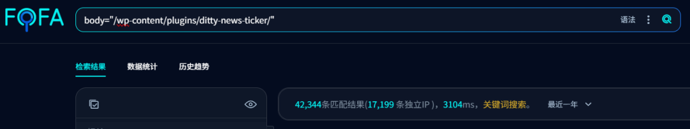
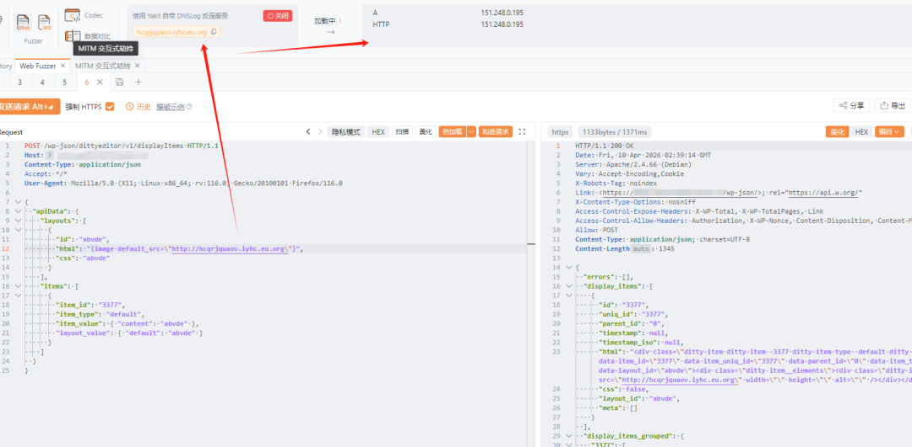
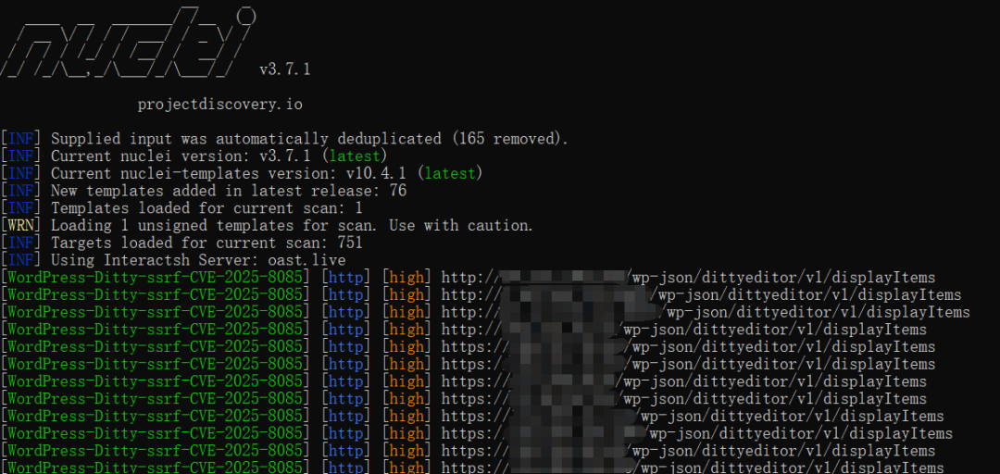
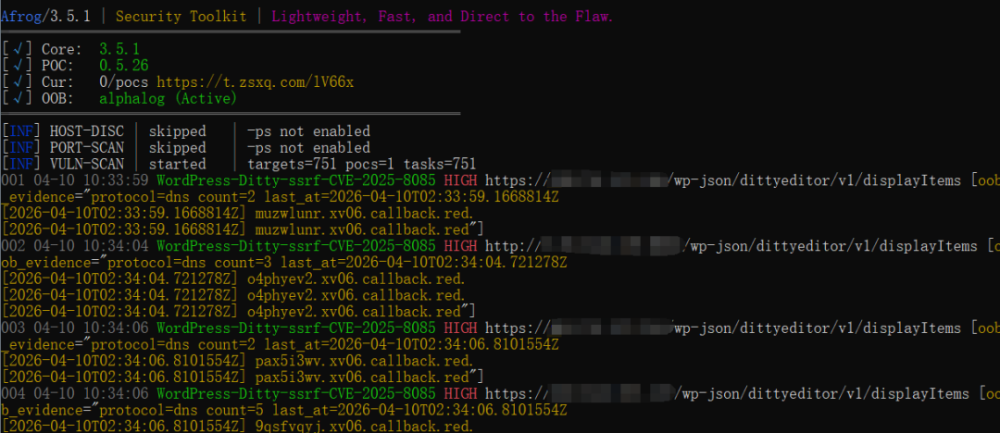

## 核对与使用边界

本文已按保存的全文审阅记录进行文字校订；本轮仅静态核对，未运行 PoC、请求目标或逐图验证。

适用条件与版本记录（来源主张，未列为明确更正的部分仍待权威资料核对）：unauthenticated claimed; versions and URL/endpoint restrictions absent

- **事实待核（1）**：无影响版本、具体接口、参数或请求文本；截图工具结果无法文本核验。该项尚不能从转载本身确定外部事实；下文相应编号、版本或修复说法只作为来源记录，不能据此判定部署受影响或已修复。明确更正另列于本节。

- **证据待核（2）**：未给SSRF响应可见性/内网访问实际证据，不应泛化受限资源可读。保留原引用、截图位置和实验叙述；本项所缺材料未被补造，截图存在或作者宣称成功都不等于已核验其内容。

- **事实待核（3）**：修复只称安全版本未标版本，原始公告链接缺失。该项尚不能从转载本身确定外部事实；下文相应编号、版本或修复说法只作为来源记录，不能据此判定部署受影响或已修复。明确更正另列于本节。

- **结论使用边界（4）**：长篇付费圈子宣传需移出漏洞技术记录。此项限制直接适用于下文对应结论；现有正文不足以作更宽泛推论，所列方法和原始证据均保留。

历史原文标识：下文原技术材料按来源保留；仅本节明确确认的更正替代相应旧说法，标为待核的观察仍不是事实确认。

#  WordPress Ditty SSRF漏洞(CVE-2025-8085)  
Superhero
                    Superhero  Nday Poc   2026-04-10 02:46  
  
  
  
  
  
  
  
内容仅用于学习交流自查使用，由于传播、利用本公众号所提供的  
POC  
信息及  
POC对应脚本  
而造成的任何直接或者间接的后果及损失，均由使用者本人负责，公众号Nday Poc及作者不为此承担任何责任，一旦造成后果请自行承担！  
  
  
**01**  
  
**漏洞概述**  
  
  
WordPress Ditty 接口存在服务器请求伪造漏洞，因此攻击者可利用该漏洞在未经身份验证的情况下访问某些受限资源.获取内部服务器信息，使系统处于极不安全状态。  
**02******  
  
**搜索引擎**  
  
  
fofa:  
```
body="/wp-content/plugins/ditty-news-ticker/"
```  
  
  
  
  
**03******  
  
**漏洞复现**  
  
  
  
  
**04**  
  
**自查工具**  
  
  
nuclei  
  
  
  
afrog  
  
  
  
  
**05******  
  
**修复建议**  
  
  
1、关闭互联网暴露面或接口设置访问权限  
  
2、升级至安全版本  
  
  
**06******  
  
**内部圈子介绍**  
  
### 【Nday漏洞实战圈】🛠️  
  
专注公开1day/Nday漏洞复现 · 工具链适配支持  
  
✧━━━━━━━━━━━━━━━━✧  
  
🔍 **资源内容**  
  
▫️ 整合全网公开1day/Nday漏洞POC详情  
  
▫️ 适配Afrog/Nuclei检测脚本  
  
▫️ 支持内置与自定义POC目录混合扫描  
  
🔄 **更新计划**  
  
▫️ 每周新增7-10个实用POC（来源公开平台）  
  
▫️ 所有脚本经过基础测试，降低调试成本  
  
🎯 **适用场景**  
  
▫️ 企业漏洞自查 ▫️ 渗透测试 ▫️ 红蓝对抗 ▫️ 安全运维  
  
✧━━━━━━━━━━━━━━━━✧  
  
⚠️ **重要声明**  
  
▫️  
仅限合法授权测试，严禁违规使用  
  
**▫️虚拟资源服务，购买后不接受任何形式退款**  
  
▫️  
付款  
前请评估需求，慎重考虑  
  
  
  
  


---

> 来源：gelusus/wxvl（微信公众号漏洞文章自动归档，原文见文首链接）
