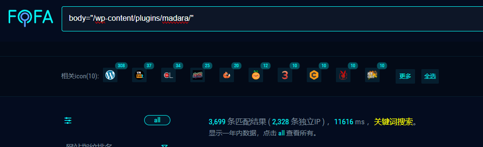
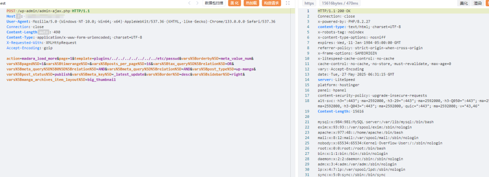
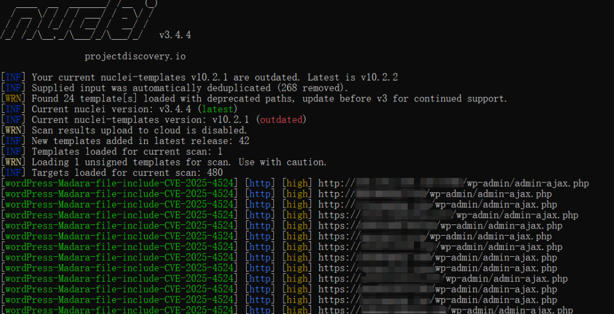
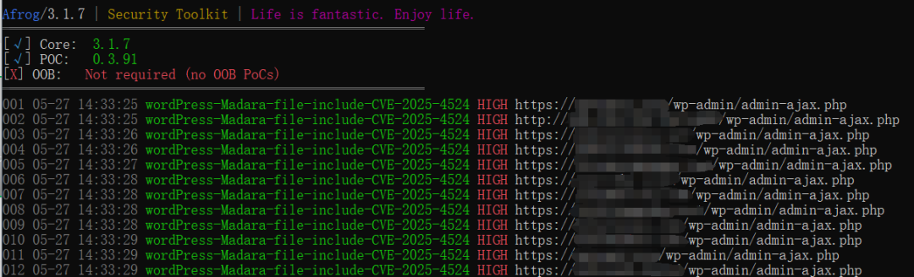
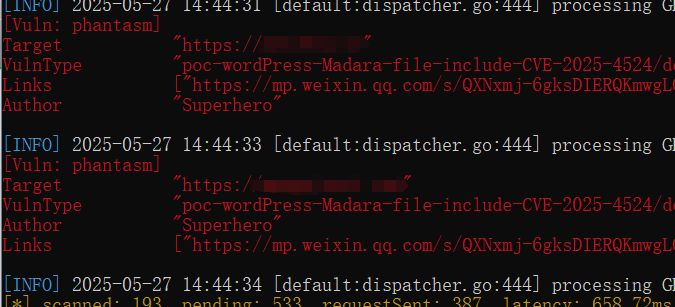

## 核对与使用边界

本文已按保存的全文审阅记录进行文字校订；本轮仅静态核对，未运行 PoC、请求目标或逐图验证。

适用条件与版本记录（来源主张，未列为明确更正的部分仍待权威资料核对）：&lt;=2.2.2, fixed2.2.2.1 claimed; unauthenticated template parameter; RCE requires includable attacker PHP file

- **结论使用边界（1）**：正文主题但FOFA写wp-content/plugins/madara，需要核实际组件/资源路径而非直接等同主题。此项限制直接适用于下文对应结论；现有正文不足以作更宽泛推论，所列方法和原始证据均保留。

- **证据待核（2）**：复现及三个工具结果全截图，未给路由/请求/响应文本。保留原引用、截图位置和实验叙述；本项所缺材料未被补造，截图存在或作者宣称成功都不等于已核验其内容。

- **适用与权限边界（3）**：已区分可上传安全扩展文件才升级RCE，这项前提应保留。按此限制解释本文结论，版本相同不足以证明所需角色、入口、配置、依赖或可控参数均已满足；原操作和失败记录一并保留。

- **来源与引用处置（4）**：缺原始公告/补丁链接，付费圈子广告较多。保留这部分来源材料并与技术结论分开；其引用或宣传内容不能补足本文漏洞的证据。

历史原文标识：下文原技术材料按来源保留；仅本节明确确认的更正替代相应旧说法，标为待核的观察仍不是事实确认。

#  WordPress Madara 本地文件包含漏洞 (CVE-2025-4524)   
Superhero  Nday Poc   2025-05-27 06:48  
  
  
  
  
  
  
  
内容仅用于学习交流自查使用，由于传播、利用本公众号所提供的  
POC  
信息及  
POC对应脚本  
而造成的任何直接或者间接的后果及损失，均由使用者本人负责，公众号Nday Poc及作者不为此承担任何责任，一旦造成后果请自行承担！  
  
  
**01**  
  
**漏洞概述**  
  
  
适用于 WordPress 的漫画网站主题的 Madara – 响应式和现代 WordPress 主题在包括 2.2.2 在内的所有版本中都容易受到通过“template”参数包含本地文件的影响。这使得未经身份验证的攻击者可以在服务器上包含和执行任意文件，从而允许执行这些文件中的任何 PHP 代码。这可用于绕过访问控制、获取敏感数据，或在可以上传和包含图像和其他“安全”文件类型的情况下实现代码执行。  
**02******  
  
**搜索引擎**  
  
  
FOFA:  
```
body="/wp-content/plugins/madara/"
```  
  
  
  
  
**03******  
  
**漏洞复现**  
  
  
  
  
**04**  
  
**自查工具**  
  
  
nuclei  
  
  
  
afrog  
  
  
  
xray  
  
  
  
  
**05******  
  
**修复建议**  
  
  
1、关闭互联网暴露面或接口设置访问权限  
  
2、  
更新到版本 2.2.2.1 或更新的修补版本  
  
  
**06******  
  
**内部圈子介绍**  
  
  
【Nday漏洞实战圈】🛠️   
  
专注公开1day/Nday漏洞复现  
 · 工具链适配支持  
  
 ✧━━━━━━━━━━━━━━━━✧   
  
🔍 资源内容  
  
 ▫️ 整合全网公开  
1day/Nday  
漏洞POC详情  
  
 ▫️ 适配Xray/Afrog/Nuclei检测脚本  
  
 ▫️ 支持内置与自定义POC目录混合扫描   
  
🔄 更新计划   
  
▫️ 每周新增7-10个实用POC（来源公开平台）   
  
▫️ 所有脚本经过基础测试，降低调试成本   
  
🎯 适用场景   
  
▫️ 企业漏洞自查 ▫️ 渗透测试 ▫️ 红蓝对抗   
▫️ 安全运维  
  
✧━━━━━━━━━━━━━━━━✧   
  
⚠️ 声明：仅限合法授权测试，严禁违规使用！  
  
  
  
  


---

> 来源：gelusus/wxvl（微信公众号漏洞文章自动归档，原文见文首链接）
