## 核对与使用边界

- 明确更正：全文分析 Page Builder by SiteOrigin 实时编辑器，标题 Baidu 是错误产品归属。
- `X-XSS-Protection: 0` 只关闭部分旧浏览器 XSS 过滤行为，不是任意 XSS 根因证明。实时预览中的反射/CSRF 与点击 Save Draft 后持久保存是不同阶段，保留该区别；具体受影响版本和补丁仍待核。

本文已按保存的全文审阅记录进行文字校订；本轮仅静态核对，未运行 PoC、请求目标或逐图验证。

适用条件与版本记录（来源主张，未列为明确更正的部分仍待权威资料核对）：victim permitted editor/admin session, live editor enabled and victim opens crafted page; affected plugin version missing

- **事实待核（1）**：文件名/标题Baidu XSS与全文SiteOrigin产品完全不符，明确归属错误。该项尚不能从转载本身确定外部事实；下文相应编号、版本或修复说法只作为来源记录，不能据此判定部署受影响或已修复。明确更正另列于本节。

- **证据待核（2）**：简介与影响栏为空，核心代码/请求/payload只截图。保留原引用、截图位置和实验叙述；本项所缺材料未被补造，截图存在或作者宣称成功都不等于已核验其内容。

- **结论使用边界（3）**：X-XSS-Protection:0仅关闭历史浏览器过滤器，不等于该响应允许任意XSS的根因。此项限制直接适用于下文对应结论；现有正文不足以作更宽泛推论，所列方法和原始证据均保留。

- **操作与副作用边界（4）**：需要区分实时预览CSRF反射链与持久保存；正文称保存另需Save Draft，应保留该边界。保留原步骤及请求方法。执行条件包括隔离且获授权的可恢复环境、预先记录相关文件/账号/配置/业务记录状态；响应完成不能等同无副作用，恢复时须核对该操作涉及的实际对象。

- **事实待核（5）**：原文链接精准但未附官方修复与版本。该项尚不能从转载本身确定外部事实；下文相应编号、版本或修复说法只作为来源记录，不能据此判定部署受影响或已修复。明确更正另列于本节。

历史原文标识：下文原技术材料按来源保留；仅本节明确确认的更正替代相应旧说法，标为待核的观察仍不是事实确认。

WordPress Plugin - Baidu xss漏洞

一、漏洞简介
------------

二、漏洞影响
------------

三、复现过程
------------

### 漏洞分析

Page Builder
bySiteOrigin插件内置一款实时编辑器，用户可以在观察实时更改的同时更新内容，这使得页面的编辑和设计或发布过程更加流畅。

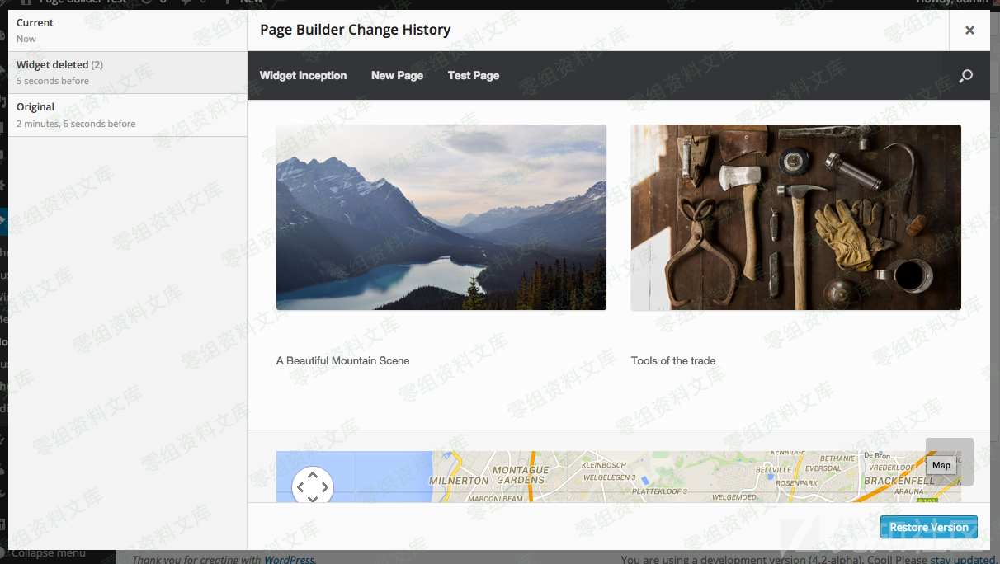

本次漏洞就是出现在该插件内置的实时编辑器中。

在编辑文章活页面时点击实时编辑器按钮即可使用此工具

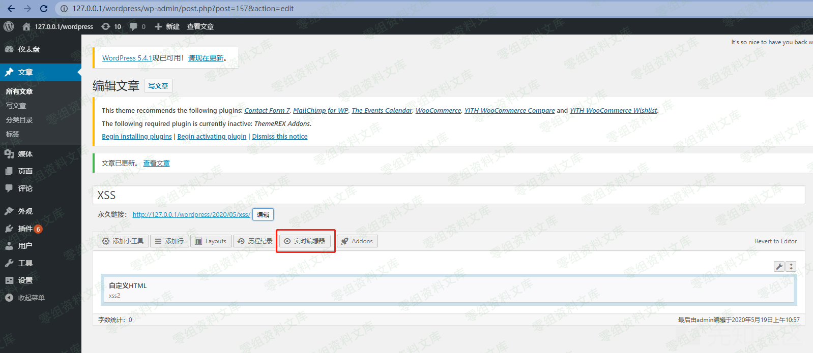

在实时编辑器中可以实时预览编辑文章、添加小工具、修改页面布局等情况

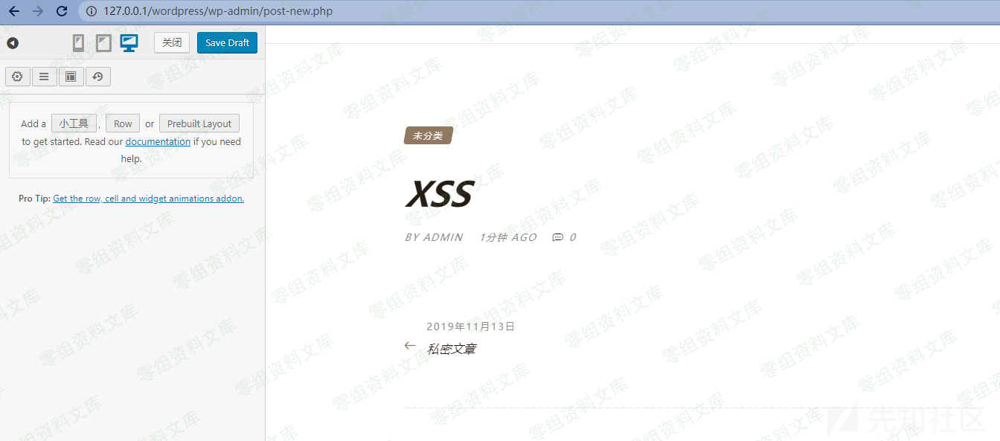

以添加小工具功能为例，我们可以添加一个自定义HTML模块

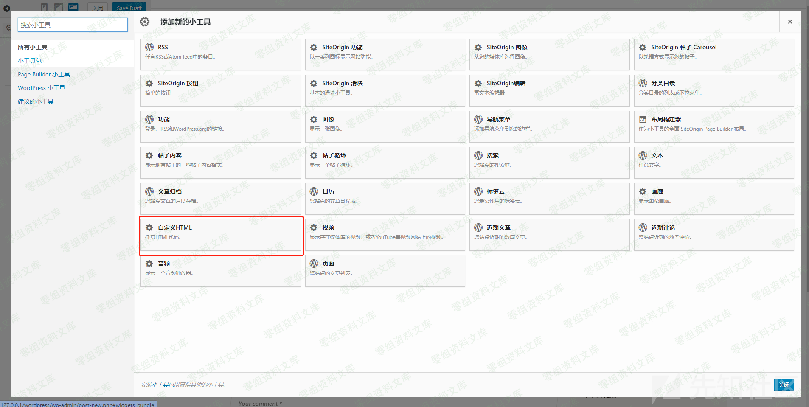

在这个模块中添加一些内容

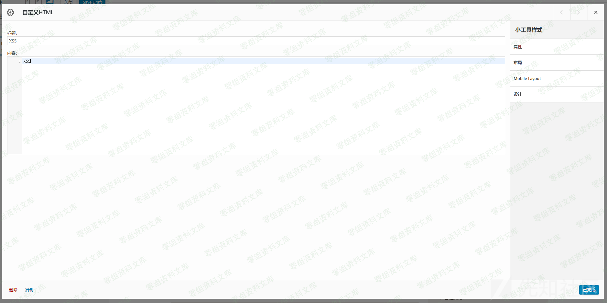

完成编辑后，用户的编辑效果可以实时呈现在编辑器浏览页面中

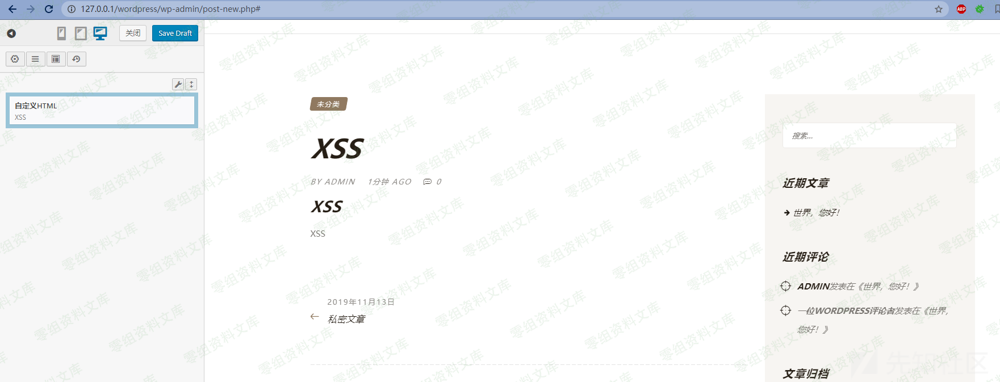

实时编辑器仅提供用户对草稿的编辑与预览。如果需要保存与发布，还需要点击Save
Draft按钮

在了解了Page Builder by
SiteOrigin插件的功能之后，再看一下后台是如何实现与如何产生漏洞的

当用户点击实时编辑器按钮后，会进入上文描述的实时编辑器页面

此时用户可以对页面进行一些编辑操作，当用户编辑完成后点击已完成按钮后，会向后台发送如下请求：

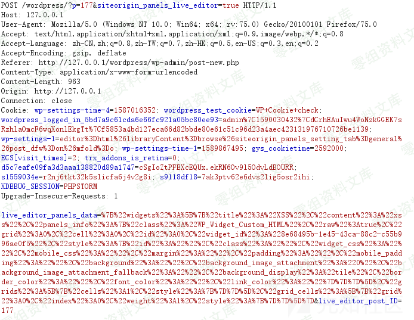

url中p参数代表目前编辑的文章id，siteorigin\_panels\_live\_editor=true代表目前正开启使用实时编辑器，live\_editor\_panels\_data参数值为修改后的页面数据

可以跟进插件后台看一下代码

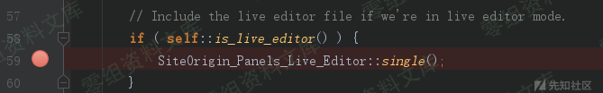

程序通过is\_live\_editor来判断是否使用实时编辑器

我们接下来看一下is\_live\_editor函数

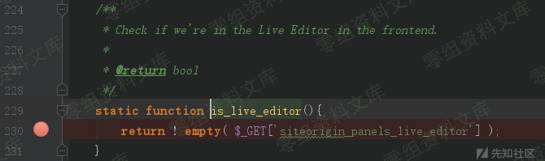

is\_live\_editor函数的作用是检查用户是否在前端的实时编辑器中，当用户提交的请求url中siteorigin\_panels\_live\_editor不为空时，则判断用户正在使用实时编辑器

接着，程序调用SiteOrigin\_Panels\_Live\_Editor::single()函数包含实时编辑器文件

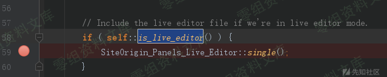

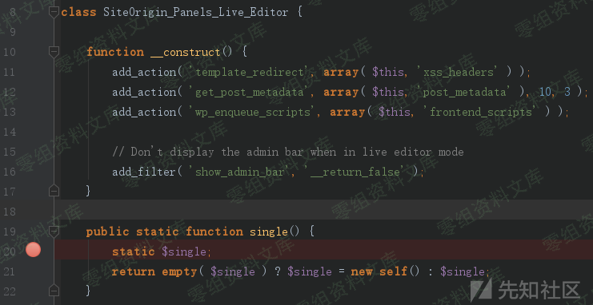

在SiteOrigin\_Panels\_Live\_Editor类的构造方法中，通过add\_action函数将post\_metadata函数挂载到get\_post\_metadata
hook上

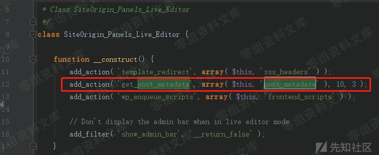

get\_{\$meta\_type}\_metadata
hook用以处理动态部分\$meta\_type指定的元数据类型并获取元数据，这里是用来获取挂载的post\_metadata函数返回的元数据

接下来看一下post\_metadata函数

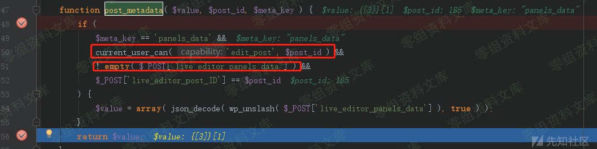

在post\_metadata函数中，对访问实时编辑器的用户身份、提交的跟新信息等进行校验，通过校验的数据可以进行后续处理并返回元数据。但post\_metadata函数并没有通过校验csrf
token来保护提交数据的来源合法性。这将导致csrf漏洞的产生。

在通过一系列的校验后，程序将live\_editor\_panels\_data参数提交的页面信息进行加工并进行渲染工作。程序使用add\_filter('the\_content',
string \$content )实现页面内容加工工作,然后再将其打印到屏幕上

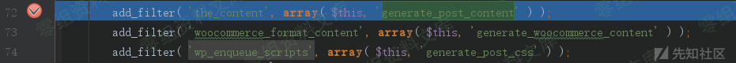

这里用来加工页面信息的函数是generate\_post\_content

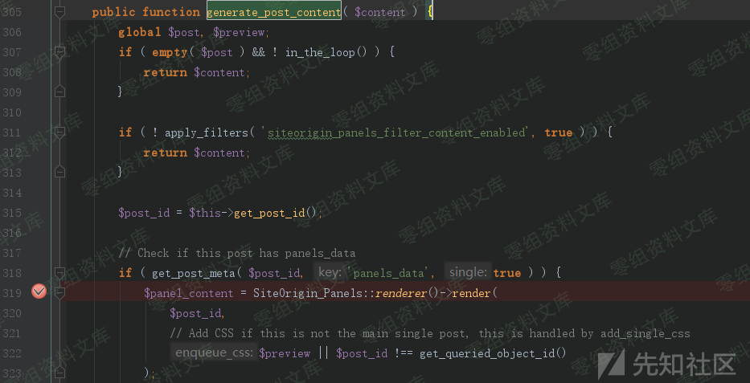

最终，live\_editor\_panels\_data参数中提交的新的页面信息将会被打印到屏幕上

需要特别注意的是，此插件实施编辑器中有如下代码

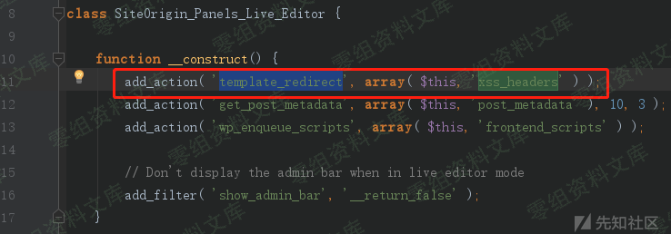

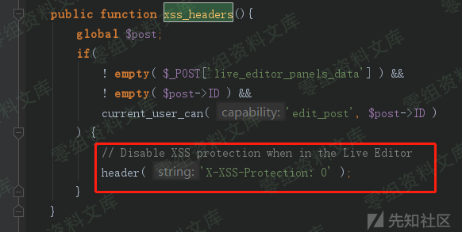

实时编辑器通过header( 'X-XSS-Protection:
0');设置X-XSS-Protection响应头以关闭浏览器XSS保护。可见这个插件的实时编辑器页面中允许xss的触发

### 漏洞复现

构造实时编辑提交页面修改的数据包

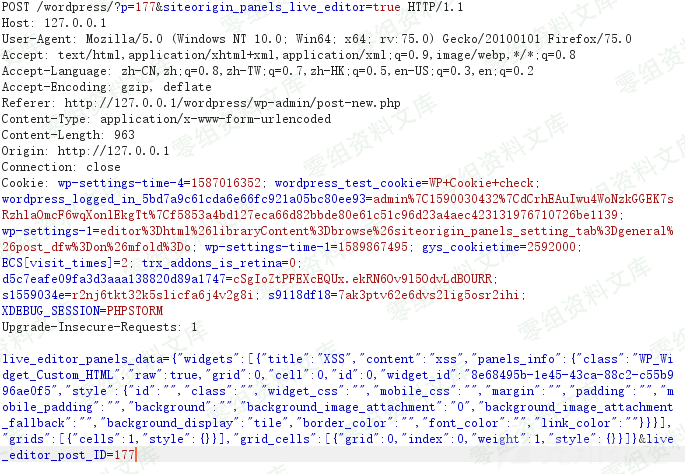

将其中的content字段改为xss payload

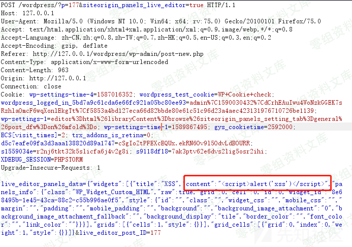

生成csrf poc

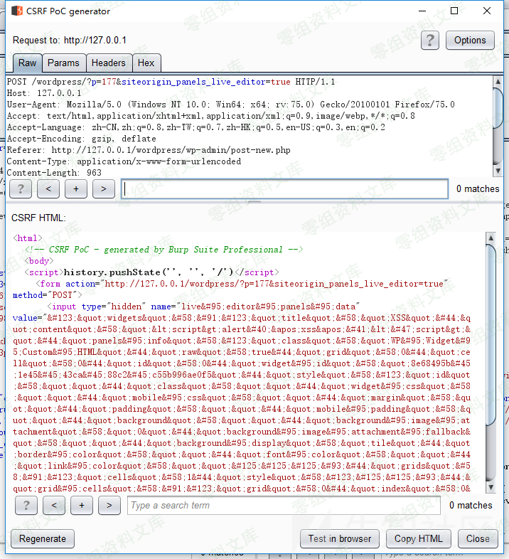

当管理员访问该poc页面时，xss触发

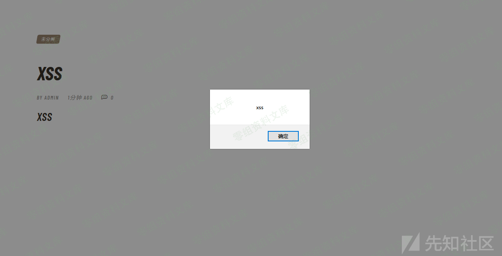

通过xss漏洞，可以构造payload进行进一步的攻击，例如添加一个管理员账号。

参考链接
--------

> https://kumamon.fun/WordPress-Page-Buider/
