## 核对与使用边界

- 明确更正：检测只判断 major==7、patch≤4，未验证 minor==0，会把 7.1.4 等误纳；该版本逻辑不等于漏洞确认。
- 代码原样保留：`self.s.headrs` 拼写错，nonce 正则未处理 None，exp() 只有 pass，不包含文件上传实现。原文 text/plain 失败与加入图像头后的 MIME 结果须分开，页面指纹未发现不能判无漏洞。

本文已按保存的全文审阅记录进行文字校订；本轮仅静态核对，未运行 PoC、请求目标或逐图验证。

适用条件与版本记录（来源主张，未列为明确更正的部分仍待权威资料核对）：7.0.0–7.0.4 claimed; public upload feature/nonce available; PHP execution in upload path

- **事实待核（1）**：检测只判major7与patch&lt;=4，未检查minor0，会误判7.1.4等。该项尚不能从转载本身确定外部事实；下文相应编号、版本或修复说法只作为来源记录，不能据此判定部署受影响或已修复。明确更正另列于本节。

- **证据待核（2）**：self.s.headrs拼错；nonce正则未判None，页面指纹缺失不能证明无漏洞。保留原引用、截图位置和实验叙述；本项所缺材料未被补造，截图存在或作者宣称成功都不等于已核验其内容。

- **事实待核（3）**：exp方法只有pass，代码不是文件上传PoC，版本判断也不是利用确认。该项尚不能从转载本身确定外部事实；下文相应编号、版本或修复说法只作为来源记录，不能据此判定部署受影响或已修复。明确更正另列于本节。

- **证据待核（4）**：前文说text/plain通过与允许图片类型矛盾，应区分初次失败和加入图片头后的类型。保留原引用、截图位置和实验叙述；本项所缺材料未被补造，截图存在或作者宣称成功都不等于已核验其内容。

- **事实待核（5）**：缺CVE/修复版本，有精确xz分析来源。该项尚不能从转载本身确定外部事实；下文相应编号、版本或修复说法只作为来源记录，不能据此判定部署受影响或已修复。明确更正另列于本节。

历史原文标识：下文原技术材料按来源保留；仅本节明确确认的更正替代相应旧说法，标为待核的观察仍不是事实确认。

# WordPress Plugin - WPdiscuz 7.0.4 任意文件上传漏洞

一、漏洞简介
------------

二、漏洞影响
------------

WPdiscuz 7.0.0 - WPdiscuz 7.0.4

三、复现过程
------------

### 漏洞分析

-   1.环境搭建后，手动安装wpdiscuz插件后，看到文章下增加评论模块

-   2.phpstorm导入web目录，点击图片按钮，上传一个php文件测试一下，上传路径是`http://www.0-sec.org:8888/wordpress/wp-admin/admin-ajax.php`，默认是上传不了的。

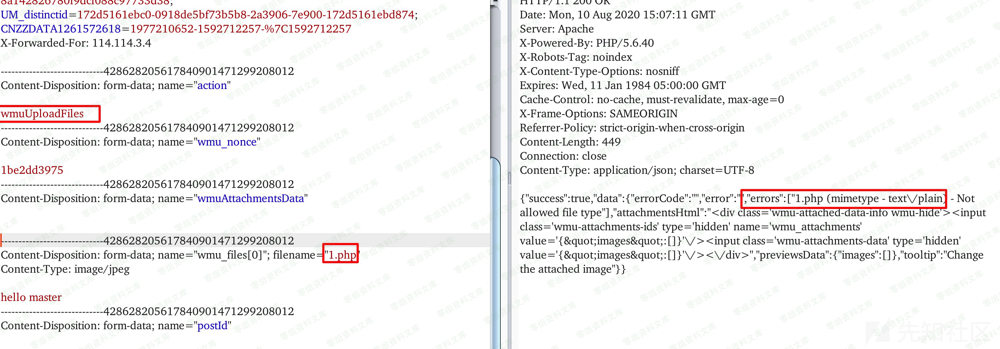

-   3.从入口点分析，如图是wp\_filter的action过滤

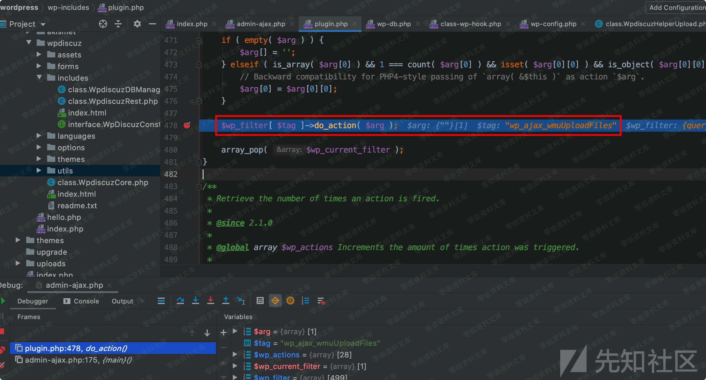

-   4.跟进去，可以看到上传的功能点，再进去

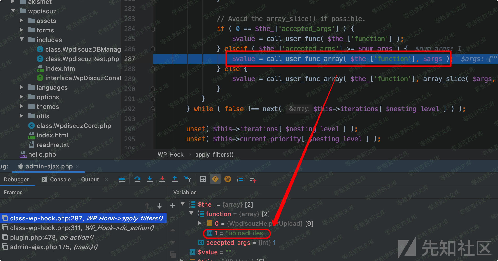

-   5.可以看到如图位置，使用getMimeType方法根据文件内容获取文件类型，并不是通过文件后缀名判断，进一步根据\$mineType判断是否是允许的上传类型。

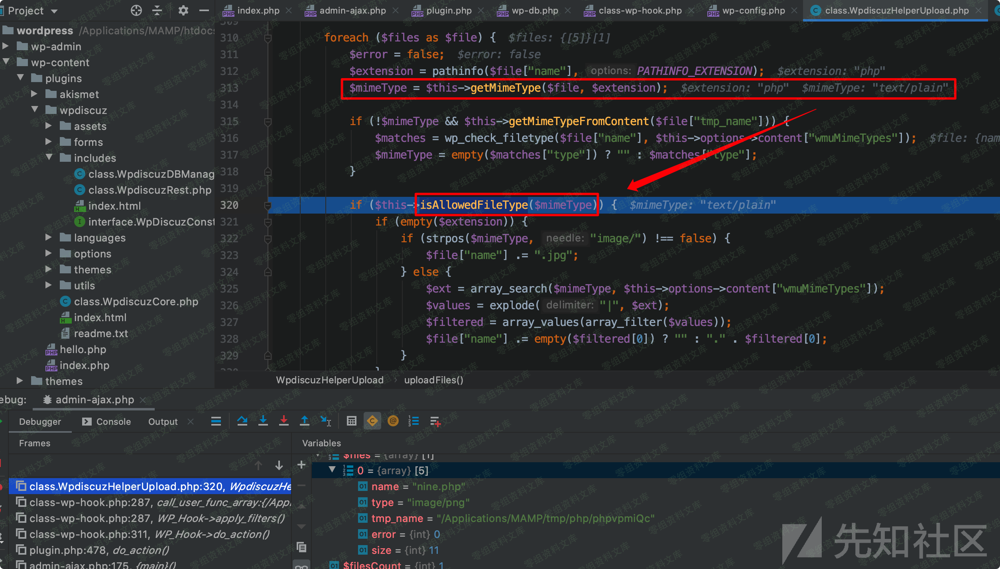

-   6.跟入查看isAllowedFileType方法，在判斷\$mineType是否在\$this -\>
    options -\> content\[\"wmuMimeTypes\"\]中存在。

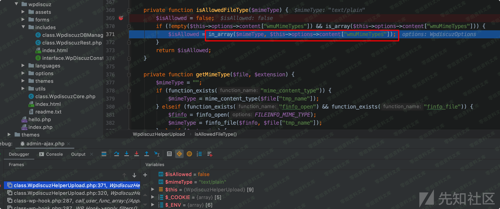

-   7.如图，进入\$options中，可以content\[\"wmuMimeTypes\"\]使用三目运算判断，搜索上下文得知，结果就是\$defaultOptions\[self::TAB\_CONTENT\]\[\"wmuMimeTypes\"\]

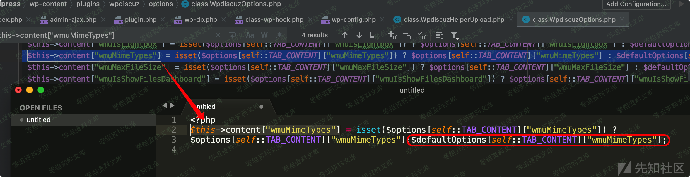

-   8.进入\$defaultOptions中可以得到最终\$this -\> options -\>
    content\[\"wmuMimeTypes\"\]的值是几种常见的图片类型。

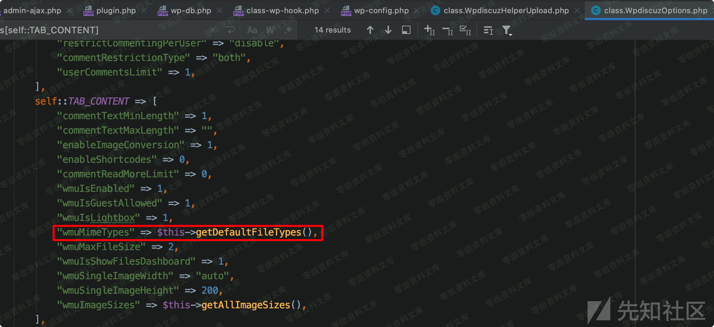

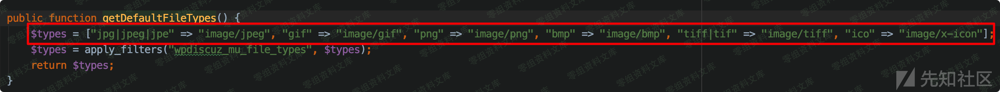

-   9.很明显此时文件类型已经通过getMimeType()方法修改为text/plain了，但是回到进入isAllowedFileType的代码，发现程序只在此处对上传文件进行了判断后，直接保存了文件。

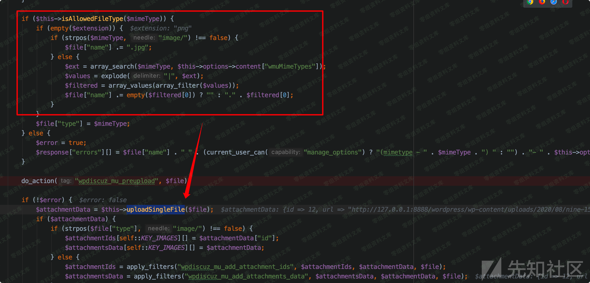

### 漏洞复现

如此，程序只是根据文件内容判断文件类型，并未对文件后缀进行效验，构造一个图片马，或者手动在webshell前面加上图片头信息即可绕过。

-   1.把后门文件追加到图片后

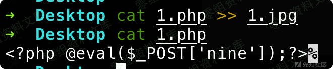

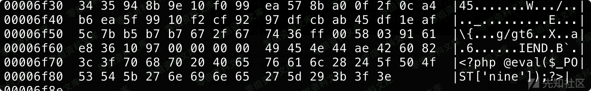

-   2.上传并修改后缀名为php，可以看到返回路径

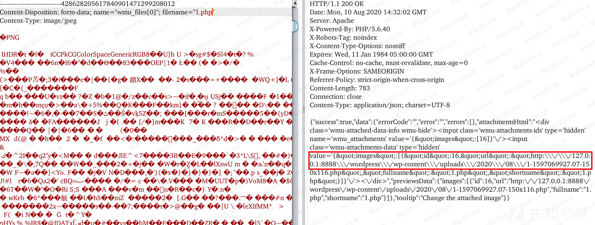

-   3.连接webshell

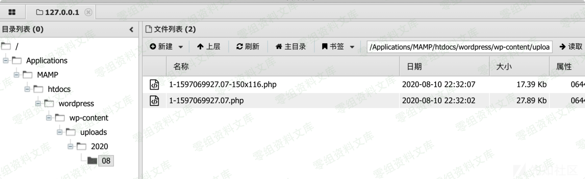

### poc

    import requests
    import re
    import sys

    class wpdiscuz():
        def __init__(self):
            self.s = requests.session()
            self.s.headrs = {
                "User-Agent":
                "Mozilla/5.0 (Windows NT 6.1) AppleWebKit/537.36 (KHTML, like Gecko) Chrome/80.0.3987.132 Safari/537.36 Edg/80.0.361.66"
            }
            self.nonce = ""
            self.state = False

        def check(self, url):
            res = self.s.get(url=url)

            pat1 = "wpdiscuz/themes/default/style\.css\?ver=(.*?)'"
            reSearch1 = re.search(pat1, res.text)
            if reSearch1 == None:
                print("%s 评论插件不存在任意文件漏洞" % url) 
                return
            mess = reSearch1.group(0)
            version = reSearch1.group(1)
            # 判断版本
            vers = version.split(".")
            if (len(vers) == 3):
                if int(vers[0]) == 7:
                    if int(vers[2]) <= 4:
                        print(url + " 存在任意文件上传漏洞 wpdiscuz版本为 %s" % version)
                        self.state = True

            if self.state == True:
                # nonce
                pat2 = '"wmuSecurity":"(.*?)"'
                reSearch2 = re.search(pat2, res.text)
                nonce = reSearch2.group(1)
                self.nonce = nonce
            else:
                print("%s 评论插件不存在任意文件漏洞" % url)    

        def exp(self, url, project, filepath):
            pass

    if __name__ == "__main__":
        wpdiscuz = wpdiscuz()
        url = sys.argv[1]
        print("检测漏洞结果:")
        wpdiscuz.check(url)

参考链接
--------

> https://xz.aliyun.com/t/8138\#toc-1
