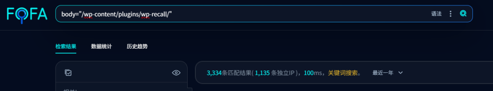
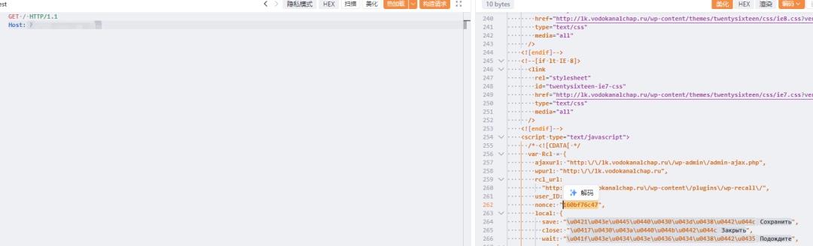
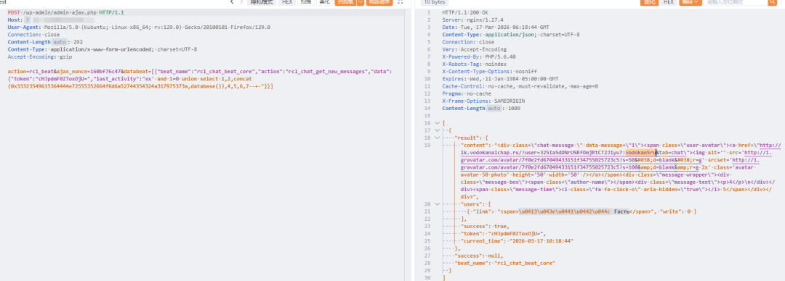
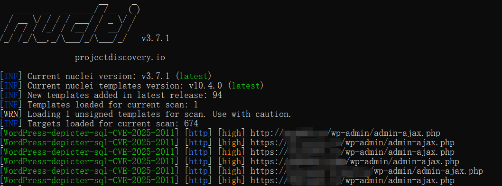
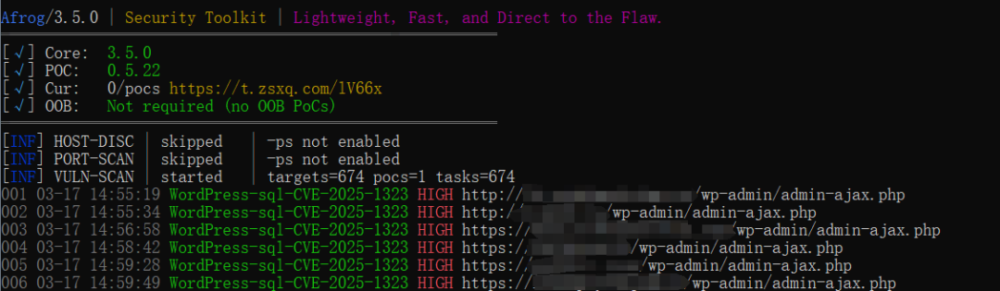
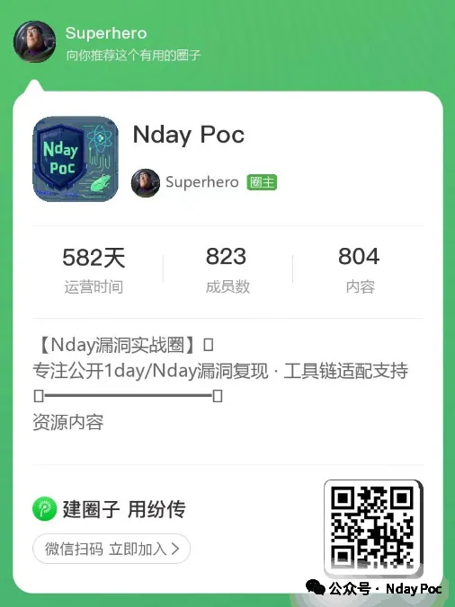

## 核对与使用边界

本文已按保存的全文审阅记录进行文字校订；本轮仅静态核对，未运行 PoC、请求目标或逐图验证。

适用条件与版本记录（来源主张，未列为明确更正的部分仍待权威资料核对）：&lt;=16.26.10; public-page nonce obtainable; optional DB FILE and executable write path for RCE

- **事实待核（1）**：标题只有WordPress掩盖具体插件，需改主产品。该项尚不能从转载本身确定外部事实；下文相应编号、版本或修复说法只作为来源记录，不能据此判定部署受影响或已修复。明确更正另列于本节。

- **证据待核（2）**：首页nonce→注入两步有价值但具体字段/请求全截图，缺文本。保留原引用、截图位置和实验叙述；本项所缺材料未被补造，截图存在或作者宣称成功都不等于已核验其内容。

- **适用与权限边界（3）**：称读取管理员密码需区分哈希，SQL写木马还需FILE/secure_file_priv及路径解析条件。按此限制解释本文结论，版本相同不足以证明所需角色、入口、配置、依赖或可控参数均已满足；原操作和失败记录一并保留。

- **事实待核（4）**：修复版本和原始公告缺失，商业宣传较长。该项尚不能从转载本身确定外部事实；下文相应编号、版本或修复说法只作为来源记录，不能据此判定部署受影响或已修复。明确更正另列于本节。

历史原文标识：下文原技术材料按来源保留；仅本节明确确认的更正替代相应旧说法，标为待核的观察仍不是事实确认。

#  WordPress sql注入(CVE-2025-1323)  
Superhero
                    Superhero  Nday Poc   2026-03-17 07:25  
  
  
  
  
  
  
  
内容仅用于学习交流自查使用，由于传播、利用本公众号所提供的  
POC  
信息及  
POC对应脚本  
而造成的任何直接或者间接的后果及损失，均由使用者本人负责，公众号Nday Poc及作者不为此承担任何责任，一旦造成后果请自行承担！  
  
  
**01**  
  
**漏洞概述**  
  
  
WordPress WP-Recall – Registration, Profile, Commerce & More <= 16.26.10 插件存在SQL注入漏洞,未经身份验证的远程攻击者除了可以利用 SQL 注入漏洞获取数据库中的信息（例如，管理员后台密码、站点的用户个人信息）之外，甚至在高权限的情况可向服务器中写入木马，进一步获取服务器系统权限。  
**02******  
  
**搜索引擎**  
  
  
fofa:  
```
body="/wp-content/plugins/wp-recall/"
```  
  
  
  
  
**03******  
  
**漏洞复现**  
  
1、访问首页获取  
nonce  
  
  
  
2、携带nonce进行注入  
  
  
  
  
  
**04**  
  
**自查工具**  
  
  
nuclei  
  
  
  
afrog  
  
  
  
  
**05******  
  
**修复建议**  
  
  
1、关闭互联网暴露面或接口设置访问权限  
  
2、升级至安全版本  
  
  
**06******  
  
**内部圈子介绍**  
  
### 【Nday漏洞实战圈】🛠️  
  
专注公开1day/Nday漏洞复现 · 工具链适配支持  
  
✧━━━━━━━━━━━━━━━━✧  
  
🔍 **资源内容**  
  
▫️ 整合全网公开1day/Nday漏洞POC详情  
  
▫️ 适配Afrog/Nuclei检测脚本  
  
▫️ 支持内置与自定义POC目录混合扫描  
  
🔄 **更新计划**  
  
▫️ 每周新增7-10个实用POC（来源公开平台）  
  
▫️ 所有脚本经过基础测试，降低调试成本  
  
🎯 **适用场景**  
  
▫️ 企业漏洞自查 ▫️ 渗透测试 ▫️ 红蓝对抗 ▫️ 安全运维  
  
✧━━━━━━━━━━━━━━━━✧  
  
⚠️ **重要声明**  
  
▫️  
仅限合法授权测试，严禁违规使用  
  
**▫️虚拟资源服务，购买后不接受任何形式退款**  
  
▫️  
付款  
前请评估需求，慎重考虑  
  
  
  
  


---

> 来源：gelusus/wxvl（微信公众号漏洞文章自动归档，原文见文首链接）
