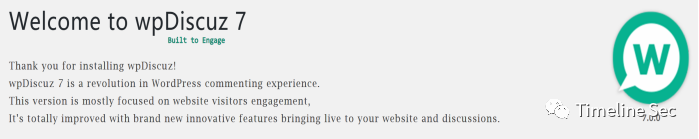
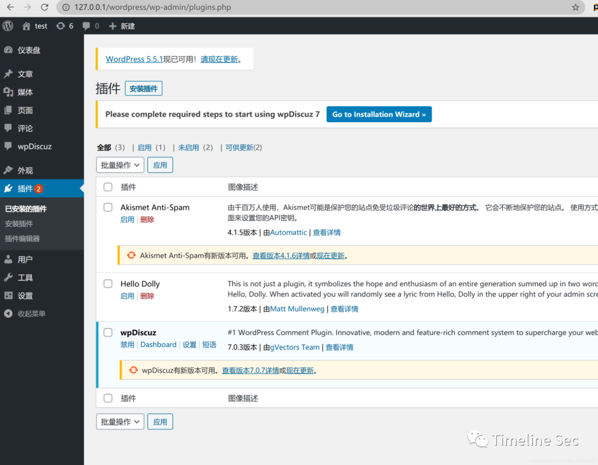
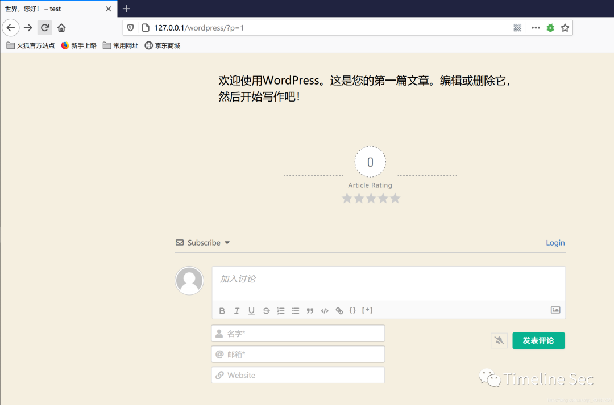
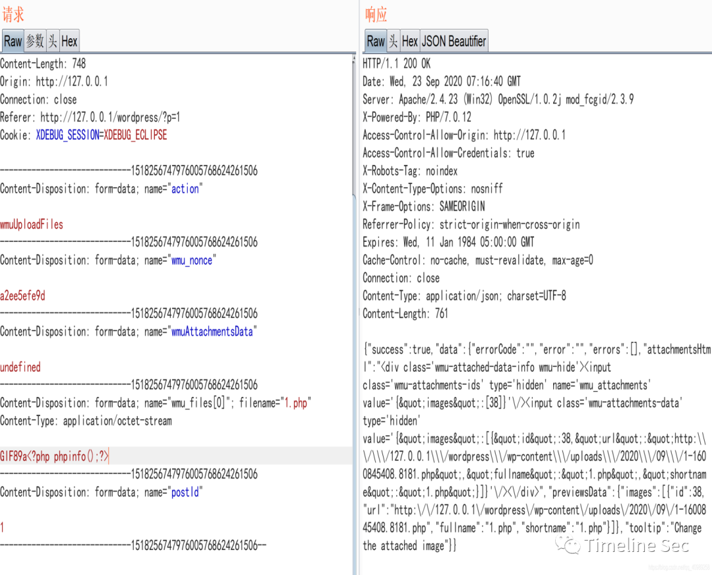
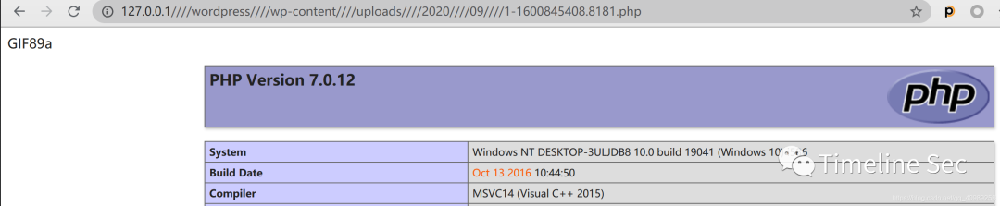
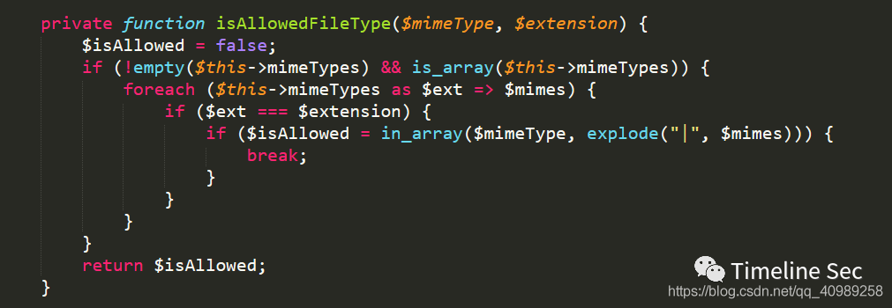
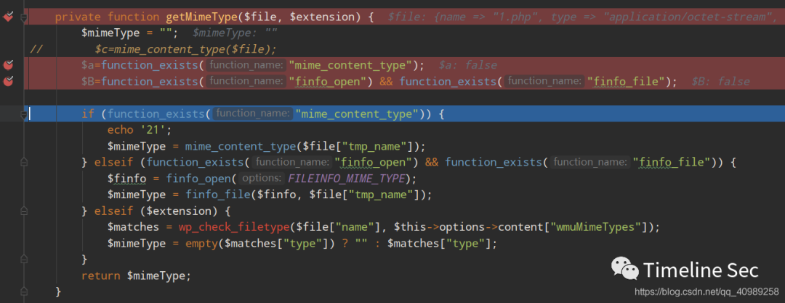
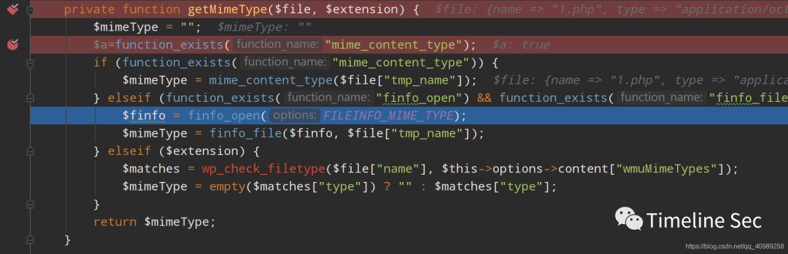

## 核对与使用边界

本文已按保存的全文审阅记录进行文字校订；本轮仅静态核对，未运行 PoC、请求目标或逐图验证。

适用条件与版本记录（来源主张，未列为明确更正的部分仍待权威资料核对）：7.0.0–7.0.4; tested7.0.3/WP5.4.1; MIME functions available otherwise wp_check_filetype fallback rejects; PHP execution

- **证据待核（1）**：与490同漏洞，额外记录MIME函数缺失导致利用失败，属于互补应重点保留。保留原引用、截图位置和实验叙述；本项所缺材料未被补造，截图存在或作者宣称成功都不等于已核验其内容。

- **事实待核（2）**：7.0.7是推荐下载版本不一定首修版本，不能直接标修复下界。该项尚不能从转载本身确定外部事实；下文相应编号、版本或修复说法只作为来源记录，不能据此判定部署受影响或已修复。明确更正另列于本节。

- **证据待核（3）**：WordPress下载链接代码内有转义下划线，访问URL多重////为转换噪声。保留原引用、截图位置和实验叙述；本项所缺材料未被补造，截图存在或作者宣称成功都不等于已核验其内容。

- **事实待核（4）**：只称文件头决定MIME过度简化；关键上传报文全图，缺主CVE与官方公告。该项尚不能从转载本身确定外部事实；下文相应编号、版本或修复说法只作为来源记录，不能据此判定部署受影响或已修复。明确更正另列于本节。

历史原文标识：下文原技术材料按来源保留；仅本节明确确认的更正替代相应旧说法，标为待核的观察仍不是事实确认。

# WordPress 评论插件 wpDiscuz 任意文件上传复现

<meta name="referrer" content="no-referrer"/>

> 本文由 [简悦 SimpRead](http://ksria.com/simpread/) 转码， 原文地址 [mp.weixin.qq.com](https://mp.weixin.qq.com/s/-H1LRmVGYz8YuTCZqMIqsw)

**上方蓝色字体关注我们，一起学安全！**

**作者：daxi0ng****@Timeline Sec  
**

**本文字数：732**

**阅读时长：2~3min**

**声明：请勿用作违法用途，否则后果自负**

**0x01 简介**  

  

wpDiscuz 是 WordPress 评论插件。创新，现代且功能丰富的评论系统，可充实您的网站评论部分。  



**0x02 漏洞概述**  

  

Wordfence 的威胁情报团队在一款名叫 wpDiscuz 的 Wordpress 评论插件中发现了一个高危漏洞，而这款插件目前已有超过 80000 个网站在使用了。这个漏洞将允许未经认证的攻击者在目标站点中上传任意文件，其中也包括 PHP 文件，该漏洞甚至还允许攻击者在目标站点的服务器中实现远程代码执行。  

**0x03 影响版本**  

wpDiscuz7.0.0–7.0.4

**0x04 环境搭建**  

为  

Wordpress5.4.1 下载地址

```
https://cn.wordpress.org/wordpress-5.4.1-zh\_CN.tar.gz

```

wpDiscuz7.0.3 下载地址  

```
https://downloads.wordpress.org/plugin/wpdiscuz.7.0.3.zip

```

用 phpstudy 搭建 Wordpress，然后将 wpdiscuz 放到 \\ wordpress\\wp-content\\plugins 目录下，进入 Wordpress 后台插件页面启动即可。  
  



**0x05 漏洞复现**  

1、进入首页默认文章的评论处。点击图片标签。  



2、wpDiscuz 插件会使用 mime\_content\_type 函数来获取 MIME 类型，但是该函数在获取 MIME 类型是通过文件的十六进制起始字节来判断，所以只要文件头符合图片类型即可。  

  

3、访问上传的文件。

http://127.0.0.1////wordpress////wp-content////uploads////2020////09////1-1600845408.8181.php  



**0x06 修复方式**  

升级 wpDiscuz 版本。

```
https://downloads.wordpress.org/plugin/wpdiscuz.7.0.7.zip

```

isAllowedFileType 函数中对 extension 后缀进行了检测，当 MIME 与后缀不一样时会在进入最后一步之前返回 False，也就是说使用 MIME 的白名单来对上传文件的后缀进行了限制。  



**0x07 踩坑经验**  

分析有很多师傅分析过了，我就说下我遇到的问题。

1、搭建 wp 的时候，getMimeType 函数的前两个 if 判断默认函数是否被定义都返回 False，然后跳到了 wordpress 自带的 wp\_check\_filetype 函数中，就会绕过失败。后换了一个工具搭建 wp 就没有这个问题。  



使用其他版本搭建  



```
参考链接：

```

https://xz.aliyun.com/t/8138

  

  


  


**阅读原文看更多复现文章  
**

Timeline Sec 团队  

安全路上，与你并肩前行

---

> 来源：MrWQ/vulnerability-paper（https://github.com/MrWQ/vulnerability-paper）
