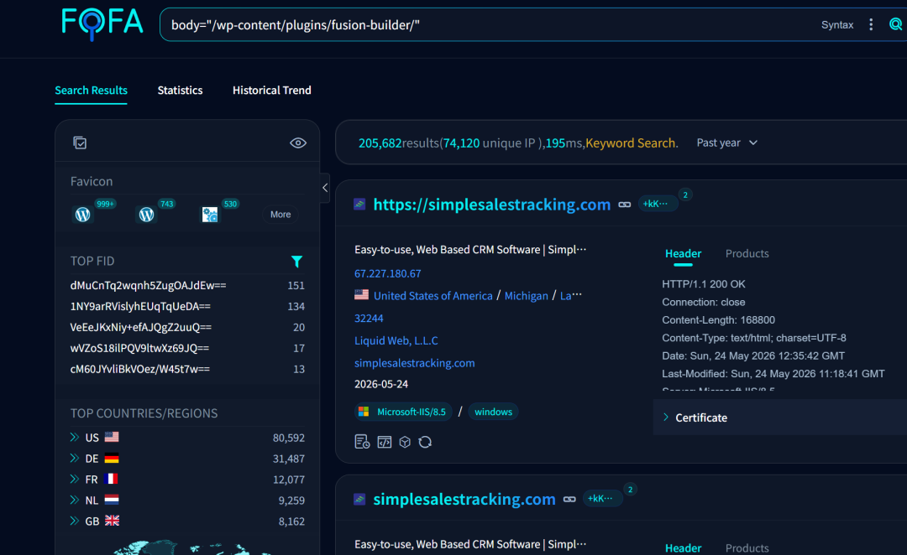

## 核对与使用边界

本文已按保存的全文审阅记录进行文字校订；本轮仅静态核对，未运行 PoC、请求目标或逐图验证。

适用条件与版本记录（来源主张，未列为明确更正的部分仍待权威资料核对）：&lt;=3.15.2 fixed3.15.3 claimed; unauth widget AJAX and conditional-tags branch; arguments not shown

- **结论使用边界（1）**：仅文字描述call_user_func与外部PoC仓库，未含请求/代码/返回，不能作为独立复现。此项限制直接适用于下文对应结论；现有正文不足以作更宽泛推论，所列方法和原始证据均保留。

- **事实待核（2）**：销量90万/资产20万推全球受影响20万缺测量口径，指纹命中非版本/漏洞确认。该项尚不能从转载本身确定外部事实；下文相应编号、版本或修复说法只作为来源记录，不能据此判定部署受影响或已修复。明确更正另列于本节。

- **事实待核（3）**：无官方公告/补丁链接；版本范围和CVSS需核验。该项尚不能从转载本身确定外部事实；下文相应编号、版本或修复说法只作为来源记录，不能据此判定部署受影响或已修复。明确更正另列于本节。

- **操作与副作用边界（4）**：插件和主题关系解释较清晰应保留，24小时删除等非技术宣传可清理。保留原步骤及请求方法。执行条件包括隔离且获授权的可恢复环境、预先记录相关文件/账号/配置/业务记录状态；响应完成不能等同无副作用，恢复时须核对该操作涉及的实际对象。

历史原文标识：下文原技术材料按来源保留；仅本节明确确认的更正替代相应旧说法，标为待核的观察仍不是事实确认。

#  CVSS 9.8 【严重】CVE-2026-6279 wordpress Avada Builder 未授权RCE漏洞：call_user_func 无过滤直接沦陷  
原创 爱坤
                    爱坤  爱坤sec   2026-05-24 18:30  
  
# 一 漏洞描述  
  
Avada Builder（fusion-builder）是 Avada 主题配套的页面构建插件，全球最畅销的 WordPress 商业插件之一。版本 ≤ 3.15.2 中，`Fusion_Builder_Conditional_Render_Helper::get_value()` 在处理 `wp_conditional_tags` 分支时，将攻击者 base64 编码的 JSON 数据直接传入 `call_user_func()` 执行，未做任何白名单校验。攻击者通过 `fusion_get_widget_markup` AJAX 接口（无认证注册）发送精心构造的 payload 即可实现远程代码执行。CVSS 评分 9.8。  
  
CVSS 评分 9.8  
# 二 影响版本  
```
插件: Avada Builder (fusion-builder)
影响版本: ≤ 3.15.2
修复版本: ≥ 3.15.3
```  
# 三 搜索语法  
```
body="/wp-content/plugins/fusion-builder/"
```  
  
四 影响范围  
  
  
资产大约20w个  
  
Avada 是 ThemeForest 销量第一的 WordPress 主题（90万+ 销量），fusion-builder 作为其核心组件安装量极大，全球预估受影响站点超过 **20 万个**。且 PoC 已公开，无需认证即可利用，风险极高  
  
  
  
五 利用脚本  
```
https://github.com/zycoder0day/CVE-2026-6279
```  
  
【严重声明】本文所涉及的工具、思路和操作手法仅用于本地安全测试以及教育目的，禁止将其用于非法入侵或对他人的系统进行攻击以及盈利，一切后果由操作者自行承担！！！下载后的24小时请删除。  
  
更多精彩文章与工具分享 欢迎关注  
  


---

> 来源：gelusus/wxvl（微信公众号漏洞文章自动归档，原文见文首链接）
