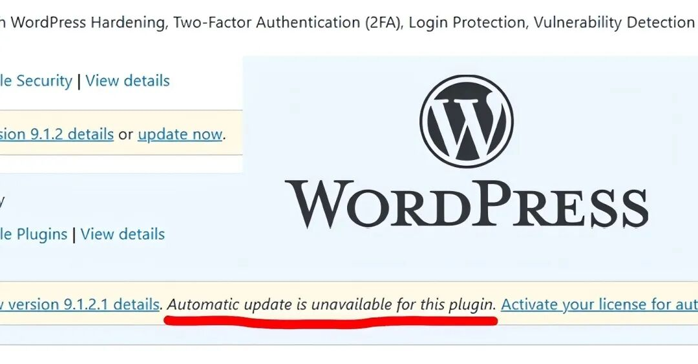
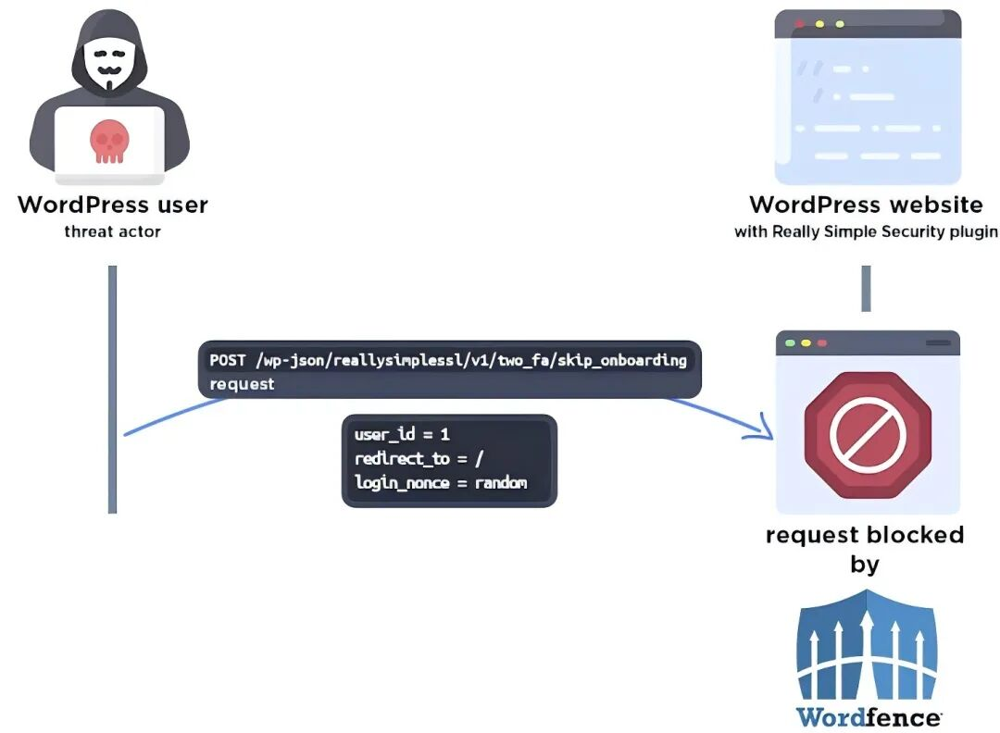

## 核对与使用边界

本文已按保存的全文审阅记录进行文字校订；本轮仅静态核对，未运行 PoC、请求目标或逐图验证。

适用条件与版本记录（来源主张，未列为明确更正的部分仍待权威资料核对）：ReallySimple9.0.0–9.1.1.1,2FAenabled,fixed9.1.2;WPLMS&lt;4.963 separate file read/delete

- **事实待核（1）**：主CVE未进元数据，WPLMS是独立背景漏洞不应归ReallySimple。该项尚不能从转载本身确定外部事实；下文相应编号、版本或修复说法只作为来源记录，不能据此判定部署受影响或已修复。明确更正另列于本节。

- **事实待核（2）**：标题400万按总安装量，须限定2FA开启且受影响版本。该项尚不能从转载本身确定外部事实；下文相应编号、版本或修复说法只作为来源记录，不能据此判定部署受影响或已修复。明确更正另列于本节。

- **实验改动边界（3）**：11月6日披露与公开披露前强制更新混用，需区分私下报告与公开时间。以下步骤按原实验条件保留；人工改动后的行为只支持该修改环境，不用于证明未修改发行版默认可利用。

- **实验改动边界（4）**：强制更新所有旧站点是绝对断言需核；有新闻来源但无Wordfence原公告。以下步骤按原实验条件保留；人工改动后的行为只支持该修改环境，不用于证明未修改发行版默认可利用。

- **操作与副作用边界（5）**：大量HTML推荐/宣传宜剥离，删除配置到接管仍有安装前提。保留原步骤及请求方法。执行条件包括隔离且获授权的可恢复环境、预先记录相关文件/账号/配置/业务记录状态；响应完成不能等同无副作用，恢复时须核对该操作涉及的实际对象。

历史原文标识：下文原技术材料按来源保留；仅本节明确确认的更正替代相应旧说法，标为待核的观察仍不是事实确认。

#  WordPress安全警报：400万网站面临严重认证绕过漏洞   
 安全客   2024-11-18 16:03  
  
WordPress插件Really Simple Security（原名Really Simple SSL）中发现了一个严重的认证绕过漏洞，若被成功利用，攻击者可能远程获得对受影响网站的完整管理权限。  
  
  
  
  
  
该漏洞被标记为CVE-2024-10924（CVSS评分：9.8），影响插件的免费和付费版本，涉及超过400万WordPress网站。Wordfence安全研究员István Márton警告称：“这个漏洞可以被编写成脚本，转化为针对WordPress网站的大规模自动化攻击。”  
  
  
在2024年11月6日披露后，该漏洞在一周后发布的9.1.2版本中被修复。为了防止潜在的滥用，插件维护者与WordPress合作，在公开披露前强制更新了所有运行旧版本插件的网站。  
  
  
Wordfence指出，这个认证绕过漏洞存在于9.0.0至9.1.1.1版本中，由于“check_login_and_get_user”函数中的错误处理不当，允许未经认证的攻击者在启用双因素认证时，登录为任意用户，包括管理员。  
  
  
  
  
  
Márton解释说：“不幸的是，增加双因素认证的一个特性实现不安全，使得未经认证的攻击者在双因素认证启用时，只需一个简单的请求就能访问任何用户账户，包括管理员账户。”  
  
  
成功利用此漏洞可能带来严重后果，恶意行为者可能借此劫持WordPress网站，用于非法活动。  
  
  
此次披露紧随Wordfence揭露的另一个WordPress学习管理系统WPLMS的严重漏洞（CVE-2024-10470，CVSS评分：9.8）之后，该漏洞可能使未经认证的攻击者读取和删除任意文件，可能导致代码执行。  
  
  
具体来说，4.963版本之前的主题“由于文件路径验证和权限检查不足，容易受到任意文件读取和删除的影响”，允许未经认证的攻击者删除服务器上的任意文件。  
  
  
Wordfence表示：“这使得未经认证的攻击者能够读取和删除服务器上的任何任意文件，包括网站的wp-config.php文件。删除wp-config.php文件会使网站进入设置状态，允许攻击者通过将其连接到他们控制的数据库来接管网站。”  
  
  
文章参考：  
  
https://thehackernews.com/2024/11/urgent-critical-wordpress-plugin.html  
  
  
**推荐阅读**  
  
  
  
  
  
<table><tbody><tr opera-tn-ra-comp="_$.pages:0.layers:0.comps:10.classicTable1:0"><td colspan="1" rowspan="1" opera-tn-ra-cell="_$.pages:0.layers:0.comps:10.classicTable1:0.td@@0" style="border-color: rgb(62, 62, 62);border-style: none;padding: 0px;" width="100.0000%"><section><section style="display: flex;flex-flow: row;margin-top: 10px;margin-right: 0%;margin-left: 0%;justify-content: flex-start;"><section style="display: inline-block;vertical-align: middle;width: auto;min-width: 10%;height: auto;flex: 0 0 auto;align-self: center;box-shadow: rgb(0, 0, 0) 0px 0px 0px;"><section style="font-size: 14px;color: rgb(115, 215, 200);line-height: 1;letter-spacing: 0px;text-align: center;">
<strong>01</strong>
</section></section><section style="display: inline-block;vertical-align: middle;width: auto;flex: 100 100 0%;align-self: center;height: auto;"><section style="font-size: 14px;letter-spacing: 1px;line-height: 1.8;color: rgb(140, 140, 140);">
｜<a target="_blank" href="http://mp.weixin.qq.com/s?__biz=MzA5ODA0NDE2MA==&amp;mid=2649787412&amp;idx=1&amp;sn=60eff1e08431344a99a3ffccc62c30a7&amp;chksm=8893bc7bbfe4356d51011ad580c70ae32c417b88f2ccad115db203a5931194d09b1cae62475d&amp;scene=21#wechat_redirect" textvalue="再谈银狐：百变木马银魂不散" linktype="text" imgurl="" imgdata="null" data-itemshowtype="0" tab="innerlink" data-linktype="2">再谈银狐：百变木马银魂不散</a>
</section></section></section><section style="margin: 5px 0%;"><section style="background-color: rgb(224, 224, 224);height: 1px;"><svg viewBox="0 0 1 1" style="float:left;line-height:0;width:0;vertical-align:top;"></svg></section></section></section></td></tr><tr opera-tn-ra-comp="_$.pages:0.layers:0.comps:10.classicTable1:1"><td colspan="1" rowspan="1" opera-tn-ra-cell="_$.pages:0.layers:0.comps:10.classicTable1:1.td@@0" style="border-color: rgb(62, 62, 62);border-style: none;padding: 0px;" width="100.0000%"><section><section style="display: flex;flex-flow: row;margin-top: 10px;margin-right: 0%;margin-left: 0%;justify-content: flex-start;"><section style="display: inline-block;vertical-align: middle;width: auto;min-width: 10%;height: auto;flex: 0 0 auto;align-self: center;"><section style="font-size: 14px;color: rgb(115, 215, 200);line-height: 1;letter-spacing: 0px;text-align: center;">
<strong>02</strong>
</section></section><section style="display: inline-block;vertical-align: middle;width: auto;flex: 100 100 0%;align-self: center;height: auto;"><section style="font-size: 14px;letter-spacing: 1px;line-height: 1.8;color: rgb(140, 140, 140);">
｜<a target="_blank" href="http://mp.weixin.qq.com/s?__biz=MzA4MTg0MDQ4Nw==&amp;mid=2247576812&amp;idx=2&amp;sn=219220578363aab542d9de7c549a9783&amp;chksm=9f8d3ce4a8fab5f2d98be5c71718a8889e4d7f8d4ed088bdba323fc12c7b65d00d4d44b49e66&amp;scene=21#wechat_redirect" textvalue="银狐木马阴云迭起" linktype="text" imgurl="" imgdata="null" data-itemshowtype="0" tab="innerlink" data-linktype="2">银狐木马阴云迭起</a>
</section></section></section><section style="margin: 5px 0%;"><section style="background-color: rgb(224, 224, 224);height: 1px;"><svg viewBox="0 0 1 1" style="float:left;line-height:0;width:0;vertical-align:top;"></svg></section></section></section></td></tr><tr opera-tn-ra-comp="_$.pages:0.layers:0.comps:10.classicTable1:2"><td colspan="1" rowspan="1" opera-tn-ra-cell="_$.pages:0.layers:0.comps:10.classicTable1:2.td@@0" style="border-color: rgb(62, 62, 62);border-style: none;padding: 0px;" width="100.0000%"><section><section style="display: flex;flex-flow: row;margin-top: 10px;margin-right: 0%;margin-left: 0%;justify-content: flex-start;"><section style="display: inline-block;vertical-align: middle;width: auto;min-width: 10%;height: auto;flex: 0 0 auto;align-self: center;"><section style="font-size: 14px;color: rgb(115, 215, 200);line-height: 1;letter-spacing: 0px;text-align: center;">
<strong>03</strong>
</section></section><section style="display: inline-block;vertical-align: middle;width: auto;flex: 100 100 0%;align-self: center;height: auto;"><section style="font-size: 14px;letter-spacing: 1px;line-height: 1.8;color: rgb(140, 140, 140);">
｜<a target="_blank" href="http://mp.weixin.qq.com/s?__biz=MzA5ODA0NDE2MA==&amp;mid=2649787234&amp;idx=1&amp;sn=2a54b4512862ae1775e25977a531a4c8&amp;chksm=8893bb0dbfe4321bae9ee2bdbe2023633b5deac511a0ac30ac2404984a63581a793342f05a0c&amp;scene=21#wechat_redirect" textvalue="社工诈骗席卷北美金融机构" linktype="text" imgurl="" imgdata="null" data-itemshowtype="0" tab="innerlink" data-linktype="2">社工诈骗席卷北美金融机构</a>
</section></section></section><section style="margin: 5px 0%;"><section style="background-color: rgb(224, 224, 224);height: 1px;"><svg viewBox="0 0 1 1" style="float:left;line-height:0;width:0;vertical-align:top;"></svg></section></section></section></td></tr></tbody></table>  
  
  
**安全KER**  
  
  
安全KER致力于搭建国内安全人才学习、工具、淘金、资讯一体化开放平台，推动数字安全社区文化的普及推广与人才生态的链接融合。目前，安全KER已整合全国数千位白帽资源，联合南京、北京、广州、深圳、长沙、上海、郑州等十余座城市，与ISC、XCon、看雪SDC、Hacking Group等数个中大型品牌达成合作。  
  
  
  
  
  
**注册安全KER社区**  
  
**链接最新“圈子”动态**  
  

---

> 来源：gelusus/wxvl（微信公众号漏洞文章自动归档，原文见文首链接）
