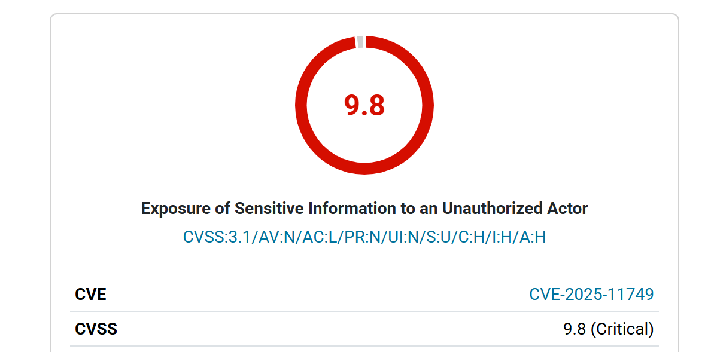

## 核对与使用边界

本文已按保存的全文审阅记录进行文字校订；本轮仅静态核对，未运行 PoC、请求目标或逐图验证。

适用条件与版本记录（来源主张，未列为明确更正的部分仍待权威资料核对）：AI Engine &lt;=3.1.3，3.1.4 修复；必须启用 MCP No-Auth URL，正文明确该选项默认禁用；REST API 索引暴露认证 token 后可访问有管理能力的 MCP

- **事实待核（1）**：仓库正文存在已确认的 ptcp154/UTF-8 编码错配及 NBSP 空白归一化损坏；已恢复审计副本，仓库原文尚待用户批准后修复。该项尚不能从转载本身确定外部事实；下文相应编号、版本或修复说法只作为来源记录，不能据此判定部署受影响或已修复。明确更正另列于本节。

- **代码与转录边界（2）**：抓取混入站点导航、评论、用户资料、相关文章和页脚；空图片 !\[\]()、根相对链接及 /tag/ 中已百分号编码的乱码需单独清理，不能因可读正文恢复就视为链接修复完成。相应原代码作为存在此问题的历史样本保留，不能直接当作可运行、成功复现的 PoC；缺失内容需回原稿核对，不据此补造可执行攻击链。

- **操作与副作用边界（3）**：保留为来源明确的通告/新闻参考，不应仅因缺少可运行 PoC 删除；必须保留独立漏洞边界和原文来源链。保留原步骤及请求方法。执行条件包括隔离且获授权的可恢复环境、预先记录相关文件/账号/配置/业务记录状态；响应完成不能等同无副作用，恢复时须核对该操作涉及的实际对象。

- **代码与转录边界（4）**：原始页脚在“合作单位”处以 * \[!\[... 截断；技术主正文、修复建议、来源链及推荐文章均完整可读，不能把这个页脚截断误报成主漏洞技术步骤缺失。相应原代码作为存在此问题的历史样本保留，不能直接当作可运行、成功复现的 PoC；缺失内容需回原稿核对，不据此补造可执行攻击链。

- **适用与权限边界（5）**：漏洞依赖显式启用 No-Auth URL；不能将插件全部安装量当成实际受影响网站数，也不能写成所有默认配置可直接提权。按此限制解释本文结论，版本相同不足以证明所需角色、入口、配置、依赖或可控参数均已满足；原操作和失败记录一并保留。

- **事实待核（6）**：正文的 11953 只在 React Native CLI 推荐文章出现，不应记入 AI Engine 受影响编号。该项尚不能从转载本身确定外部事实；下文相应编号、版本或修复说法只作为来源记录，不能据此判定部署受影响或已修复。明确更正另列于本节。

- **适用与权限边界（7）**：主链为认证 token 暴露后调用 MCP 管理功能，不能直接简写成原始无条件操作系统 RCE；上传后门等是后续影响说明，文章没有独立复现证据。按此限制解释本文结论，版本相同不足以证明所需角色、入口、配置、依赖或可控参数均已满足；原操作和失败记录一并保留。

- **事实待核（8）**：译文混入“24 小时内 6 次尝试”“2145 美元赏金”“10 万安装量”等时间敏感数字；本轮只核了漏洞记录中的核心范围，统计与奖金须另核原始研究报告并标时间。该项尚不能从转载本身确定外部事实；下文相应编号、版本或修复说法只作为来源记录，不能据此判定部署受影响或已修复。明确更正另列于本节。

- 编码恢复：已按恢复清单核对本文路径和原始/恢复 SHA-256，采用可无损还原的中文副本；原源文页尾截断事实仍保留，未补造缺失页尾。

历史原文标识：下文原技术材料按来源保留；仅本节明确确认的更正替代相应旧说法，标为待核的观察仍不是事实确认。

# WordPress的AI引擎插件中存在严重漏洞（CVE-2025-11749），可致网站被攻击者完全控制

> 图片说明（2026-10-04）：归档的空图片位置补录来源页面当前封面，图注区分当前插图与仍未知的历史原图；未把来源封面当作实验截图或漏洞证明。

首页

阅读

* [安全资讯](https://www.anquanke.com/news)
* [安全知识](https://www.anquanke.com/knowledge)
* [安全工具](https://www.anquanke.com/tool)

活动

社区

学院

安全导航

内容精选

* [专栏](/column/index.html)
* [精选专题](https://www.anquanke.com/subject-list)
* [安全KER季刊](https://www.anquanke.com/discovery)
* [360网络安全周报](https://www.anquanke.com/week-list)

# WordPress的AI引擎插件中存在严重漏洞（CVE-2025-11749），可致网站被攻击者完全控制

阅读量**21758**

发布时间 : 2025-11-05 17:54:53

**x**

##### 译文声明

本文是翻译文章，文章原作者 Ddos，文章来源：securityonline

原文地址：<https://securityonline.info/critical-cve-2025-11749-flaw-in-ai-engine-plugin-exposes-wordpress-sites-to-full-compromise/>

译文仅供参考，具体内容表达以及含义原文为准。

> 补录说明（2026-10-04）：此图取自[来源页面当前封面](https://securityonline.info/wp-content/uploads/2025/11/cve98.png)，只作来源插图，不作漏洞验证证据。原归档此处仅为 ``，历史图片 URL 和像素未知；这次补录不是恢复已确认的历史原图。

Wordfence研究人员披露了热门WordPress插件**AI Engine**中存在的一个**严重漏洞（CVE-2025-11749，CVSS评分9.8）**，未经身份验证的攻击者可利用该漏洞**提升权限并完全控制受影响网站**。该漏洞被归类为**敏感信息泄露漏洞**，影响所有版本至3.1.3，3.1.4版本已提供修复补丁。

“此漏洞可被未经身份验证的攻击者利用，提取Bearer令牌，进而完全访问MCP并执行‘wp\_update\_user’等各类命令，通过更新用户角色将权限提升至管理员。”Wordfence解释道。

该问题具体影响在插件的**模型上下文协议（MCP）设置中启用了‘No-Auth URL’功能**的用户——此功能默认处于禁用状态。但一旦启用，会无意中将敏感身份验证令牌暴露至**公共REST API**，使利用变得极其简单。

AI Engine拥有**超10万活跃安装量**，旨在将ChatGPT、Claude等大型语言模型直接集成到WordPress中。通过其MCP（模型上下文协议）功能，插件允许AI代理执行管理任务，包括用户管理、内容编辑和媒体操作。

### **漏洞根源：REST API路由配置缺陷**

漏洞源于插件通过`Meow_MWAI_Labs_MCP`类中的`rest_api_init()`函数注册REST API路由的方式。在3.1.4之前的版本中，“No-Auth URL”端点被**公开注册**，既无适当限制，也未设置`show_in_index => false`参数。

Wordfence分析发现：“在‘No-Auth URL端点（路径中包含令牌）’部分，端点与其他端点一样被注册，但未将‘show\_in\_index’参数设为false。这意味着这些端点也是公开的，会被列在`/wp-json/` REST API索引中。”

因此，当此设置激活时，插件会在REST API索引中**意外公开Bearer令牌**，任何人都能查看并使用该令牌。

### **攻击流程：从令牌泄露到完全接管**

攻击者获取暴露的令牌后，可直接通过MCP端点认证并发出特权命令。Wordfence指出：“通过Bearer令牌认证并访问MCP端点的攻击者，可执行‘wp\_update\_user’等命令，将自己的用户角色更新为管理员。”

这一利用链可实现**网站完全接管**，使攻击者能够上传后门插件、注入SEO垃圾内容，或重定向访客至恶意域名。

### **风险现状与修复建议**

Wordfence证实已检测到**活跃探测行为**，在公开披露后的24小时内已拦截6次利用尝试。

公司强调，仅当“**No-Auth URL**”设置启用时才可能被利用，但警告管理员可能在配置测试或API集成过程中**无意中激活了该功能**。

该漏洞由安全研究员Emiliano Versini通过Wordfence漏洞赏金计划发现并负责任披露。值得注意的是，漏洞代码引入仅一天后即被报告，Versini因此获得**2145美元赏金**。

**修复建议**：

1. 立即升级AI Engine至**3.1.4及以上版本**。
2. 检查并禁用“**No-Auth URL**”功能（如需使用，确保严格限制访问来源）。
3. 审查`/wp-json/`端点，确认无敏感令牌暴露。

本文翻译自securityonline [原文链接](https://securityonline.info/critical-cve-2025-11749-flaw-in-ai-engine-plugin-exposes-wordpress-sites-to-full-compromise/)。如若转载请注明出处。

商务合作，文章发布请联系 anquanke@360.cn

本文由**安全客**原创发布

转载，请参考[转载声明](https://www.anquanke.com/note/repost)，注明出处： [https://www.anquanke.com/post/id/313004](/post/id/313004)

安全KER - 有思想的安全新媒体

本文转载自: [securityonline](https://securityonline.info/critical-cve-2025-11749-flaw-in-ai-engine-plugin-exposes-wordpress-sites-to-full-compromise/)

如若转载,请注明出处： <https://securityonline.info/critical-cve-2025-11749-flaw-in-ai-engine-plugin-exposes-wordpress-sites-to-full-compromise/>

安全KER - 有思想的安全新媒体

分享到：

* [安全资讯](/tag/%D0%B5%C2%AE%D2%AF%D0%B5%E2%80%A6%D0%81%D0%B8%D3%A9%E2%80%9E%D0%B8%C2%AE%D2%9C)
* [漏洞情报](/tag/%D0%B6%D1%98%D2%B8%D0%B6%D2%99%D2%BB%D0%B6%D2%93%E2%80%A6%D0%B6%D2%A0%D2%98)

**+1**0赞

收藏

安全客

分享到：

## 发表评论

您还未登录，请先登录。

[登录](/login/index.html)

[安全客](/member.html?memberId=171771)

这个人太懒了，签名都懒得写一个

* 文章
* **653**

* 粉丝
* **6**

### TA的文章

* ##### [一文读懂香港金融科技周：DART将带领香港金融科技驶向何方？](/post/id/313039)

  2025-11-05 18:35:34
* ##### [WordPress的AI引擎插件中存在严重漏洞（CVE-2025-11749），可致网站被攻击者完全控制](/post/id/313004)

  2025-11-05 17:54:53
* ##### [深度解析Tycoon 2FA钓鱼工具包针对Microsoft 365与Gmail账户的攻击手法](/post/id/313007)

  2025-11-05 17:54:36
* ##### [新型NGate NFC恶意软件通过中继受害者手机的EMV数据与PIN码，对ATM实施盗刷](/post/id/313012)

  2025-11-05 17:54:19
* ##### [CISA发布关键漏洞紧急警报：Gladinet LFI/RCE漏洞与控制面板CWP管理员权限接管漏洞正遭积极利用](/post/id/313015)

  2025-11-05 17:53:59

### 相关文章

* ##### [深度解析Tycoon 2FA钓鱼工具包针对Microsoft 365与Gmail账户的攻击手法](/post/id/313007)

  2025-11-05 17:54:36
* ##### [新型NGate NFC恶意软件通过中继受害者手机的EMV数据与PIN码，对ATM实施盗刷](/post/id/313012)

  2025-11-05 17:54:19
* ##### [CISA发布关键漏洞紧急警报：Gladinet LFI/RCE漏洞与控制面板CWP管理员权限接管漏洞正遭积极利用](/post/id/313015)

  2025-11-05 17:53:59
* ##### [全球网络间谍组织利用ZipperDown漏洞及Android零日漏洞，通过邮件客户端实现一键远程代码执行与账户接管](/post/id/313018)

  2025-11-05 17:53:37
* ##### [React Native CLI 中存在严重漏洞（CVE-2025-11953，CVSS 9.8），攻击者可经由暴露的Metro开发服务器实现RCE](/post/id/313021)

  2025-11-05 17:53:18
* ##### [Bugcrowd收购自动化测试工具Mayhem，以强化其应用安全测试平台能力](/post/id/313024)

  2025-11-05 17:52:48
* ##### [Open VSX扩展市场中出现新型“SleepyDck”恶意软件，允许攻击者远程控制Windows系统](/post/id/313027)

  2025-11-05 17:52:17

### 热门推荐

文章目录

安全KER

* [关于我们](/about)
* [联系我们](/note/contact)
* [用户协议](/note/protocol)
* [隐私协议](/note/privacy)

商务合作

* [合作内容](/note/business)
* [联系方式](/note/contact)
* [友情链接](/link)

内容需知

* [投稿须知](https://www.anquanke.com/contribute/tips)
* [转载须知](/note/repost)
* 官网QQ群：568681302

合作单位

* [![...

---

> 来源：gelusus/wxvl（微信公众号漏洞文章自动归档，原文见文首链接）
