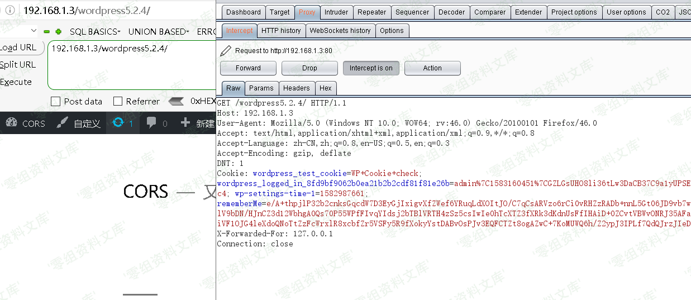
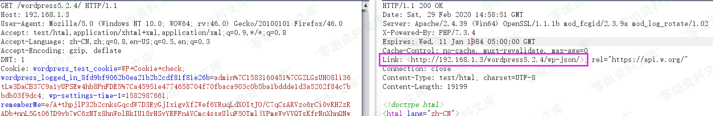
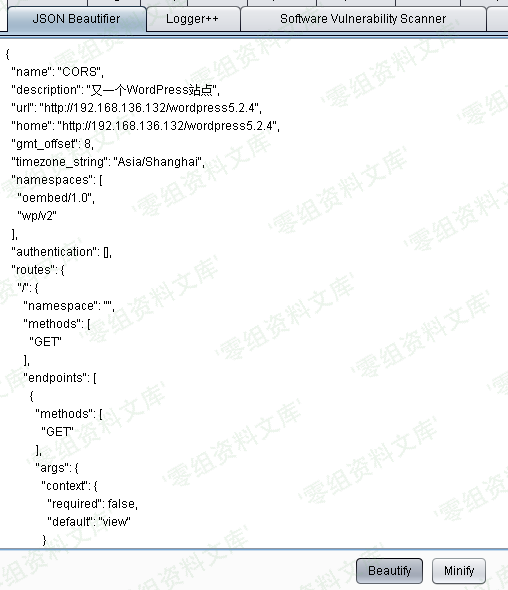
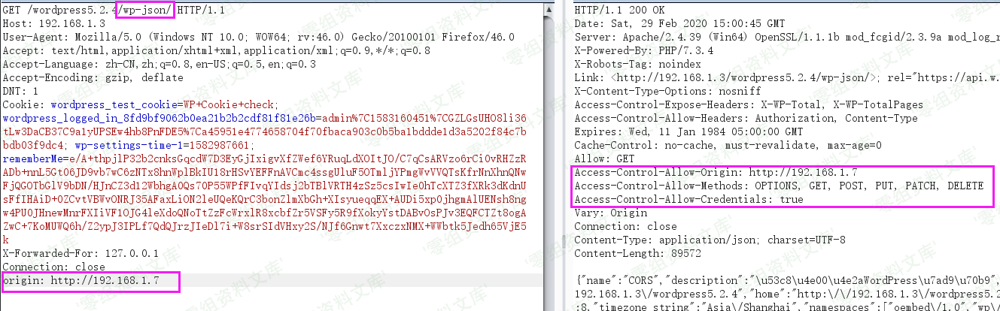
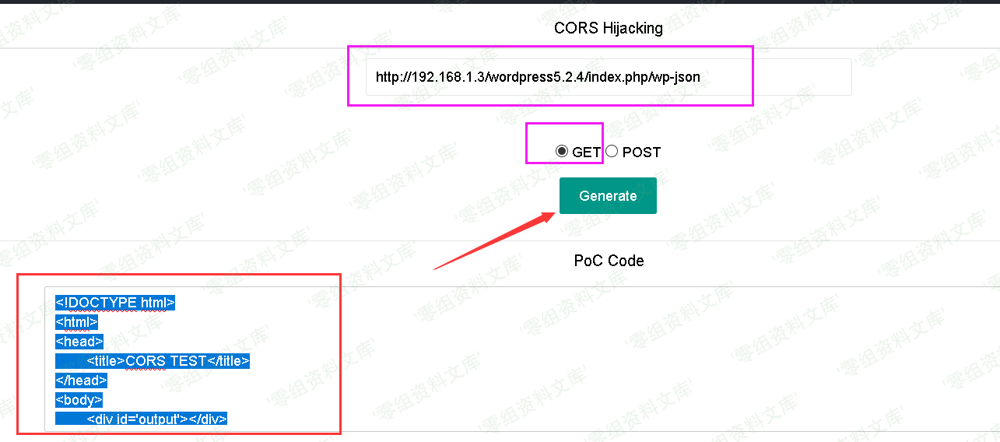
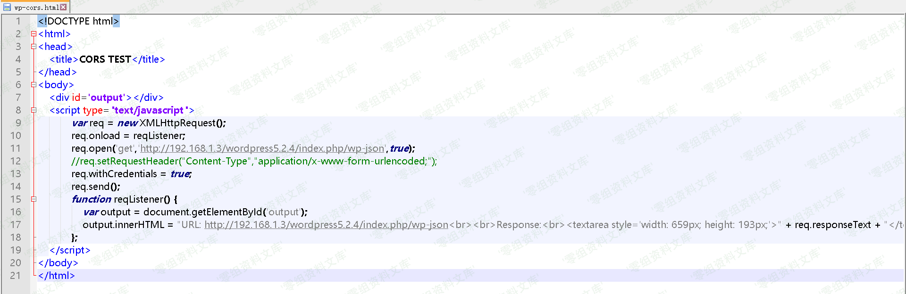

## 核对与使用边界

- 明确结论边界：公开 `/wp-json` 索引反射 Origin 和 Allow-Credentials 只证明响应头行为；没有匿名不可读、凭受害者权限才可读的敏感 REST 数据，不能证明核心 CORS 信息泄漏。
- 须核 REST nonce/Cookie 实际鉴权和受害者浏览器条件；原文 `orgin` 是拼写错误，截图代码与污染 URL 未补造为工作 PoC。

本文已按保存的全文审阅记录进行文字校订；本轮仅静态核对，未运行 PoC、请求目标或逐图验证。

适用条件与版本记录（来源主张，未列为明确更正的部分仍待权威资料核对）：5.2.4 lab; attacker site/credentialed browser, sensitive authenticated REST route and effective REST auth required

- **凭据与会话边界（1）**：仅证明/wp-json公开索引反射Origin并Allow-Credentials不能证明敏感信息泄漏；需显示匿名不可读但带受害权限可读的数据。抓包中的会话不能视为未认证访问证明。需重新取得授权测试会话，不能复用文中值。

- **凭据与会话边界（2）**：未讨论WP REST nonce/cookie鉴权，可能只是预期公开跨域接口，不能定性WP核心漏洞。抓包中的会话不能视为未认证访问证明。需重新取得授权测试会话，不能复用文中值。

- **证据待核（3）**：Origin拼成orgin、多个链接把中文标点说明纳入URL，PoC代码全图。保留原引用、截图位置和实验叙述；本项所缺材料未被补造，截图存在或作者宣称成功都不等于已核验其内容。

- **事实待核（4）**：无官方公告、具体受影响范围或修复，风险结论明显超过现有证据。该项尚不能从转载本身确定外部事实；下文相应编号、版本或修复说法只作为来源记录，不能据此判定部署受影响或已修复。明确更正另列于本节。

历史原文标识：下文原技术材料按来源保留；仅本节明确确认的更正替代相应旧说法，标为待核的观察仍不是事实确认。

# Wordpress 5.2.4 cors跨域劫持漏洞

一、漏洞简介
------------

CORS是一个W3C标准，全称是"跨域资源共享"（Cross-origin resource
sharing）。通过该标准，可以允许浏览器向跨源服务器发出 XMLHttpRequest
请求，从而克服了AJAX只能同源使用的限制，进而读取跨域的资源。CORS允许Web服务器通知Web浏览器应该允许哪些其他来源从该Web服务器的回复中访问内容

漏洞产生原因：在Access-Control-Allow-Origin中反射请求的Origin值。该配置可导致任意攻击者网站可以直接跨域读取其资源内容。

二、漏洞影响
------------

Wordpress 5.2.4

三、复现过程
------------

1、影响版本wordpress5.2.4，首先访问首页，利用burp抓包

2、然后发送到reapeter，日常go一下，看到返回包内容，返回了/wp-json

3、我们将请求包中的url补上/wp-json，再次发包，发现出现了一堆json数据，我们将其复制到jsonbeautiful进行格式化，说明漏洞出现在：[http://www.0-sec.org/wp-json，](http://www.0-sec.org/wp-json，)

4、我们在请求包中，加入orgin头[http://192.168.1.7（实战中为你的vps），再次发送，](http://192.168.1.7（实战中为你的vps），再次发送，)
发现响应头内的

Access-Control-Allow-Origin:已经变成[http://192.168.1.7，并且且Access-Control-Allow-Credentials:的值为true。](http://192.168.1.7，并且且Access-Control-Allow-Credentials:的值为true。)

从而证明是存在cors漏洞的，我们可以进行cors跨域劫持

5、然后我们利用pocbox构造payload，输入漏洞链接(记住！！记住！！！加上[http://)，选择http请求方法即可](http://)，选择http请求方法即可)

6、然后将生成的html内容，放到你的vps下，命名为wp-cors.html

7、然后诱骗受害者点击，就会把json数据传到你的服务器，从而获取对方敏感信息，攻击成功

