## 核对与使用边界

本文已按保存的全文审阅记录进行文字校订；本轮仅静态核对，未运行 PoC、请求目标或逐图验证。

适用条件与版本记录（来源主张，未列为明确更正的部分仍待权威资料核对）：&lt;=5.9.6; administrator; Download Manager dependency active; orderby in orders list

- **结论使用边界（1）**：影响范围、FOFA、docker-compose、启动命令、两个下载地址、PoC、请求与sqlmap全空代码块，严重抓取丢失。此项限制直接适用于下文对应结论；现有正文不足以作更宽泛推论，所列方法和原始证据均保留。

- **适用与权限边界（2）**：管理员前提/时间盲注与依赖写清楚，应保留。按此限制解释本文结论，版本相同不足以证明所需角色、入口、配置、依赖或可控参数均已满足；原操作和失败记录一并保留。

- **适用与权限边界（3）**：读取所有数据库仍受DB权限边界；修复只最新版无明确版本。按此限制解释本文结论，版本相同不足以证明所需角色、入口、配置、依赖或可控参数均已满足；原操作和失败记录一并保留。

- **证据待核（4）**：有FreeBuf精确来源可用于恢复，图片未视查不判坏。保留原引用、截图位置和实验叙述；本项所缺材料未被补造，截图存在或作者宣称成功都不等于已核验其内容。

历史原文标识：下文原技术材料按来源保留；仅本节明确确认的更正替代相应旧说法，标为待核的观察仍不是事实确认。

#  Wordpress wpdm-premium-packages SQL注入漏洞(CVE-2025-24659)   
 船山信安   2025-04-21 05:00  
  
## 插件介绍：  
  
Premium Packages 是一款免费的全功能 WordPress 电子商务插件，可轻松销售数字产品。  
## 漏洞描述：  
  
Premium Packages - Sell Digital Products Securely plugin 5.9.6 及以下版本存在 SQL 注入漏洞。该漏洞是由于在插件仪表板的订单菜单 (/wp-admin/edit.php?post_type=wpdmpro&page=orders) 中查看订单列表时，URL 参数 orderby 未进行充分转义造成的。  
  
因此，拥有管理员权限的攻击者可以利用此漏洞访问目标网站数据库中存储的所有信息。  
  
此外，虽然此 SQL 注入漏洞无法直接从响应数据中检索数据，但可以使用基于时间的盲 SQL 注入技术提取信息，该技术利用 SQL 查询中基于真/假条件的响应时间差异。  
## 影响版本：  

## FOFA:  

## 环境搭建：  
  
使用docker 容器进行搭建，docker-compose.yml 文件内容如下：  
> 原文缺损：此处注明 docker-compose.yml，但归档中的文件内容为空；现有公开资料未找到与本文部署步骤逐字对应的配置，无法恢复。
  
执行如下命令，开启靶场  
> 原文缺损：此处应为启动靶场的命令，但归档代码块为空；未找到同一文章的可核验原命令。
  
  
  
访问目标地址，依次进行如下安装即可。  
  
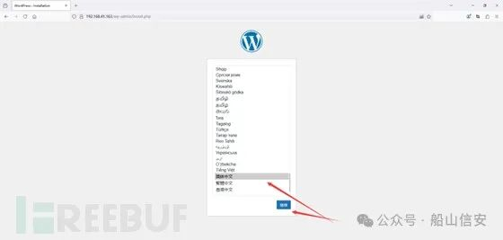  
  
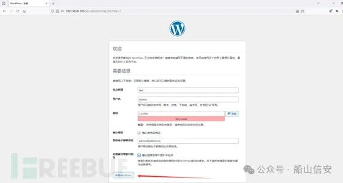  
  
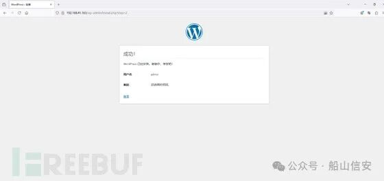  
  
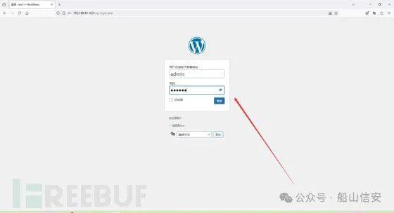  
  
输入账户密码进入后台  
  
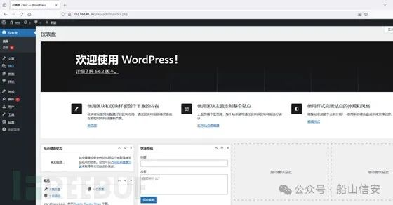  
  
下载插件,插件下载地址如下：  
> 原文缺损：此处标注插件下载地址，但链接未保存在归档中；无法确认原文使用的具体下载地址或版本。补充资料：[Premium Packages 插件目录](https://wordpress.org/plugins/wpdm-premium-packages/)，不是原文链接。
  
这个插件可以直接安装  
  
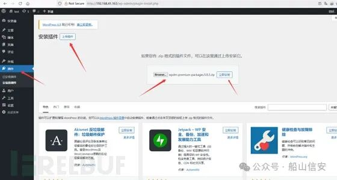  
  
安装完成，进行激活  
  
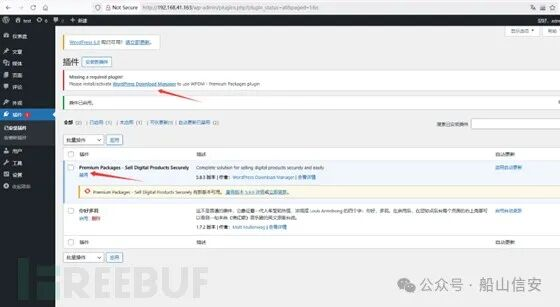  
  
激活后提示需要插件Download Manager，下载地址如下：  
> 原文缺损：此处标注 Download Manager 下载地址，但链接未保存在归档中。补充资料：[WordPress Download Manager 插件目录](https://wordpress.org/plugins/download-manager/)，不是原文链接。
  
下载完插件，进行解压，执行如下命令将插件复制到容器中  
  
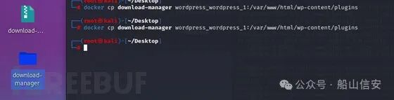  
  
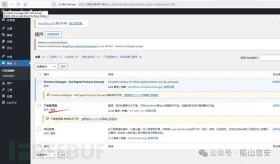  
  
启用即可  
  
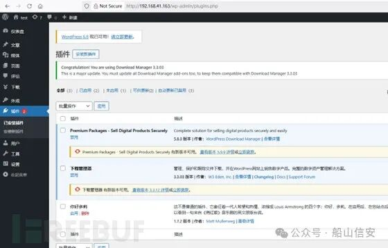  
### 漏洞复现：  
  
该漏洞利用需要管理员权限  
  
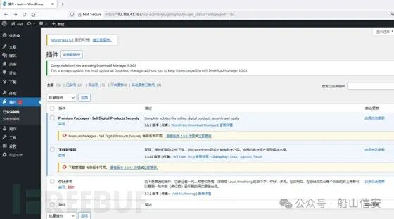  
  
POC 如下：  
> 原文缺损：原文标注 PoC，但归档代码块为空。补充资料：[DoTTak/CVE-2025-24659](https://github.com/DoTTak/CVE-2025-24659) 有公开实现；该仓库内容不是本文原文复原，本次未运行或验证。
  
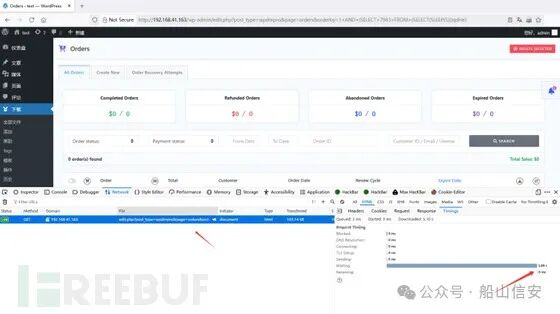  
  
使用burpsuite抓包，修改请求包如下,并保存为2.txt  
> 原文缺损：此处提到 Burp 抓包并保存为 2.txt，但原始 HTTP 请求未保存在归档中。补充资料：[CVE/NVD 记录](https://nvd.nist.gov/vuln/detail/CVE-2025-24659) 描述漏洞参数，不包含本文的抓包文件。
  
直接使用sqlmap 跑数据  
> 原文缺损：此处仅说明使用 sqlmap，具体命令和输出未保存在归档中。补充资料：[DoTTak/CVE-2025-24659](https://github.com/DoTTak/CVE-2025-24659) 是独立公开 PoC，不能视为本文原命令。
  
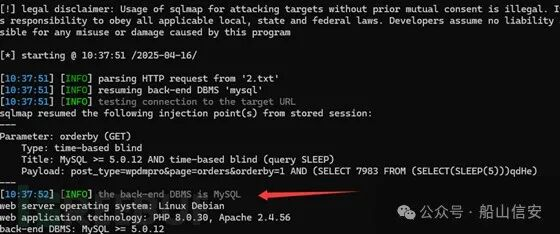  
### 漏洞修复：  
  
升级至最新版  
  
转自：  
https://www.freebuf.com/articles/vuls/427747.html  
  

---

> 来源：gelusus/wxvl（微信公众号漏洞文章自动归档，原文见文首链接）
