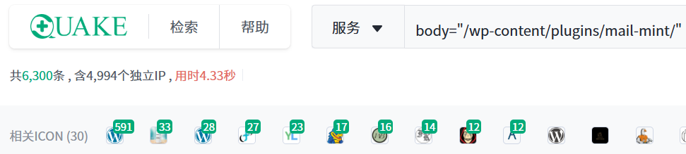
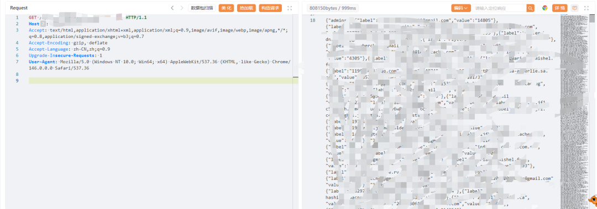

## 核对与使用边界

本文已按保存的全文审阅记录进行文字校订；本轮仅静态核对，未运行 PoC、请求目标或逐图验证。

适用条件与版本记录（来源主张，未列为明确更正的部分仍待权威资料核对）：&lt;1.19.5 claimed; endpoint/authentication/data scope absent

- **结论使用边界（1）**：标题称附Payload但正文仅后台回复获取，未提供请求/参数/返回。此项限制直接适用于下文对应结论；现有正文不足以作更宽泛推论，所列方法和原始证据均保留。

- **事实待核（2）**：信息泄露直接延伸服务器控制无任何链证据；1day在野没有来源/观测时间。该项尚不能从转载本身确定外部事实；下文相应编号、版本或修复说法只作为来源记录，不能据此判定部署受影响或已修复。明确更正另列于本节。

- **结论使用边界（3）**：影响段写Mint Mail而其余MailMint，应统一品牌/slug。此项限制直接适用于下文对应结论；现有正文不足以作更宽泛推论，所列方法和原始证据均保留。

- **代码与转录边界（4）**：所谓Quake语法使用body=需核引擎字段；修复未提供安全版本官方链接。相应原代码作为存在此问题的历史样本保留，不能直接当作可运行、成功复现的 PoC；缺失内容需回原稿核对，不据此补造可执行攻击链。

历史原文标识：下文原技术材料按来源保留；仅本节明确确认的更正替代相应旧说法，标为待核的观察仍不是事实确认。

#  【1 day 在野】WordPressMailMint-CVE-2026-2025-信息泄露 附Payload  
阿伟
                    阿伟  船山信安   2026-04-10 04:20  
  
**免责声明**  
  
由于传播、利用本公众号船山信安所提供的信息而造成的任何直接或者间接的后果及损失，均由使用者本人负责，公众号  
船山信安  
及作者不为此承担任何责任，一旦造成后果请自行承担！如有侵权烦请告知，我们会立即删除并致歉。谢谢！  
  
**一、漏洞描述**  
  
**WordPress MailMint 插件是一款集成邮件营销、用户订阅、邮件发送、数据统计与客户线索管理于一体的 WordPress 生态营销管理插件。该插件存在 CVE-2026-2025 信息泄露漏洞，未对接口访问权限及请求参数进行严格校验与权限控制，攻击者可构造恶意请求直接获取系统敏感数据，甚至可利用漏洞实现服务器权限控制，造成数据泄露、服务器被入侵等安全风险。**  
  
**二、影响版本**  
  
**WordPress Mint Mail <1.19.5**  
  
**三、360Quake 语法**  
  
**body="/wp-content/plugins/mail-mint/"**  
  
  
  
**四、漏洞复现**  
  
  
  
**五、修复建议**  
  
**升级插件至官方最新安全版本并应用对应安全补丁、完善接口身份认证与权限校验机制、对用户请求及接口调用进行严格权限控制与参数校验、启用安全防护策略并开展全面安全审计、从源头消除安全隐患。**  
  
**六、payload获取**  
  
**后台回复20260410获取Payload**  
  

---

> 来源：gelusus/wxvl（微信公众号漏洞文章自动归档，原文见文首链接）
