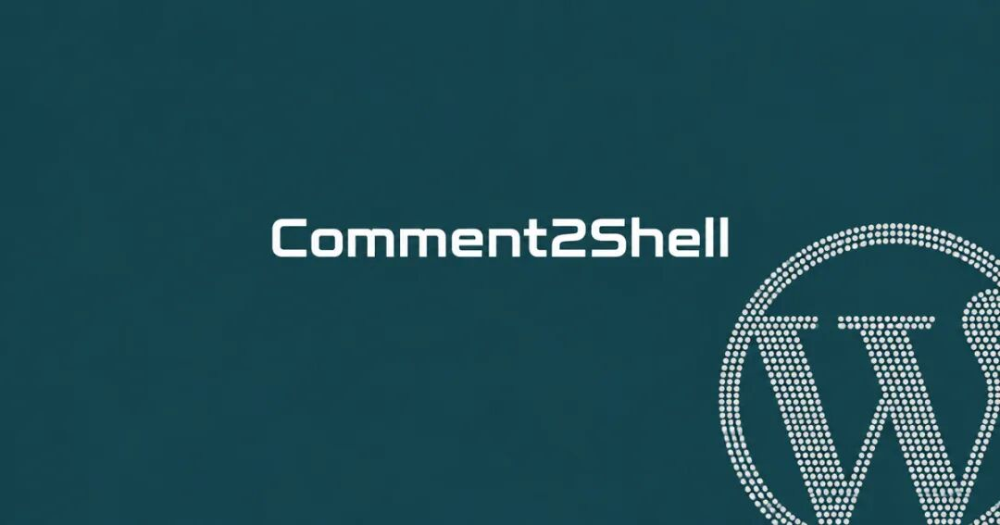
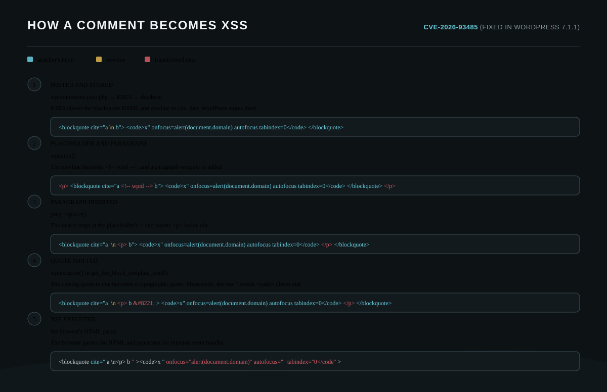

## 核对与使用边界

本文已按保存的全文审阅记录进行文字校订；本轮仅静态核对，未运行 PoC、请求目标或逐图验证。

适用条件与版本记录（来源主张，未列为明确更正的部分仍待权威资料核对）：affected per-branch versions, fixed7.1.1/4.7.36backport claimed; vulnerable theme/filter order; commentvisible toadmin; plugin install permitted and writable/PHPenabled

- **凭据与会话边界（1）**：文章明确管理员浏览触发，但zero-click/pre-auth到RCE容易省略受害管理员会话/安装权限，不可称直接服务端匿名RCE。抓包中的会话不能视为未认证访问证明。需重新取得授权测试会话，不能复用文中值。

- **凭据与会话边界（2）**：关闭先前批准要求不代表全自动审核，还要排除手动审核全部评论开关；持有任何comment_author cookie不等于可看任意待审评论，须核邮箱/nonce/hash限制。抓包中的会话不能视为未认证访问证明。需重新取得授权测试会话，不能复用文中值。

- **证据待核（3）**：标题前台评论到Shell主要提供中间HTML和算法，没有完整初始载荷/请求与管理员脚本。保留原引用、截图位置和实验叙述；本项所缺材料未被补造，截图存在或作者宣称成功都不等于已核验其内容。

- **实验改动边界（4）**：修复前后代码挤在同一行//注释中，直接复制不执行；正文裸HTML标签可能被渲染吞掉。以下步骤按原实验条件保留；人工改动后的行为只支持该修改环境，不用于证明未修改发行版默认可利用。

- **事实待核（5）**：有精确研究来源，发行/回移/CVE时间需官方核；按各分支范围比统一&lt;7.1.1更正确。该项尚不能从转载本身确定外部事实；下文相应编号、版本或修复说法只作为来源记录，不能据此判定部署受影响或已修复。明确更正另列于本节。

历史原文标识：下文原技术材料按来源保留；仅本节明确确认的更正替代相应旧说法，标为待核的观察仍不是事实确认。

#  【CVE-2026-93485】从评论到Shell，Wordpress漏洞深度剖析  
原创 idnsec
                    idnsec  骨哥说事   2026-09-23 01:00  
  
<table><tbody><tr><td data-colwidth="557" width="557" valign="top" style="word-break: break-all;"><h1 data-selectable-paragraph="" style="white-space: normal;outline: 0px;max-width: 100%;font-family: -apple-system, system-ui, &#34;Helvetica Neue&#34;, &#34;PingFang SC&#34;, &#34;Hiragino Sans GB&#34;, &#34;Microsoft YaHei UI&#34;, &#34;Microsoft YaHei&#34;, Arial, sans-serif;letter-spacing: 0.544px;background-color: rgb(255, 255, 255);box-sizing: border-box !important;overflow-wrap: break-word !important;"><strong style="outline: 0px;max-width: 100%;box-sizing: border-box !important;overflow-wrap: break-word !important;"><span style="outline: 0px;max-width: 100%;font-size: 18px;box-sizing: border-box !important;overflow-wrap: break-word !important;"><span style="color: rgb(255, 0, 0);"><strong><span style="font-size: 15px;"><span leaf="">声明：</span></span></strong></span></span></strong><span style="outline: 0px;max-width: 100%;font-size: 18px;box-sizing: border-box !important;overflow-wrap: break-word !important;"><span style="font-size: 15px;"><span leaf="">文章中涉及的程序(方法)可能带有攻击性，仅供安全研究与教学之用，读者将其信息做其他用途，由用户承担全部法律及连带责任，文章作者不承担任何法律及连带责任。</span></span></span></h1></td></tr></tbody></table>

#   
  
#   
  
****# 防走失：https://gugesay.com/  
  
**不想错过任何消息？设置星标****↓ ↓ ↓**  
#   
  
  
  
  
#   
  
**摘要：利用一条看似无害的评论，触发连锁过滤转换，从良性的HTML标签演变为带有JavaScript事件处理程序的恶意HTML，最终导致服务器远程代码执行。WordPress 7.1.1已修复，补丁回溯到所有支持的4.7分支。**  
  
  
## 漏洞概要  
- **影响版本**  
：WordPress核心wpautop()  
函数中存在未经认证的存储型跨站脚本 (Stored Cross-Site Scripting， Stored XSS) 漏洞，编号CVE-2026-93485。  
  
- **修复版本**  
：已在WordPress 7.1.1中修复。**修复补丁已向所有支持的版本（自4.7起）进行了回溯移植**  
。如果你的站点版本低于其对应分支的已修复版本，则仍受影响。  
  
- **攻击方式**  
：未经验证的访客可以构造一条评论，当站点使用区块主题 (block theme) 或特定的经典主题 (classic theme) 渲染时，该评论会从良性的HTML经过一系列过滤器转换，最终形成带有活动JavaScript事件处理程序的恶意HTML。  
  
- **触发条件**  
：除了加载该评论所在的页面外，**无需任何交互**  
。当管理员浏览到包含恶意评论的页面时，攻击脚本将自动执行。  
  
- **潜在危害**  
：结合已知的WordPress提权链，通过管理员会话上传插件文件，即可实现**服务器代码执行 (Remote Code Execution, RCE)**  
。  
  
**如果您正在使用WordPress，请务必升级至WordPress 7.1.1，或至少是您所使用版本分支的最新发布版本。**  
> **编者按 (IDNSEC)**  
：此问题由作者Rafie Muhammad（Awesome Motive Inc. 的安全研究员）通过HackerOne上的WordPress漏洞赏金计划报告，并在协调披露后得到修复。  
  
## 漏洞成因：两阶段的过滤断层  
  
WordPress在评论保存时使用其HTML清理器 (KSES-Html 消毒器) 进行清理，然后在评论显示时通过 comment_text  
 过滤器链进行格式化。**漏洞就发生在这两个步骤之间的空隙中。**  
  
评论允许白名单 (allowlist) 仅限七种简单标签（超链接、缩写、块引用、删除、内联引用和代码）。然而，comment_text  
 上挂载的一系列**格式化过滤器**  
在处理这些合法标签时，存在缺陷，可以将无害的输入转换成为能执行JavaScript的恶意结构。  
### 攻击链详解  
  
核心利用点在于 <blockquote>  
 标签 cite  
 属性中的换行符 (\n  
)。它触发了一系列过滤器的不安全级联转换。下图清晰地展示了从评论提交到代码执行的演变过程：  
  
  
  
评论Payload从提交到执行每一步的图示  
  
**步骤1：KSES允许块引用标签的 cite 属性和换行**  
虽然KSES清理器严格限制了可用的标签和属性，但 <blockquote cite>  
 位于白名单中，且换行符 \n  
 或其HTML实体 (&#10;  
) 可以被保留在属性值中，这是后续攻击的起点。  
  
**步骤2 & 核心步骤3：wpautop() 注入意外标签**wpautop()  
 函数主要负责为文本添加段落标签。它会为块级元素（如 <blockquote>  
）添加空行，并随后将其用 <p>  
 标签包裹。关键在于处理换行符占位符 <!-- wpnl -->  
 时，函数中的正则表达式替换存在缺陷。该正则表达式模式 |<p><blockquote([^>]*)>|i  
 在匹配到占位符中的 >  
 时就停止，将 <p>  
 标签错误地**插入**  
到 cite  
 属性值的内部。  
  
错误处理导致的结果是：  
```
<blockquote cite="a<p> b"><code>...攻击载荷...</code></p></blockquote>
```  
  
这里被注入的 <p>  
 标签破坏了HTML结构，为下一步的转换创造了条件。  
  
**步骤4：wptexturize() 编码/不编码引号**  
当使用区块主题或某些调用了 wptexturize()  
 的经典主题渲染时，该函数会将普通文本中的直引号 "  
 转换为印刷体引号实体 &#8221;  
。然而，**内容在 `<code>` 标签内的属性部分被视为纯文本**  
，其中的引号 "  
 会被编码；而 <code>  
 标签内部的直引号则被 wptexturize()  
 有意排除（code  
 在其 $default_no_texturize_tags  
 列表中），从而保持原样。  
  
**步骤5：最终恶意HTML合成与执行**  
经过上述一系列级联转换，最终的HTML变成了这样：  
```
<blockquote cite="a<p> b&#8221;><code>x" onfocus=alert(document.domain) autofocus tabindex=0</code></p></blockquote>
```  
  
现代浏览器解析时会重新解释结构，autofocus  
 和 onfocus  
 等属性被解析到 <blockquote>  
 标签上，实现**零点击 (zero-click)**  
 自动触发JavaScript。仅需一个页面加载动作，恶意代码立即执行。  
## 三种绕过审核、直接触发的方式  
  
WordPress默认设置下，并非所有评论都需要审核。至少存在三种途径可以让恶意评论无需管理员批准即可生效：  
1. **重用安装程序创建的默认评论者**  
：WordPress新安装附带了一条来自 A WordPress Commenter  
 (wapuu@wordpress.example  
) 的已批准评论。使用相同的昵称和邮箱提交评论，系统会立即批准。  
  
1. **相关设置被关闭**  
：如果在【设置】→【讨论】中，未勾选“评论者必须有一条先前已批准的评论”，则任何新身份的评论都会直接存储为已批准状态。  
  
1. **评论处于待审状态但仍对特定用户可见**  
：待审核的评论内容，仍然会呈现给持有`comment_author_<COOKIEHASH>`  
 Cookie的用户（即任何曾在该站点发表过评论的人）。攻击者可以通过自身的 `?unapproved=<id>&moderation-hash=<hash>`  
 链接来访问。  
  
  
  
从匿名评论到代码执行全程的录屏  
## 从XSS到服务器代码执行  
  
当恶意脚本在管理员会话中运行时，它可以访问插件安装器。通过管理员权限上传一个包含PHP Webshell的插件压缩包，是WordPress已知的提权路径。具体流程如下：  
1. **获取上传令牌 (Nonce)**  
：通过管理员会话，脚本可以访问插件上传页面并从中提取一个安全令牌。  
  
1. **在内存中构造恶意插件**  
：创建一个简单的PKZIP格式的压缩包，其中包含一个带有任意命令执行代码的PHP文件。  
  
1. **提交上传**  
：将构造好的ZIP文件通过表单提交给WordPress安装器。  
  
1. **直接访问Webshell**  
：上传后的插件文件无需激活，直接通过其物理路径即可访问，从而执行任意系统命令。  
  
## 修复补丁详情  
  
WordPress 7.1.1 用一行代码修复了此漏洞。修复改变了 <p><blockquote>  
 重写时的正则匹配模式，使其**能够识别并正确处理引号内的内容**  
，从而防止错误的标签注入。  
  
**修复对比（一行之差）：**  
```
// 修复前（WordPress 7.1及更早版本）：$text = preg_replace( '|<p><blockquote([^>]*)>|i', '<blockquote$1><p>', $text );// 修复后（WordPress 7.1.1）：$text = preg_replace( '!<p><blockquote((?:[^>"\']|"[^"]*"|\'[^\']*\')*)>!i', '<blockquote$1><p>', $text );
```  
  
关键的改进是 (?:[^>"\']|"[^"]*"|\'[^\']*\')*  
 这个新的子模式，它能够正确地“跳过”被引号包裹的整个字符串内容（包括其中可能包含的 >  
），确保匹配直到**真正的**  
标签结束符 >  
，这样 <p>  
 标签便能正确地放置在 <blockquote>  
 之后，而非其属性内部。  
## 披露时间线  
- **2026年9月8日**  
：通过HackerOne上的WordPress漏洞赏金计划报告给核心团队。安全团队同日完成评估。  
  
- **2026年9月15日**  
：向Patchstack请求CVE编号。  
  
- **2026年9月17日**  
：WordPress 7.1.1 发布，包含修复程序，并向下回溯移植至 4.7.36 的所有支持分支。  
  
- **2026年9月18日**  
：Patchstack分配 CVE-2026-93485。  
  
- **2026年9月21日**  
：本技术研究文章发布。  
  
原文：  
https://idnsec.com/research/comment2shell-zero-click-pre-auth-xss-to-rce-in-wordpress-core/  
  
- END -  
  
**感谢阅读，如果觉得还不错的话，动动手指给个三连吧～**  
  


---

> 来源：gelusus/wxvl（微信公众号漏洞文章自动归档，原文见文首链接）
