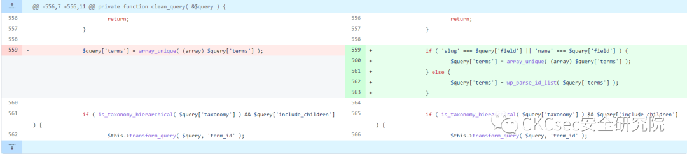
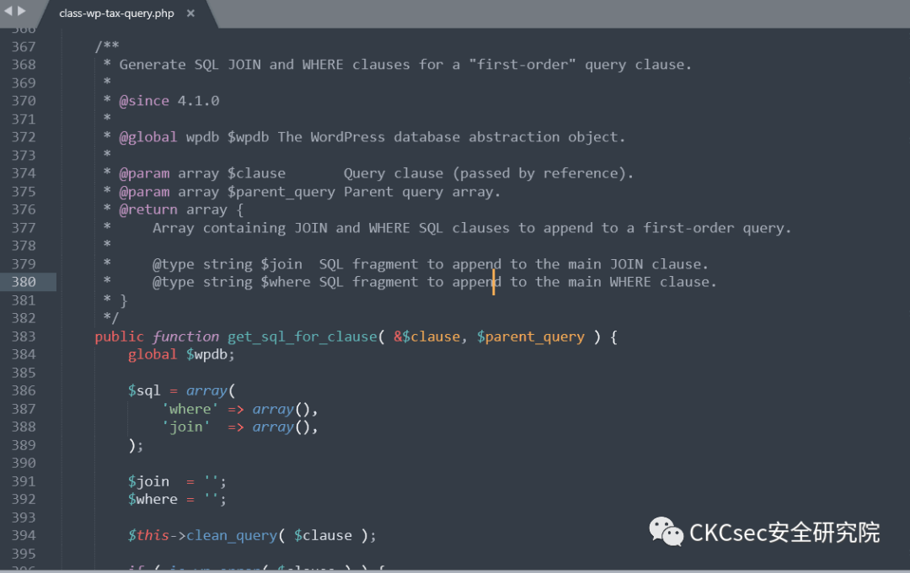
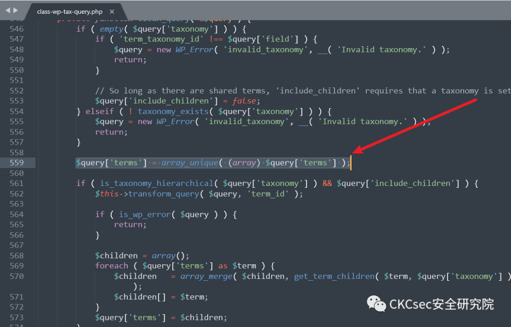
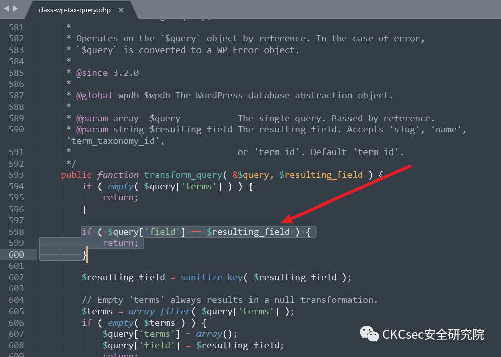
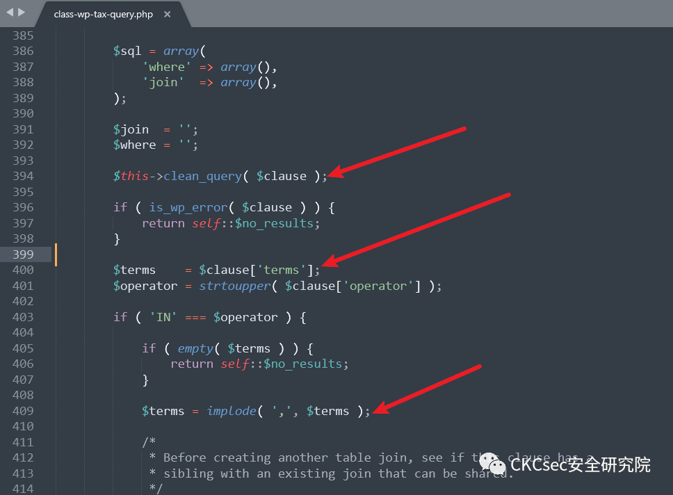
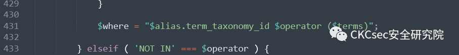
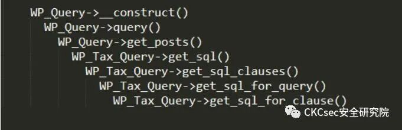
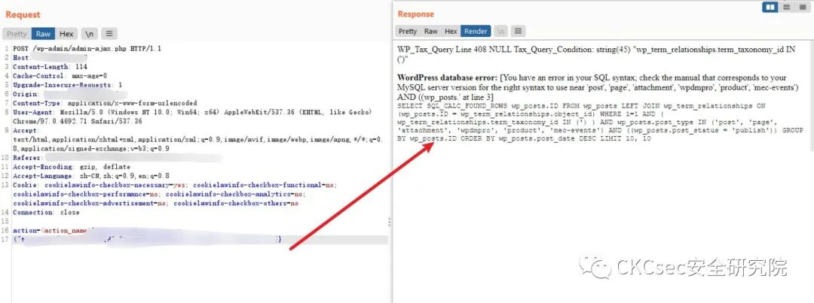

## 核对与使用边界

本文已按保存的全文审阅记录进行文字校订；本轮仅静态核对，未运行 PoC、请求目标或逐图验证。

适用条件与版本记录（来源主张，未列为明确更正的部分仍待权威资料核对）：vulnerable core branch plus attacker-controllable WP_Query args via plugin/theme; taxonomy/field constraints; DEBUGonlyforvisibleerrors

- **事实待核（1）**：题中CVE使用长连接号21661不易解析，元数据缺标准CVE。该项尚不能从转载本身确定外部事实；下文相应编号、版本或修复说法只作为来源记录，不能据此判定部署受影响或已修复。明确更正另列于本节。

- **适用与权限边界（2）**：明确核心默认路径不触发、需插件传可控data，是比513短PoC完整的前提，应关联互补。按此限制解释本文结论，版本相同不足以证明所需角色、入口、配置、依赖或可控参数均已满足；原操作和失败记录一并保留。

- **结论使用边界（3）**：JSON代码含反斜线转义右花括号且两份payload挤一行，直接解析无效。此项限制直接适用于下文对应结论；现有正文不足以作更宽泛推论，所列方法和原始证据均保留。

- **适用与权限边界（4）**：必须开启DEBUG只对示例错误回显检测适用，不是SQLi本身必要条件。按此限制解释本文结论，版本相同不足以证明所需角色、入口、配置、依赖或可控参数均已满足；原操作和失败记录一并保留。

- **结论使用边界（5）**：机器翻译多处不通；&lt;5.8.3应改维护分支范围，有官方GHSA可核。此项限制直接适用于下文对应结论；现有正文不足以作更宽泛推论，所列方法和原始证据均保留。

历史原文标识：下文原技术材料按来源保留；仅本节明确确认的更正替代相应旧说法，标为待核的观察仍不是事实确认。

# 深度刨析 Wordpress 的 SQL 注入 (CVE-2022–21661)

<meta name="referrer" content="no-referrer"/>

> 本文由 [简悦 SimpRead](http://ksria.com/simpread/) 转码， 原文地址 [mp.weixin.qq.com](https://mp.weixin.qq.com/s/uiTPtf7VY171TQtm18FgzQ)

深度刨析 Wordpress 的 SQL 注入 (CVE-2022–21661)
========================================

遵纪守法
----

任何个人和组织使用网络应当遵守宪法法律，遵守公共秩序，尊重社会公德，不得危害网络安全，不得利用网络从事危害国家安全、荣誉和利益

漏洞描述
----

Wordpress，它是世界上使用最多的开源 CMS 之一。在允许开发者自己构建插件和主题来管理网站时，使用我们的许多便捷功能，wordpress 的核心会提供插件 / 主题调用和使用 wordpress 函数的功能，如数据格式、查询数据库等许多选项在提供的众多 wordpress ma 类中，我们在提供查询 DB 的 WP 服务器类中发现 SQL Injection 错误：WP_Query。

风险等级
----

高危

影响版本
----

wordpress < 5.8.3

漏洞分析
----

在 5.8.3 版本中，wordpress 已经修复了这个错误，比较提交更改可以在处理变量之前`clean_query`添加检查的函数中看到。`$query['field']``$query['terms']`



函数`clean_query`是从 调用的`get_sql_for_clause`。阅读该函数的代码会发现，该函数的工作是为 SQL 查询中的条件创建子句，具体来说，它的工作是处理接收到的数据，将这些数据组合成 SQL 查询中的条件。将其返回给父函数。所以我们可以控制这个函数的返回数据，也就是说我们可以控制 SQL 查询，进行 SQL 注入。



回到函数`clean_query`，当这个改动没有做的时候，默认情况下`$query['terms']`只会删除 in 的值，然后再调用到`$this->transform_query( $query, 'term_taxonomy_id' );`。

为了避免下降`if`，它`$query['taxonomy']`需要为空或`is_taxonomy_hierarchical`返回 false 的值。



该函数`transform_query`将检查`$query['field'] == $resulting_field`，如果为真，则返回并且不做进一步处理，因此如果变量`$query['field']`为`term_taxonomy_id`，我们可以退出函数而不更改变量值`$query['terms']`。

（这里的比较是使用`==`并且存在 Loose 比较的漏洞，在某些情况下这个错误可以用来随意创建条件句）。



函数逃逸后，返回原位的代码流会调用`clean_query`函数`get_sql_for_clause`，变量的值`$query['terms']`会直接作为 SQL 查询条件，导致 SQL 注入。



综上所述，SQL 注入要发生，必须满足两个条件：

*   `$query['field']` 成为 `term_taxonomy_id`
    
*   `$query['taxonomy']` 空的或 `is_taxonomy_hierarchical($query['taxonomy']) === false`
    

导致以下错误：



虽然这是 wordpress 核心的 bug，但是 wordpress 核心的复用方式并不能触发错误，在插件和主题中会自动转向错误方向。`WP_Query`当你要查询数据库时，插件 / 主题会调用该类，从源代码中识别错误的方法是在使用时`WP_Query($data)`和 $data 是可控的。

例如，`new WP_Query(json_decode($_POST['query_vars']))`有效载荷将采用以下形式：

```
query_vars={"tax_query":{"0":{"field":"term_taxonomy_id","terms":["<inject>"]\}\\}\} query_vars={"tax_query":{"0":{"taxonomy":"nav_menu","field":true,"terms":["<inject>"]\}\\}\}
```

在复现的时候，必须开启 DEBUG 功能，通过基于错误的方式检测 SQL 注入：



修复方案
----

目前厂商已发布升级补丁以修复漏洞，补丁获取链接：

https://github.com/WordPress/wordpress-develop/security/advisories/GHSA-6676-cqfm-gw84

下面就是团队的公众号和知识星球了

安全圈内最新渗透资源、工具、教程、白皮书尽在 CKCsec 安全团队知识星球，限时免费面向所有安全爱好者哟！

公众号


---

> 来源：MrWQ/vulnerability-paper（https://github.com/MrWQ/vulnerability-paper）
