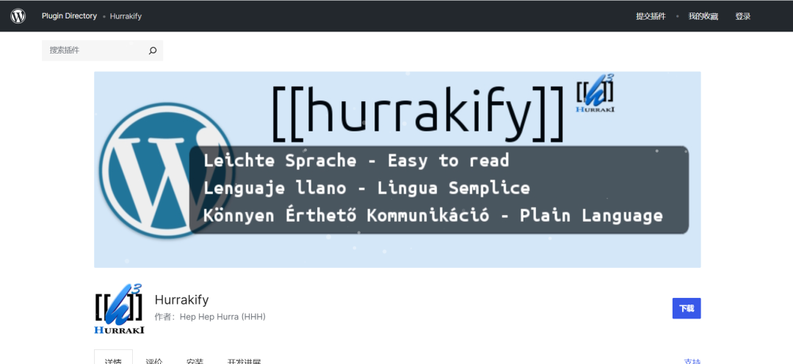

## 核对与使用边界

本文已按保存的全文审阅记录进行文字校订；本轮仅静态核对，未运行 PoC、请求目标或逐图验证。

适用条件与版本记录（来源主张，未列为明确更正的部分仍待权威资料核对）：&lt;=2.4 claimed; unauth hurraki_tooltip_proxy; fetch scheme/network restrictions unspecified

- **证据待核（1）**：SSRF直接表述可读系统重要文件，缺file协议/本地读取链证据，应区分内网请求与本地文件读。保留原引用、截图位置和实验叙述；本项所缺材料未被补造，截图存在或作者宣称成功都不等于已核验其内容。

- **证据待核（2）**：有action但没有目标URL参数/请求和响应，PoC已公开无链接。保留原引用、截图位置和实验叙述；本项所缺材料未被补造，截图存在或作者宣称成功都不等于已核验其内容。

- **来源与引用处置（3）**：插件简介社交分享需核实际Hurraki词典功能，不能直接采通用营销介绍。保留这部分来源材料并与技术结论分开；其引用或宣传内容不能补足本文漏洞的证据。

- **事实待核（4）**：官方已修复但未给版本/公告，只插件主页。该项尚不能从转载本身确定外部事实；下文相应编号、版本或修复说法只作为来源记录，不能据此判定部署受影响或已修复。明确更正另列于本节。

历史原文标识：下文原技术材料按来源保留；仅本节明确确认的更正替代相应旧说法，标为待核的观察仍不是事实确认。

#  漏洞预警 | WordPress Plugin Hurrakify SSRF漏洞   
浅安  浅安安全   2025-01-15 00:00  
  
**0x00 漏洞编号**  
- # CVE-2024-54330  
  
**0x01 危险等级**  
- 高危  
  
**0x02 漏洞概述**  
  
Hurrakify是一个专为WordPress平台设计的插件，旨在增强网站的社交分享功能和用户交互体验。  
  
  
  
**0x03 漏洞详情**  
###   
  
**CVE-2024-54330**  
  
**漏洞类型：**  
SSRF****  
  
**影响：**  
  
获取敏感信息  
  
  
****  
  
**简述：**  
Hurrakify的/wp-admin/admin-ajax.php?action=hurraki_tooltip_proxy接口存在服务器端请求伪造漏洞，未经身份验证攻击者可通过该漏洞读取系统重要文件，导致网站处于极度不安全状态。  
  
**0x04 影响版本**  
- Hurrakify <= 2.4  
  
**0x05****POC状态**  
- 已公开  
  
**0x06****修复建议**  
  
**目前官方已发布漏洞修复版本，建议用户升级到安全版本****：**  
  
https://cn.wordpress.org/plugins/hurrakify/  
  
  
  

---

> 来源：gelusus/wxvl（微信公众号漏洞文章自动归档，原文见文首链接）
