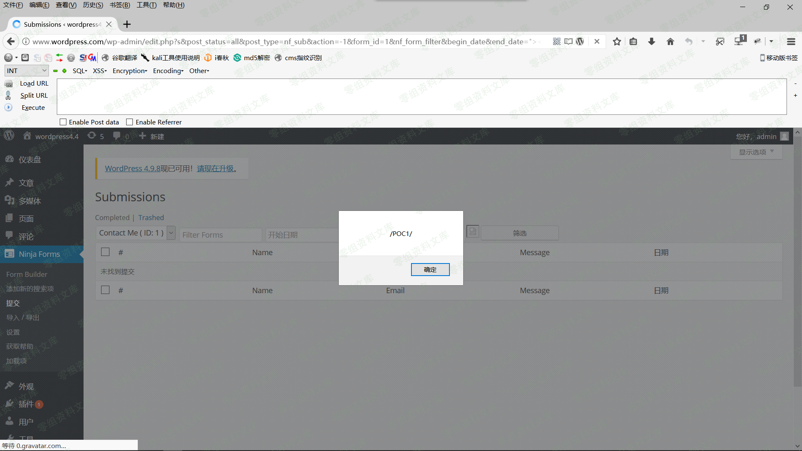
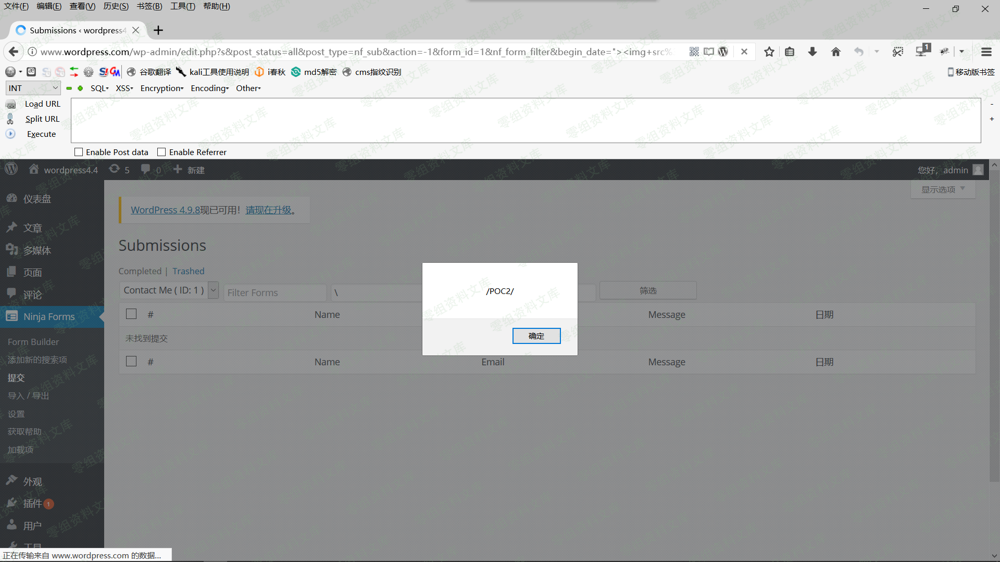
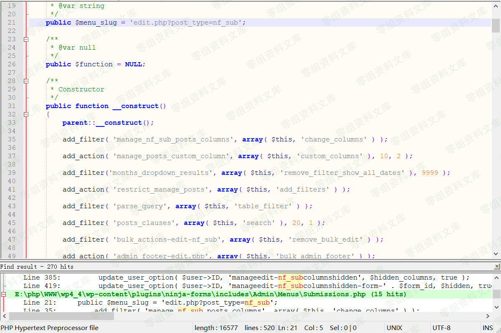

## 核对与使用边界

本文已按保存的全文审阅记录进行文字校订；本轮仅静态核对，未运行 PoC、请求目标或逐图验证。

适用条件与版本记录（来源主张，未列为明确更正的部分仍待权威资料核对）：3.3.17 title; authenticated user with submissionsview access opens craftedlink

- **适用与权限边界（1）**：直接复制地址即可触发省略需登录且能访问提交页的角色条件。按此限制解释本文结论，版本相同不足以证明所需角色、入口、配置、依赖或可控参数均已满足；原操作和失败记录一并保留。

- **操作与副作用边界（2）**：分析只覆盖form_id，两个日期字段虽有截图不应假定同一源码根因。保留原步骤及请求方法。执行条件包括隔离且获授权的可恢复环境、预先记录相关文件/账号/配置/业务记录状态；响应完成不能等同无副作用，恢复时须核对该操作涉及的实际对象。

- **事实待核（3）**：三个payload/输出代码较完整，EDB45880精确源有价值；影响/修复范围缺失。该项尚不能从转载本身确定外部事实；下文相应编号、版本或修复说法只作为来源记录，不能据此判定部署受影响或已修复。明确更正另列于本节。

- **事实待核（4）**：图片后重复尾路径及大量源码空行需清理；需URL编码不依赖浏览器自动修复。该项尚不能从转载本身确定外部事实；下文相应编号、版本或修复说法只作为来源记录，不能据此判定部署受影响或已修复。明确更正另列于本节。

历史原文标识：下文原技术材料按来源保留；仅本节明确确认的更正替代相应旧说法，标为待核的观察仍不是事实确认。

（CVE-2018-19287）WordPress Plugin - Ninja Forms 3.3.17 XSS
===========================================================

一、漏洞简介
------------

Ninja
Forms是WordPress的终极免费表单创建工具。使用简单但功能强大的拖放式表单创建器在几分钟内构建表单。对于初学者，可以快速轻松地设计复杂的表单，绝对没有代码。对于开发人员，利用内置的钩子，过滤器，甚至自定义字段模板，使用Ninja
Forms作为框架，在表单构建或提交的任何步骤中执行您需要的任何操作。

二、漏洞影响
------------

三、复现过程
------------

下面是我从exploit-db上复制的POC，为了方便判断，修改了弹窗的内容。

    http://0-sec.org/wp-admin/edit.php?s&post_status=all&post_type=nf_sub&action=-1&form_id=1&nf_form_filter&begin_date&end_date=">&nf_form_filter&paged=1

我们只要直接复制POC到浏览器的地址栏回车即可触发漏洞。

下图是触发第一个POC的图：

WordPressPlugin-NinjaForms3.3.17XSS/media/rId24.png)

下图是触发第二个POC的图：

WordPressPlugin-NinjaForms3.3.17XSS/media/rId25.png)

下图是触发第三个POC的图：

WordPressPlugin-NinjaForms3.3.17XSS/media/rId26.png)

### 漏洞分析过程

笔者直接从POC方面入手，简单分析一下漏洞的成因。由于方法是一样的，笔者是一个懒人，这里就只分析了POC3的成因。

通过POC查找关键词nf\_sub，确定了核心文件\\wp-content\\plugins\\ninja-forms\\includes\\Admin\\Menus\\Submissions.php。

下图是Submissions.php部分内容：

WordPressPlugin-NinjaForms3.3.17XSS/media/rId28.png)

通过粗略的阅读，发现这个函数是导致POC3成功弹窗的关键。

下图是Submissions.php文件第71-104行内容：

    public function change_views( $views )

    {

        // Remove our unused views.

        unset( $views[ 'mine' ] );

        unset( $views[ 'publish' ] );

        // If the Form ID is not empty...

        if( ! empty( $_GET[ 'form_id' ] ) ) {

            // ...populate the rest of the query string.

            $form_id = '&form_id=' . $_GET[ 'form_id' ] . '&nf_form_filter&paged=1';

        } else {

            // ...otherwise send in an empty string.

            $form_id = '';

        }

        // Build our new views.

        $views[ 'all' ] = '<a href="' . admin_url( 'edit.php?post_status=all&post_type=nf_sub'  ) . $form_id . '">'

                        . __( 'Completed', 'ninja-forms' ) . '</a>';

        $views[ 'trash' ] = '<a href="' . admin_url( 'edit.php?post_status=trash&post_type=nf_sub' ) . $form_id . '">'

                            . __( 'Trashed', 'ninja-forms' ) . '</a>';

        // Checks to make sure we have a post status.

        if( ! empty( $_GET[ 'post_status' ] ) ) {

            // Depending on the domain set the value to plain text.

            if ( 'all' == $_GET[ 'post_status' ] ) {

                $views[ 'all' ] = __( 'Completed', 'ninja-forms' );

            } else if ( 'trash' == $_GET[ 'post_status' ] ) {

                $views[ 'trash' ] = __( 'Trashed', 'ninja-forms' );

            }

        }

        return $views;

    }

从上面代码，我们可以看到，form\_id并没有被过滤，导致XSS存在。

    $form_id = '&form_id=' . $_GET[ 'form_id' ] . '&nf_form_filter&paged=1';

四、参考链接
------------

> <https://www.exploit-db.com/exploits/45880/>
>
> <https://www.freebuf.com/vuls/190411.html>
