## 核对与使用边界

本文已按保存的全文审阅记录进行文字校订；本轮仅静态核对，未运行 PoC、请求目标或逐图验证。

适用条件与版本记录（来源主张，未列为明确更正的部分仍待权威资料核对）：&lt;=1.3.4; subscriber authenticated; ZIP import writable temp andPHPexecution

- **结论使用边界（1）**：开头称解压插件目录，后文所有实际路径WordPress/temp，落点须统一。此项限制直接适用于下文对应结论；现有正文不足以作更宽泛推论，所列方法和原始证据均保留。

- **适用与权限边界（2）**：is_admin不验证角色讲解准确且保留wp_ajax需登录边界，不能转成匿名漏洞。按此限制解释本文结论，版本相同不足以证明所需角色、入口、配置、依赖或可控参数均已满足；原操作和失败记录一并保留。

- **证据待核（3）**：关键源码/上传POST全截图；图片后重复路径转换噪声较多。保留原引用、截图位置和实验叙述；本项所缺材料未被补造，截图存在或作者宣称成功都不等于已核验其内容。

- **事实待核（4）**：缺修复版本，但有xz精确源；20000安装量非受影响确认。该项尚不能从转载本身确定外部事实；下文相应编号、版本或修复说法只作为来源记录，不能据此判定部署受影响或已修复。明确更正另列于本节。

历史原文标识：下文原技术材料按来源保留；仅本节明确确认的更正替代相应旧说法，标为待核的观察仍不是事实确认。

（CVE-2019-15866）WordPress Plugin - Crelly Slider 任意文件上传&RCE漏洞
=======================================================================

一、漏洞简介
------------

WordPress Crelly
Slider是一个开源的幻灯片插件。用户可以使用强大的拖放生成器来添加文本、图像、youtube/vimeo视频，并为每个视频制作动画。

WordPress Crelly
Slider插件具有20,000多个活动安装。该插件在1.3.4及更低版本中出现任意文件上传漏洞。任意经过身份验证的用户（例如订阅者身份）可通过向wp\_ajax\_crellyslider\_importSlider发送带有恶意PHP文件的ZIP压缩文件来利用该漏洞上传文件并将恶意PHP文件解压到插件目录中。

二、漏洞影响
------------

三、复现过程
------------

### 漏洞分析

在crelly-slider\\crellyslider.php文件中，存在如下代码

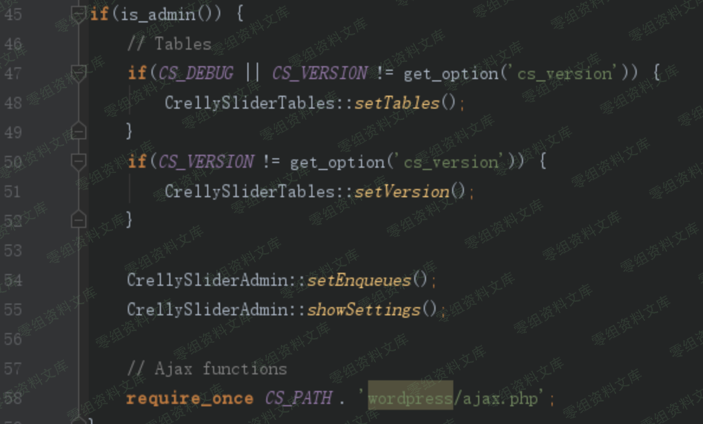WordPressPlugin-CrellySlider任意文件上传&RCE漏洞/media/rId25.png)

位于上图45行处可见，插件使用if(is\_admin())进行判断，满足条件则可以进入上图if分支，并且在58行处将wordpress/ajax.php文件包含进来

接着来分析下ajax.php文件

在crelly-slider/wordpress/ajax.php中存在如下代码

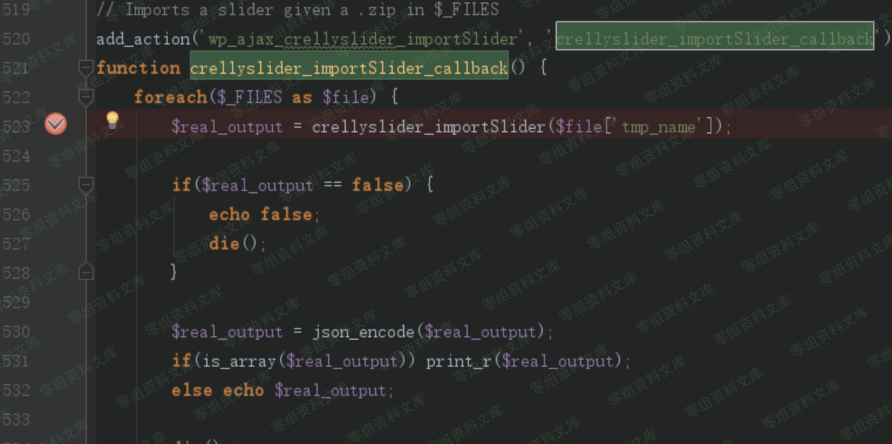WordPressPlugin-CrellySlider任意文件上传&RCE漏洞/media/rId26.png)

可见上图520行处注册了一个名为wp\_ajax\_crellyslider\_importSlider 的ajax
action并指向ajax.php中的crellyslider\_importSlider\_callback方法。

在wordpress插件调用机制里，crellyslider\_importSlider\_callback方法可以通过构造

    http://0-sec.org/wordpress/wp-admin/admin-ajax.php?action=crellyslider_importSlider

这样的url来访问

具体调用链如下

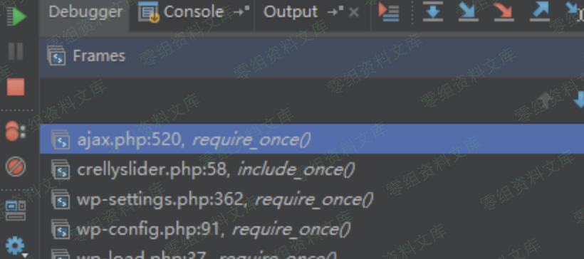WordPressPlugin-CrellySlider任意文件上传&RCE漏洞/media/rId27.png)

在搞清楚crellyslider\_importSlider\_callback方法是如何通过url调用后，继续分析crellyslider\_importSlider\_callback方法

在crellyslider\_importSlider\_callback方法中523行处使用crellyslider\_importSlider方法来处理上传文件，如下图

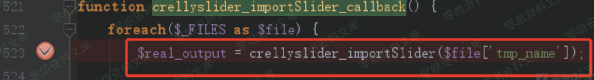WordPressPlugin-CrellySlider任意文件上传&RCE漏洞/media/rId28.png)

接着来看下crellyslider\_importSlider方法

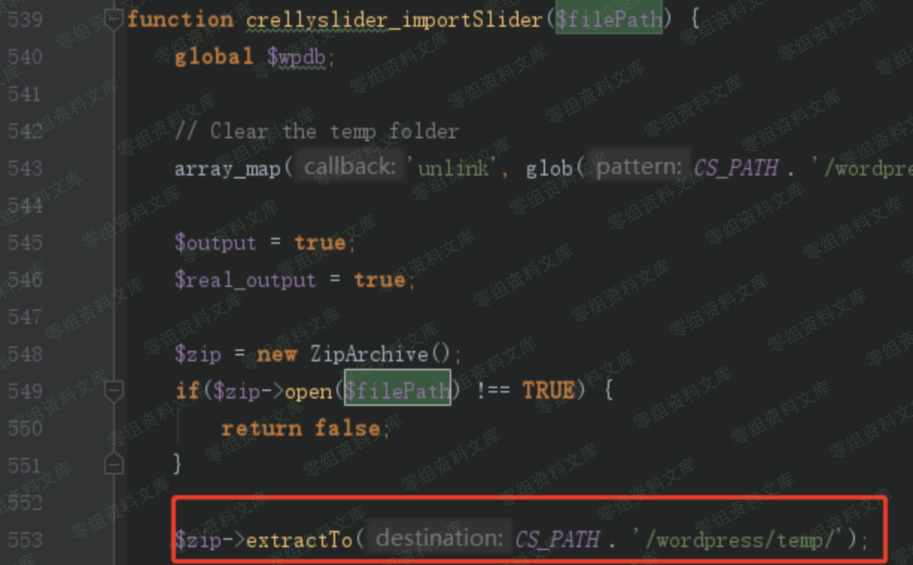WordPressPlugin-CrellySlider任意文件上传&RCE漏洞/media/rId29.png)

crellyslider\_importSlider方法将上传zip文件解压，并将解压后的文件存储于/wordpress/temp/路径中，如上图553行红框处

现在梳理一下上文介绍的流程：

crelly-slider插件将使用is\_admin()方法验证用户是否有使用crellyslider\_importSlider\_callback方法的使用权限。通过is\_admin()方法验证的用户则可以使用crellyslider\_importSlider\_callback方法上传任意zip压缩包，程序将上传的压缩包中的文件解压至/wordpress/temp/路径。

能使整个流程执行的前提是通过is\_admin()的校验。但是is\_admin()方法具体是做什么的呢？它是否像字面上看起来的那样：判断用户是否是管理员身份吗？------答案是否定的。

is\_admin方法只是用来确定当前请求是否是针对管理界面页面。使用if(is\_admin())只是为了确保if条件中的代码在后端管理界面加载，而不会再前台管理界面加载

is\_admin方法并没有核实用户是否是管理员身份的能力，其代码如下图:

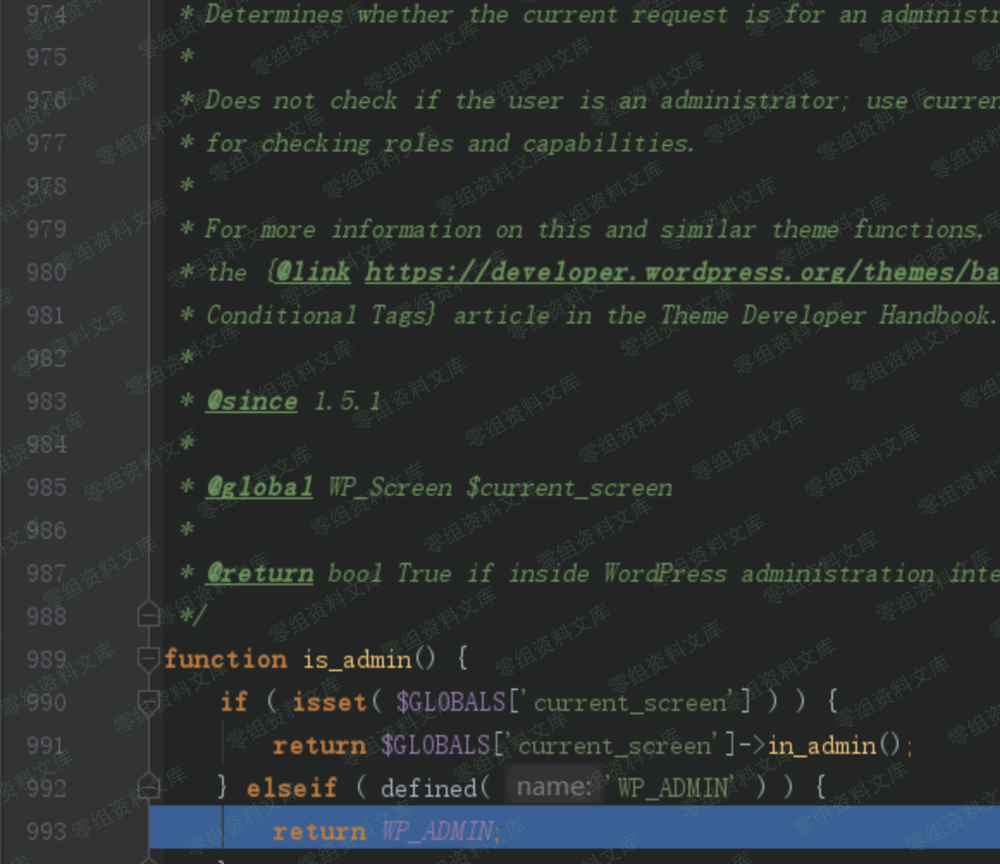WordPressPlugin-CrellySlider任意文件上传&RCE漏洞/media/rId30.png)

因此crelly-slider插件开发者误用了is\_admin方法，错误的将其用来判断当前操作的用户身份是否为管理员身份。

事实上，只要是是后台文件，都会定义WP\_ADMIN常量为true，例如本次漏洞的入口：wp-admin/admin-ajax.php文件，如下图

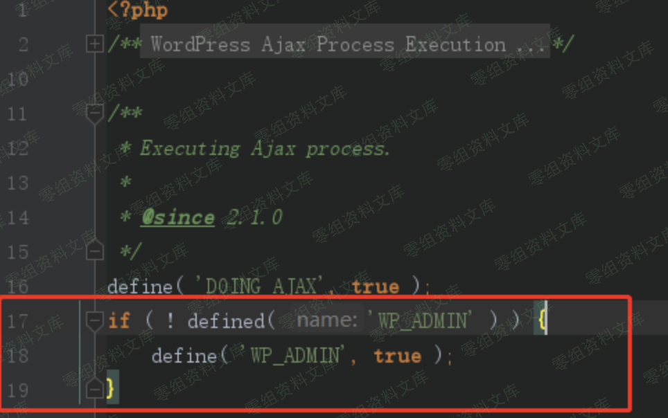WordPressPlugin-CrellySlider任意文件上传&RCE漏洞/media/rId31.png)

可见上图17-19行，使用常量WP\_ADMIN来标识这是一个后台文件

这就导致了无论什么身份的用户，只要访问后台文件，is\_admin方法都会返回true

我们新建一个名为subscriber的用户，其权限为订阅者权限(subscriber)

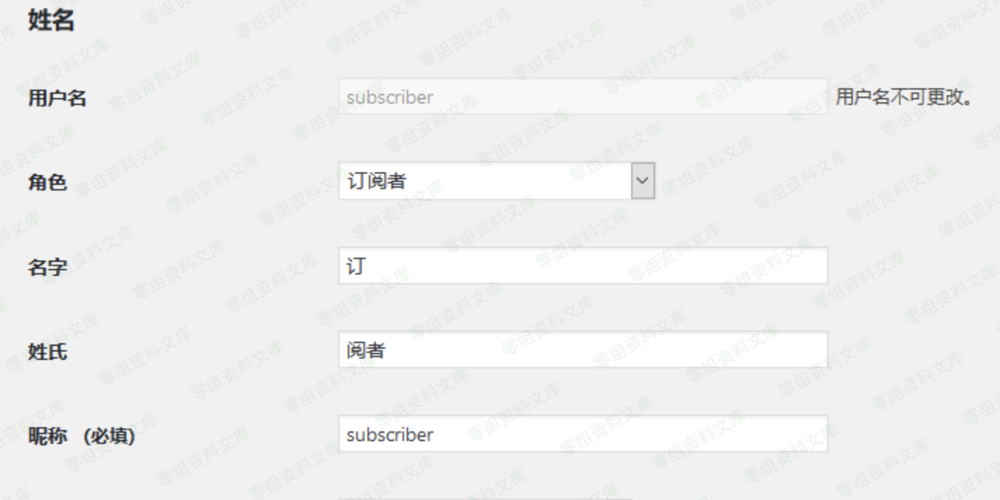WordPressPlugin-CrellySlider任意文件上传&RCE漏洞/media/rId32.png)

在wordpress中，订阅者权限具有极低的权限：

"具有订阅者用户角色的用户可以登录WordPress站点并更新自己的配置。他们可以根据需要更改密码。订阅者用户角色无法在WordPress管理后台内撰写文章，查看评论或执行任何其他操作。订阅者用户角色无权访问设置，插件或主题，因此无法更改网站上的任何设置"

订阅者wordpress管理页面如下

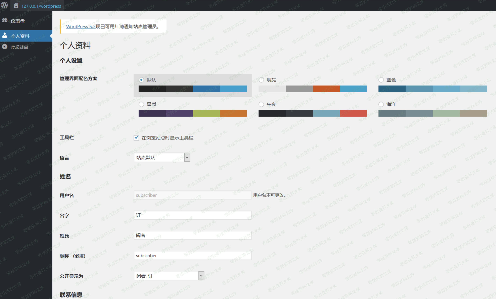WordPressPlugin-CrellySlider任意文件上传&RCE漏洞/media/rId33.png)

crelly-slider插件开发者的本意是希望"is\_admin"用户拥有调用crellyslider\_importSlider
ajax接口的权限，但实际上，subscriber身份的用户仍有权限使用crellyslider\_importSlider
ajax接口上传压缩包并将其中内容解压到/wordpress/temp/路径中

在我们构造的webshell.php文件中写入如下代码

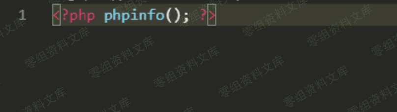WordPressPlugin-CrellySlider任意文件上传&RCE漏洞/media/rId34.png)

并将其压缩至webshell.zip中

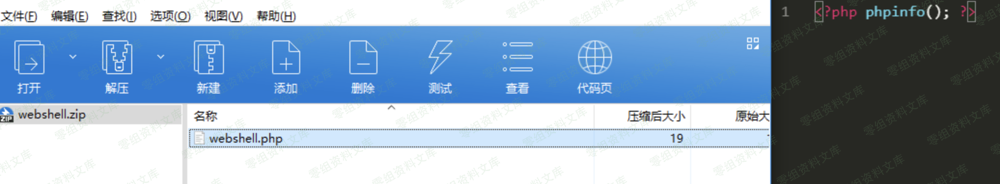WordPressPlugin-CrellySlider任意文件上传&RCE漏洞/media/rId35.png)

使用subscriber身份的用户的cookie，发送如下POST请求

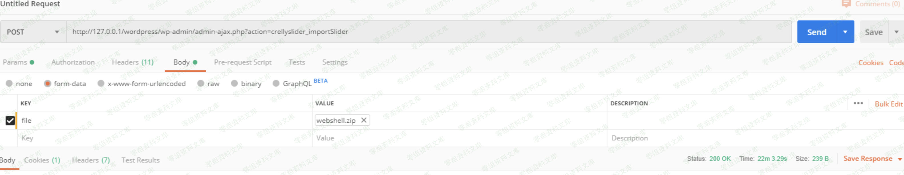WordPressPlugin-CrellySlider任意文件上传&RCE漏洞/media/rId36.png)

webshell.zip 中的webshell.php将会被解压到wordpress\\temp目录下，如下图

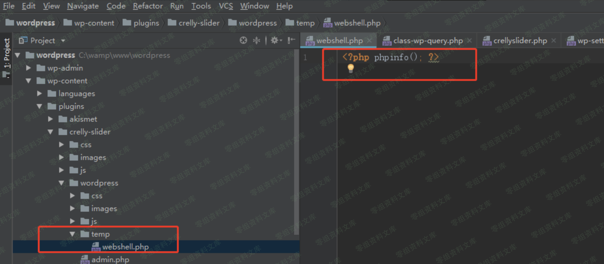WordPressPlugin-CrellySlider任意文件上传&RCE漏洞/media/rId37.png)

通过访问这个地址，webshell.php中的内容将会被执行

四、参考链接
------------

> <https://xz.aliyun.com/t/6841>
