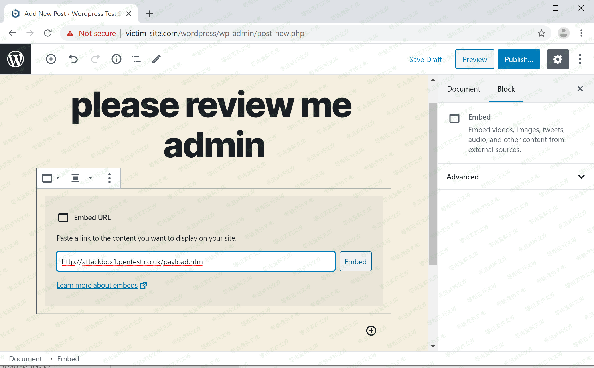
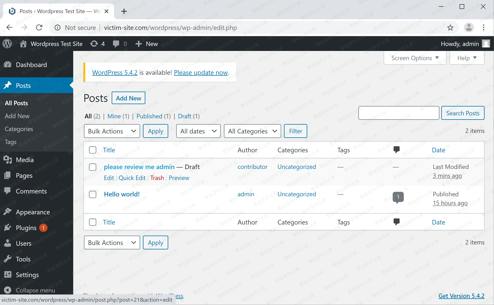
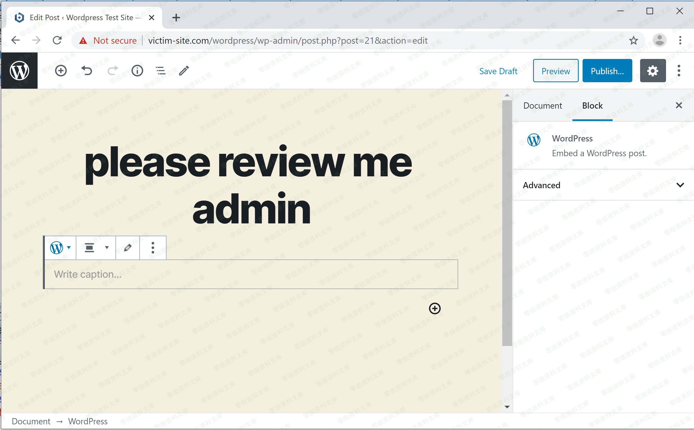
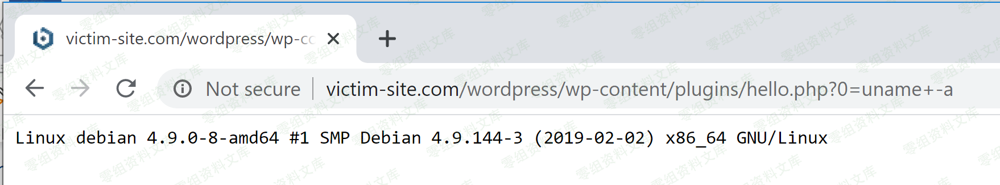

## 核对与使用边界

本文已按保存的全文审阅记录进行文字校订；本轮仅静态核对，未运行 PoC、请求目标或逐图验证。

适用条件与版本记录（来源主张，未列为明确更正的部分仍待权威资料核对）：body5.0–5.0.4/5.1–5.1.1; editpost shortcode; victim reopens editor versus frontend unclear

- **结论使用边界（1）**：文件名5.2.3与正文受影响范围不一致。此项限制直接适用于下文对应结论；现有正文不足以作更宽泛推论，所列方法和原始证据均保留。

- **事实待核（2）**：所有图片都引用CVE-2020-4046目录而不是本篇，需核图片内容是否错配，不判资源不存在。该项尚不能从转载本身确定外部事实；下文相应编号、版本或修复说法只作为来源记录，不能据此判定部署受影响或已修复。明确更正另列于本节。

- **结论使用边界（3）**：核心场景是重新打开编辑器错误预览，结论任何查看帖子者触发可能扩大到前台，需核渲染入口。此项限制直接适用于下文对应结论；现有正文不足以作更宽泛推论，所列方法和原始证据均保留。

- **代码与转录边界（4）**：末尾GetShel截断；缺角色、修复、原始来源。相应原代码作为存在此问题的历史样本保留，不能直接当作可运行、成功复现的 PoC；缺失内容需回原稿核对，不据此补造可执行攻击链。

历史原文标识：下文原技术材料按来源保留；仅本节明确确认的更正替代相应旧说法，标为待核的观察仍不是事实确认。

（CVE-2019-16219）内置编辑器Gutenberg 储存型xss
===============================================

一、漏洞简介
------------

Gutenberg编辑器无法过滤"简码"错误消息中的JavaScript /
HTML代码，导致可执行任意JavaScript / HTML代码

二、漏洞影响
------------

wordpress 5.0到5.0.4、5.1和5.1.1

三、复现过程
------------

在WordPress
5.0中，用户可以在帖子中添加Shortcode块。当在Shortcode块中添加某些HTML编码字符（例如"＆lt;"），然后重新打开该帖子时，它将显示错误消息，并通过将"＆lt;"解码为"
\<"来预览它。

图1.将HTML编码的字符插入Shortcode块

WordPress5.2.3内置编辑器Gutenberg储存型xss/media/rId24.png)

图2.带有预览的Shortcode错误消息

WordPress5.2.3内置编辑器Gutenberg储存型xss/media/rId25.png)

可以通过PoC

    "&gt;&lt;img src=1 onerror=prompt(1)&gt;

轻松绕过此预览中的XSS过滤器。

图3.将PoC代码插入Shortcode块

WordPress5.2.3内置编辑器Gutenberg储存型xss/media/rId26.png)

当任何受害者查看此帖子时，XSS代码将在其浏览器中执行。

WordPress5.2.3内置编辑器Gutenberg储存型xss/media/rId27.png)

如果受害者恰巧具有管理员权限，则攻击者可以利用此漏洞来控制管理员的帐户，将WordPress内置功能用于GetShel
