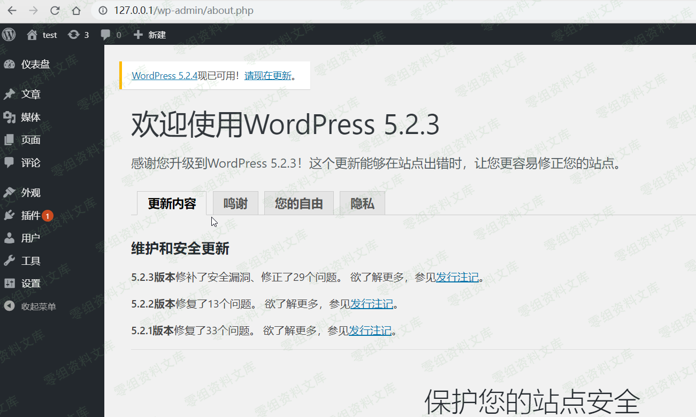
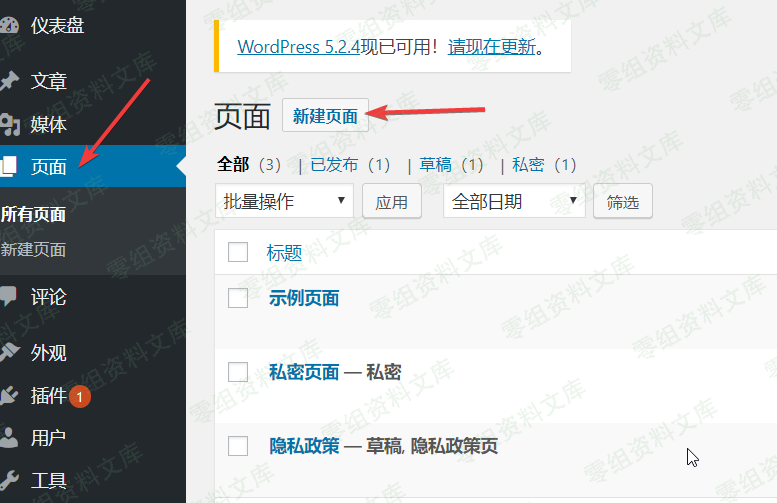
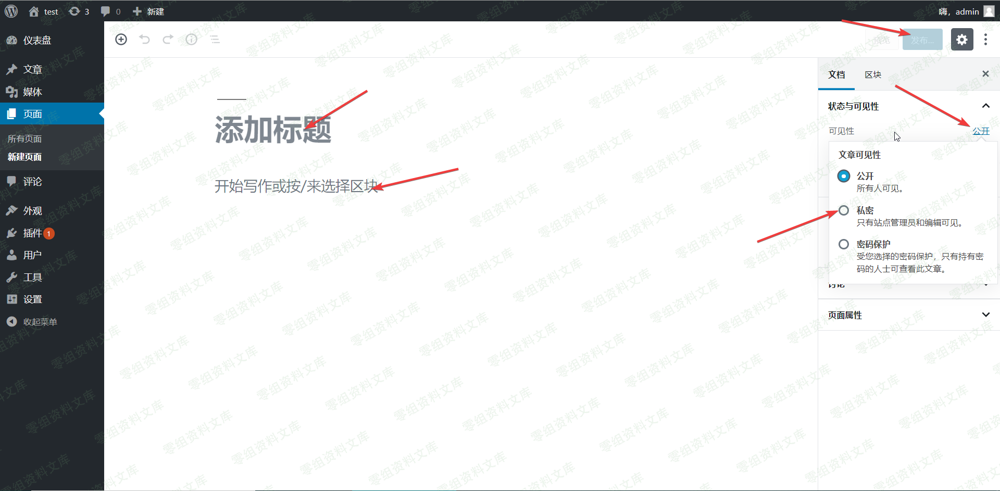
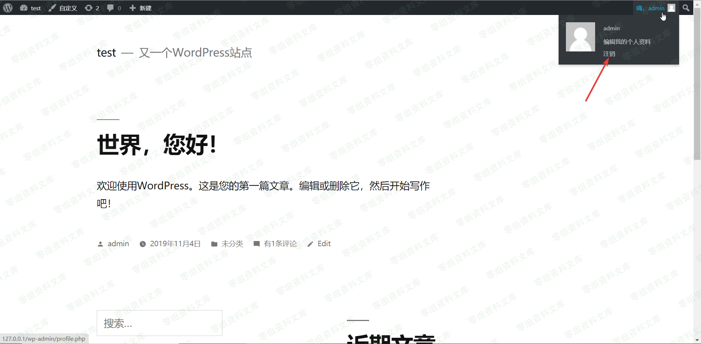
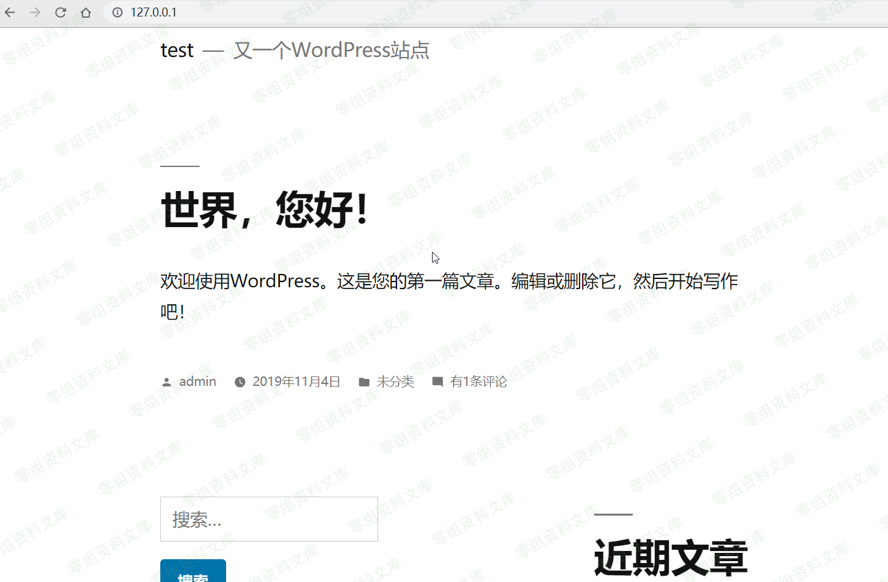

## 核对与使用边界

本文已按保存的全文审阅记录进行文字校订；本轮仅静态核对，未运行 PoC、请求目标或逐图验证。

适用条件与版本记录（来源主张，未列为明确更正的部分仍待权威资料核对）：&lt;=5.2.3 claimed; private content and static query configuration/layout

- **结论使用边界（1）**：简介说部分内容，结论称所有文章，单个私密页面实验不足支持全部文章/草稿等。此项限制直接适用于下文对应结论；现有正文不足以作更宽泛推论，所列方法和原始证据均保留。

- **证据待核（2）**：没有响应文本，末尾image缺失且图片后路径重复。保留原引用、截图位置和实验叙述；本项所缺材料未被补造，截图存在或作者宣称成功都不等于已核验其内容。

- **适用与权限边界（3）**：新建私密内容是实验准备管理员步骤，不是攻击者需管理员条件，应区分。按此限制解释本文结论，版本相同不足以证明所需角色、入口、配置、依赖或可控参数均已满足；原操作和失败记录一并保留。

- **事实待核（4）**：无维护分支/修复版本与原始源，最新一词需历史化。该项尚不能从转载本身确定外部事实；下文相应编号、版本或修复说法只作为来源记录，不能据此判定部署受影响或已修复。明确更正另列于本节。

历史原文标识：下文原技术材料按来源保留；仅本节明确确认的更正替代相应旧说法，标为待核的观察仍不是事实确认。

（CVE-2019-17671）Wordpress未授权访问
=====================================

一、漏洞简介
------------

wordpress 爆出最新的查看未经身份验证的文章漏洞，
该漏洞源于程序没有正确处理静态查询，
攻击者可利用该漏洞未经认证查看部分内容

二、漏洞影响
------------

WordPress \<= 5.2.3

### 三、复现过程

Wordpress<=5.2.3未授权访问/media/rId24.png)

登陆后台新建私密页面
--------------------

Wordpress<=5.2.3未授权访问/media/rId26.png)

### 随便填入内容，选择私密，发布

Wordpress<=5.2.3未授权访问/media/rId28.png)

### 访问前台页面，退出登陆，模拟外部访问

Wordpress<=5.2.3未授权访问/media/rId30.png)

### 漏洞利用

直接访问，查看不了私密文章

Wordpress<=5.2.3未授权访问/media/rId32.png)

输入payload访问，即可未授权访问所有文章

    url+/?static=1&order=asc

image
